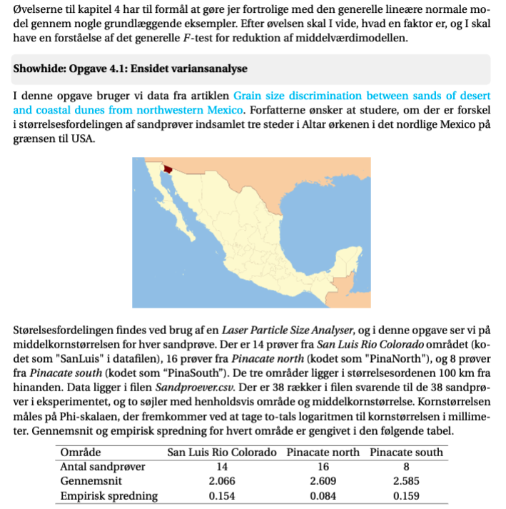
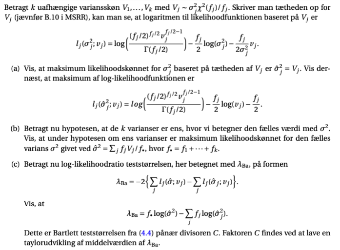
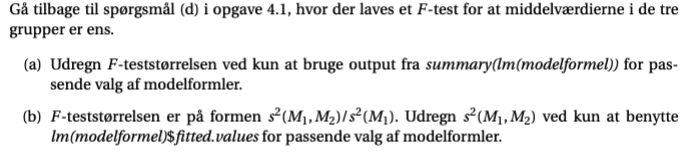

```{r setup, include=FALSE}
knitr::opts_chunk$set(echo = TRUE)
```


## webbog opgave 4.1



### a)

Indlæs  data,  og  dan  de  to  variableOmraadeogkornstrmed  indholdet  af  de  to  søj-ler.  Undersøg,  omOmraadeer  en  faktor.  Svaret  afhænger  af,  hvilken  version  afRmankører.  HvisOmraadeikke  er  en  faktor,  skal  du  omdanne  den  til  en  faktor  med  funk-tionenfactor.   Lav   en   figur,   hvorkornstrafsættes  modOmraadekodet   som   1   til   3(dette  kan  du  gøre  ved  at  brugeas.numeric(Omraade)).  Prøv  også  at  lave  et  qqplotmed  kommandoenqqnormFlere(kornstr,Omraade)(se  omtalen  afqqnormFlerei  detskjulte  punktBoxplot  og  qqploti  afsnit  4.6)  og  dernæst  et  boxplot  med  kommandoenboxplot(kornstr∼Omraade). Overvej, hvad disse figurer viser om forholdet mellem spred-ningerne i de tre områder og forholdet mellem middelværdierne.

### b)

Opskriv den statistiske model, hvor data er delt ind i tre grupper svarende til de tre områder,og data er normalfordelt med en middelværdi og varians, der afhænger af gruppen.
Opskriv hypotesen, at de tre varianser er ens. Lav Bartletts test, for at de tre varianser er ens.Hvad bliver konklusionen af testet?

### c) 

Opskriv den statistiske model, hvor middelværdien afhænger af området, men de tre vari-anser er ens. Find estimater i denne model (både for middelværdierne og for spredningen).Benyt parametertabellen til at lave ett-test for hypotesen, atμPinaNorth=μPinaSouth.Angiv et 95%-konfidensinterval forμSanLuis−μPinaNorth

### d)

Opskriv hypotesen, at de tre middelværdier er ens, og lav et test for denne hypotese ved etpassende kald tilanova.Hvad bliver konklusionen i denne opgave: er det rimeligt at sige, at der er samme middel-værdi af middelkornstørrelsen i de tre områder af Altar ørkenen 


## webbog opgave 4.2

I  artiklen  Environmental  heterogeneity  does  not  affect  levels  of  phenotypic  plasticity  in  natu-ral  populations  of  three  Drosophila  species  undersøges,  hvordan  forskellige  arter  og  geografiskadskilte grupper af bananfluer reagerer på miljøpåvirkninger. I denne opgave skal I se på en del-mængde af data, hvor der betragtes D.melanogasterindsamlet i henholdsvis Danmark og Italien.Fra ægstadiet og frem udsættes fluerne for tre forskellige behandlinger: C (constant), PF (predi-ctable fluctuation) og UF (unpredictalbe fluctuation). For C-gruppen holdes temperaturen kon-stant på 23 (grader celsius) hen over døgnet, for PF følger temperaturen en sinuskurve med mak-simum på 18 og minimum på 13, og for UF følger temperaturen også en sinuskurve, men medstokastiske maksimum og minimum for hvert døgn. Ved en given alder udsættes fluerne for enkritisk varmepåvirkning (37.5 grader celsius uafbrudt), og tiden (minutter) indtil fluen går i komaregistreres. Med undersøgelsen ønsker man således at se, om forskel i opvæksten har betydningfor deres evne til at klare varmepåvirkningen, og om der er forskel i de to geografiske populatio-ner med hensyn til denne evne. Gennemsnit og empirisk spredning for logaritmen til tiden indtilkoma er gengivet for hver kombination af land og behandling i nedenstående tabel.

Data i artiklen kan findes underDryad Digital Repository. Data til opgaven her er i filenBanan-fluer.csv, hvor søjle 1 angiver land, søjle 2 angiver behandling og søjle 3 angiver tiden i minutter,indtil fluen går i koma.

### a)  

Du skal først se på, om tidsmålingerne kan beskrives med en normalfordeling, eller om manførst bør tage logaritmen til tidsmålingerne. Indlæs data og dan variableneLand,Behand-lingogtid. HvisLandogBehandlingikke er faktorer efter indlæsningen, skal du omdan-ne dem til faktorer. Lav qqplots fortidfor alle seks kombinationer af land og behandlingmed  kommandoenqqnormFlere(tid,Land:Behandling)(se  omtalen  afqqnormFlereidet  skjulte  punktBoxplot  og  qqploti  afsnit  4.6).  Lav  dernæst  tilsvarende  qqplot  for  loga-ritmen tiltid.Hvad bliver din konklusion ud fra de to figurer ?

Lav dernæst interaktionsplot for logaritmen til tiden i forhold til de to faktorer land og be-handling  (se  omtalen  af  funktionenadditivitetsPloti  det  skjulte  punktInteraktionsplotiafsnit 4.6).

### b)  

Opskriv modellen, hvor logaritmen til tidsmålingen hørende til hver gruppe bestemt af landog behandling følger sin egen normalfordeling.Opskriv hypotesen, at varianserne i de 6 grupper er ens, og lav Bartletts test for denne hy-potese. Er det rimeligt at sige, at de seks varianser er ens ?

### c)  

Opskriv  modellen,  hvor  logaritmen  til  tiden  er  normalfordelt,  og  hver  gruppe  bestemt  afland og behandling har sin egen middelværdi, og alle har den samme varians. Opskriv indenfor denne model additivitetshypotesen, hvor middelværdien består af et bidrag fra land oget bidrag fra behandling.Lav et test, for at data kan beskrives med den additive model. Hvad bliver konklusionen aftestet ?  Stemmer konklusionen, med hvad du kan se i interaktionsplottet ?

### d)  

Lav et test for henholdsvis ingen effekt af behandling og ingen effekt af land inden for denadditive model.

### e)  

Angiv inden for den addititve model et 95%-konfidensinterval for forskellen i middelværdiaf logaritmen til tiden mellem de to lande.Oversæt det fundne interval til et interval for forholdet mellem middelværdierne af tid indtilkoma for de to lande, jævnfør underafsnit 2.13.3.


## webbog opgave 4.5



## webbog opgave 4.6




## webbog opgave 4.8

Gå tilbage til spørgsmål (e) i opgave 4.2, hvor der findes et konfidensinterval for forskellen i mid-delværdi af logaritmen til tiden mellem de to lande. Beregn dette interval baseret på den infor-mation du får fra et passende kald tilsummary(lm(modelformel)).