```{r setup, include=FALSE}
knitr::opts_chunk$set(echo = TRUE)
```

## OMS 6.A

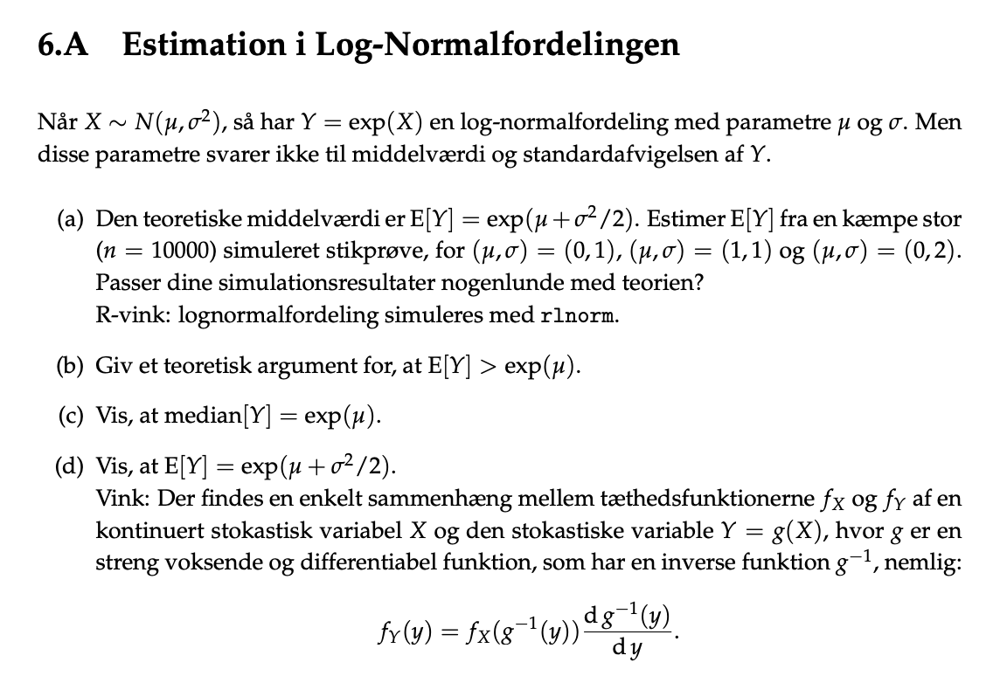

### d) Vis

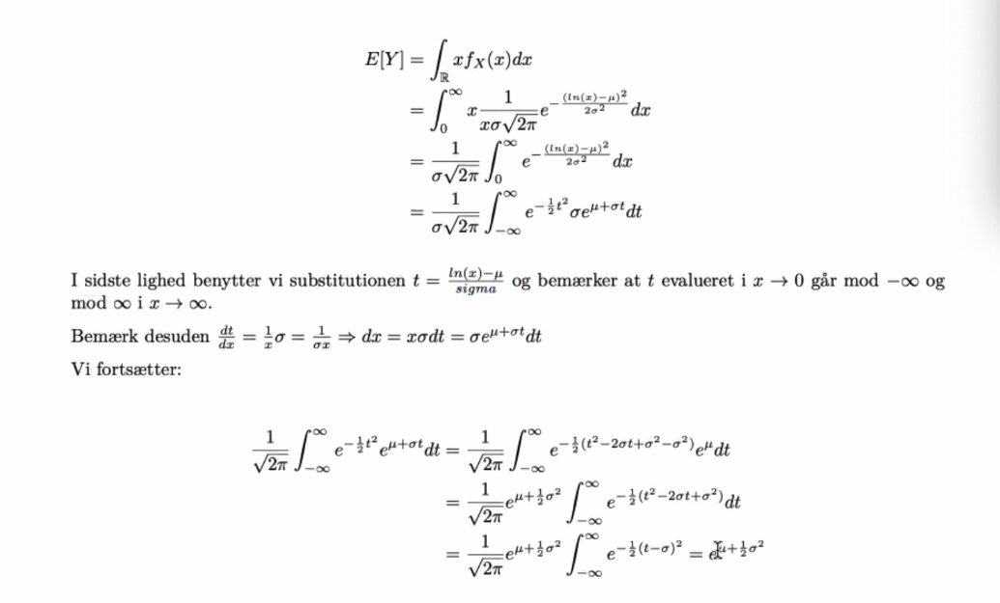

Vi får det vi gerne vil have. 

Går op i hvordan man skal stille det op. 

### b) giv en teoretisk argument for, at E[Y] > exp(mu)

$$
E[Y] = exp(\mu + \frac{\sigma^2}{2}) \\ = exp(\mu)exp(\sigma^2/2)
$$

### c)  vis t median [Y] = exp(mu)

Den nemme måde: Fordelingen (normalfordelingen) er symmetisk og derme vil medianen
selvsagt være lige i midten. Midsten af en symmetisk fordeling vil altid være middelværdien mu.

den ikke nemme løsning:
vi kan først og fremmest bemærke at hvis $X\sim N(\mu,\sigma^2$ og $Y=exp(X)$
er vi færdige hvis vi kan vise at medianen af X er mu da e x er positvi, monoton transofrmation. D X er normalt fordelt kender vi dens pdf fra ppendix c.
Altså skal vi blot vise at $P(X<\mu)=\frac{1}{2}$,


$$ 
P(X < \mu) = \int^\mu_{-\infty} f_X(x)dx=\frac{1}{\sigma \sqrt(2\pi)}\int^\mu_{-\infty}e^{\frac{(x-\mu)^2}{2\cdot \sigma^2}}
$$

vi kan substituere $t=\frac{x-\mu}{\sqrt(2\sigma)}$

Da bliver $dt/dx=\frac{1}{\sqrt(2\sigma)}$ som er det same som $dx=\sqrt(2\sigma dt)$ og t evalueret i mu giver blot 0. Regner vi da vider kan vi omskrive oventående:

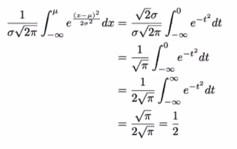

Vi må gerne lave transformationen fra normal til lognormal på denne måde med medianen, da en positiv monoton transofrmation ikke ændrer medianen, da denne kun intersserer sig for rækkefølgen på observationerne - hvorimod fx middelværiden vil se forksel om vi tager E[X^2] eller E[X]^2.


### a) teoretisk, simulering, normalfordeling

```{r}
set.seed(1234)

sim_1 <- rlnorm(n = 10000, meanlog = 0, sdlog = 1)
mean_1 <- mean(sim_1)
theo_1 <- exp(0.5)

sim_2 <- rlnorm(n = 10000, meanlog = 1, sdlog = 1)
mean_2 <- mean(sim_2)
theo_2 <- exp(1.5)

sim_3 <- rlnorm(n = 10000, meanlog = 0, sdlog = 2)
mean_3 <- mean(sim_3)
theo_3 <- exp(2)

parameter <- c("(0,1)", "(1,1)", "(0.2)")
theoretical <- c(theo_1, theo_2, theo_3)
estimated <- c(mean_1, mean_2, mean_3)

difference <- c(theoretical - estimated)
df <- data.frame(parameter, theoretical, difference)
df
```

Jo større middelværdi desto større differens mellem teoretisk og estimerede værdi.
 

## OMS 6.B

- Markovs ulighed? Er en metode man bruger til at bevise proposition 6.4

- Chebyshevs ulighed?

- Når vi kigger på uligheder og grænser så skal vi bruge markov og chebyshevs uligheder.
- Begge fortæller os at random variabler oftes ikke får usædvanlige værdier.

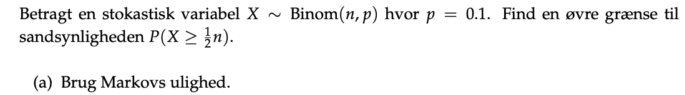

Vi har givet en binomial variable. 

Her har vi givet 

$$
p = 0.1 \\ \alpha = \frac{1}{2}
$$
Ud fra https://www.probabilitycourse.com/chapter6/6_2_2_markov_chebyshev_inequalities.php

Får vi 

$$
P(X \ge \alpha n) \le \frac{EX}{\alpha n}= \frac{pn}{\alpha n} = \frac{p}{\alpha}
$$
Så få vi at der er en øvre grænse

$$
P(X\ge \frac{1}{2} n) \le\frac{1}{5}
$$

 


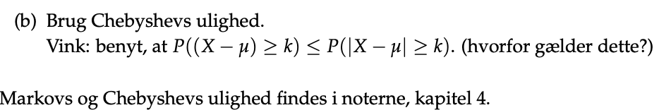

- se formlen og fremgangsmåde på siden: https://www.probabilitycourse.com/chapter6/6_2_2_markov_chebyshev_inequalities.php

findes i 4.5 i utes noter

$$
P(X \ge \frac{1}{2}n)=P(X-np\ge\frac{1}{2}n-np)\\
\le P(|X-np|\ge n(\frac{2}{5}))\\
\le\frac{\sigma^2}{n^{\frac{2}{5}}}\\
=n0.225
$$

Hvornår er det relevant om hvilkene r bedre end den anden. Ikke til at sige.


## 6.36, unbiased estimator, efficiency

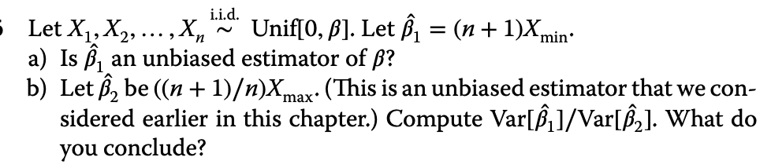
### a) 

Brug side 165 og corollary 4.2.2 til at bregne $f_{min}$.

Bruger her følgende:

$$
f_{min(X)}=n(1-\frac{X}{\beta})^{n-1}\frac{1}{\beta}
$$
$$
E[X_{min}] = \int^{\beta}_0x\cdot(1-\frac{X}{\beta})^{n-1} \frac{1}{\beta} dx \\
= \frac{\beta}{n+1}
$$


$$
Bias(\hat \beta_1) = E[\hat \beta] - \beta\\
= E[(n+1)X_{min}] - \beta \\
(n+1) E[X_{min}] - \beta \\
(n+1) \frac{\beta}{n+1} - \beta \\
=0
$$
Altså unbiased.

### b)

Her skal vi se på 6.3.2 omkring efficiency og se om hvilken af de to estimator
der er mest efficient.

Brug

$$
E[X_{min}^2]=\int^{\beta}_0X^2n(1-\frac{X}{\beta})^{n-1}\frac{1}{\beta} dx \\
= \frac{2b^2}{n^2+3n+2}
$$

$$
var(\hat \beta_1) =var((n + 1)-X_{min}) \\ 
= (n+1)^2var(X_{min})\\
= (n+1)^2(E[X_{min}]-(E[X_{min}])^2)\\
= (n+1)^2(\frac{2b^2}{n^2+3n+2}-(\frac{\beta}{n+1})^2)\\
= \frac{n\beta^2}{n+2}
$$
Så finde vi for

hjælpe funtioner

$$
var(\hat \beta_2)=var((\frac{n+1}{n})X_{max})
$$

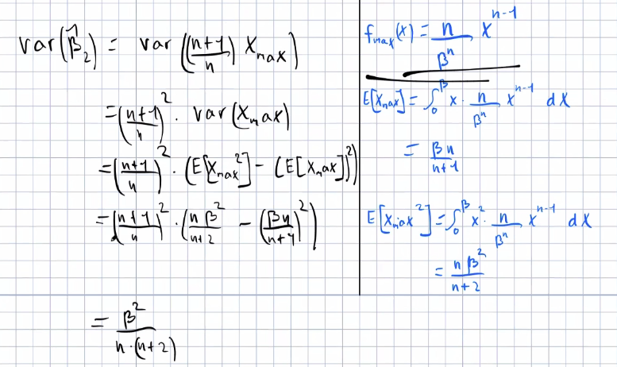
 Deler de med hinanden
 
$$
\frac{var(\hat\beta_1)}{var(\hat\beta_2)} =\frac{\frac{n\beta^2}{n+2}}{\frac{\beta^2}{n(n+2)}}=n^2
$$

beta 1 er højest og vi skal vælge beta2. Da de har ens middelværdi vil den med lavest varians være bedst.

## 6.43, consistent

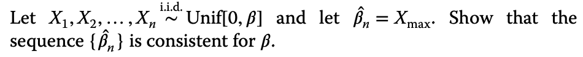

Når man snakker om en estimator er konsistent, så betyder det at desto større
ens data bliver, desto bedre skal ens resultater blive. Desuden burde en MSE
gå mod nul. 
Bruger vi tidligere har udregnet middelværdien

$$
E[X_{min}] = \frac{\beta}{n+1}
$$

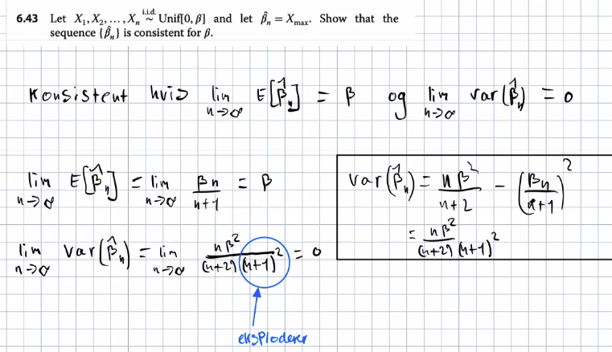
 Den er konsisten da vores varians eksplodere og dermed vil den gå mod nul. 

 ## 7.42 

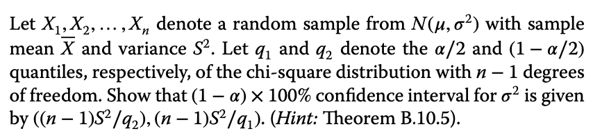


## 6.32

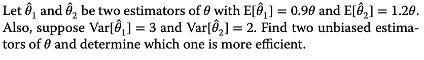


## 7.4

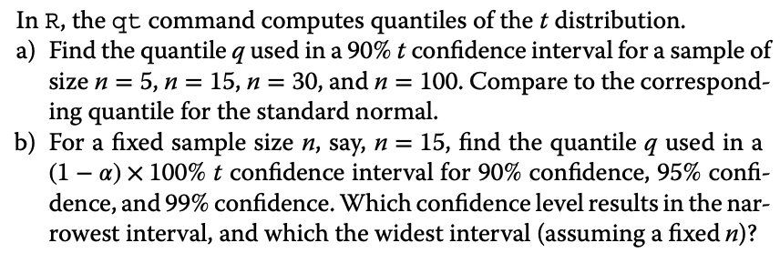


## 7.5, margin of error

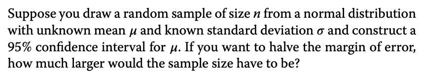

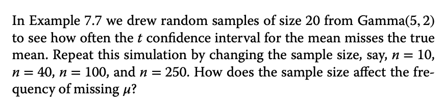


## 7.8

Her skal vi bruge:

```{r}
tooLow <- tooHigh <- logical(N)
# reserver plads til resultater: denne linje laver to vektorer ad gangen
n <- 20 # sample size
q <- qt(0.975, n-1) # quantile
for (i in 1:N) {
x <- rgamma(n, shape = 5, rate = 2)
xbar <- mean(x)
s <- sd(x)
L <- xbar - q*s/sqrt(n)
U <- xbar + q*s/sqrt(n)
tooLow[i] <- U < 5/2 # Does right endpt miss 5/2?
tooHigh[i] <- 5/2 < L # Does left endpt miss 5/2?
}
# andele af d˚arlige konfidensintervaller:
# udnytter at TRUE svarer til 1 og FALSE svarer til 0
mean(tooLow)
mean(tooHigh)
```


