```{r setup, include=FALSE}
knitr::opts_chunk$set(echo = TRUE)
```


## 7.12, 

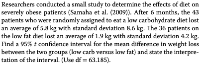
```{r}
n_1 = 43
x_1 = 5.8
s_1 = 8.8
n_2 = 36
x_2 = 1.9
s_2 = 4.2

conf_func <- function(n1, x1, s1, n2, x2, s2, z) {
  z_scor <- qnorm(1- z / 2)
  lower <- (x1 - x2 - z_scor * (sqrt((s1^2/n1)+(s2^2/n2))))
  above <- (x1 - x2 + z_scor * (sqrt((s1^2/n1)+(s2^2/n2))))
  paste(lower, above)
}

conf_func(n1 = n_1, x1 = x_1, s1 = s_1, n2 = n_2, x2 = x_2, s2 = s_2, z = 0.05)
```

vi kan med 95% sikkerhed sige at forskellen i mellem de to populations mean ligger i intervallet.

## 7.14

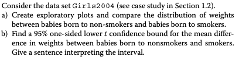

### a)

```{r}
girls <- read.csv("MatStat-R/data/Girls2004.csv")

head(girls)
```
```{r}
girls_smoker <- subset(girls,select = Weight, subset = Smoker == "Yes",drop = TRUE)
girls_no     <- subset(girls,select = Weight, subset = Smoker == "No" ,drop = TRUE)

plot.ecdf(girls_smoker, xlab = "kg")
plot.ecdf(girls_no, col = "blue", pch = 2, add = TRUE)
abline(v = 3300, lty = 2)
legend("topleft", legend = c("smoker", "no"),
    col = c("black", "blue"), pch = c(19, 2))
```


### b)

```{r}
t.test(girls_no, girls_smoker, alternative = "greater", conf.level = 0.95)
```

vi er sikek rpå at mean vægt er mellem de to konfidensbånd.


## 7.24

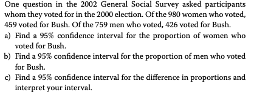

### a) 

```{r}
prop.test(459, 980, correct = TRUE)
```

### b)

```{r}
prop.test(426, 759, correct = TRUE)
```

### c) 

## 7.39

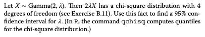
```{r}
qchisq(p = c(0.025, 0.975),
       df = 4)
```

```{r}

```


## 7.A

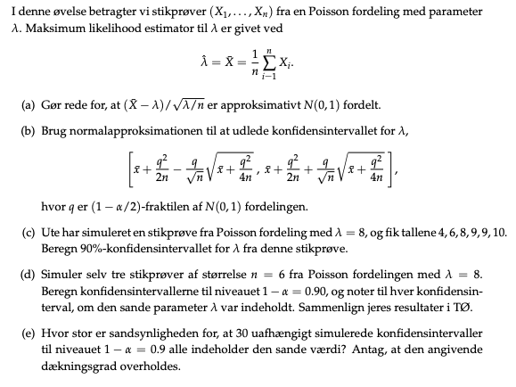


## 7.40

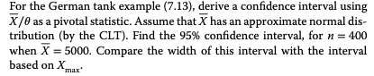
> pivotal statistic: er en funktion af observationer og uboseverede parameter
så sandsynligheds fordelingen ikke afhænger af den ukendte parameter.

## 7.22

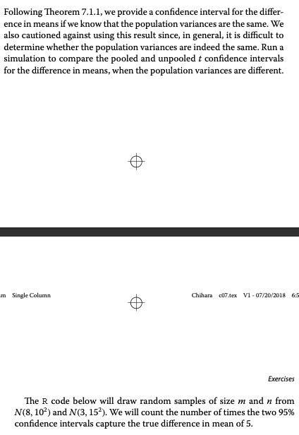

## 8.15, professor

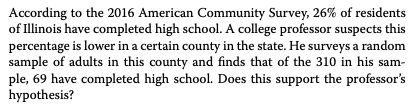

## 8.11, t-test, permutation test, 

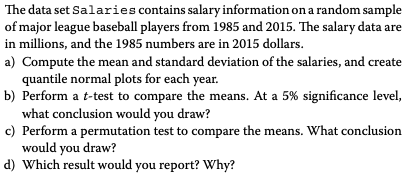


## 7.14, den har du lavet


## 7.29, confidence, bootstrp confidence intervals.

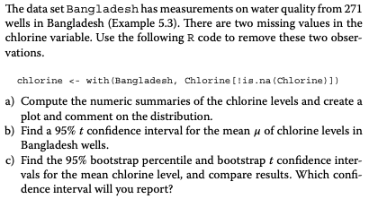

## 7.43, cereal problem,

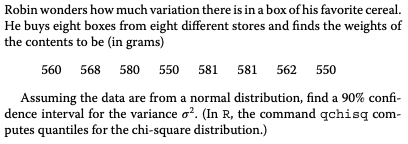

## 8.6, model poisson

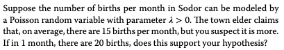
$$
\begin{aligned}
  H0: \lambda > 15 \\
  H1: \lambda <15
\end{aligned}
$$

Beregnes af test statistik.

```{r}
z_possion <- function(TS, lambda){
  z <- (TS - lambda) / sqrt(lambda)
  z
} 

z_possion(20, 15)
```

```{r}
# z niveau 0.95
qnorm(1-0.05/2)
```

```{r}
library(glue)
glue("Vi har altså {z_possion(20, 15)} < {qnorm(1-0.05/2)}")
```
Vi acceptere H0, og der er altså i gennemsnitlig 15 fødsler om måneden. 
