```{r setup, include=FALSE}
knitr::opts_chunk$set(echo = TRUE)
```


## 8.25
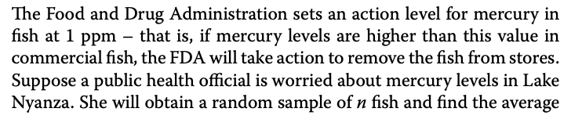

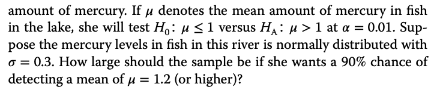


## 8.28

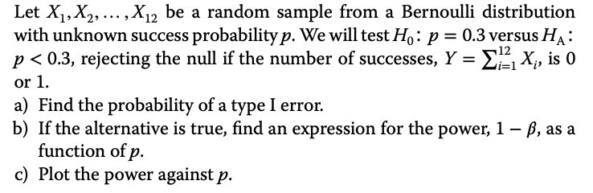


## 8.12

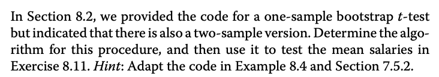

bruger formel ved eksempel 7.22.


```{r}
data <- read.csv("MatStat-R/data/Salaries.csv")

year_1985 <- subset(data$Salary, data$Year == "1985")
year_2015 <- subset(data$Salary, data$Year == "2015")

Salary <- data$Salary
# t test som udgangspunkt.
OservedT <- t.test(year_2015, year_1985, alt = "greater")
OservedT

OservedT <- OservedT$statistic

xbar_2015 <- mean(year_2015)
xbar_1985 <- mean(year_1985)
n <- length(Salary)
N <- 10^4
Tstar <- numeric(N)

for (i in 1:N){
  # bootstrap for både 2015 og 1985.
  # #
  boot_2015 <- sample(year_2015, length(year_2015), replace = TRUE)
  boot_1985 <- sample(year_1985, length(year_1985), replace = TRUE)
  # formlen ved eksempel 7.22.
  Tstar[i] <- (mean(boot_2015) - mean(boot_1985) - (xbar_2015 - xbar_1985)) /
              sqrt(var(boot_2015) / length(year_2015) +  
                     (var(boot_1985) /length(year_1985)))
}
OservedT
mean(Tstar)

hist(Tstar)
abline(v = OservedT)
(sum(Tstar >= OservedT) + 1) / (N+1)
```

hvor ofte ser vi noget så ekstrem, og det er ikke så ofte. 

Udgangspunkt er en  t test

med bootstrap  er det ikke nødvendig at data er normalt fordelt. Den er lidt højreskæv. de 0.007 siger os der ikke er sandsynligt at obserer noget så ekstrem som før.


## 8.30

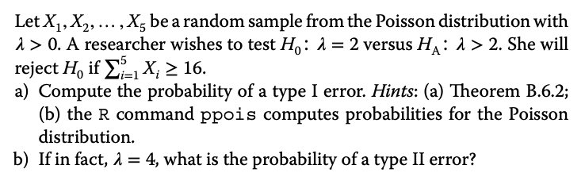

### a)

Vi 5 obs fra pission og test H0, om lambda =2. Forkast hvis sum af stikprøve er >=16,

$$
\text{P(type I error)=P(Reject } H_0|H_0 \text{ true)} \\
=P(X\ge 16 |\lambda=2)\\
=1-ppois(15,10)
$$
 sandynlighed at forkast sand H0, at X>=16 hvor lambda =2 for de enkelte stikprøver.
 Find altså sand for brug B6.2 at 2*5 da vi summer over dem
```{r}
1-ppois(15,10)
```

$$
\text{P(type II error)=P(Fail to reject } H_0|H_1 \text{ true)} \\
=P(X \le 15 |\lambda=4)\\
=ppois(15,20)
$$
Det er summen af stikorøve er mindre end 15 og lambda er 4.

Den stokastiske varibel er fordel med pois(4*5), hvor 4 er lambda og 5 er stikprøve størrelsen.

```{r}
ppois(15,20)
```

Det er 0.16 

Vigtig med forskel i fejlene. 


### b)

Sand for type II.

## 8.33

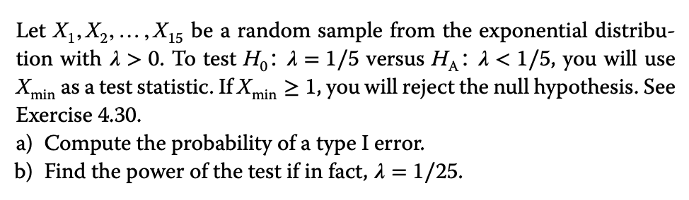
### a)

f_min er test statistik
$$
f_{min}(x)=n(1-F(x))^{n-1}f(x)\\
=15(1-1-e^{-\frac{1}{5}x})^{14}\cdot\frac{1}{5}\cdot e^{-\frac{1}{5}x}\\
=3e^{-3x}
$$
 her ser vi lambda er 3 og så kan vi bruge


 $$
 F_{min}(x)=1-e^{-3x}=Y\\
 P(\text{Type I error})=P(\text{Teject } H_0|H_0  true)\\
 = P(Y\ge 1|\lambda=3)
 $$
 
```{r}
1-pexp(1, rate = 3)
```
 

### b), power,


$$
f_{min}=n(1-F(x))^{n-1}f(x)\\
=15(1-1-e^{-\frac{1}{25}x})^{14}\frac{1}{25}e^{-\frac{1}{6}x}\\
=\frac{3e^{-\frac{3x}{5}}}{5}
$$

så her er lambda 3/5

$$
1-\beta=P(reject H_=|H_A true)\\
=P(Y \ge|\lambda=\frac{3}{5})
$$
```{r}
1-pexp(1,rate=3/5)
```

 


## 8.48

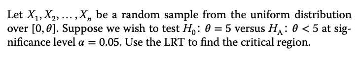


Lad X være

$$
X\sim Uni(0,0) \\
\text{Vi ønsker at test}\\
H_0=0.5\\
H_1<0.5 \\
\text{med signifikans } \alpha=0.05
$$


Vores test statistik til LRT () er givet ved:

$$
T=\frac{L(\theta_{H_0})}{L(\theta_{H_1})} \text{ likelihood funktion  }
$$
husk det er theta under H= som er 0.5. 

Når den alternative test er mindre en bestem værdi så skal vi bruge theta maximum liehood. Den findes i bogen så den viser han ikke.

Når vi benytter et test på denne form, vil værdien vi kyler in i den nederste likelihood funktion være MLE for vores parameter. I dette tilfælde:
$$
\theta_{H_1}=max(X_1,...,X_n)=X_{max}\\

L(5)=(\frac{1}{5})^n \text{ under H0 bruges 5}\\ 
L(X_{max})=(\frac{1}{X_{max}})^n \text{ det er under den alternative}
$$
Maximu likel udtrykke er nogen man kan regne sig til, men det er også at finde dem.

Dermed bliver: 

$$
T=(X_{max}/5)^n
$$

Vi afviser H0 T < c. Alternativt afviser vi H0 hivs $X_{max}<k$. (da (1/5)^n blot er en konstant)
pdf for Xmax kender vi fra korollar 4.2.2. 

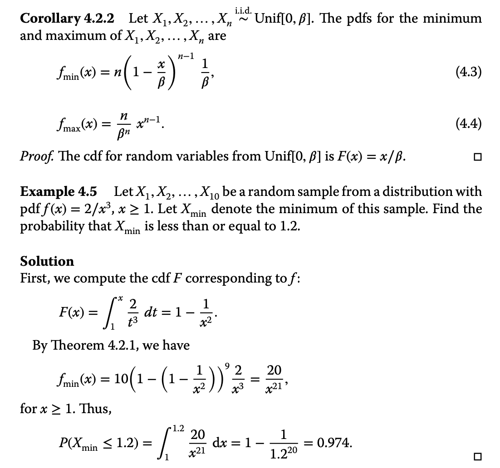


Vi antager H0 er sand

$$
\alpha =\int^k_0 f_ma x(x)dx\\
=\int^k_0 (\frac{n}{5})^nx^n -1dx\\
\frac{k^n}{5^n}

$$
Altså har vi at 0.05=k^n/5^n som er det samme som

$$
k=5*0.05^{\frac{1}{n}}
$$

Dermed forkaster vi H0 i mængden 

$$
{X_{max} < 5 * 0.05^{\frac{1}{n}}}

$$

Kommentar mellem simon og Naveed. Kontinuert fordeling kan ikke antage en præcis værdi, et resultat han nævner. 

Husk at hvis den alternative er mindre end så skal vi bruge maximum likelihood estimator. 

## 8.A

### a)

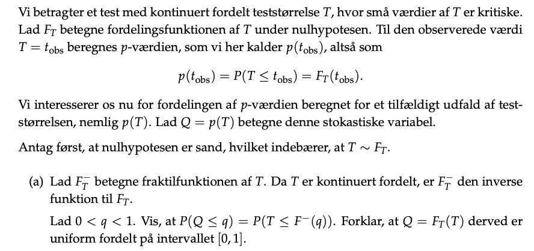
Lad:
$$
P(W \le q) = P(T\le q) \text{ Hvor vi T=} F_T(t_{obs})\\
= P(F_T(t_{obs})\le q) \text{ Tag den inverse } \\
= P(F^-(F_t(t_{obs}))\le F^-(q)) \text{ Hvor nu F vil gå ud}\\
=P(t_{obs} \le F^-(q))

$$

Den inverse af en funktion går de ud med hinanden.

### b)

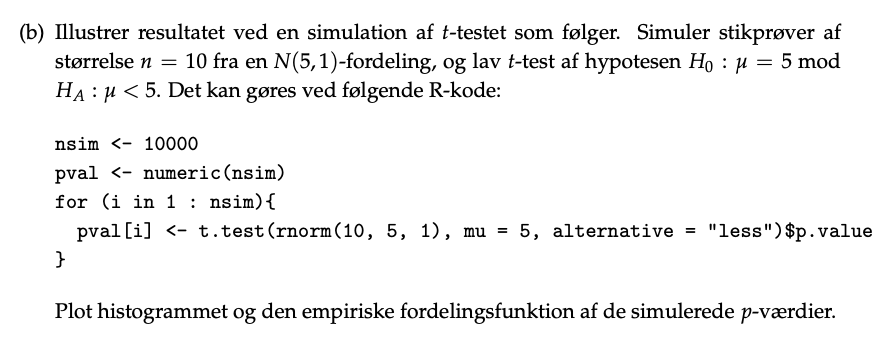

```{r}
nsim <- 10000
pval <- numeric(nsim)
for (i in 1:nsim){
  pval[i] <- t.test(rnorm(10,5,1), mu = 5, alternative = "less")$p.value
}

hist(pval)
```

Vi laver en t test på en stikprøve og trækker p væriden ud.

Tag vores test, og da H0 er sand så ses denne hist.


### c)

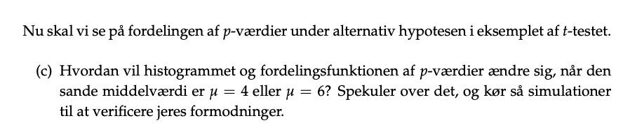

mu = 4

så må p væriden ligge lagt over mod højre og vi får nogle lave o værdier


```{r}
nsim <- 10000
pval <- numeric(nsim)
for (i in 1:nsim){
  pval[i] <- t.test(rnorm(10,4,1), mu = 5, alternative = "less")$p.value
}

hist(pval)
```

meget sand aH1 er sand


mu = 6

```{r}
nsim <- 10000
pval <- numeric(nsim)
for (i in 1:nsim){
  pval[i] <- t.test(rnorm(10,6,1), mu = 5, alternative = "less")$p.value
}

hist(pval)
```

H1 ikke sand.


### d)

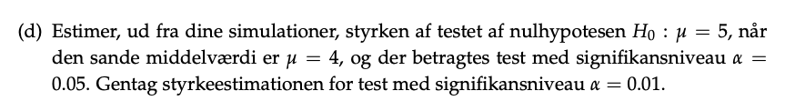

```{r}
nsim <- 10000
pval <- numeric(nsim)
for (i in 1:nsim){
  pval[i] <- t.test(rnorm(10,4,1), mu = 5, alternative = "less")$p.value
}

mean(pval < 0.05)
```

estimer styrken.

styrken er på 90%. Hvis iv ændre signifikansniveauet så bliver det omkring 60%.
som betyder vi oftere vil acceptere en falsk H0.

## 8.4

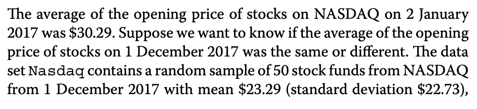

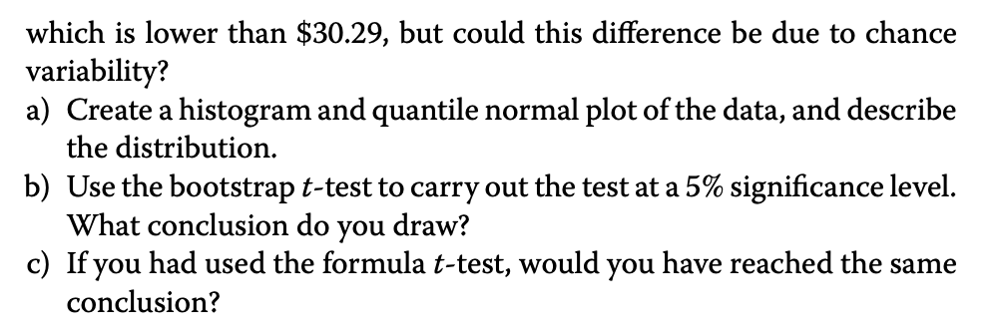

### a)

```{r}
data <- read.csv("MatStat-R/data/Nasdaq.csv")
head(data)

hist(data$Open)
qqnorm(data$Open)
qqline(data$Open)
```

Det er højreskæv. 

### b), bootstrap

```{r}
observedT <- t.test(data$Open, mu = 30.29)$statistic
xbar <- mean(data$Open)
n <- length(data$Open)
N <- 10^5
Tstar <- numeric(N)

for (i in 1:N){
  bootx <- sample(data$Open, n, replace = TRUE)
  Tstar[i] <- (mean(bootx) - xbar) / (sd(bootx)/sqrt(n))
}

hist(Tstar)
abline(v = observedT)
2 * (sum(Tstar <= observedT) + 1) / (N + 1)

test <- t.test(data$Open, mu = 30.29)
test$p.value
```

Fra boot får vi en p værdi på 0.07 så der er ikke en forskel mellem priserne, så det skyldes bare tilfældighed. 

For t testen kræver det at vores data ernormal fordelt. 

### c)


## 8.34

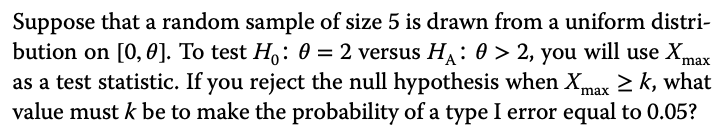