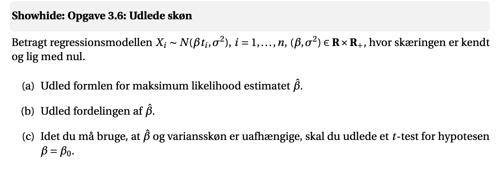
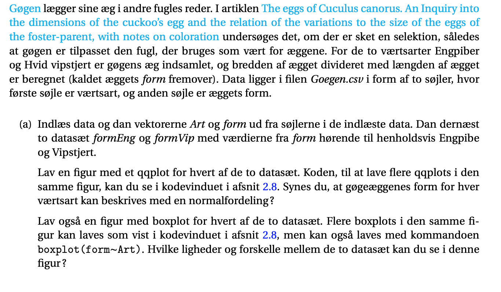
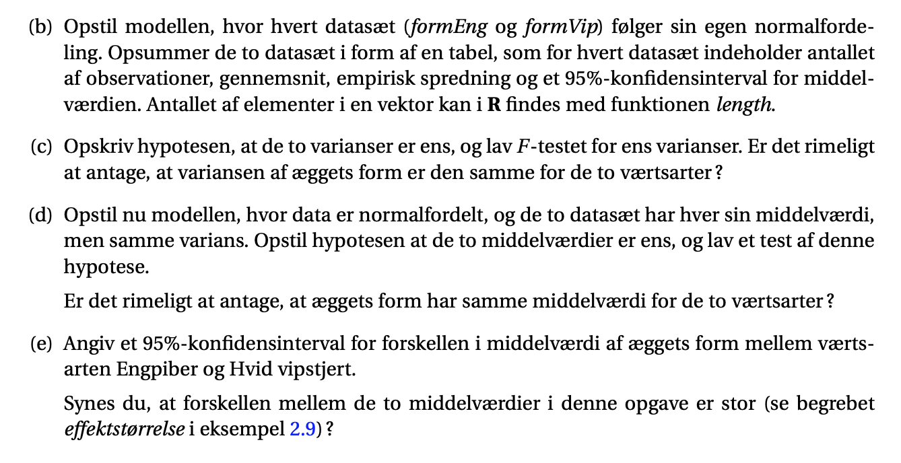
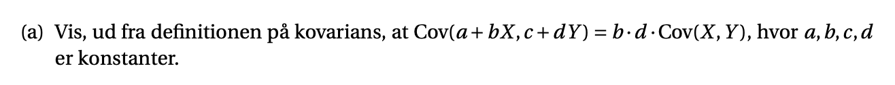

```{r setup, include=FALSE}
knitr::opts_chunk$set(echo = TRUE)
```

## webbog opgave 3.1

Et mål for udviklingen af kompleksiteten af computerchips er antallet af transistorer på en chip.
På adressen Transistor count kan man finde en tabel med antallet af transistorer for 108 chips
produceret i perioden 1971-2016. Moore’s lov siger, at antallet af transitorer på en chip fordobles
94 Kapitel 3. Lineær regression
cirka hvert andet år. Dette blev formuleret af Gordon Moore, som var medstifter af Intel (Moore’s
udsagn går helt tilbage til 1965 og 1975).

I skal nedenfor undersøge dette udsagn ved at se på de log2
transformerede antal transistorers
afhængighed af produktionsår. Ved at bruge to-talslogaritmen opnår vi, at en fordobling af antal
transistorer svarer til en stigning på 1.
Filen Moore.csv indeholder data. Filen har to søjler, hvor første søjle er produktionsår regnet
med udgangspunkt i 1950 (en værdi på 24 svarer således til 1974), og anden søjle er antal transistorer på chippen.

### a) Indlæs data, og dan variablene Aar og Antal med indholdet af de to søjler. Dan endvidere
variablen log2Antal=log2(Antal) med de log2
transformerede antal transistorer. Lav en
figur, hvor log2Antal tegnes op mod Aar (Aar langs førsteaksen og log2Antal langs andenaksen). Er det rimeligt at sige, at der er en lineær sammenhæng mellem de to variable?

```{r}
moore <- read.csv("MatStat-R/data/JLJfiler/Moore.csv")
```

```{r}
library(tidyverse)
moore2 <- moore %>% 
  rename(Antal = Transistorer) %>% 
  mutate(log2Antal = log2(Antal))

plot(moore2$Aar, moore2$log2Antal)
```
Jeps.

### (b) Opskriv den lineære regressionsmodel for data. Estimer parametrene i modellen, og lav figurer til modelkontrol. I residualplottet skal du indtegne to vandrette linjer, der skærer andenaksen i punkterne ±2sr
, hvor sr er skønnet over spredningen i regressionsmodellen.

$$
y=\alpha + \beta x
$$


```{r}
model <- lm(Aar ~ Antal + log2Antal, data = moore2)
summary(model)
```


### c) Beregn 95%-konfidensintervaller for henholdsvis skæring og hældning i den lineære sammenhæng mellem middelværdien af log2Antal og Aar. Eftervis, at konfidensintervallet for
hældningen, fundet gennem et kald til confint, er korrekt ved at bruge oplysninger i output
fra summary.


### d) Overvej, om data er i overensstemmelse med en teori, der siger, at antallet af transitorer på
en chip fordobles hvert andet år ?


## webbog opgave 3.2

I denne opgave skal I se på muligheden for at prædiktere den tid, der skal bruges til at teste et
program ud fra oplysning om, hvor lang tid der er brugt på at kode programmet. Data i filen
Testtid.csv indeholder oplysninger for 95 programmer. Filen har to søjler, hvor første søjle er tid
3.9. Opgaver til kapitel 3 95
brugt på at kode, og anden søjle er tid brugt på at teste programmet (begge tider er i timer). Data
er simulerede ud fra oplysningerne i figur 3 i artiklen Software effort estimation with multiple
linear regression: review and practical application.
I opgaven her skal I etablere en lineær sammenhæng mellem middelværdien af logaritmen til
testtiden og logaritmen til kodningstiden og bruge denne sammenhæng til at prædiktere testtiden
ved forskellige givne værdier af kodningstiden.

### (a) 
Lad logKode være en vektor med logaritmen til kodningstiderne, og lad logTest være en vektor med logaritmen til testtiderne. Lav en figur, hvor logTest afsættes mod logKode. Er det
rimeligt at sige, at der er en lineær sammenhæng mellem de to variable ?
Opskriv den lineære regressionsmodel for data, og estimer parametrene i denne via lm og
summary. Indtegn den fundne linje i figuren med data.
Prøv i ord at beskrive sammenhængen i data, ud fra hvad du ser i figuren.

```{r}
testtid <- read.csv("MatStat-R/data/JLJfiler/Testtid.csv")
```

```{r}
testtid2 <- testtid %>% 
  mutate(logKode = log(KodningsTid),
         logTest = log(TestTid))
```

```{r}
plot(testtid2$logTest, testtid2$logKode)
```

lineær sammenhæng.

```{r}
model_2 <- lm(logTest ~ logKode, data = testtid2)
summary(model_2)
```

```{r}
plot(testtid2$logTest, testtid2$logKode)
abline(model_2)
```

Det ser ud til at modellen rammer ved siden af. 

### (b) 
Lav et test, for hypotesen at hældningen er nul. Hvad bliver konklusionen af dit test ? Lav
dernæst et 95%-konfidensinterval for hældningen. Kommenter på betydningen af, at hældningen ser ud til at være væsentlig mindre end 1.
Lav et skøn over ændringen i middelværdi af logTest mellem en værdi af logKode på 2 og
4, og sammenhold denne med spredningen omkring regressionslinjen (jævnfør din egen
beskrivelse af sammenhængen i data sidst i foregående spørgsmål).

```{r}

```


### (c) Lav et 95%-konfidensinterval for middelværdien af logTest, når logKode er 6.
Lav dernæst et prædiktionsinterval for en kommende måling, når logKode er 6.
Prøv at forklare, hvorfor prædiktionsintervallet er noget bredere end konfidensintervallet.

### (d) I dette spørgsmål skal du beregne konfidensintervallet og prædiktionsintervallet i mange
punkter og indtegne disse som en kurve i figuren fra spørgsmål (a). Du kan finde inspiration
til konstruktion af figuren i afsnit 3.5 i det skjulte punkt "Test dig selv". Til beregningen kan
du kalde predict med nye datapunkter givet ved data.frame(logKode=c(0:100)*0.07).

## webbog opgave 3.4 (Desværre hedder datafilen "LambertBeer.txt" og ikke "LambertBeer.csv". Indlæs med kommandoen ## read.table("../Data/LambertBeer.txt"))

Denne opgave omhandler måden, hvorpå absorption af lys i en væske afhænger af koncentrationen af et absorberende molekyle i væsken, og hvordan vi kan bruge dette til at estimere koncentrationen ud fra en målt lysintensitet. Man måler lysintensiteten I ved forskellige kendte koncentrationer af det absorberende molekyle. På denne måde får man etableret en kalibreringkurve, der
3.9. Opgaver til kapitel 3 97
efterfølgende kan benyttes til at finde koncentrationen af molekylet i en prøve ud fra en måling
af lysintensiteten efter lysets passage gennem prøven.
Absorption af denne type beskrives typisk via Lambert-Beers lov:

$$
I=I_0 exp{-\epsilon vc}
$$

Her er ε absorptionskoefficienten for det absorberende molekyle, v er vejlængden gennem materialet, c er koncentrationen af molekylet og I0 er lysintensiteten når koncentrationen er nul.
I denne opgave betragter vi en serie målinger af lysintensiteten I som funktion af koncentrationen for en opløsning af Rhodamine 6G i ethanol. Den benyttede vejlængde gennem opløsningen er v = 1.00cm. Egentligt burde man i modelleringen af data også tage hensyn til, at
koncentrationen af opløsningsmidlet ethanol ændrer sig, når koncentrationen af Rhodamine ændres, men denne effekt er så lille, at vi kan se bort fra den. Tager vi logartimen på begge sider i
Lambert-Beers lov (3.2), får vi

$$
H=\alpha - \epsilon vc
$$

hvor α = log(I0) og H = log(I).
Data i filen LambertBeer.csv giver den målte værdi af lysintensiteten I for 16 forskellige valg af
koncentrationen. Filen har to søjler, hvor første søjle er koncentration, og anden søjle er lysintensiteten

```{r}
lambertbeer <- read.table("MatStat-R/data/JLJfiler/LambertBeer.txt")
```


### 1. Dan en variabel logLys med logaritmen til de målte lysintensiteter og en variabel konc med
koncentrationerne af Rhodamine 6G. Lav en figur, hvor logLys afsættes mod koncentrationen konc. Synes I, at der er en lineær sammenhæng i data ? Synes I, at sammenhængen er
god, med henblik på at estimere koncentration ud fra lysintensiteten ?

### 2. Opskriv den lineære regressionsmodel, hvor respons er logaritmen til lysintensiteten, og
den forklarende variabel er koncentration. Forklar, at regressionskoefficienten β i denne
model er β = −εv. Estimer modellen og indtegn den estimerede linje i figuren ovenfor.

### 3. Beregn et 95%-konfidensinterval for den ukendte koncentration af Rhodamine 6G i tre tilfælde med en enkelt ny måling af lysintensiteten Lys. Hertil kan du bruge funktionen inversReg omtalt i underafsnit 3.5.1. Funktionen findes i filen Rfunktioner.txt. De tre tilfælde er
Lys = 2654, Lys = 4512 og Lys = 7688. Lav en tabel med resultaterne.

## webbog opgave 3.6



## webbog opgave 2.3

```{r}
goegen <- read.csv("MatStat-R/data/JLJfiler/Goegen.csv")

goegen %>% head()
```







## webbog opgave 3.7





