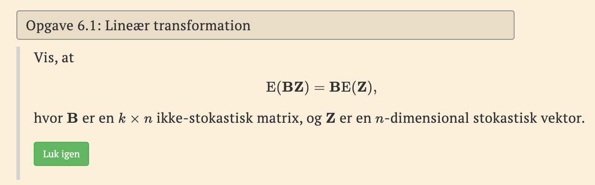
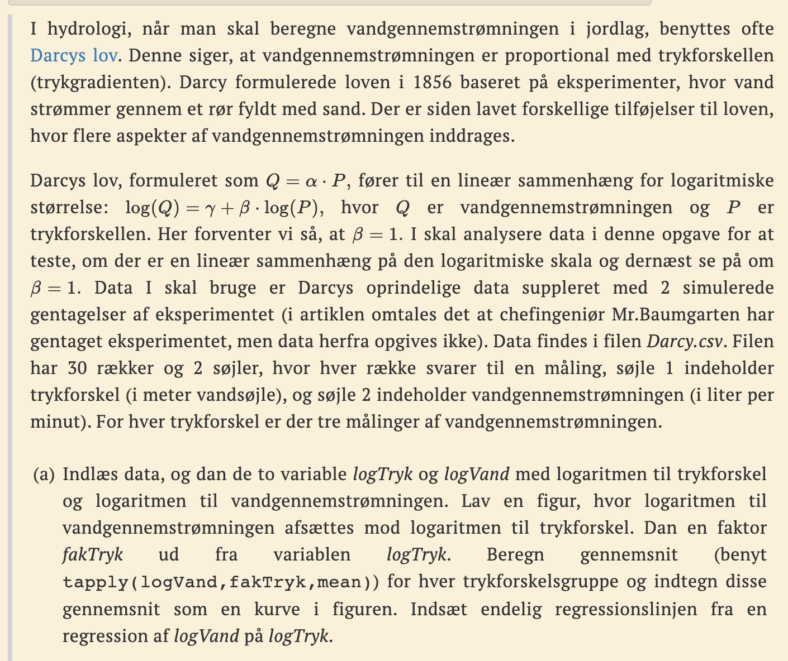
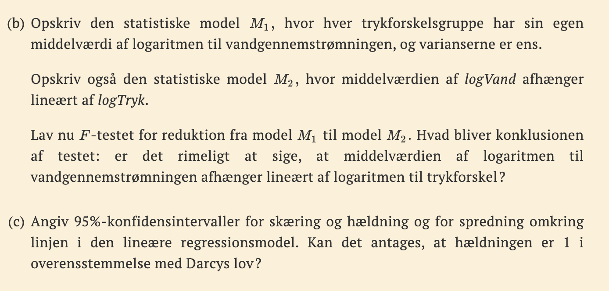
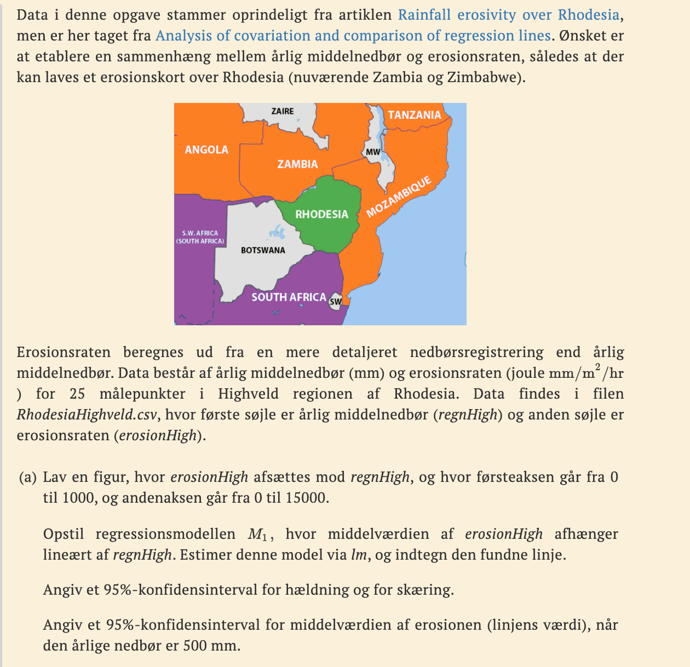
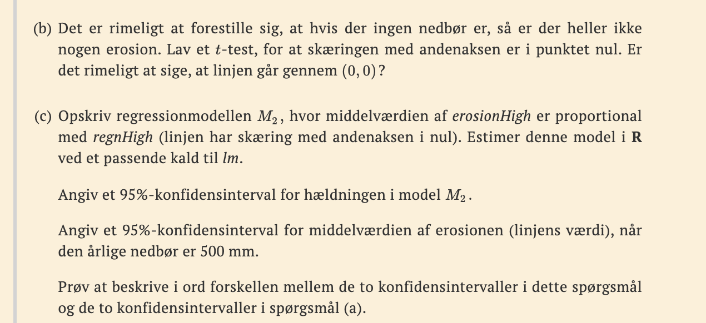
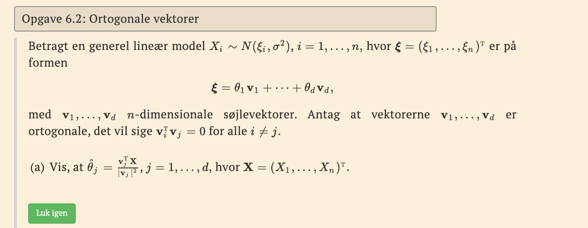

```{r setup, include=FALSE}
knitr::opts_chunk$set(echo = TRUE)
library(tidyverse)
```

### 6.1



### 5.1

Opgaven kan ses som en forlængelse af opgave 5.1, hvor vi så på længde
og bredde af sprækker i jordoverfladen i de canadiske Rocky Mountains.
Vi vil udvide undersøgelsen og inddrage sprækker fra to andre steder på
jorden, nemlig fra Kyushu i Japan og fra Kilve i England. Som i opgave
5.1 er data aflæst fra figur i A modern regression approach to
determining fault displacement-length scaling relationships.

Data findes i filen **Spraekker.csv**, der har tre søjler. Den første
søjle angiver området (med værdierne RM, Kyushu og Kilve), den anden
søjle indeholder længden og den tredje søjle bredden af sprækkerne,
begge målt i meter.

```{r}
spraekker <- read.csv("MatStat-R/data/JLJfiler/Spraekker.csv")
head(spraekker)
```

#### a)

Indlæs data, og dan variablen omr med område og variablene logL og logB
med henholdsvis logaritmen til længden og logaritmen til bredden. Hvis
omr ikke er en faktor efter indlæsningen, skal du omdanne den til en
faktor.

```{r}
omr <- factor(spraekker$Omraade)
logL <- log(spraekker$Laengde)
logB <- log(spraekker$Bredde)
```

Lav en figur, hvor logaritmen til bredden afsættes mod logaritmen til
længde, og hvor hver af de tre områder har sin egen farve (dette opnås
med tilføjelsen col=omr til plot-kommandoen).

```{r}
plot(logB ~ logL, col = omr)
```

Estimer for hver af de tre områder parametrene i modellen, hvor
middelværdien af logaritmen til bredden afhænger lineært af logaritmen
til længden. Du kan lade dig inspirere af koden i det første kodevindue
i afsnit 5.2. Indtegn efterfølgende de tre estimerede linjer i jeres
figur (jeg minder om, at en regressionslinje kan indtegnes ved at
benytte abline, hvor input er output fra et kald til lm).

```{r}
kyushu <- subset(spraekker, Omraade == "Kyushu")
kilve <- subset(spraekker,  Omraade == "Kilve")
rm <- subset(spraekker,     Omraade == "RM")

lmUDKy <- lm(log(kyushu$Bredde) ~ log(kyushu$Laengde))
lmUDKi <- lm(log(kilve$Bredde) ~ log(kilve$Laengde))
lmUDRM <- lm(log(rm$Bredde) ~ log(rm$Laengde))

plot(logL, logB, col = omr)
abline(lmUDKy, col = "red")
abline(lmUDKi)
abline(lmUDRM, col = "green")
```

#### b)

Opstil den statistiske model, hvor hvert område har sin egen lineære
sammenhæng mellem middelværdien af logB og logL, og hvert område har sin
egen varians omkring den lineære sammenhæng. Opstil hypotesen, at der er
samme varians for de tre områder. Benyt Bartletts test for at vurdere
denne hypotese. (I kan igen lade jer inspirere af koden i det første
kodevindue i afsnit 5.2).

opstil den bredde model

$$
logB_{omr_i}\sim N(\alpha_{omr_i} + \beta_{imr_i}logL_{omr_i}, \sigma^2_{omr_i}),1,...,64
$$ check om samme varians:

```{r}
bartlett.test(list(lmUDKy, lmUDKi, lmUDRM))
#  
```

p værdien er 0.035 den er under 0.05 det er okay så vi går ud fra de har
samme varians.

#### c)

Opstil nu den reducerede model, hvor der er samme varians i de tre
regressionsmodeller (selvom pp-værdien i Bartletts test var lidt under
5%, vælger vi at sige samme varians). Undersøg, om det kan antages, at
de tre hældninger er ens. Undersøg dernæst, om det kan antages, at de
tre skæringer er ens.

OPsitl den reducerede model

$$
logB_{omr_i}\sim N(\alpha_{omr_i} + \beta_{omr_i}logL_{omr_i}, \sigma^2)
$$ UNdersøger om det kan antages de at hældnignerne er ens:

Additiv model for lineære regressioner $M_{2\alpha$, med samme hædlning.

$$
anova(lm(x\sim gr+t), lm(x\sim gr*t))
$$

```{r}
M1_til_M2_alpha <- anova(lm(logB~ omr+logL), lm(logB ~ omr * logL))
M1_til_M2_alpha
```

Data stirder mod hypotesen

$$
\beta_U=\beta_M
$$

Vi kan godt beskrive ved den additive model.

Vi laver altså en reduktion fra M1 til M2 som er den model hvor skæring
er den samme, og undersøger om skæringen kan komme fra den samme
foreling p væriden siger det kan godt lade sig gøre.

Nu vil jeg undrsøge sammde for skræing

```{r}
M1_til_M2_beta <- anova(lm(logB~ logL+omr:logL), lm(logB ~ omr*logL))
M1_til_M2_beta
```

samme forklaring. Modellen kan beskrives additivt.

#### d)

For modellen, hvor der er den samme hældning for de tre områder, skal du
angive skøn og konfidensinterval for de parametre, der indgår i
modellen. Kan det antages, at hældningen er 1, svarende til at bredden
er proportional med længden?

```{r}
M2a = lm(logB~ omr + logL)
summary(M2a)
```

1 intercept alpha 2 alpha_u-alpha_m beta sigma

derfor er modellen

$$
logB~ N(\alpha\cdot omr+0.09\cdot logL_i,0.9^2  )
$$

```{r}
confint(M2a)
```

logL er hældnign og den ligger indenfor 1.

```{r}
plot(logL, logB, col = omr)
abline(lmUDKy, col = "red")
abline(lmUDKi)
abline(lmUDRM, col = "green")
curve(-1.69801 + 0.9 * x, add = TRUE, col = "yellow")
curve(-1.69801 + 1 * x, add = TRUE, col = "blue")
```

Ovenstående forvirrende.

### 4.3



```{r}
darcy <- read.csv("MatStat-R/data/JLJfiler/Darcy.csv")
logTryk <- log(darcy$Trykforskel)
logVand <- log(darcy$Vandfoering)
```

```{r}
plot(logVand ~ logTryk)
```

gennemsnit

```{r}
fakTryk <- factor(logTryk)

tapply(logVand, fakTryk, mean)
plot(logVand~ logTryk )
abline(lm(logVand~ logTryk), col = "cornflowerblue")
#par(new = FALSE)
#  lines(tapply(logVand, fakTryk, mean), col = 'red', type = 'b')
lines(tapply(logTryk, fakTryk, mean), tapply(logVand, fakTryk, mean), col = 2,
      type = 'b', pch = 16)
```



#### b)

var er ens

$$
M1:logVald_i\sim N(\chi_i,\sigma^2), \chi_i=\alpha_{fakTryk_i}+\beta_{fakTryk_i}logTryk_i
$$

$$
M_2: logVand_i\sim N(\alpha + \beta logTryk_i,\sigma^2)
$$

lav FF testen fra m1 til m2

```{r}
M1_til_m2 <- anova(lm(logVand ~ logTryk), lm(logVand ~ fakTryk * logTryk))
M1_til_m2
```

høj p vangennemstrømningen afhænger lineær af logariem til trykforskel.

#### c)

```{r}
confint(lm(logVand~logTryk ))
```

hældning ligger under 1.

find formel

```{r}
lmSUM <- summary(lm(logVand ~ logTryk))
lmSUM$sigma
```

```{r}
df <- lmSUM$df
df[2]
```

```{r}
sqrt(df[2] * lmSUM$sigma^2 /
       qchisq(c(0.975, 0.025), df[2]))
```

finder konfidents interval for spredning.

### 3.3



### a)

lav figur

```{r}
rhodes <- read.csv("MatStat-R/data/JLJfiler/RhodesiaHighveld.csv")
reghigh <- rhodes$Nedboer
erosionhigh <- rhodes$Erosion
```

```{r}
plot(reghigh, erosionhigh, xlim = c(0, 1000), ylim = c(0, 15000))
```

opstil M1

$$
erosin_i \sim N(\alpha + \beta \cdot regn_i, \sigma^2), i=1,...,25
$$

estimer

```{r}
lmUD <- lm(erosionhigh ~ reghigh)
lmUD
```

```{r}
plot(reghigh, erosionhigh, xlim = c(0, 1000), ylim = c(0, 15000))
abline(lmUD$coefficients)
```

angiv kondi

```{r}
confint(lmUD)
```

angiv for 500 mm

```{r}
predict(lmUD, data.frame(reghigh = 500), interval = "confidence")
```

#### b)

t tst

```{r}
anova(lm(erosionhigh ~ reghigh - 1), lm(erosionhigh ~ reghigh))
```

vi forkaster H0. vi kan antage linjen går igennem

#### c)

$$
erosion \sim N(/beta \cdot regn, sigma^2)
$$

```{r}
lmUD2 <- lm(erosionhigh ~ reghigh - 1)
lmUD2
```

confiden

```{r}
confint(lmUD2)
```

nagi for 500 mm

```{r}
predict(lmUD2, data.frame(reghigh = 500), interval = "confidence")
```

samller konfidence.



### 4.7

Gå tilbage til opgave 4.1, hvor Bartletts test for ens varianser
betragtes. Beregn Bartletts teststørrelse baseret udelukkende på
informationen i tabellen med gennemsnit og empiriske spredninger i de
tre grupper.

se 4.5 hvordan udregnes. bruger bare formlen

```{r}
df1 <- 14 - 1
df2 <- 16 - 1
df3 <-  8 - 1

k <- 3 # tre grupper. 
df <- df1 + df2 + df3

s12 <- 0.154^2
s22 <- 0.084^2
s32 <- 0.159^2

s2 <- sum(df1 * s12, df1 * s22, df3 * s32) / df

C <-  1 + (1 / (3 * (k - 1))) * 
  sum(1 / df1 - 1 / df, 
      1 / df2 - 1 / df,
      1 / df3 - 1 / df)

Ba <- (1 / C) * (df * log(s2) - 
                   sum(
                     df1 * log(s12),
                     df2 * log(s22),
                     df3 * log(s32)))
pværdi <- 1 - pchisq(Ba, k - 1)

```

### 6.2


