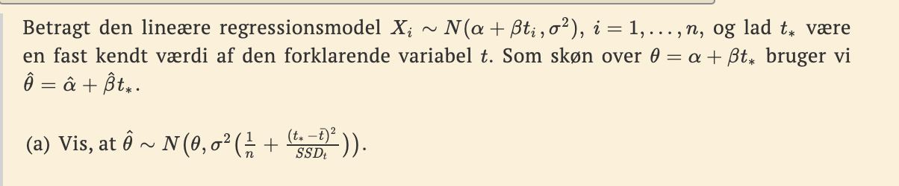
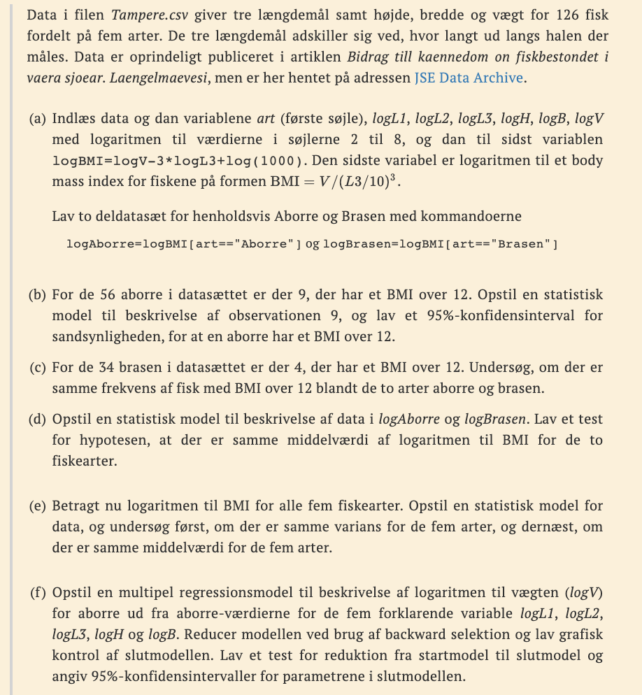
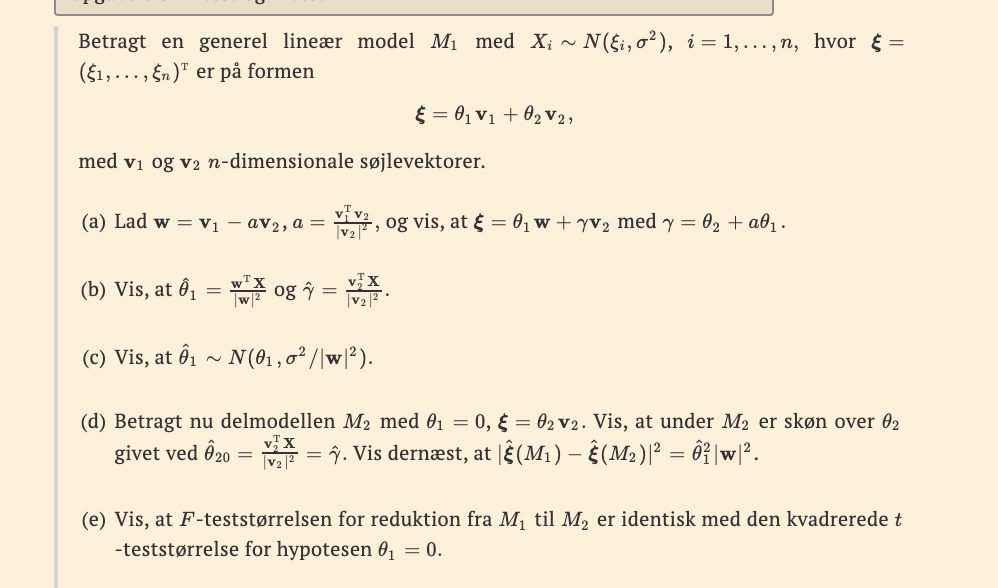
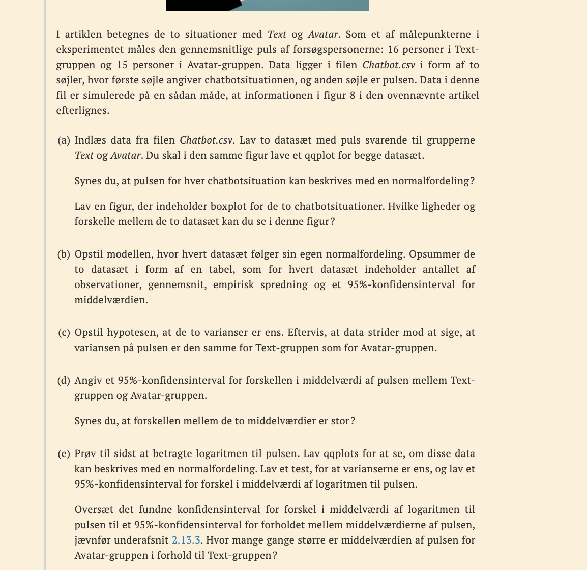
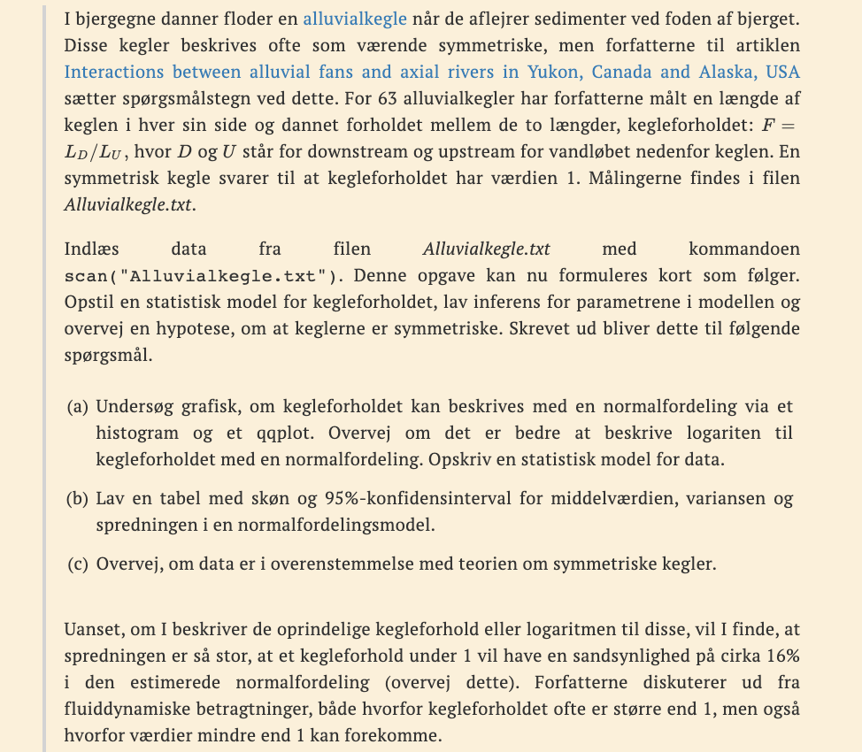
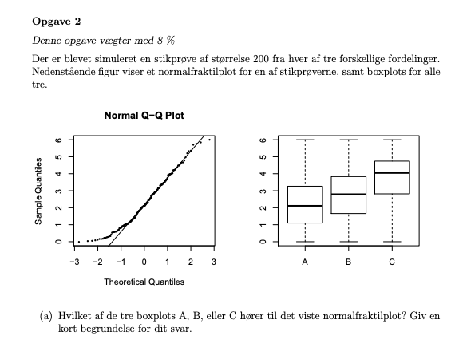

```{r setup, include=FALSE}
knitr::opts_chunk$set(echo = TRUE)
```


## 3.8


## 5.3 


### a) dan variabler og dan to datasæt

```{r}
library(tidyverse)
dat0 <- read.csv2("MatStat-R/data/JLJfiler/Tampere.csv", sep = ',') %>% 
  mutate(across(c(L1,L2,L3,Hoejde,Bredde,Vaegt), as.numeric))
dat0
Art <- dat0[,1]
logL1 <- log(dat0[,2])
logL2 <- log(dat0[,3])
logL3 <- log(dat0[,4])
logH <- log(dat0[,5])
logB <- log(dat0[,6])
logV <- log(dat0[,7])
logBMI <- logV - 3 * logL3 + log(1000)
logAborre <- logBMI[Art == 'Aborre']
logBrasen <- logBMI[Art == 'Brasen']
```


### b) opstil model

vi kigger på ud af de 56 obs hvad er sand for 9 suceseer?
det er binominalfordeling.

altså har vi på 9 en model binom(56,p)

```{r}
x = 9 # antal suc
n = 56 # antal obs
z = 1.96
phat <- x / n
phat + c(-1,1) * z*sqrt(phat*(1-phat)/n)
```

formel fra wiki.

brug
```{r}
prop.test(9,56)
```


### c) model igen?


(9,47) obs fr multinom(56, (piA_1,piA_2)
(4,30) obs fr multinom(34, (piB_1,piB_2))

```{r}
Obs <- rbind(c(9,47), c(4,30))
ex <- outer(rowSums(Obs), colSums(Obs))/sum(Obs)
G <- 2 * sum(Obs * log(Obs/ex))
pval <- 1-pchisq(G, (dim(Obs)[1] - 1) * (dim(Obs)[2] -1))
list(Forventede = ex, G = G, p_vaedi = pval)
```

Cochrans regel.

### d) OPstil model

se om var er ens

```{r}
var.test(logAborre, logBrasen)
```


### e) opstil model me dlog


### f) opstil multipel model


## 6.3 (d-e)

## 2.4


## 2.1 



```{r}
chatbot <- read.csv("MatStat-R/data/JLJfiler/Chatbot.csv")

text <- subset(chatbot, Chatbot == 'Text')
avatar   <- subset(chatbot, Chatbot == 'Avatar')

par(mfrow = c(1,2))
qqnorm(text$Puls, main = 'Normal Q-Q plot for text')
qqline(text$Puls)
qqnorm(avatar$Puls, main = 'Normal Q-Q plot for avatar')
qqline(avatar$Puls)
```

text mere normal fordelt. Dog kan vi se aflejres for avatar. 

```{r}
boxplot(text$Puls, avatar$Puls, names = c('Text', 'Avatar'))
```

Ikke samme spredning. 

### b) opstil model

$$
M_0:X_{ji}\sim N(\mu _j,\sigma_j^2),j=Text,Avata,i=1,..,31
$$
Følger deres egen normalfordeling. 

```{r}
c(length(text$Puls),length(avatar$Puls))

gns = c(mean(text$Puls),
  mean(avatar$Puls))

c(sd(text$Puls),
  sd(avatar$Puls))

# conf 2.4

confint(lm(chatbot$Puls~chatbot$Chatbot))

```

### c) varians en?

```{r}
var.test(text$Puls, avatar$Puls)
```

### d) konfiden med forskel i midelværi


```{r}
t.test(text$Puls, avatar$Puls, var.equal = F)$conf.int
```

### e) gør det samme bare med log

```{r}
var.test(log(text$Puls), log(avatar$Puls))
```

Her kan vi ikke for kaste H0 Dermed er variansen ens.

Så skriver vi den næste model op

$$
M_1:X_{ji}\sim N({mu_j,\sigma^2}), j=log(Text),log(avtar)
$$


## eksamensopgave forår 2018 opgave 2, 




under så strider mod hypotese om samme varians. 


## MSRR opgave 8.44.
