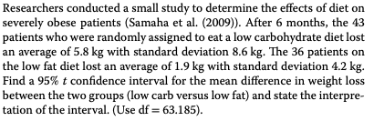
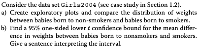
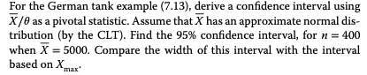
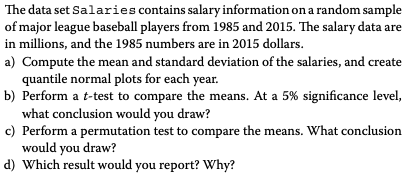
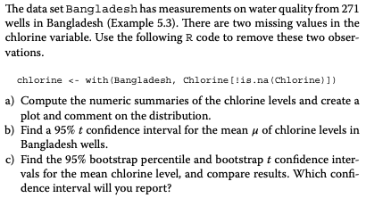
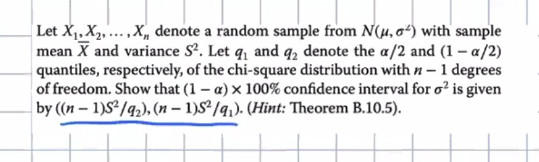
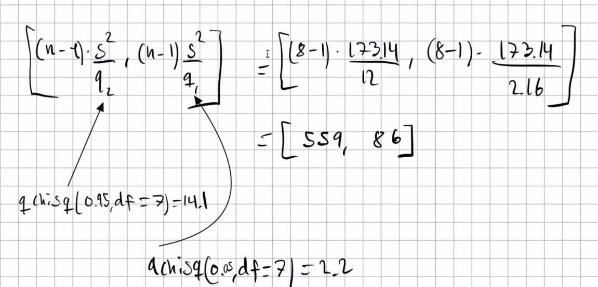

```{r setup, include=FALSE}
knitr::opts_chunk$set(echo = TRUE)
```


## 7.12, 


```{r}
n_1 = 43
x_1 = 5.8
s_1 = 8.8
n_2 = 36
x_2 = 1.9
s_2 = 4.2

conf_func <- function(n1, x1, s1, n2, x2, s2, z) {
  z_scor <- qnorm(1- z / 2)
  lower <- (x1 - x2 - z_scor * (sqrt((s1^2/n1)+(s2^2/n2))))
  above <- (x1 - x2 + z_scor * (sqrt((s1^2/n1)+(s2^2/n2))))
  paste(lower, above)
}

conf_func(n1 = n_1, x1 = x_1, s1 = s_1, n2 = n_2, x2 = x_2, s2 = s_2, z = 0.05)
```

vi kan med 95% sikkerhed sige at forskellen i mellem de to populations mean ligger i intervallet.

## 7.14



### a)

```{r}
girls <- read.csv("../MatStat-R/data/Girls2004.csv")

head(girls)
```
```{r}
girls_smoker <- subset(girls,select = Weight, subset = Smoker == "Yes",drop = TRUE)
girls_no     <- subset(girls,select = Weight, subset = Smoker == "No" ,drop = TRUE)

plot.ecdf(girls_smoker, xlab = "kg")
plot.ecdf(girls_no, col = "blue", pch = 2, add = TRUE)
abline(v = 3300, lty = 2)
legend("topleft", legend = c("smoker", "no"),
    col = c("black", "blue"), pch = c(19, 2))
```


### b)

```{r}
t.test(girls_no, girls_smoker, alternative = "greater", conf.level = 0.95)
```

vi er sikek rpå at mean vægt er mellem de to konfidensbånd.


## 7.24


### a) 

```{r}
prop.test(459, 980, correct = TRUE)
```

### b)

```{r}
prop.test(426, 759, correct = TRUE)
```

### c) 

## 7.39


```{r}
qchisq(p = c(0.025, 0.975),
       df = 4)
```

## 7.A


### a)

vi har følgende

$$
E(X_i) = \lambda \\var(X_i)=\lambda
$$

Det giver os at

$$
\frac{(\bar X - \mu)}{\sqrt(\sigma / n)} = \frac{(X-\lambda)}{\sqrt{\lambda/n}}
$$

vi har stikpvøe fra possion. Vi ved middelværdi go varians. Fra clt ved vi
at de er standardnormalt fordel 

### b)

### c)

```{r}
sample <-  c(4,6,8,9,9,10)
q <- qnorm(0.95)
low <- mean(sample) + q^2/6 - qnorm(0.95)/6*(sqrt(mean(sample) + q^2/4*6))
high <- mean(sample) + q^2/6 + qnorm(0.95)/6*(sqrt(mean(sample) + q^2/4*6))

c(low,high)
```

udregning for konfidens interval. Fra ugeseddel står formlen.

8 er vores parameter er indenfor.

### d) simulering

```{r}
n = 100
result = numeric(n)
q <- qnorm(0.95)
for (i in 1:n) {
  samlpe1 <- rpois(n = 6, 8) # simuler 100 gange
  low <-  mean(samlpe1) + q^2/6 - q/6*(sqrt(mean(samlpe1) + q^2/24))
  high <- mean(samlpe1) + q^2/6 + q/6*(sqrt(mean(samlpe1) + q^2/24))
  result[i] <- floor((low <= 8) * 0.5 + 0.5 * (8 <= high)) # checke rom den ligger indenfor
}

mean(result)
```

### e)

ved hver simulation bør vi have 90% dermed er sand

```{r}
0.9^30
```

ca 4%

## 7.40


> pivotal statistic: er en funktion af observationer og uboseverede parameter
så sandsynligheds fordelingen ikke afhænger af den ukendte parameter.

vi har uniform fordeling med nogle grænser. vi skal se på konfidens intetval
 
laver beregning se video igen 

```{r}
q <- qnorm(0.95)
low <-  5000 / (1/2+q/sqrt(12*400))
high <- 5000 / (1/2- q/sqrt(12*400))
c(low,high)
```

intervallet for Xmax er en del mere snævert. det kan dog skyldes at for store stikprøver vil X max jo næsten være theta.


## 7.22


har givet følgende kode

```{r}
pooled.count <- 0
unpooled.count <- 0
m <- 20
n <- 10

N <- 100000
for (i in 1:N){
  x <- rnorm(m, 8, 10)
  y <- rnorm(n, 3, 15)
  
  CI.pooled <- t.test(x,y, var.equal = TRUE)$conf
  CI.unpooled <- t.test(x,y)$conf
  
  if (CI.pooled[1] <= 5 && 5 <= CI.pooled[2])
    pooled.count <- pooled.count + 1
  
  if (CI.unpooled[1] <= 5 && 5 <= CI.unpooled[2])
    unpooled.count <- unpooled.count + 1
}

pooled.count/N
unpooled.count/N
```

### a)

konfidens for pooled er lavere. 

### b)

kører igen

### d)

jo tætter sample sizee er på hinaden er de lig hinanden.

## 8.15, professor


```{r}
# profesro har observeret
value <- 69 / 310
value
```

sandsynligheden at observere 69 eller færre:

```{r}
pbinom(69, 310, 0.26) # tosidet
```

hvilket er ret usandsynlighet, derfor ladet det til at col pro har ret.

binomial fordeling da det er enten eller. 

dbinom er pdf vi skal brug pbinom. accepter h0.  

## 8.11, t-test, permutation test, 



```{r}
Salaries <- read.csv("../MatStat-R/data/Salaries.csv")
head(Salaries)
```

### a) 

mean og sd

```{r}
mean(Salaries$Salary)
sd  (Salaries$Salary)
```

```{r}
year_1985 <- subset(Salaries$Salary, Salaries$Year == '1985')
year_2015 <- subset(Salaries$Salary, Salaries$Year == '2015')

qqnorm(year_2015)
qqline(year_2015)

qqnorm(year_2015)
qqline(year_2015)
```

første er fint
ved anden er der en skævvridning. Nogle tjerner mere end forventet.

### b) t means

```{r}
t.test(year_2015, year_1985)
```

laver t test. De to fordelinger virker ikke til at komme fra den samme foreling.
Så der er lav sandsynlighed for de kommer fra samme fordeling.
Lønninger har ændret sig meget. 


### c) permutation test

```{r}
observed <-  mean(year_1985) - mean(year_2015)
observed

N <-  10^5 - 1
N

result <- numeric(N)
for(i in 1:N) {
  meantime <- tapply(sample(Salaries$Salary, replace = FALSE),
                     Salaries$Year, mean)
  result[i] <- meantime['1985'] - meantime['2015']
}

p_lille <- (sum(result <= observed) + 1) / (N + 1)
p_stor <- (sum(result >= observed) + 1) / (N + 1)
p_værdi <- 2*min(p_lille, p_stor)

print(p_værdi)
hist(result)
abline(v = observed)
```

mere se på en ensidet test. 

per er bedst i dette tilfælde. Da vi har et normal fordeling.

### d)


## 7.14, den har du lavet


## 7.29, confidence, bootstrp confidence intervals.



### a)

```{r}
Bangladesh <- read.csv("../MatStat-R/data/Bangladesh.csv")
cholorine <- with(Bangladesh, Chlorine[!is.na(Chlorine)])
```

```{r}
summary(cholorine)
```

```{r}
hist(cholorine)
```

skæv fordeling


### b)

```{r}
t.test(cholorine)
```


### c) bootstrap t test

```{r}
xbar <- mean(cholorine)
N <- 10^4
n <- length(cholorine)
Tstar <- numeric(N)
for (i in 1:N){
  x <- sample(cholorine, size = n, replace = TRUE)
  Tstar[i] <- (mean(x) - xbar) / (sd(x)/sqrt(n))
}

quantile(Tstar, c(0.025, 0.975))
xbar - quantile(Tstar, c(0.975, 0.025))  * sd(cholorine) / sqrt(n)
```


koden fra bogen og ændret til clorine.

vi kan se at værdier er skubbet og blevet større i bootstrap.

quantile er 


### d)

bootstrap er smart da den laver korrektur på en skæv fordeling. 


## 7.43, cereal problem,


hun måler morgen mads produkter. opgaven er vi skal findes konfidens interval

lige over fik op formlen





bredt interval men som man får med lille data. 

## 8.6, model poisson


$$
\begin{aligned}
  H0: \lambda > 15 \\
  H1: \lambda <15
\end{aligned}
$$

Beregnes af test statistik.

```{r}
z_possion <- function(TS, lambda){
  z <- (TS - lambda) / sqrt(lambda)
  z
} 

z_possion(20, 15)
```

```{r}
# z niveau 0.95
qnorm(1-0.05/2)
```

```{r}
library(glue)
glue("Vi har altså {z_possion(20, 15)} < {qnorm(1-0.05/2)}")
```
Vi acceptere H0, og der er altså i gennemsnitlig 15 fødsler om måneden. 


