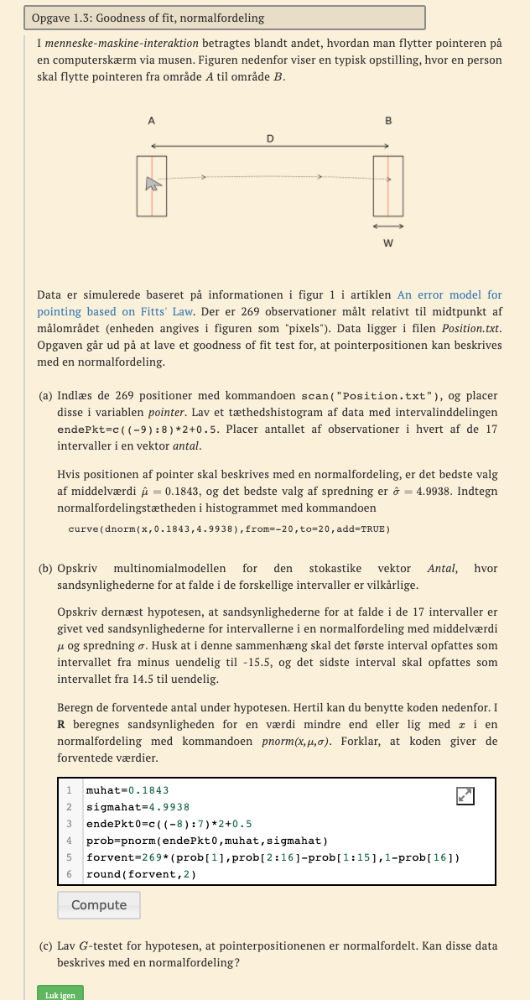
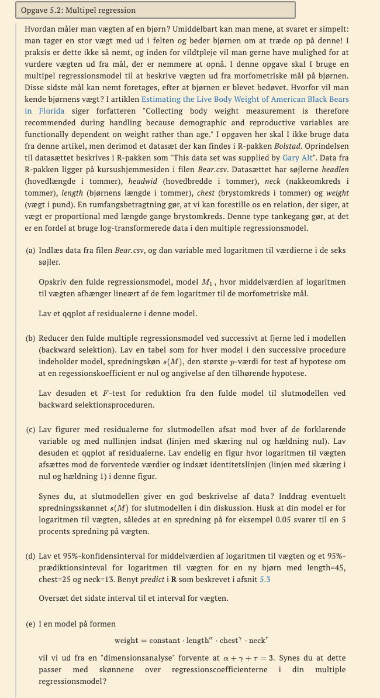
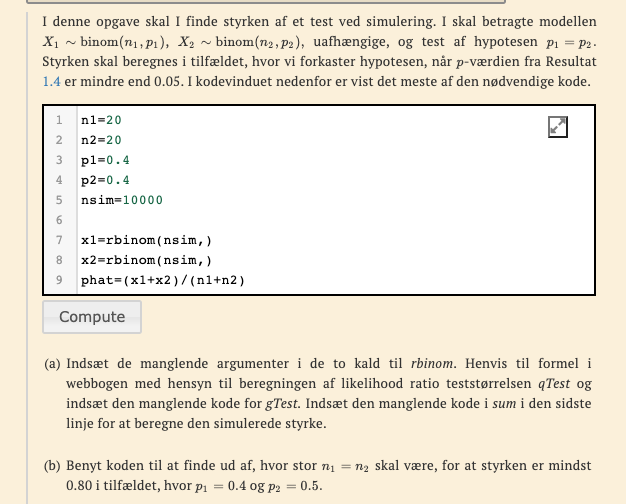

```{r setup, include=FALSE}
knitr::opts_chunk$set(echo = TRUE)
library(tidyverse)
```

### 1.1


```{r}
jord <- read.csv("../MatStat-R/data/JLJfiler/JordskaelvDag.csv")
jord <- jord[1:7,] # skal slides da vi bliver bedt om de førse 7. 
sum(jord[1:7,] %>% pull(Antal))
```


#### a) opstil multinomialmodellden, hvor sand for at falde i de syv klasser er vilkårdlig

$$
M:A_1,..A_7\sim multinom(118415,(\pi_1,\pi_2,..,\pi_7))
$$


#### b) ligelig fordeling. Forventede antal, G test

$$
H0:\pi_1=\theta,...,\pi_7=\theta
$$


```{r}
ex <- sum(jord[1:7,] %>% pull(Antal)) / 7
obs <- jord$Antal

gTest <- 2 * sum(obs * log(obs/ex))
gTest
1 - pchisq(gTest, df = 7 - 1) # 
```

Høj g værdi, hypotesen holder ikke. 


#### c) lav en ligelig fordeling, både for alle jordskælv med en styrke over 5

```{r}
jord <- read.csv("../MatStat-R/data/JLJfiler/JordskaelvDag.csv")
jord_s5 <- jord[c(8:14), ]
jord_seft <- jord[c(15:21), ]
```


```{r}
obs_jord_s5 <- jord_s5$Antal
ex_jord_s5 <- sum(jord[c(8:14), ] %>% pull(Antal)) / 7

gTest_jord_s5 <- 2 * sum(obs_jord_s5 * log(obs_jord_s5/ex_jord_s5))
gTest_jord_s5
```


```{r}
obs_jord_seft <- jord_seft$Antal
ex_jord_seft <- sum(jord[c(15:21), ] %>% pull(Antal)) / 7

gTest_jord_seft <- 2 * sum(obs_jord_seft * log(obs_jord_seft/ex_jord_seft))
gTest_jord_seft
```

```{r}
# p værdo
1 - pchisq(gTest_jord_s5, df = 7 - 1)  
1 - pchisq(gTest_jord_seft, df = 7 - 1)  
```

En med høj så vi acceptere ikke
den med efter skal kan vi accepterer den.      

### 1.3



### 1.4


#### a)

OPstil model følger multinomialfordeling.

Samme sandsynlighedsvektor.

$$
A_{1j}\sim multinom(65,\pi_{1j})\\
A_{2j}\sim multinom(43,\pi_{1j}) \\
a_{ij} = (a_{1i},...,a_{i3})\\
\pi_{ij} = (\pi_{i1},...,\pi_{u3})
i =1,2
j =1,..,3
$$

hovr i er køn række og j er kategori søjler.
hvpotese om samme sandynlgíeh

$$
\pi_{ij}=\pi_j
$$
  


#### b)

homogenitet test

```{r}
hom_test <- function(obs){
  ex = outer(rowSums(obs), colSums(obs)) / sum(obs)
  obs1 <- ifelse(obs == 0, 1, obs)
  G <- 2 * sum(obs * log(obs1/ex))
  pval = 1- pchisq(G, (dim(obs)[1] - 1) * (dim(obs)[2] - 1))
  
  return(list(Forvendtede = ex, G = G, Pvaerdi = pval))
}

hom_test(rbind(c(37,
                 16,
                 12),
               c(20, 
                 16,
                 7)))
```


samme for kvinder og mænd, afhængier af metode og ikke køn. 


### 5.2 



#### a)

```{r}
bear <- read.csv("../MatStat-R/data/JLJfiler/Bear.csv")

headlen <- log(bear$headlen)
headwid <- log(bear$headwid)
neck <- log(bear$neck)
length <- log(bear$length)
chest <- log(bear$chest)
weight <- log(bear$weight)
```

$$
M_1: log(weigth)_i \sim N(\alpha+\beta_1 log(headlen)_i +
\beta_2 log(headwid)_i +
\beta_3 log(neck)_i +
\beta_4 log(length)_i +
\beta_5 log(chest)_i,
\sigma)
$$

```{r}
lmUD = lm(weight ~headlen + headwid + neck + length + chest)
sumUD <- summary(lmUD)
qqnorm(sumUD$residuals)
qqline(sumUD$residuals)
```

Det ser normalt fordelt ud

#### b) backwards

```{r}
sumUD
```

```{r}
summary(lm(weight ~ neck + length + chest))
```

fjerne variabler så vi får signifikante resultater.

 
```{r}
lmSlut <- lm(weight ~ neck + length + chest)
anova(lmSlut, lmUD)
```

Høj p værdi kan kan godt reduceer modellen. 

#### c)

#### d)

#### e)

### 1.9 

