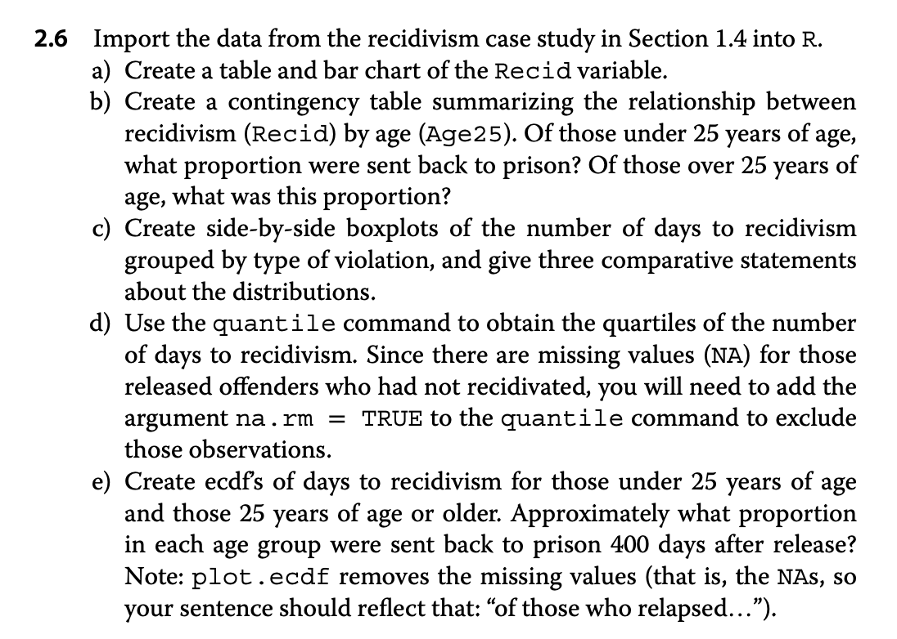
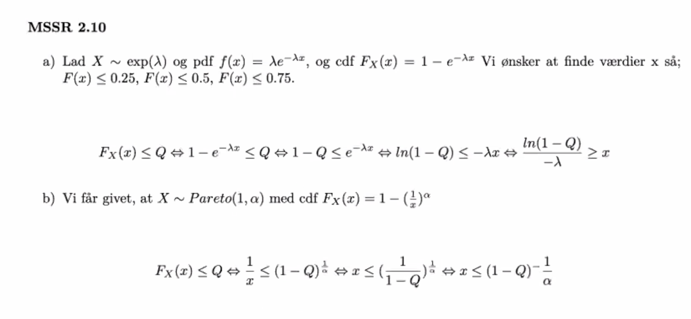

```{r setup, include=FALSE}
knitr::opts_chunk$set(echo = TRUE)
library(magrittr)
library(tidyverse)
```


```{r}
data <- read.csv2("../MatStat-R/data/FlightDelays.csv", sep = ",")
```

```{r}
data %$%
  DepartTime %>% 
  table() %>% 
  barplot()
```

### b)

```{r}
table(data$Day, data$Delayed30) %>% 
  prop.table(margin = 1)
```
### c)

```{r}
boxplot(data$FlightLength ~ data$Delayed30)
```

### 2.6



```{r}
data <- read.csv("../MatStat-R/data/Recidivism.csv")
```

### a)

```{r}
data %$%
  Recid %>% 
  table()  %>% 
  barplot()
```
```{r}
table(data$Recid, data$Age25) %>% 
  prop.table(margin = 1)
```

### c) 

```{r}
boxplot(data$Days ~ data$Type)
```
```{r}
quantile(data$Days, na.rm = TRUE)
```
### e)

```{r}
age_over_25 <- data %>% 
  filter(Age25 == "Over 25") %>% 
  pull(Days)

age_under_25 <- data %>% 
  filter(Age25 == "Under 25") %>% 
  pull(Days)
```


```{r}
plot.ecdf(age_over_25)
plot.ecdf(age_under_25, col = "blue", pch = 2, add = TRUE)
```


## 2.10


Svar er ud fra billede og jeg skal lave det selv i R.


Det lader til at ovenstående ikke er korret, men følgende er rigtig



## 2.A


Hvis man finder den inverse funktion til normal fordeling og indsætter 0.25 og 0.75
finder man Q1 og Q3.

### A)

```{r}
Q1 <- qnorm(0.25, mean = 0, sd = 1)
Q1

Q3 <- qnorm(0.75, 0, 1)

# beregner intervaller i opgaven
nedre <- Q1 - 1.5 * (Q3 - Q1)
øvre <- Q3 +  1.5 * (Q3 - Q1)

interval <- c(nedre, øvre)
interval
```

### b)

Finder ss for at ligge udenfor

```{r}
pnorm(nedre, 0, 1)
```

```{r}
2 * pnorm(nedre, 0, 1)
```


### c) 

Grunden til at prikkerne er binominal fordelt at de enten er inden for området 
eller uden for. Fordelingen 

## Den praktiske del


### a)

```{r}
stikprove <- c(0,2, 15:21, 25, 30)
boxplot(stikprove)
boxplot.stats(stikprove)
boxplot.stats(stikprove)$out
length(boxplot.stats(stikprove)$out)
```

Vi forventede der var 0.0069  outlier men der er 3/11 = 0.272 så vi rammer forkert.

```{r}
replicate(5, 3)
replicate(5, mean(rnorm(4)))
```

```{r}
replicate(100, length(boxplot.stats(rnorm(10, mean = 0, sd = 1))$out))
mean(replicate(100, length(boxplot.stats(rnorm(10, mean = 0, sd = 1))$out)))
```

### e)

```{r}
N10 <- mean(replicate(10000, length(boxplot.stats(rnorm(10, 0, 1))$out)))
N100 <- mean(replicate(10000, length(boxplot.stats(rnorm(100, 0, 1))$out)))
N1000 <- mean(replicate(10000, length(boxplot.stats(rnorm(1000, 0, 1))$out)))

N10/(0.0069 * 10)
N100/(0.0069 * 100)
N1000/(0.0069 * 1000)
```

som vi kan se passer bedre med c hvor den bliver større. 

### f)

```{r}
E10 <- mean(replicate(10000, length(boxplot.stats(rexp(10, 1))$out)))
E100 <- mean(replicate(10000, length(boxplot.stats(rexp(100, 1))$out)))
E1000 <- mean(replicate(10000, length(boxplot.stats(rexp(1000, 1))$out)))

E10/10
E100/100
E1000/1000
```


```{r}
x <- rnorm(15)

par(mfrow = c(1,2))

qqnorm(x)
qqline(x)

hist(x)
```


### b) 

```{r}
y <- rnorm(30)
u <- rnorm(60)
v <- rnorm(100)

par(mfrow=c(2,3))

qqnorm(y)
qqline(y)

qqnorm(u)
qqline(u)

qqnorm(v)
qqline(v)

hist(y)
hist(u)
hist(v)
```

### b igen

```{r}
sam_1 <- rnorm(50, 0, 1)
sam_2 <- rnorm(50, 0, 2)
sam_3 <- rnorm(50, 1, 1)
```

```{r}
par(mfrow=c(1,3))
qqnorm(sam_1, main = "N(0,1)")
qqline(sam_1)

qqnorm(sam_2, main = "N(0,2)")
qqline(sam_2)

qqnorm(sam_3, main = "N(1,1)")
qqline(sam_3)
```


### c)

```{r}
sam_4 <- rnorm(1000, -2, 3^2)

qqnorm(sam_4, main = "N(-2,3^2)")
abline(-2, 3, col = "2")
```


