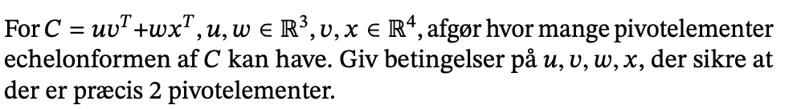

```{r setup, include=FALSE}
knitr::opts_chunk$set(echo = FALSE)
```



$$
\begin{pmatrix} 
u_1v_1 & u_1v_2 &u_1v_3 & u_1v_4 \\
u_2v_1 & u_2v_2 &u_2v_3 & u_2v_4 \\
u_3v_1 & u_3v_2 &u_3v_3 & u_3v_4
\end{pmatrix} +
\begin{pmatrix} 
w_1x_1 & w_1x_2 &w_1x_3 & w_1x_4 \\
w_2x_1 & w_2x_2 &w_2x_3 & w_2x_4 \\
w_3x_1 & w_3x_2 &w_3x_3 & w_3x_4
\end{pmatrix} = \\
\begin{pmatrix} 
u_1v_1 + w_1x_1 & u_1v_2 + w_1x_2 &u_1v_3 + w_1x_3 & u_1v_4 + w_1x_4 \\
u_2v_1 + w_2x_1 & u_2v_2 + w_2x_2 &u_2v_3 + w_2x_3 & u_2v_4 + w_2x_4 \\
u_3v_1 + w_3x_1 & u_3v_2 + w_3x_2 &u_3v_3 + w_3x_3 & u_3v_4 + w_3x_4
\end{pmatrix}
$$

Gamg første rækker $u_1^{-1}$

$$
\begin{pmatrix} 
v_1 + w_1x_1u_1^{-1} & v_2 + w_1x_2u_1^{-1} & v_3 + w_1x_3u_1^{-1} & v_4 + w_1x_4u_1^{-1} \\
u_2v_1 + w_2x_1 & u_2v_2 + w_2x_2 &u_2v_3 + w_2x_3 & u_2v_4 + w_2x_4 \\
u_3v_1 + w_3x_1 & u_3v_2 + w_3x_2 &u_3v_3 + w_3x_3 & u_3v_4 + w_3x_4
\end{pmatrix}
$$ Gang første række med med $u_2$ og træk fra anden række:

$$
 \begin{pmatrix} 
v_1 + w_1x_1u_1^{-1} & v_2 + w_1x_2u_1^{-1} & v_3 + w_1x_3u_1^{-1} & v_4 + w_1x_4u_1^{-1} \\
w_2x_1-w_1x_1u_1^{-1}u_2 & w_2x_2-w_1 x_2 u_1^{-1}u_2 & w_2x_3-w_1x_3u_1^{-1}u_2 & w_2x_4-w_1x_4u_1^{-1}u_2 \\
u_3v_1 + w_3x_1 & u_3v_2 + w_3x_2 &u_3v_3 + w_3x_3 & u_3v_4 + w_3x_4
\end{pmatrix}
 $$

Det kan reduceres til:

$$
 \begin{pmatrix} 
v_1 + w_1x_1u_1^{-1} & v_2 + w_1x_2u_1^{-1} & v_3 + w_1x_3u_1^{-1} & v_4 + w_1x_4u_1^{-1} \\
x_1(w_2-w_1u_1^{-1}u_2) & x_2(w_2-w_1  u_1^{-1}u_2) & x_3(w_2-w_1u_1^{-1}u_2) & x_4(w_2-w_1u_1^{-1}u_2) \\
u_3v_1 + w_3x_1 & u_3v_2 + w_3x_2 &u_3v_3 + w_3x_3 & u_3v_4 + w_3x_4
\end{pmatrix}
 $$

Nu lægger vi mærke til at anden række er egentlig vores vektor, x ganget
med en skalar.

Det samme skal vi gøre med 3. række. Brug første række og ganger med u3:

$$
 \begin{pmatrix} 
v_1 + w_1x_1u_1^{-1} & v_2 + w_1x_2u_1^{-1} & v_3 + w_1x_3u_1^{-1} & v_4 + w_1x_4u_1^{-1} \\
x_1(w_2-w_1u_1^{-1}u_2) & x_2(w_2-w_1  u_1^{-1}u_2) & x_3(w_2-w_1u_1^{-1}u_2) & x_4(w_2-w_1u_1^{-1}u_2) \\
x_1(w_3-w_1u_1^{-1} u_3) & x_2 (w_3 - w_1  u_1^{-1} u_3) & x_3 (w_3 - w_1 u_1^{-1} u_3) & x_4 (w_3 - w_1 u_1^{-1} u_3) 
\end{pmatrix}
 $$ Igen er det indeni parentesen blot en skalar.

Nu skal 3. række fjernes. 3 række er en skalaering af 2 række. Således
kan 3. række fjernes ved at gange igennem med
$\frac{w_3 - w_1 u_1^{-1} u_3}{w_2 - w_1 u_1^{-1} u_2}$ og trække fra 3.
række.

$$
 \begin{pmatrix} 
v_1 + w_1x_1u_1^{-1} & v_2 + w_1x_2u_1^{-1} & v_3 + w_1x_3u_1^{-1} & v_4 + w_1x_4u_1^{-1} \\
x_1(w_2-w_1u_1^{-1}u_2) & x_2(w_2-w_1  u_1^{-1}u_2) & x_3(w_2-w_1u_1^{-1}u_2) & x_4(w_2-w_1u_1^{-1}u_2) \\
0 & 0 & 0 & 0
\end{pmatrix}
 $$

Hvis $v_1$ er en skalar af $x_1$ så kan den sættes ud froan en parentes.

$$
x_1(\frac{v_1}{x_1} + w_1 u_1^{-1})
$$ Det kan vi hvis v1 er en skalar af x1.

Hvis vi vil fjerne anden række, så skal første række ganges med
$$\frac{w_2 - w_1 u^{-1} u_2 }{\frac{v_1}{x_1} + w_1 u_1^{-1}}$$ Tager
vi og ganger første række med ovenstående og tækker fra 2 række så får
vi nul. Det kan vi så med følgende $$
\frac{x_1(\frac{v_1}{x_1} + w_1 u_1^{-1}) (w_2 - w_1 u^{-1} u_2) }{\frac{v_1}{x_1} + w_1 u_1^{-1}}
$$ Delene går ud med hinanden så vi ender med

$$
x_1(w_2 - w_1 u_1^{-1} u_2)
$$ Hvis vi trækker det fra 2 række vil den bliver nul. Så vil vi kun
have 1 pivot element. Derfor kan man sige at hvis ikke det er muligt at
dele v1 med x1 så kan vi ikke fjerne 2 række og vi vil have to pivot
elementer.


