```{r setup, include=FALSE}
knitr::opts_chunk$set(echo = TRUE)
library(reticulate)
virtualenv_create('na_resume-proj')
py_install('matplotlib', proj = 'na_resume-proj')
use_virtualenv('na_resume-proj')
```

```{python}
import numpy as np
import matplotlib.pyplot as plt
```


# Note: Tal og fejl

Her ses machine epsilon første gang.

```{python}
np.finfo(float).eps
```

- overflow
- underflow

I det første kapitel står der en række ting omkring fejl og hvordan de beregnes og hvordan man tager hånd om det. 

# kap 2: Plangeometri: vektorer ogmatricer

- normen
- enhedsvektor
- indre produkt
- prikprodukt (dot)
- transponerde
- rotation
- spejling
- projektion

# kap 3: Matricer og vektorer

- gennemgår matricer, og hvordan man i python kan finde frem til akser, dimension og elementer. 
- numpy bruger dtype så man får en bestemt brug af hukommelse. 
- Her ses også på **heat map**.
- Skalar multiplikation.
- Proposition 3.1 fortæller om matrix og addition regner, som er meget væsentlig.
- Der er et afsnit om **transponering**

# kap 4: Matrix multiplikation

- Ser på at gange **række søjleprodukt**.  
- Første gang vi hører om **Vandermondevektoren**.
- Ser på **matrixprodukt** ud fra definition **4.5**. 
- Ser også på **lineær kombination**. 
- Der er også regneregler for matrix produktion **Proposition 4.13.**.
- Her har vi også **identitetsmatricen**. Her se på en formula for I i **Proposition 4.19.**. Desuden kan man bruge `np.eye` til at lave en.

```{python}
print(f'Her det identitets matricen: \n {np.eye(3)}')
```


- Vi har også gane en søjle på en række som kaldes **ydre produkt**. 

# kap 5: Numerisk håndtering af matricer

Når vi udføre beregninger så koster det på usikkerhed. 

En model siger at+ - * og / koster samme antal tid og ressource, som kaldes **flops**. Det angives som antal flop. 

```{python}
def skalar_product(s, v):
  u = s * v
return u
```

skalar_product kost n x 1 = n flops. 

- **tabel 5.1** viser omkostninger ved operationer.

```{python}
rng = np.random.default_rng()
n = 20
ut = rng.random((1, n))
v = rng.random((n, 1))
c = 0

for i in range(n):
    c = c + ut[0, i] * v[i, 0]
print(c)
```

```{python}
(ut @ v)[0,0]
```

```{python}
s = 2
sk = []
for i in range(n):
  sk = s * v[i]
print(sk)
```

# kap 6: Lineære ligningssystemer

- **elementære rækkeoperationer**
- **back substitution**

Se **tabel 6.1** for rækkeoperaioner i python.

Her har vi også **echelonformen** vi bliver introduceret til.

**Proposition 6.2** fortæller os alle kan reduceret til echelonform.

Se også **sætning 6.4** for løfning lignignsystem hvor vi har hvordan den løses. 

# Kap 7: Matrix invers

- **kvadraskt** samme antal søjler som rækker. 
- Formel for at finde den inverse. 

**Proposition 7.4.** Ser på at to matricer er invertibel multipliceret samen. 

- **elementær matrix**. 

# Kap 8: Ortogonalitet og projektioner

**indre produkt** ser vi på.

**Lemma 8.2** fortæller os om de forskellige regne operationer for den inverse. 

Desuden kigges **2-normen**. 

**Sætning 8.8** ser på **Cauchy-Schwarz ulighed** uligheden som handler om  at vinklen skal ligge mellem -1 og 1. 

Projektion ser vi på som leder os til QR.

En **ortornomal** matix er hvis vi har ortogonalitet samt vektorerne er endhedsvektor. 

Fra **Proposition 8.17** ser vi **Parsevals identitet**.

# Kap 9: Ortogonale matricer

Får med **Definition 9.1** af vide hvad en ortogonal matrice er.

Det specielle og gode ved ortogonale matricer er de bevarer det indre produkt, samt norm og afstand. 

Vi får **grammatricen**  som kan bruges til at identificerer om  samlingen, v0, v1.,,vn er ortornomarle. 

Fra **proposition 9.10** får vi at søjlerne af en ortogonal matrix udgør en **ortornamal basis**. 

Vi får og **household matrix** som er en kvadratisk matrice som er ortogonal og på formen

$$
H=I_n-svv^T
$$

Hvor v kaldes **householdvektoren**. 

For **Proposition 9.13** følger der en række egenskaber, som gør H er en **spejlingsmatrix**. 

```{python}
x = np.array([1.0, 2.0, 3.0])[:, np.newaxis]
print(f'vores x: \n {x}')

u = x / np.linalg.norm(x)

print(f'u : \n {u}')

eps = -1 if u[0,0] >= 0 else 1
print(f'vores eps: {eps}')

s = 1 + np.abs(u[0,0])
print(f'vores s \n {s}')

v = (-eps/s) * u
v[0,0] = 1
print(f'v vektor \n {v}')

Hx = x - s * v @ (v.T @ x)
print(f'household \n {Hx}')

print(f'float \n {np.linalg.norm(x)}')
```

Det er også muligt at lave det til en funktion.

Fra *Plan geometri: trigonometriske identiteter* snakkes der om **isometrier**. 

# Kap 10: Singulærværdidekomponering

side 110 står der om **tynd singulærkomponering**. 
Singulærværdier, sigma gemmer på oplysninger omkring A. Det bruges også når man skal benytte sig af PCA. 

Ligning 10.3 er vigtig for SVD.
På side 115 står der en oversættelse af output til SVD.  

# Kap 11: Konditionstal

- **Absolutte konditionstal**
- konditionstallet, $\kappa$.

På side 130 står der om **matrixnorm**. Normen har nogle regler som er under **definition 11.4**. N3 kaldes **trekantsuligheden**. Der er flere normer

- **1-normen**
- $\infty-normen$
- Under et kaldes de for **p-normen**. 

# Kap 12: Generelle vektorrum

Handler om vektorrum.

- **vektorrum** Der er forskellige regne operationer med en masse underpunkter, som kan læses om.

**Komplekse tal** kan også bruges. 

Man kan dele med komplekse tal ud fra 12.3

$$
\frac{1}{z}= \frac{1}{x+iy}=\frac{x-iy}{x^2+y^2}
$$
Man kan også regne med rækkeoperationer for komplekse tal.

Formlen indeholder vigtig operationer, hvor den første er **konjugerede**

$$
\bar z = \bar x+iy =x-iy
$$
Den anden er den **numerisk værdi**

$$
|z| = |x+iy|=\sqrt{x^2+y^2}
$$

Vektorrummet kan deles op i del rum. Et **underrum** hvor på side 144 står om kriterier for hvornår det er opfyldt. 

**Udspændt** er de mulige lineær kombinationer. 

# Øvelse 1

- spring over

# Øvelse 2

- spring over

# Øvelse 3

## 3.1

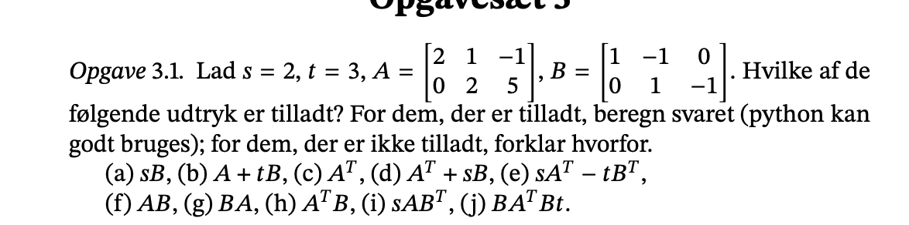

```{python}
s = 2
t = 3
A = np.array([[2, 1, -1],[0, 2, 5]])
B = np.array([[1, -1, 0],[0, 1, -1]])
```

### a)

```{python}
s * B
```


### b)

```{python}
A + t*B
```


### c)

### d)

### e)

### f)

### g)

### h)

### j)


## 3.2

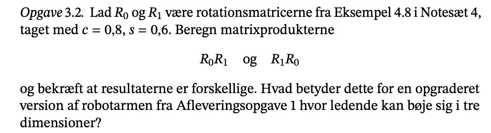
```{python}
c = 0.8
s = 0.6
R0 = np.array([[1, 0, 0],[0, c, -s], [0,s,c]])
R1 = np.array([[c, 0, -s],[0, 1, 0], [s,0,c]])
```
Beregn matric produkt

```{python}
print(f'For første: \n {R0 @ R1}')
print(f'For den anden: \n {R1 @ R0}')
```

Resultaterne er forskellige. 

## 3.3

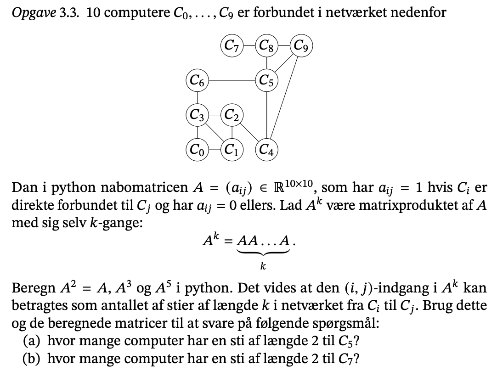

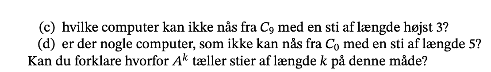

### a)

Laver en A_10 x 10 matrice. 

```{python}
A = np.array([
  [0,1,0,1,0,0,0,0,0,0],
  [1,0,1,1,0,0,0,0,0,0],
  [0,1,0,1,1,0,0,0,0,0],
  [1,1,1,0,0,0,1,0,0,0],
  [0,0,1,0,0,1,0,0,0,1],
  [0,0,0,0,1,0,1,0,1,1],
  [0,0,0,1,0,1,0,0,0,0],
  [0,0,0,0,0,0,0,0,1,0],
  [0,0,0,0,0,1,0,1,0,1],
  [0,0,0,0,1,1,0,0,1,0]])
A
```

Dan A2

```{python}
A2 = A@A
A2
```


### b)

## 3.4

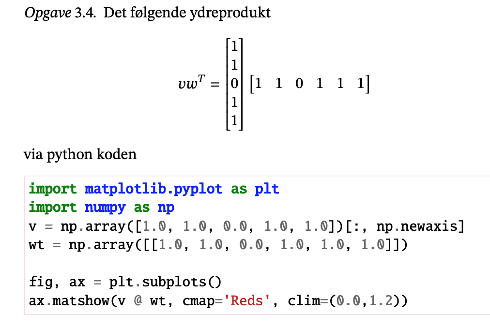
```{python}
import matplotlib.pyplot as plt
import numpy as np
v = np.array([1.0, 1.0, 0.0, 1.0, 1.0])[:, np.newaxis]
wt = np.array([[1.0, 1.0, 0.0, 1.0, 1.0, 1.0]])
fig, ax = plt.subplots()
ax.matshow(v @ wt, cmap='Reds', clim=(0.0,1.2))
plt.show()
```

```{python, østrig flag}
v = np.array([1.0, 1.0, 0.0, 1.0, 1.0])[:, np.newaxis]
wt = np.array([[1.0, 1.0, 1.0, 1.0, 1.0, 1.0]])
fig, ax = plt.subplots()
ax.matshow(v @ wt, cmap='Reds', clim=(0.0,1.2))
plt.show()
```

```{python, englang flag}
v = np.array([0.7, 0.7, 0.0, 0.7, 0.7])[:, np.newaxis]
wt = np.array([[0.7, 0.7, 0.0, 0.7, 0.7, 0.7]])
fig, ax = plt.subplots()
ax.matshow(v @ wt, cmap='bwr_r', clim=(0.0,1))
plt.show()
```

# Øvelse 4

# Øvelse 5

## 5.1. 

Lad a være en ndarray med to akser. Forklar hvad de følgende operationer gøre ved a:

### (a) a[0, [1,3,4,6]] = 1

```{python}
a = np.array([
  [1,2,3,4,5,6],
  [4,3,6,2,6,8],
  [1,2,3,4,5,5]
])
print(f'vores a \n {a}')
```


### (b) a[[1,2], [2,3]] = np.array([0,1])

```{python}
a[[1,2], [2,3]] = np.array([0,1])
a
```

den giver de pladser i a nogle nye værdier.

### (c) a[:, [3,1]] = a[:, [1,3]]

```{python}
a[:, [3,1]] = a[:, [1,3]]
```

Bytter rundt på værdierne.

### (d) a[2:5, 0] = np.array([0, 1, 2])

### (e) a[2, 3:8:2] += 6


```{python}
a[2, 3:8:2] += 6
a
```

## 5.2

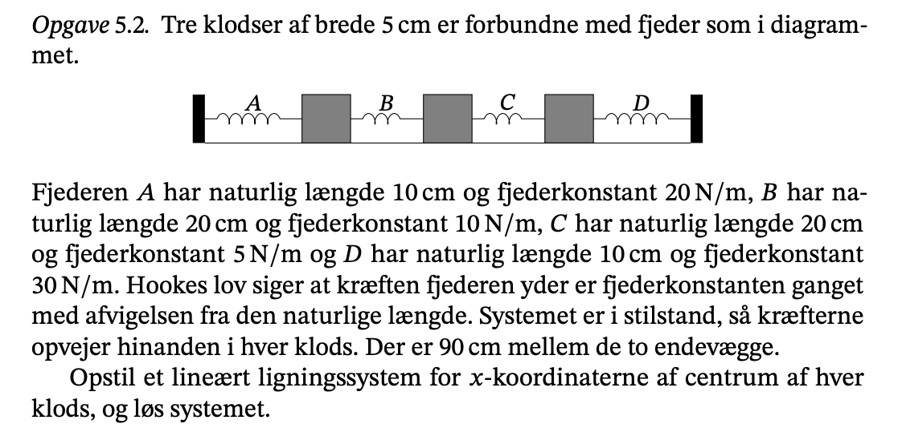

## 5.3

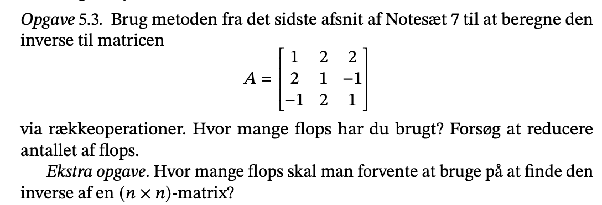

```{python}
a = np.array([
  [1, 2, 2],
  [2, 1, -1],
  [-1, 2, 1]
])
print(f'A matricen: \n {a}')
```

```{python}
def switch_rows(A,i,j):
    "Switch rows i and j in matrix A."
    n = A.shape[0]
    E = np.eye(n)
    E[i,i] = 0
    E[j,j] = 0
    E[i,j] = 1
    E[j,i] = 1
    return E @ A
```

```{python}
ab = np.array([
  [1, 2, 2, 1, 0, 0],
  [2, 1, -1, 0, 1, 0],
  [-1, 2, 1, 0, 0, 1]
])
ab[2, :] += ab[0, :]
ab[1, :] += -2*ab[0, :]
ab = switch_rows(ab, 1, 2)
ab[1, :] +=  ab[2, :]
ab[0, :] += -2*ab[1, :]
ab[2, :] += 3 * ab[1, :]
ab[2, :] *= 1/11
ab[1, :] += (-2) * ab[2, :]
ab[0, :] += 6 * ab[2, :]
ab[2, :] *= -1
ab.round(2)
```

Som er løsningen ud fra den metode der er blevet vist.

Jeg bruger 10 flops.

det mindste er vi enten skaler en række eller trækker til og fra i en
række.

flobs angiver hver enkelt skift i indgangene. Når vi gange noget på så
koster det også endnu flere flobs på.

Huns får i alt 78 flobs.

Hvis vi lægger 0 til så er det også en flob. Alt der har et +-\* har en
flob

## 5.4

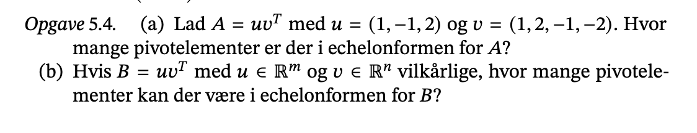

### a)

```{python}
u = np.array([[1, -1, 2]])
v = np.array([[1, 2, -1, -2]])

A = u * v.T

print(f'Vores u vektor \n {u}')
print(f'Vores v vektor \n {u}')
print(f'Vores A vektor \n {A}')
```

ydre produkt så de bliver 3 x 4 matrice. Der skal kun være en enkelt.

Lav ydre produkt så vi får en 3 x 4 matricer. Vi finder der er en enkelt

Ved følgende ling udregner vi echolon form og finder der er en 1 pivot indgang: 

<https://www.emathhelp.net/calculators/linear-algebra/reduced-row-echelon-form-rref-caclulator/?i=%5B%5B1%2C-1%2C2%5D%2C%5B2%2C-2%2C4%5D%2C%5B-1%2C1%2C-2%5D%2C%5B-2%2C2%2C-4%5D%5D&reduced=on>

### b)

Vi har et ydre produkt og er i at gange en skalar på vektoren. Så hver
rækker er en skalering. Vi vil bare kunne gange rænkkerne med et tal og
træk fra næste. Det er den fixe ide med det ydre produkt. Det er en
generalisering af første opgave. Der vil altid være en pivot.


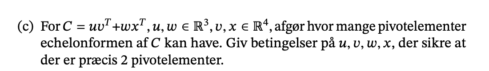

### c)

$$
\begin{pmatrix} 
u_1v_1 & u_1v_2 &u_1v_3 & u_1v_4 \\
u_2v_1 & u_2v_2 &u_2v_3 & u_2v_4 \\
u_3v_1 & u_3v_2 &u_3v_3 & u_3v_4
\end{pmatrix} +
\begin{pmatrix} 
w_1x_1 & w_1x_2 &w_1x_3 & w_1x_4 \\
w_2x_1 & w_2x_2 &w_2x_3 & w_2x_4 \\
w_3x_1 & w_3x_2 &w_3x_3 & w_3x_4
\end{pmatrix} =
\\
\begin{pmatrix} 
u_1v_1 + w_1x_1 & u_1v_2 + w_1x_2 &u_1v_3 + w_1x_3 & u_1v_4 + w_1x_4 \\
u_2v_1 + w_2x_1 & u_2v_2 + w_2x_2 &u_2v_3 + w_2x_3 & u_2v_4 + w_2x_4 \\
u_3v_1 + w_3x_1 & u_3v_2 + w_3x_2 &u_3v_3 + w_3x_3 & u_3v_4 + w_3x_4
\end{pmatrix}
$$

Gang første rækker $u_1^{-1}$

$$
\begin{pmatrix} 
v_1 + w_1x_1u_1^{-1} & v_2 + w_1x_2u_1^{-1} & v_3 + w_1x_3u_1^{-1} & v_4 + w_1x_4u_1^{-1} \\
u_2v_1 + w_2x_1 & u_2v_2 + w_2x_2 &u_2v_3 + w_2x_3 & u_2v_4 + w_2x_4 \\
u_3v_1 + w_3x_1 & u_3v_2 + w_3x_2 &u_3v_3 + w_3x_3 & u_3v_4 + w_3x_4
\end{pmatrix}

$$ 

Gang første række med med $u_2$ og træk fra anden række:


$$
 \begin{pmatrix} 
v_1 + w_1x_1u_1^{-1} & v_2 + w_1x_2u_1^{-1} & v_3 + w_1x_3u_1^{-1} & v_4 + w_1x_4u_1^{-1} \\
w_2x_1-w_1x_1u_1^{-1}u_2 & w_2x_2-w_1 x_2 u_1^{-1}u_2 & w_2x_3-w_1x_3u_1^{-1}u_2 & w_2x_4-w_1x_4u_1^{-1}u_2 \\
u_3v_1 + w_3x_1 & u_3v_2 + w_3x_2 &u_3v_3 + w_3x_3 & u_3v_4 + w_3x_4
\end{pmatrix}
$$

Det kan reduceres til:

$$
 \begin{pmatrix} 
v_1 + w_1x_1u_1^{-1} & v_2 + w_1x_2u_1^{-1} & v_3 + w_1x_3u_1^{-1} & v_4 + w_1x_4u_1^{-1} \\
x_1(w_2-w_1u_1^{-1}u_2) & x_2(w_2-w_1  u_1^{-1}u_2) & x_3(w_2-w_1u_1^{-1}u_2) & x_4(w_2-w_1u_1^{-1}u_2) \\
u_3v_1 + w_3x_1 & u_3v_2 + w_3x_2 &u_3v_3 + w_3x_3 & u_3v_4 + w_3x_4
\end{pmatrix}
$$

Nu lægger vi mærke til at anden række er egentlig vores vektor, x ganget
med en skalar.

Det samme skal vi gøre med 3. række. Brug første række og ganger med u3:

$$
 \begin{pmatrix} 
v_1 + w_1x_1u_1^{-1} & v_2 + w_1x_2u_1^{-1} & v_3 + w_1x_3u_1^{-1} & v_4 + w_1x_4u_1^{-1} \\
x_1(w_2-w_1u_1^{-1}u_2) & x_2(w_2-w_1  u_1^{-1}u_2) & x_3(w_2-w_1u_1^{-1}u_2) & x_4(w_2-w_1u_1^{-1}u_2) \\
x_1(w_3-w_1u_1^{-1} u_3) & x_2 (w_3 - w_1  u_1^{-1} u_3) & x_3 (w_3 - w_1 u_1^{-1} u_3) & x_4 (w_3 - w_1 u_1^{-1} u_3) 
\end{pmatrix}
$$

Igen er det indeni parentesen blot en skalar.

Nu skal 3. række fjernes. 3 række er en skalaering af 2 række. Således
kan 3. række fjernes ved at gange igennem med
$\frac{w_3 - w_1 u_1^{-1} u_3}{w_2 - w_1 u_1^{-1} u_2}$ og trække fra 3.
række.

$$
 \begin{pmatrix} 
v_1 + w_1x_1u_1^{-1} & v_2 + w_1x_2u_1^{-1} & v_3 + w_1x_3u_1^{-1} & v_4 + w_1x_4u_1^{-1} \\
x_1(w_2-w_1u_1^{-1}u_2) & x_2(w_2-w_1  u_1^{-1}u_2) & x_3(w_2-w_1u_1^{-1}u_2) & x_4(w_2-w_1u_1^{-1}u_2) \\
0 & 0 & 0 & 0
\end{pmatrix}
$$

Hvis $v_1$ er en skalar af $x_1$ så kan den sættes ud froan en parentes.

$$
x_1(\frac{v_1}{x_1} + w_1 u_1^{-1})
$$ 

Det kan vi hvis v1 er en skalar af x1.

Hvis vi vil fjerne anden række, så skal første række ganges med

$$\frac{w_2 - w_1 u^{-1} u_2 }{\frac{v_1}{x_1} + w_1 u_1^{-1}}$$

Tager vi og ganger første række med ovenstående og tækker fra 2 række så
får vi nul. Det kan vi så med følgende 

$$
\frac{x_1(\frac{v_1}{x_1} + w_1 u_1^{-1}) (w_2 - w_1 u^{-1} u_2) }{\frac{v_1}{x_1} + w_1 u_1^{-1}}
$$

Delene går ud med hinanden så vi ender med

$$
x_1(w_2 - w_1 u_1^{-1} u_2)
$$

Hvis vi trækker det fra 2 række vil den bliver nul. Så vil vi kun have 1
pivot element. Derfor kan man sige at hvis ikke det er muligt at dele v1
med x1 så kan vi ikke fjerne 2 række og vi vil have to pivot elementer.

## 5.5

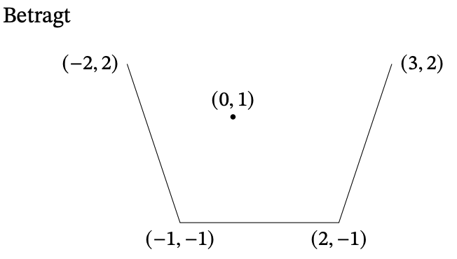

Bestem afstanden af punktet (0, 1) fra hver af disse linjer.

Vi har denne figur. Der er nogle punkter og for hver ende punkt er der
koordinater. VI vil bestemme afstande fra de tre linjer. Brug formlen
for projektion

Formel for $pr_v(u)$ punktet på L som ligger tættest på u er (projektion
til u):

$$
pr_v(u)=\frac{\langle u,v \rangle}{||v||_2}v
$$

formel for afstand mellem u og dens projektion er:

$$
||u-pr_v(u)||_2=\sqrt{||u_2^2||-||pr_v(u)||_2^2}
$$

Vi finder en vektor mellem to punktet og ud mod midten.

```{python}
import numpy as np
o = np.array([0.0, 1.0]) # punkt i midten
a = np.array([-2., 2.])
b = np.array([-1., -1.])
c = np.array([2., -1.])
d = np.array([3., 2.])
# Funktion til at beregne afstand.
# UUdregner projektionen
def afstand(a0, b0, o0):
  u_1 = o0 - a0 #  vektor fra ene endepunkt til anden.
  v_1 = b0 - a0 # mellem de to endepunkter. Dene ene vektor minus den anden. 
  pr_v = ((u_1 @ v_1) / np.linalg.norm(v_1) ** 2) * v_1 
  # det er formlen for projektionen.
  
  afstand = np.linalg.norm(u_1 - pr_v) # her bruger vi den anden formel. 
  return afstand
```

```{python}
afstand(a,b,o)
afstand(b,c,o)
```

Som er aftanden fra de ønskede punkter. 

## 5.6

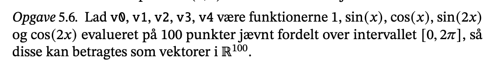

```{python}
x = np.linspace(0.0, 2 * np.pi, 100)
v0 = np.ones(100)[:, np.newaxis]
v1 = np.sin(x)[:, np.newaxis]
v2 = np.cos(x)[:, np.newaxis]
v3 = np.sin(2 * x)[:, np.newaxis]
v4 = np.cos(2 * x)[:, np.newaxis]
fig, ax = plt.subplots()
ax.plot(x, v0)
ax.plot(x, v1)
ax.plot(x, v2)
ax.plot(x, v3)
ax.plot(x, v4)
plt.show()
```
Ud fra den kan vi se de er ca ortogonale. Man skal tænke de som vektor i
100 dimensionel space. De rører ikke hinanden og det betyder at de er
ortogonale.

Find prik produktet

Find prik produktet som vi gør forneden:

```{python}
print("v0, v1")
print(np.vdot(v0, v1) / (np.linalg.norm(v0) * np.linalg.norm(v1)))

print("v0, v2")
print(np.vdot(v0, v2) / (np.linalg.norm(v0) * np.linalg.norm(v2)))

print("v0, v3")
print(np.vdot(v0, v3) / (np.linalg.norm(v0) * np.linalg.norm(v3)))

print("v0, v4")
print(np.vdot(v0, v4) / (np.linalg.norm(v0) * np.linalg.norm(v4)))

print("v1, v2")
print(np.vdot(v1, v2) / (np.linalg.norm(v1) * np.linalg.norm(v2)))
```

Her ser vi at mange af dem ligger tæt på nul. De er mindre end machine epsilon. De er ca ortogonale.

```{python}
# matrix til at projekterer.
P = 1 / np.vdot(v0, v0) * v0 * v0.T + \
    1 / np.vdot(v1, v1) * v1 * v1.T + \
    1 / np.vdot(v2, v2) * v2 * v2.T + \
    1 / np.vdot(v3, v3) * v3 * v3.T + \
    1 / np.vdot(v4, v4) * v4 * v4.T 
    
```

```{python}
u = (x ** 2)[:, np.newaxis] # x: {ndarray: (100, 1)}
u_proj = P @ u

print(np.amax(abs(u - u_proj)))
```

Det viser den største forskel mellem u og u proj.

```{python}
ax.plot(x, u)
ax.plot(x, u_proj) 
ax.plot(x, abs(u - u_proj))
plt.show()
```

Man kan se en forskel.


### (a) Bekræft at v0, v1, v2, v3, v4 er næsten ortogonal, ved at beregne cos 𝜃 for

vinklerne theta mellem de forskellige vektorer. Plot funktionerne.

Er gjort foroven.

### (b) Lad u være vektoren i ℝ100, som dannes ved at evaluere funktionen 𝑥

2 på de samme 100 punkter. Bestem projektionen af u langs samlingen v0,
v1, v2, v3, v4 og plot resultatet. Hvad er den maksimale afvigelse
mellem u og dens projektion?

### (c) Tilføj to ekstra vektorer v5, v6 svarende til funktionerne sin(3x) og

cos(3x). Find og plot den nye tilnærmelse til x 2 via projektion af u
langs samlingen v0,...,v6.

```{python}
v5 = np.sin(3 * x)[:, np.newaxis]
v6 = np.cos(3 * x)[:, np.newaxis]
```

```{python}
P_2 = 1 / np.vdot(v0, v0) * v0 * v0.T + \
    1 / np.vdot(v1, v1) * v1 * v1.T + \
    1 / np.vdot(v2, v2) * v2 * v2.T + \
    1 / np.vdot(v3, v3) * v3 * v3.T + \
    1 / np.vdot(v4, v4) * v4 * v4.T  + \
    1 / np.vdot(v5, v5) * v5 * v5.T  + \
    1 / np.vdot(v6, v6) * v6 * v6.T 
```

```{python}
u_proj2 = P_2 @ u

ax.plot(x, u_proj2)
ax.plot(x, abs(u - u_proj2))
plt.show()
```

Får ikke helt samme plot.

### (d) Prøv at lave tilsvarende approksimationer til funktionen

```{python}
w = np.concatenate((np.ones(50), np.zeros(50)))[:, np.newaxis]
w_proj = P @ w
ax.plot(x,w)
ax.plot(x,w_proj)
plt.show()
```

# aflevering 1

- spring over

# aflevering 2

Vi har givet et signal

$$
y(x)= 9 sin(x)-2sin(5x)
$$

## a) Lav en python plot af funktionen foroven med n = 100 jævnt fordelt over intervallet [0, 6].

```{python}
import matplotlib.pyplot as plt
import numpy as np
```

Til at lave plottet af den ovenstående funktion benytter jeg mig af modulet
`matplotlib`.

```{python}
x = np.linspace(0, 6, 100)
y = 9 * np.sin(x) - 2 * np.sin(5*x)
fig, ax = plt.subplots()
ax.plot(x, y)
plt.show()
```

## b) Tilføj støj til funktionen og plot det.

Her skal vi i y formlen tilføje følgende:

$$
y_{støj} = y + rng.standardnormal(n)
$$

```{python}
n = 100
rng = np.random.default_rng()
støj = rng.standard_normal(n)
```

```{python}
y_støj = y + støj
fig, ax = plt.subplots()
ax.plot(x, y_støj)
plt.show()
```


## c) 

Givet en vektor v og et heltal offset vil funktionen np.diag(v, offset)
danne en matrix med v langs en skrå linje hvor start punktet er forskudt
fra det øverste venstre hjørne med offset. Brug np.diag, eventuelt kombineret med np.ones(), tre gange til at konstruere matricen A.
der har formen

```{python}
for n in range(1,101):
  v = 1/3 * np.ones((1, n))
  A1 = np.diag(v[0], -1) 
  A2 = np.diag(v[0], 0)
  A3 =  np.diag(v[0], 1)
  A = A1[0:n, 0:n] + A2[0:n, 0:n] + A3[0:n, 0:n]
```

Foroven har jeg forsøgt a kontruer den ønskede matrice.

## d) Plot Aystøj. Her skal vi se om den har en form der mindere mere om y end
på ystøj.

```{python}
A_y_støj = A @ y_støj
fig, ax = plt.subplots()
ax.plot(x, A_y_støj)
plt.show()
```

Der er noget som gør galt i min plot. Jeg tror det skyldes at jeg ikke
får splitte min matrice A op i en enkelt array, så nu ser den som en nested
funktion. 

Dog med antagelse af jeg fik et plot, som minder mere om det oprindelige, 
så vil det ligne mere da vi inkludere flere multiplikation af nul, som gør at
vi fjerne noget støj.

## e) Ændre på vægtning i A og lave en matrix B, som er bedre end A.

```{python}
for n in range(1,101):
  v = 1/3 * np.ones((1, n))
  B1 = np.diag(v[0], 1)
  B12 = np.diag(v[0], 2)
  B2 = np.diag(v[0], 0)
  B3 = np.diag(v[0], -1)
  B123 = np.diag(v[0], -2)
  B = B1[0:n, 0:n] + B12[0:n, 0:n]+ B2[0:n, 0:n] + B3[0:n, 0:n] + B123[0:n, 0:n]

  
B_y_støj = B @ y_støj
fig, ax = plt.subplots()
ax.plot(x, B_y_støj)
plt.show()
```

I ovenstående B matrice har jeg tilføjet en vægtning på diagonalen.
Ud fra ovenstående, så får jeg et pænerer resultatet end forrig opgave.
Det giver fint mening da vi har en højere vægtning af støjen vi har tilføjet
og vi får ikke et perfekt resultat, men noget som er bedre end før. 


# aflevering 3

## a) Plot grafen svarende til de overstående datapunkter.

Ud fra opgave beskrivelse får vi angiver nogle data punkter for en
drone vi er ved at bygge.

Data består af tid og temperatur for droen.

Her skal vi starte med at visualizer det.

```{python}
x = np.array([2.0, 5.0, 8.0, 10.0])
y = np.array([35.0, 40., 50., 65.])
fig, ax = plt.subplots()
ax.plot(x, y, 'r')
plt.show()
```

I ovenstående plot ser vi vores datapunkter.

### b)  Opstil et lineært ligningssystem for at p går igennem de sidste tre datapunkter. Løs ligningssystemet ved hjælp af elementære rækkeoperationer. Plot resultatet

I den anden del af opgaven opstiller jeg mit koefficient matrict for systemet
og benytter mid af Andrew python metodik til at løse systemet.


```{python}
a = np.array([[1, 5, 25, 40],
              [1, 8, 64, 50],
              [1, 10, 100, 65]])
```

```{python}
aub = a
aub
```


```{python}
aub[1, :] += (-1) * aub[0, :]
aub
```

```{python}
aub[2, :] += (-1) * aub[0, :]
aub
```

For bytte rundt om rækkerne så laver jeg en funktionen `switch_rows` til
det formål.

```{python}
def switch_rows(A,i,j):
    "Switch rows i and j in matrix A."
    n = A.shape[0]
    E = np.eye(n)
    E[i,i] = 0
    E[j,j] = 0
    E[i,j] = 1
    E[j,i] = 1
    return E @ A
```


```{python}
aub = switch_rows(aub, 1, 2)
aub
```


```{python}
aub[1,:] *= 1/5
aub
```

```{python}
aub[2,:] += (-3 * aub[1,:])
aub
```

```{python}
aub[2,:] *= -1/6
aub
```

```{python}
aub[1,:] += - 15 * aub[2,:]
aub
```

```{python}
aub[0,:] += - 25 * aub[2,:]
aub
```

```{python}
aub[0,:] += - 5 * aub[1,:]
aub.round(2)
```

Nu har vi ved hjælp af rækkeoperationer fået udregnet løsningerne til systemet.


$$
a = 56.67 \\
b = -7.5 \\
c = 0.83
$$
Yderligere bliver vi bedt om at plotte ovenstående

Laver efterfølgende plottet af de to optimale punkter.

```{python}
x1 = np.linspace(2, 10, 100)
y1 = 56.67 - 7.5 * x1 + 0.83 * x1 **2
fig, ax = plt.subplots()
ax.plot(x1, y1, color = "blue")
ax.plot(x, y, linestyle = '', marker = 'o', color = 'red')
plt.show()
```

Jeg har løst lignignsystemet og lave ovenstående plot. Dog mistænker jeg der er
en fejl et eller andet sted, da polynomiet ikke ligger oven på punkterne.

### c) Hvis man vil have et polynomium p(x) der går igennem alle 4 datapunkter, hvad er den mindst mulige grad for p? Bestem sådan et polynomium, denne gang må I bruge np.linalg.solve(), og plot resultatet.

For at udvælge den mindste mulige grad vælger jeg at tage 3. Dermed skal vi
have et polynomium på formen:

$$
p(x) = a + bx + cx^2 + dx^3
$$

Nu skal jeg således definere mit koefficientmatrix, løsning og løse ligninssystemet,
som vi må gøre med `np.linalg.solve`.

```{python}
x2 = np.array([
  [1, 2, 4, 8],
  [1, 5, 25, 125],
  [1, 8, 64, 512],
  [1, 10, 100, 1000]
])

y2 = np.array([35, 40, 50, 65])[:, np.newaxis]

np.linalg.solve(x2,y2)
```

Dermed bliver mit polynomium:

$$
p(x) = 28.89 + 4.31x - 0.76x^2 + 0.07x^3
$$

Lad os som før også plotte dette:

```{python}
y2 = 28.89 + 4.3 * x1 - 0.75 * x1 ** 2 + 0.07 * x1 **3
fig, ax = plt.subplots()
ax.plot(x1, y1, color = "black")
ax.plot(x, y, linestyle = '', marker = 'o', color = 'red')
x1 = np.linspace(2, 10, 100)
ax.plot(x1, y2, color = 'green')
plt.show()
```
Her ser vi et meget bedre resultat end det forrig.


## d) Opstil et lineært ligningssystem for en funktion

$$
f(x) = p_1(x), \ for \ 5. \ \le x\le 8.\\
f(x) = p_2(x), \ for \ 8. \ \le x\le 5.
$$


hvor p1, p2 er andengradspolynomier således at

i) p1 går igennem datapunkterne ved tid 5,0 og 8,0,

ii) p2 går igennem datapunkterne ved tid 8,0 og 10,0, og

iii) i tid 8,0 har p1 og p2 den samme hældning.

Her til en start kan vi se at $p_1(x)$ og $p_2(x)$ skal begge gå igennem
(8,55).

Ud fra iii) har vi den sammen hældming som medføre

$$
p'_1(8) = b_1 +16c_1 \\
=p'_2(8)=b_2+16c_2 \Longleftrightarrow \\
b_1 + 16c_1 -b_2-16b_2=0
$$

Dermed bliver min udvidede koefficientmatrix:

```{python}
a = np.array([
  [1, 5, 25, 0, 0, 0, 40],
  [1, 8, 64, 0, 0, 0, 50],
  [0, 0, 0, 1, 8, 64, 50],
  [0, 0, 0, 1, 10, 100, 65],
  [0, 1, 16, 0, -1, -16, 0]
  ])
a
```

## e) Vis a systemet har mere end en løsning.

Her udfører vi række operationer så vi får løsningen:

```{python}
a_solve = np.array([
  [1, 0, 0, 0, 0, 80/3, 710/9],
  [0, 1, 0, 0, 0, -26/3, -265/18],
  [0, 0, 1, 0, 0, 2/3, 25/18],
  [0, 0, 0, 1, 0, -80, -10],
  [0, 0, 0, 0, 1, 18, 15/2]
  ])
a_solve.round(2)
```

Herfra kan vi se at der ikke er et pivotelement i søjle 7 og fra 6.4 medføre
det at der er uendelig mange løsninger.

## f) Ved at sætte én betingelse på den afedede af p1 i 5,0, dan et system med
en entydig løsning og plot den resulterende funktion f. Gør rede for jeres
valg af betingelse på p1.

$$
p_1(x)=a+bx+cx^2
$$

$$
p_1'(x)=b+2\cdot x
$$
$$
p_1'(2)=0
$$
Her ved får vi følgende system


Så får jeg en nyt system som jeg også løser:

```{python}
a = np.array([
  [1, 5, 25, 0, 0, 0],
  [1, 8, 64, 0, 0, 0],
  [0, 0, 0, 1, 8, 64],
  [0, 0, 0, 1, 10, 100],
  [0, 1, 16, 0, -1, -16],
  [0, 1, 10, 0, 0, 0]
  ])
b = np.array([40,50,50,65,0,2])[:, np.newaxis]
```

Ved at løse systemet får vi den entydig løsning:

to inspace en p1 på x2 og p2 x3 så vi laver dem ud fra ens resultat.


```{python}
x4 = np.linspace(5, 8, 100)
x5 = np.linspace(8, 10, 100)

C = np.linalg.solve(a,b)
p_1 = C[0,0] + C[1,0] * x4 + C[2,0] * x4 ** 2
p_2 = C[3,0] + C[4,0] * x5 + C[5,0] * x5 ** 2
```

Her for oven har vi valgt betingelsen p'(2)=0. Det har jeg gjort ved en
snak med Simon.

## g) Hvilke af modellerne (b), (c) eller (f) vil I helst bruge for at estimere hvornår temperaturen passerer 55 C?

Her i den sidste opgave skal vi samle vores modeller og udfra
det vurdere hvilken model vi vil vælge.

$$
p(x) = 28.89 + 4.31x - 0.76x^2 + 0.07x^3
$$

```{python}
# plot b i grøn, c i sort
n = 2
fig, ax = plt.subplots()
ax.plot()

x1 = np.linspace(2, 10, 100)
ax.plot(x, y, linestyle = '', marker = 'o', color = 'red')
ax.plot(x4, p_1, color = "red", zorder = 100)
ax.plot(x5, p_2, color = "red", zorder = 100)
ax.plot(x1, y1, color = "black")
ax.plot(x1, y2, color = 'green')
plt.axhline(y = 55, color = "blue", linestyle = "--")
plt.show()
```

Ud fra ovenstående graf kan vi se at modellerne er skærer hinanden nogenlunde
i samme værdi. Af den grund vil valget af modellen ikke være afgørende.

# aflevering 4

## a) Gramm


```{python}
import numpy as np
v0 = np.array([1.0, -1.0, 1.0, -1.0])
v1 = np.array([1.0,  1.0, 1.0,  1.0])
v2 = np.array([2.0,  0.0,-2.0,  0.0])
V = np.vstack([v0, v1, v2])
G1 =  V @ V.T

print('G=\n', G1)
```

Når vi har et sæt af vektorer og vi vil vurdere om de er ortogonale, så skal Gram matricen indgange udover diagonalen være nul, som er tilfældet i ovenstående.

## b)


Til en start opskriver jeg x.

```{python}
x = np.array([3., 2., 1., 0.])
```

Herefter bestemmes normel.

```{python}
v0_norm = np.linalg.norm(v0)
v1_norm = np.linalg.norm(v1)
v2_norm = np.linalg.norm(v2)
```

Nu kan vi således bestemme projektion af x langs v0.

```{python}
prov0 = (np.dot(v0, x) / v0_norm**2) * v0
prov1 = (np.dot(v1, x) / v1_norm**2) * v1
prov2 = (np.dot(v2, x) / v2_norm**2) * v2
Px = prov0 + prov1 + prov2
print("Projektionen er:  =\n", Px)
```

## c)


```{python}
v3 = np.round(x - Px)

print("v3 og v0 er ortogonale da deres indre produkt er", np.dot(v0,v3))
print("v3 og v0 er ortogonale da deres indre produkt er", np.dot(v1,v3))
print("v3 og v0 er ortogonale da deres indre produkt er", np.dot(v2,v3))
```

## d)

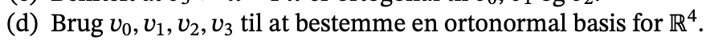

En Ortonormal basis er hvor alle vektor er en enhedsvektor med længden 1. En
anden måde man kan sige det på er de er blevet normaliseret. 

Desuden er de også ortogonale til hinanden, som vi så i c. 

Udover de allerede to egenskaber ved en ortonormal så vil et ortonormal basis
også være lineær uafhængig. 

Så for at besvarer d, skal vi egentlig bare dele med længden af de respektive
vektor, da vi allerede har vist ortogonalitet i opgave c. 


```{python}
V = np.vstack([v0 / v0_norm, \
               v1 / v1_norm, \
               v2 / v2_norm, \
               v3 / np.linalg.norm(v3)])
print(V, '\n')
print(np.round(V.T @ V))
```

SÅ har vi en ortonormal basis og vi ser vi får samme diagonal som i opgave a.

# aflevering 5

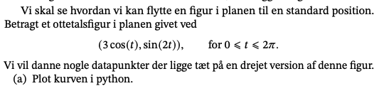{width="567"}

## a)

I den første del af opgaven skal vi tage de angivende funktioner:

$$
(3 cos(t), sin(2t)), \text{for } 0 \le t \le 2\pi
$$


Nu kan jeg således danne vores punkter til figuren.

```{python}
t = np.linspace(0, 2*np.pi, 1000)
y_1 = 3 * np.cos(t)
y_2 = np.sin(2*t)
eight = np.array([y_1, y_2])
```

Herefter kan vi plotte det.

```{python}
fig, ax = plt.subplots()
ax.set_aspect('equal')
ax.plot(*eight)
plt.show()
```

Som giver mig det ønskede 8 tal.

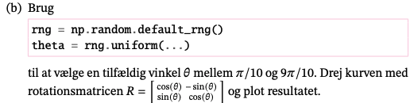

## b) 

Jeg opskriver funktioner der skal til for at lave vores plot med støjen.

```{python}
rng = np.random.default_rng()
theta = rng.uniform(np.pi / 10, \ 
                   (9 * np.pi) / 10)
```

Herefter definerer jeg min rotationsmatrice:

```{python}
c = np.cos(theta)
s = np.sin(theta)
R = np.array([[c, -s],
              [s, c]])

```


```{python}
rotated = R @ eight
fig, ax = plt.subplots()
ax.set_aspect('equal')
ax.plot(*(rotated))

plt.show()
```

Her kan vi se at vores ottetals er blevet roteret

## c)

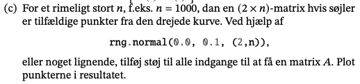
Dan den matricen angivet i opgave beskrivelsen:


```{python}
noise = rng.normal(0.0, 0.1, (2, 1000))

A = rotated + noise 

fig, ax = plt.subplots()
ax.set_aspect('equal')
ax.plot(*A, 'o', markersize = 2)
plt.show()
```

Jeg har tilføjet noget støj til ottetallet og herefter plottet det.

## d)

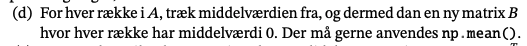

For at gøre ovenstående skal jeg trække mean fra hver enkelt vektor i A.

```{python}
B = np.vstack([A[0] - np.mean(A[0]), A[1] - np.mean(A[1])])
```

```{python}
fig, ax = plt.subplots()
ax.scatter (*B, color = "blue")
plt.show()
```


## e)

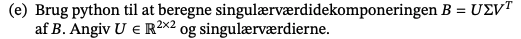

SVD er en matrix dekomponering metode der reducere en matrice i tre komponenter for senre at gøre udregninger til andre matricer simpler. 

- $U$ er en m x m matic, 

- $\Sigma$ er en m x n diagonal matrix og 

- $V^T$ er den transponerede af en n x n matrix.

De diagonale værdier i $\Sigma$ kendes som singulærværdierne af den orginale matrice. Kolonnerne af U kaldes venstre-singulær vektor af den orginale matrix og kolonnen af V kaldes højre singulær vektor af A.


For vores B matrices komponenter er givet som følgende:

```{python}
u, s, vt = np.linalg.svd(B, full_matrices = False)

print("Dimensioner af vores singulærværdier: \n",u.shape, s.shape, vt.shape)
print("Værdien af u: \n", u)
print("Værdien af s, som er vores singulærværdier: \n", s)
print("Værdien af vt: \n", vt)
```


## f)

I opgave f skal vi se på hvordan singulærværdierne for B er relateret til den
første figur.

 
Det jeg vil starte med a gøre er at plotte matricen U: 
```{python}
n = 1000
scale = 2/np.sqrt(n)
tscale = 1.2*scale
origo = np.zeros((2,1))
fig, ax = plt.subplots()
ax.set_aspect('equal')
ax.scatter (*B, color = "blue")
ax.plot(*np.hstack([origo, u[:,[0]]]))
ax.plot(*np.hstack([origo, u[:,[1]]]))
plt.ylim([-6.0,6.0])
plt.xlim([-6.0, 6.0])
plt.show()
```

Ud fra ovenstående figur kan vi se hvilken retning der giver mest varians. I dette tlfælde er det de venstresingulærvektorer, som også bliver af vores singulærværdier:

```{python}
print("Singulærværdier: \n", s)
```

Her kan vi se at 67 er støsrt som er vores s[0].

Denne singulærværdi har venstesingulærvektor som er den første føjle af u. Vores figur foroven viser at det således er de venstresingulærvektorer giver retningerne hvor variationen af punkterne er størst.


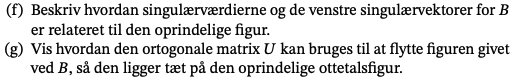

## g) 

Her forsøger jeg at gange u med B:

```{python}
opg_g = u @ B
```

```{python}
fig, ax = plt.subplots()
ax.set_aspect('equal')
ax.plot(*opg_g)
plt.show()
```

Her foroven ser vi at vi tilnærmelsesvis har fået den samme figur som i a.


# Kap 13: Indre produkter

Ser på det indre produkt og **definition 13.1** hvor reglerne står.

- Begrebet **normen induceret**
- `np.vdot` bruges til beregne indre produkt. Dog er `np.linalg.norm` at foretrække.

Der er også **vægtede indre produkt**. 

En speciel norm der bliver præsenteret er **frobeniusnormen**.

**L2-indre produkt**. 

Se side 150 for formler.


Ser på **fourier cosinus udviklingen**. 

Side 158 **simpsons regl**. 

# Kap 14: Ortogonale samlinger: klassiskGram-Schmidt

GS kan bruges til at danne ortogonale samlinger. 

Her gennemgåes metoden.

Q matricen har ortonormale søjler. R er øvre triangulær og udgør QR. 

# Kap 15: Forbedring af Gram-Schmidt

For GS iges den at være numerisk ustagil. 

# Kap 16: Mindste kvadraters metode


Skal hjælpe os med at estimer parameter.

I dette kapitel ser vi på hvor vi kan bruge MKM til at estimer parameter. Her bruger vi forskellige teknikker, QR, GS til at avende på mindske kvadrater metode. 

# Kap 17: Mindste kvadrater, konditionstalog Householder triangulering

Ser stadig på MKM og hvordan konditionstallet kan benyttes til at se præcisionen af løsninger. 

En alternativ metode til QR som er mere præcis end FGS er householder matricen, hvor der indgår en del nye mellemregninger og formular.

- ser på **defhouseholder_qr_data**.

Tabel 17.1 viser en tabel over de forskellige metoder og hvilke der er bedst når det gælder flops. 

# kap 18: Lineære aildninger og matricer

Fra tidligere har vi set at et vektorrum har to fundamentale operationer; sum og skalar multiplikation. 
En **lineær afbildning** respekterer disse. 

**Proposition 18.11** fremhæver to væsentlige egenskaber af lineære afbildninger. #Side 213.

Vi støder på en matrice A som kaldes for **den standard matrixrepræsentation (SMR)**.

Lineære afbildninger kan kombineres med simple eksempler hvorved de bliver komplekse.

Vektorrummet bevares under en lineær afbildning og det samme gør underrummet. Dog er der to særlige underrum. **Kernen** Som er mængden af alle vektorer i V, som L afbildnigner i $0 \in W$. Den anden er **billedemængden** af L som er mængden af alle værdier af L. # side 216.

# Kap 19: Koordinater

Der er mange koordinater der kan bruges for at ankomme til et givet punkt. I planen skal det gælde at vektorerne skal være forskellig fra nul og ikke paralelle. 

I højere dimensioner er der flere krav. Her skal vi bruge udtrykket **bias** hvor vi skal bruge **definition 19.1**.

Ser på **koordinatvektor** $[b]_E$.

Det centrale er vi har en base og denne base er med til at bevæge vores matrice. 

# Kap 20: Lineære transformationer ogkoordinatskift

- **rang-nullitetsformlen** # side 229.
- Ser på afbildnign af vektor rum. 

# Kap 21: Egenværdier og egenvektorer

- **Proposition 21.2** fortæler os om definitioner for en **egenværdi**.
- **Karakteristisk polynomium**
- En vigtig egenskab og formel er **21.4** hvor vi tilknytter begrebet **diagonaliserbar**. 
- **Determinantion** benyttes til til at afstemme om en matrice er invertibel. 

# Øvelse 6

## Opgave 6.2 Betragt de følgende vektorer


### a) gør rede for de er ortogonale

To vektorer er vinkelrette på hianden hvis deres indre produkt er lig 0
(8.1)

```{python}
v_0 = np.array([[2],[1],[-2]])
                
v_1 = np.array([[1],[0],[1]])
                
v_2 = np.array([[1],[-4],[-1]])                
```

```{python}
a = np.vdot(v_0, v_1)
b = np.vdot(v_0, v_2)
c = np.vdot(v_1, v_2)

print(f'resultater for a, b og c \n {a}, {b} og {c}')
```

Dermed kan vi se de er nul og de er ortogonale.


#### med gram matricen

```{python}
v0 = np.array([2.0, 1.0, -2.0])[:, np.newaxis]
v1 = np.array([1.0, 0.0, 1.0])[:, np.newaxis]
v2 = np.array([1.0, -4.0, -1.0])[:, np.newaxis]
V = np.hstack((v0, v1, v2))
G = V.T @ V

print('G=\n', G)
```

Ser den er diagonal så det betyder den er ortogonal.

### b) Lineær kombinatoin, parsevals identitet.

Brug her proposition 8.17:

```{python}
w = np.array([4.,5.,6])[:, np.newaxis]
x = np.linalg.inv(V) @ w
print('det(V)=', np.linalg.det(V))
print('x= \n', x)
```

Ovenståender har vi løst ligning system.

Parcevals identitet siger at:

```{python}
norm_w = x[0] **2 * np.linalg.norm(v0) **2 + \
         x[1] **2 * np.linalg.norm(v1) **2 + \
         x[2] **2 * np.linalg.norm(v2) **2 
print('norm med parcevals identitet;', np.sqrt(norm_w[0]))         
print('norm med numpys identitet;', np.linalg.norm(w))         
```

### c) dan en ortogonal matrix A hvis søjler er proportionalet med v0, v1, v2.

Vi kan opstile en ortogonal matrix A hvis søjler er proportionelle med
vores samling

```{python}
A = np.array([
  [2, 1, 1],
  [1, 0, -4],
  [-2, 1, -1]
])
A
```

For den er ortoginal skal den transponeres være identitet

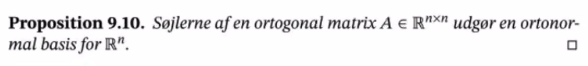

ortonormale vektorer har længden 1.

### d) hvad er forholdet

Hvis vi transporonerer denne og anvender den på w får vi:

$$
A^Tw=A^TVx=diag(a,b,c)V^TVx=diag(a,b,c)Gx
$$

Vi kender grammatricen fra tidligere og dermed får vi sammenhængen

$$
\begin{pmatrix}
9a & 0 & 0 \\
0 & 2b & 0 \\
0 & 0 & 18c
\end{pmatrix}
$$ 

Hvis vi havde valgt nogle værdier for bogstaverne ville det blive
identitets matricen.

## Opgave 6.3


### a)

$$
(AB)^{-1}A\\
= (B^{-1})^{-1}A^{-1}A\\
= BI
= B
$$ 

### b)

$$
A^{-1}(A^TB)^T\\
= A^{-1}B^T(A^T)^T\\
= B^TI\\
B^T
$$ 

### c)

$$
(AC)^{-1}(ABA^{-1})(AB)\\
C^{-1}AA^{-1}BA^{-1}AC \\
C^{-1}BA^{-1}AC \\
C^{-1}BC\\
$$

## Opgave 6.4

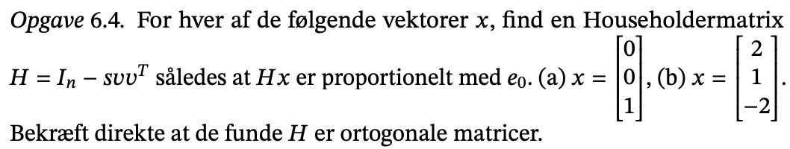

vi ved ikk hvad s, v


Der ønskes at

$$
H_x=te_0=\begin{pmatrix} t\\0\\0 \end{pmatrix}
$$ 

hvor

$$
H=I-svv^T
$$

Fra noterne ved vi at:

$$
v=\frac{1}{s}(e_0-\epsilon u)
$$ 

hvor u er en enhedsvektor

$$
s=1-\epsilon u_0=1+|u_0|\ge1
$$

### a)

x = (0,0,1) vi finder først enhedsvektor:

$$
u=\frac{x}{\sqrt(0^2+o^2+1^2)}=0
$$ 

Vi før dermed at $u_0=x_0=0\rightarrow\epsilon=-1$, hvilket mefører
at:

$$
s=1+0=1
$$

$$
v=\frac{1}{s}(e\_=-\epsilon u)=\frac{1}{1} ()
\begin{pmatrix} 
1 \\ 0 \\ 0
\end{pmatrix}
-   
    \begin{pmatrix} 
    0 \\ 0 \\ 1
    \end{pmatrix}
)=

\begin{pmatrix} 
1 \\ 0 \\ 1
\end{pmatrix}
$$
det indsætte vi ind i definitionen

$$
H =
\begin{pmatrix} 
1 & 0 & 0 \\ 0 & 1 & 0 \\ 0 & 0 & 1
\end{pmatrix}
-1
\begin{pmatrix} 
1 \\ 0 \\ 1
\end{pmatrix}
\begin{pmatrix} 
1 &0&1
\end{pmatrix}=
\begin{pmatrix} 
0 & 0 & -1 \\ 0 & 1 & 0 \\ -1 & 0 & 0
\end{pmatrix}
$$

Er den ortogonal?

```{python}
Ha = np.array([
  [0,0,-1],
  [0,1,0],
  [-1,0,0]])
x = np.array([0,0,1])[:, np.newaxis]
print(Ha@x)
```

vi får at Hx er en skalering af vores enhedsvektor.

et andet eksempel

```{python}
Ha.T@Ha
```

får identitetsmatricen så vores matrix opfylder det den skulle og så er
den også ortogonal.

### b)

Vi gør det samme, men nu for

$$
x = 2,1,-1
$$

$$
u=\frac{x}{\sqrt{2^2+1^2+(-2)^2)}}=\frac{1}{3}x \\
u_0=\frac{1}{3}x_0=\frac{2}{3}\rightarrow\epsilon=-1 \\
s=1+\frac{2}{3}=\frac{5}{2}\\
v = \frac{3}{5}
(
\begin{pmatrix}
1 \\ 0 \\ 0
\end{pmatrix}
+
\begin{pmatrix}
2/3 \\ 1/3 \\ -2/3
\end{pmatrix}
) =\begin{pmatrix}
1 \\ 1/5 \\ -2/5
\end{pmatrix}\\
$$

$$
H =
\begin{pmatrix} 
1 & 0 & 0 \\ 0 & 1 & 0 \\ 0 & 0 & 1
\end{pmatrix}
-\frac{3}{5}
\begin{pmatrix} 
1 \\ 1/5 \\ -2/5
\end{pmatrix}
\begin{pmatrix} 
1 &1/5&-2/5
\end{pmatrix}=
\begin{pmatrix} 
-2/3 & -1/3 & 2/3 \\ -1/3 & 14/15 & 2/15 \\ 2/3 & 2/15 & 11/15
\end{pmatrix}
$$ 

vi væler epsilon men det er ligegyldig hvilken værdi den får.

Det kan vi ligesom før også afprøve

## Opgave 6.5


## a) vis A er vinkelret

```{python}
A = np.array([[2., 0.],[0., 1.]])

e0 = np.array([1., 0.])[:, np.newaxis]              
e1 = np.array([0., 1.])[:, np.newaxis]              
```

```{python}
Ae0 = (A @ e0)

Ae1 = (A @ e1)

np.vdot(Ae0, Ae1)
```

Den er vinkelret

Da scalar produktet er lig 0 er de to vektorer vinkelrette 

### b)

Beregn vinklen:

```{python}
v0 = np.array([1., 1.])
v1 = np.array([1., -1.])

unit_v0 = np.linalg.norm(v0)
unit_v1 = np.linalg.norm(v1)
```

Brug:

$$
grader = \frac{radianer\cdot180}{\pi}\ \hat a \cdot\hat b=|a|\cdot |b|*cos(v)
$$

```{python}
cosv = (np.dot(v0,v1)) / (unit_v0 * unit_v1)
v    = (np.arccos(cosv)*180) / np.pi

print(f'Vores v \n {v}')
```

Vinklen er 90 grader mellem v0 og v1.

```{python}
Av0 = A @ v0
Av1 = A @ v1

unit_Av0 = np.linalg.norm(Av0) 
unit_Av1 = np.linalg.norm(Av1)

cosAv = (np.dot(Av0,Av1)) / (unit_Av0 * unit_Av1)
Av    = (np.arccos(cosAv)*180)/np.pi

print(f'vores av er \n {Av}')
```

Vinklen er 53 grader mellem av0 og av1

### c) hvis w0= er enheds lav en plot af vinklen mellem.

Vi får af vide at de to vektorer c og s. Det gælder at de i anden er 1.

```{python}
import matplotlib.pyplot as plt

co = np.linspace(-1., 1., 100)

si = np.sqrt(1-co**2)

w00 = np.array([co,si])

w11 = np.array([-si,co])

A   = np.array([[2., 0.], [0., 1.]])
A_w00 = A@w00
A_w11 = A@w11

costh = []
for n in range(0,100):
  a = ((A_w00[:,n] @ A_w11[:,n]) / (np.linalg.norm(A_w00)*np.linalg.norm(A_w11)))
  costh.append(a)

costh_rad = np.arccos(costh)
costh_grad = np.arccos(costh) / (np.pi) * 180

fig, ax = plt.subplots()
ax.plot(co, costh_grad)
plt.show()
```

vi har en 2 x 100 matrix.

Hvis cos er 1 er de vinkelrette. så er sin 0. det giver

$$
Aw_0=
\begin{pmatrix}2 &0 \\0 & 1 \end{pmatrix}
\begin{pmatrix} 
c \\ s
\end{pmatrix}=
\begin{pmatrix} 
2c\\s
\end{pmatrix}
$$ 

$$
Aw_0\bot A_w\leftarrow \rightarrow\langle Aw_0,Aw_1\rangle = 0
\\ \langle 

\begin{pmatrix} 
2c \\s
\end{pmatrix}
,

\begin{pmatrix} 
-2s\\c
\end{pmatrix}
\rangle=-4sc+sc=0 
$$

Dette er kun sandt hvis enten c = 0 eller s = 0,
korrsonerede med w0, w1 er parallelle med e0, e1 eller e1 e0.

## Opgave 6.6


### a) hvis A er diagonal bestem en singulærværdidekomponerin SVD for A

enhver matrix har en singulærværdikomponering, hvor u og v er ortogonal.
sigma er en diagonal matrix. De er sorteres efter størrelse.

Hvi A er en diagonal matrix så er en SVD for A:

$$
A=U\Sigma V^T
$$

hvor U og V.T er matricer der udfører rækkeoperationer på (byt om på
rækker) sigma, som indeholde de samme værider som A, men bare sorteret
efter størrelse. U og V.T vil kun indeholde indgange der er 0 eller 1.


Generalt er svd ikke unik, Så der er meget stor frihed, så længde vores
svd overholder definitionen på en svd. 

### b) nu vilkårlig diagonal

det samme som i a bortset fra at nogen af værdiern i V.T vil være
negative for så singulærværdierne kan være positive.

A må have negative værider.

Sigma er den samme.

En singulær værdi kan ikke være negativ.

Vt må have nogle negative værdier for at udligne dem.

### c) bestem svd for A.T

$$
A^T=(U\Sigma V^T)^T\\
=V\Sigma^T U^T \\
= V\Sigma U^T 
$$

Sigma er diagonal og når vi transponerer den får vi den selv.

### d) A er ortogonal bestem SVD

Hvis matrix anvendt på sig selv giver dens inverse er det
identitetsmatrice.

idet A er ortogonal må det gælde

$$
A^TA=V\Sigma U^TU \Sigma V^T =I_n \\
A^TA=V\Sigma \Sigma V^T=I_n \\
\Sigma \Sigma=I_n \\
\Sigma =I_n
$$

kender svd for A og transponerede. Det kan vi indsætte så vi ender med
identitet matricen.

Sigma er altså sin egen inverse, hvilket kun opfyldes af
identitetmatricen:

$$
A=UI_nV^T=UV^T
$$


### e) 

hvis A er invertibel hvad
kan siges om singulærværdier for A

Hvis A er invertibel gælder det at det(A) forskelle 0, så

$$
det(A) = det(V\Sigma U^T)\\
=det(V)det(\Sigma)det(U^T)\ne0
$$

idet det(sigma) = sigma0,sigma1,sigma2.., gælder det at alle sigmai er
forskellig fra 0.

## Opgave 7.1


### a)

sin diff er cos

ser at de er mindre en 1, så hvis vi får en floating fejl, så vil den vokse lineære og ikke en eksponentiel stining. Fejlen skal helst være så tæt på 1 som muligt.

Hvad vhis nævner kommer tæt på nul. Så bliver fejlen uendelig stor. 

### b)

Det ser ud til vi skal bruge en formel for at lave beregningen.

$$
\kappa = \frac{||x||f'(x)}{f(x)}\\
= \frac{x*cos(x)}{sin(x)}
$$

```{python}
x = np.linspace(0, 6, 100)
y = np.sin(x)
```

Her skal vi bruge den anden formel hvor vi har gradienten. 

Her ser vi at fejlen vil vokse polomiel i stedet. 

## Opgave 7.2


### a)

$$
(3+2i) +(-1+i)
$$

```{python}
z = 3.0 + 2.0j
w = (-1.0+1.0j)
z + w
```

som er løsningen.

### b)

```{python}
(3.0+2.0j)*(-1.0+1.0j)
```

### c)

```{python}
(3.0+2.0j)/(-1.0+1.0j)
```

### d)

```{python}
def switch(A, i, j):
  A[[i, j], :] = A[[j, i], :]
 
def scale(A,i, s):
  A[i, :] *= s
 
def increase(A, i, j, s):
  A[i, :] += A[j, :] * s
```


```{python}
D = np.array([[1.0 + 1.0j, 2.0-1.0j]])

print("D: \n" + str(D))
scale(D, 0, 1 / D[0,0])
print("\n" + str(D))
increase()
```


### e)

```{python}
E = np.array([ 
  [1- 1j, 1j,-(1+1j)],
  [1, -(2+1j),1j],
  [1j,1-1j,1-1j]
])

b = np.array([5,2,0])
x = np.linalg.solve(E,b)
print(np.round(x,5))
```


## Opgave 7.3

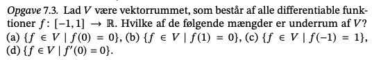

Defition 12.1 vektorrum består af mængde V hvis elementer vi kalder vektor.

definition 12.11: en ikke tim delmængde w delmænde V er et underum hvis sum og
skalarmultiplikaiton sender element W til elementer W.

vi skal undersøge om det er et underrum. Vi får af vide f har funktionsværdier mellem -1 og 1. Her skal vi undersøge om de forskellige er underrum. Her skal vi bruge de tre definitioner i 12.11

- a) W er ikke tom,
- b) v,w $\in W$ medfører $n+w\in W$,
- c) $w\in W$ og s en skalar medfører $sw\in W$
 
### a) {f \in V | f(0) = 0}

For alle gælder det at V ikke er tom. FOr den anden regle så deler vi op og pludser. Da 0 er en del af funktionsværdien eller intervallet for værdier vi acceptere, så er b også overholdt.  Det handler altså om at se om hvis vi enden lægger to værdier sammen eller ganger en skalar på, så skal vores resultat være en del af de funktionerværdier som V må antage. 

$$
\begin{align*}
    g=f_i+f_j,&&\text{  } g(0) =f_i(0)+f_j(0)=0\\
    g=sf_i, &&g(0)=sf_i(0)=s0=0\\
    \text{Er underrum}
\end{align*}
$$

### b) f(1) = 0

$$
\begin{align*}
    g=f_i+f_j,&&\text{  } g(1) =f_i(1)+f_j(1)=0\\
    g=sf_i, &&g(1)=sf_i(1)=s0=0\\
    \text{Er underrum}
\end{align*}
$$

### c) f(-1) = 1

$$
\begin{align*}
    g=f_i+f_j,&&\text{  } g(-1) =f_i(-1)+f_j(-1)=2\\
    \text{Ikke underrum}
\end{align*}
$$

### d) f'(0)=0

$$
\begin{align*}
    g=f_i+f_j, &&\text{  } g'(0) =f_i'(0)+f_j'(0)=0\\
    g=sf_i, &&\text{} g'(0)=sf_i'(0)=0 \\
    \text{Er underrum}
\end{align*}
$$

## Opgave 7.4


Hvis en delmængde skal være et underrum skal mængden ikke være tom.

Betragt ovenstående løsning til andengradligningen $ax^2+bx+c=0$

Brug wolframe alhp til beregningen af gradienten.

$$
\begin{align*}
\nabla f(x)=(1/4-\sqrt 3 /12, \sqrt 3 / 12-1/4, -\sqrt 3 / 6) && \text{gradienten}
\end{align*} \\
$$

$$
\kappa(x) =\frac{||(2.0, 2.0, -1.0)||_2||(-1,0,1||_2}{|f(x)|} \\
$$

$$ 
= \frac{\sqrt{2.0^2+2.0^2+(-1)^2}||(1/4-\sqrt 3 /12, \sqrt 3 / 12-1/4, -\sqrt 3 / 6)||_2}{|\frac{-b+\sqrt{b^2-4ac}}{2a}|}
$$

### simons løsning

```{python}
def f(a, b, c):
  return (-b + np.sqrt(b**2 -4*a*c))/(2*a)

print(f(2,2,-1))
print(f(2.1,2,-1))
print(f(2,2.1,-1))
print(f(2,2,-1.1))
```

Ved ovenstående ser simon hvilken der varier mest, da en del af opgaven netop beståe i at udtale sig om hvilken der.


```{python}
def gradf(a,b,c):
  x = ((-b**2 + 2*a*b)/np.sqrt(b**2 - 4*a*c) + b) / 2*a
  y = (b/np.sqrt(b**2-4*a*c)+1)/2*a
  z = -1/np.sqrt(b**2-4*a*c)
  return np.array([x, y, z])

print("K(2,2,-1) = ", \
        np.linalg.norm(gradf(2,2,-1))*\
        np.linalg.norm(np.array([2,2,-1]))/\
        abs(f(2,2,-1)))
print("K(2,2,-10) = ", \
        np.linalg.norm(gradf(2,2,-10))*\
        np.linalg.norm(np.array([2,2,-10]))/\
        abs(f(2,2,-10)))
```

Udregner gradienten.

FInd konditionstallet for de to punkter. Bruger formlen på noter.

Får to forskellige tal 29 og 15 og dem relateres tli variationen. 

Vi vil gerne have et konditionstal mellem 1 og 10, da det er til at acceptere, menss hvis de er over så sker der for store fejl. 


```{python}
import math

# definer gradient
first = np.array([(1/4) - (math.sqrt(3) / 6), \
                  (math.sqrt(3)/12 - (1/4)), \
                  (math.sqrt(3) / 6)])
                 
# udregner længden
value1 = np.linalg.norm(first)
 
print("Normen af gradienten for første funktion er: ", value1)
print("Den partiel afledte for a: ", (1/4) - (math.sqrt(3) / 6))
print("Den partiel afledte for b: ", (math.sqrt(3) / 12) - (1/4))
print("Den partiel afledte for c: ", -(math.sqrt(3) / 6))

# Den partielle afledte som varier mest
# siden c har den største absolutte værdi, så er denne den som varier mest.

a = 2.0
b = 2.0
c = -1.0

# udregner konditionstal
((math.sqrt(a**2+b**2+c**2) *value1) * (2*a)) / \
(-b + math.sqrt(b**2 - 4 * a * c)) 
```

c har altså den største påvirkning, hvor den er

$$
\kappa(x)=2.54
$$


# Øvelse 8

- Se egen fil

# Øvelse 9

- Se egen fil

# Øvelse 10

- Mangler

# Aflevering 6

## a)


er ortogonal

I ovenstående opgave beskrivelse ligner det der mangler et tegn i grænserne for integralet. Her følger jeg 13.10 og antager at der skal stå $\pi$.

Her kan vi følge ovenstående nævnte eksempel og vise følgende:

$$
\int^\pi_0sin(m\cdot w)sin(n \cdot w) dx = 0 \text{, hvor  }  m\ne n
$$
Hvor vi kan bruge følgende identitet:

$$
sin(\theta)sin(\phi)=\frac{1}{2}[cos(\theta-\phi)- cos(\theta+\phi)]
$$

Således kan ovenstående skrives som:

$$
\int^\pi_0\frac{1}{2}[cos(mw-nw))- cos(nw+mw)]
$$
Smid 1/2 og w ud

$$
\frac{1}{2}\int^\pi_0 cos(m-n)w- cos(n+m)w
$$
Hvor vi nu kan integrerer

$$
\frac{1}{2}[\frac{1}{m-n} sin(m-n)w-\frac{1}{m+n}sin(m+n)w]^\pi_0
$$

Her får vi at sin(m-n) bare er nul, så år vi evaluerer udtrykket så får vi nul.
Dermed får vi nul og vi har de er ortogonale.  

## b)


For at vise dette kan vi bare beregne det indre produkt af funktionerne

$$
\langle 1, sin(w) \rangle = \int^\pi_01\cdot sin(w) \ dw\\
=[-cos(w)]^\pi_0\\
=2
$$

Ikke vinkelret.

$$
\langle 1, sin(3w) \rangle = \int^\pi_01\cdot sin(3w) \ dw\\
=\frac{1}{3}[-cos(w)]^{3 \pi}_0\\
=\frac{2}{3}
$$
Ikke vinkelret.

$$
\langle 1, sin(2w) \rangle = \int^\pi_01\cdot sin(3w) \ dw\\
=\frac{1}{2}[-cos(w)]^{2 \pi}_0\\
=0
$$
Vinkelret

$$
\langle 1, sin(4w) \rangle = \int^\pi_01\cdot sin(3w) \ dw\\
=\frac{1}{4}[-cos(w)]^{4 \pi}_0\\
=0
$$
Den er vinkelret.

Således har jeg vist at f(w)=1 er vinkelret på sin(2w) og sin(4w), men ikke vinkelret for sin(w) og sin(3w). 

### c)


Det indre produkt for $L^2$ er

$$
\langle f,g\rangle = \int^b_a f(x)g(x) dx
$$

Opskriv projektionen:

$$
pr_{sin(x),sin(3w)}(1)=\frac{\langle 1, sin(w)\rangle}{||sin(w)||^2}sin(w) + 
\frac{\langle 1, sin(3w)\rangle}{||sin(3w)||^2}sin(3w)
$$
Lad os udregne nogle enkelte skridt ad gangen:

$$
\langle 1, sin(w) \rangle = \int^\pi_0 1\cdot sin(w) dw \\
= 2
$$

$$
||sin(w)||^2=\int^\pi_0 sin(w)^2 \\
= \frac{\pi}{2}
$$

Indsæt i formlen:

Herefter foretages der en del udregning af det indre produkt og normen, men ender ud med:

$$
pr_{sin(x),sin(3w)}(1)=
\frac{2}{\frac{\pi}{2}}\cdot sin(w) + 
\frac{\langle 1, sin(3w)\rangle}{||sin(3w)||^2}sin(3w)
$$

$$
pr_{sin(x),sin(3w)}(1)=
\frac{4}{\pi}\cdot sin(w) + 
\frac{\langle 1, sin(3w)\rangle}{||sin(3w)||^2}sin(3w)
$$
Så udregner vi andet led:

$$
||sin(3w)||^2=\int^\pi_0sin(3w)^2\\ = \pi/2
$$

$$
\langle 1, sin(w) \rangle = \int^\pi_0 1\cdot sin(3w) dw \\
= \frac{2}{3}
$$

$$
pr_{sin(x),sin(3w)}(1)=
\frac{4}{\pi}\cdot sin(w) + 
\frac{\frac{2}{3}}{\frac{\pi}{3}} \cdot sin(3w)\\
= \frac{4}{\pi}\cdot sin(w) + \frac{4}{3\pi}\cdot sin(3w)
$$

Med ovenståedne projektion kan vi nu finde den vinkelrette funktion:

$$
1-\frac{4}{\pi}sin(w)-\frac{4}{3\pi}sin(3w)
$$

Denne kombination er vinkelret på alle funktioenr i 8.1, da det er et eksempel på en Gram Schmidt process, hvor ideen er at vi kan trække fra vores vektor en projektion på hver vektor (her sin w, sin 2w, sin 3w og sin 4w) så vi får en vekto der er ortogonal til hver vektor. For vores *f*, som er ortogonal til sin (m w) når m er positiv og lige.  Derfor skal man trække projektionen med sin w og sin 3w fra.

### d)


I denne opgave skal vi bruge python til at plotte ovenstående funktion og beregne en approximering baseret på vores funktion givet i 8.1.

Allerførst indlæser modulerne  numpy og matplotli.

```{python}
import numpy as np
import matplotlib.pyplot as plt
```

Efterfølgende bruger jeg samme metode som Andrew vise i hans undervisning, men hvor han viste en fourier cosinus udvikling. 

```{python}
n = 100
x, h = np.linspace(0, np.pi, n, retstep = True)
print("De først 10 obervationer i x: \n",x[:10])
print("Vores h observation, som er pi: \n", h)
```
Nu vil jeg plotte vores eksponential funktion.
 
```{python}
fig, ax = plt.subplots()
ax.set_aspect("equal")
ax.plot(x, 1-np.exp(-x))
plt.show()
```

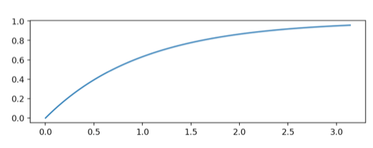

Herefter benytter jeg mig ad de tre funktioner vi så i undervisning:

- `indre_produkt` den beregner det indre produkt ved hjælp af **Trapezreglen**.
- ´nor_sq´ beregner længden.
- `proj` beregner projektionen for os.

```{python}
def indre_produkt(f, g, h):
  return np.trapz(f * g, dx = h)

def nor_sq(f, h):
  return indre_produkt(f, f, h)

def proj(f, k, x, h):
  konstant = np.ones_like(x)
  out = 0
  for m in range(1, k):
    out += indre_produkt(f, np.sin(m * x), h) / nor_sq(np.sin(m * x), h) * np.sin(m * x)
  return out
```

```{python}
f = 1 - np.exp(-x)

fig, ax = plt.subplots()
ax.set_aspect('equal')
ax.plot(x, f)
ax.plot(x, proj(f, 2, x, h), label = "til sin(w)")
ax.plot(x, proj(f, 3, x, h), label = "til sin(2w)")
ax.plot(x, proj(f, 4, x, h), label = "til sin(3w)")
ax.plot(x, proj(f, 5, x, h), label = "til sin(4w)")
plt.legend(loc = "lower right")
plt.show()
```


Ovenstående plot viser vores funktion og dens tilnærmelser.


# Aflevering 7


## Intro
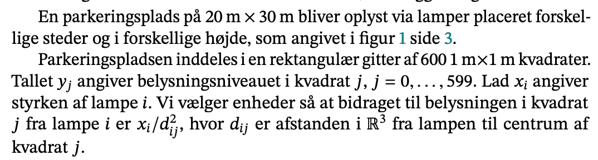
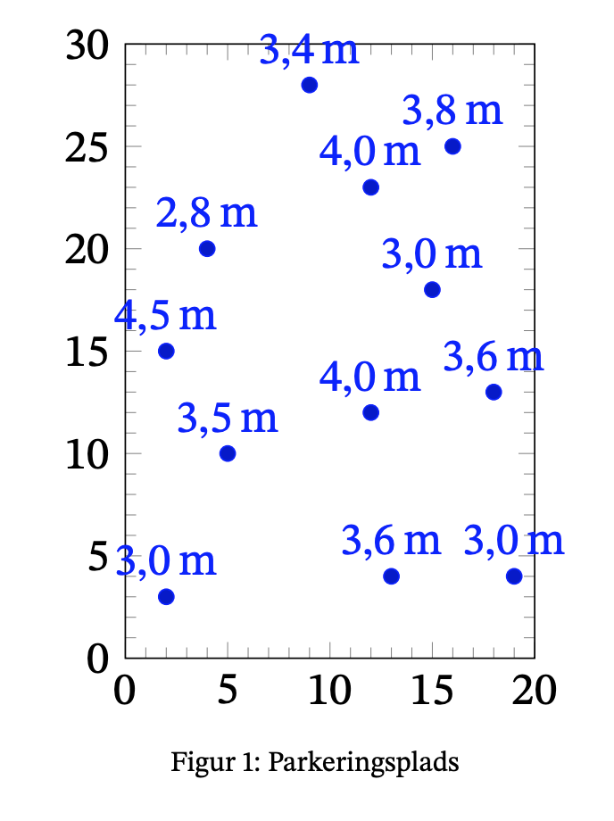

## a)
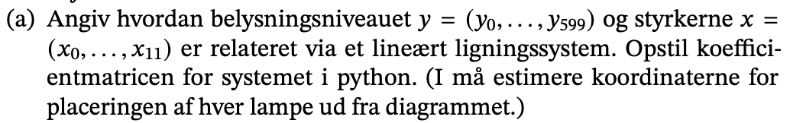

I denne opgave skal vi opstille et ligning system på formlen:

$$
Ax=b
$$

Til en start kan vi se hvordan y og x er udtrykt af hinanden:

$$
y_0 = \frac{x_0}{d^2_{0,0}}+ \frac{x_1}{d_{1,0}^2}+...+\frac{x_{11}}{d_{11,0}^2}\\
\\.
\\.\\.\\
y_{599} = \frac{x_0}{d^2_{0,599}}+ \frac{x_1}{d_{1,599}^2}+...+\frac{x_{11}}{d_{11,599}^2}
$$

For at opstille koefficient matricen skal vi bruger en række ting.

Først skal vi have en funktion til at beregne afstanden. Det gør jeg med min funktion `afstand`:

```{python}
def afstand(i, point):
  x = i % 20
  y = i //  20
  return (point[0] - x - 0.5)**2 + (point[1] - y - 0.5)**2 + (point[2])**2
```

Herefter kan vi udfra billede fra opgave beskrivelsen opskrive vores data, med x og y koordinaterne samt afstand værdi.

```{python}
lamps = np.array([
  [2, 3, 3.0],
  [14, 4, 3.6],
  [19, 4, 3.0],
  [10, 5, 3.5],
  [12, 12, 4.0],
  [18, 13, 3.6],
  [2, 15, 4.5],
  [15, 10, 3.0],
  [5, 20, 2.8],
  [12, 23, 4.0],
  [10, 29, 3.4],
  [16, 26, 3.8]
])
```

Nu er vi klar til selve beregning. Til en start laver jeg en `afstand_matrix`, hvor data skal gemmes i. 

```{python}
afstand_matrix = np.ones((600,12))

for i in range(600):
  for j, lamp in enumerate(lamps):
    Afstand = 1 / afstand(i, lamp)
    afstand_matrix[i, j] = Afstand
print(f' Hermed får vi vores koefficient matrice til følgende: \n {afstand_matrix}')
```

## b)
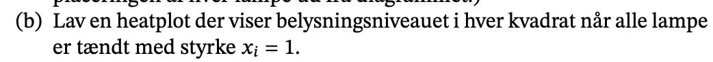

Til at lave et heatplot skal vi først sørge for at x har værdien 1:

```{python}
x = np.ones(12)
```

Herefter kan vi beregne y og dernæst reshaper vi vores y, så den er i en form der matcher vores tegning. Dermed bliver det en 30 x 20 matrice. For at ændre matricen kan vi benytte os af klassen array `reshape` attribute.

```{python}
y = afstand_matrix @ x
y_reshape = y.reshape((30, 20))

fig, ax = plt.subplots()
ax.set_aspect('equal')
ax.matshow(y_reshape, cmap='Reds')
plt.show()
```

Foroven ser vi belysningniveauet når alle lamper lyser med en styrke på $x_i$ = 1. 

## c)

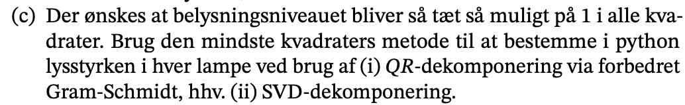

I denne opgave skal vi have at belysningsniveauet er tæt på 1 i alle kvadrater. Her skal vi vise vi kan gøre brug af mindste kvadraters metode ved Gram Schimidt og SVD komponering.


## i) QR dekomponering via forbedret gram schimidt

Til

```{python}
def gram_schmidt(a):
    k = a.shape[1]
    q = np.copy(a)
    r = np.zeros((k,k))
    for i in range(k):
        r[i, i] = np.linalg.norm(q[:, i])
        q[:, i] /= r[i,i]
        r[[i], i+1:] = q[:, [i]].T @ q[:, i+1:]
        q[:, i+1:] -= q[:, [i]] @ r[[i], i+1:]
    return q, r

def least_squares(A, b):
    Q, R = gram_schmidt(A)
    b0 = Q.T @ b
    return np.linalg.solve(R, b0)

A = afstand_matrix
y_new = np.ones(600)
koeffs_gs = least_squares(A, y_new)

print(f'Lystyrken skal være \n: {koeffs_gs}')
```

Her foroven ser vi for hvilke værdeir der skal til for at vores belysning niveau er 1.

#### ii) QR dekomponering via SVD dekomponering

Den samme problemstillign har vi for SVD:

```{python}
u, s, vt = np.linalg.svd(A, full_matrices = False)
koeffs_svd = vt.T @ (np.diag(1/s) @ (u.T @ y_new))
print(f'Resultatet når vi gør brug af svd \n {koeffs_svd}')
```

Vi opnår samme resultat næsten. 

## d)

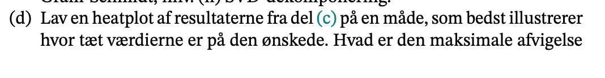

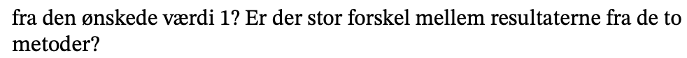

Her vil jeg først lave en ny heatmap, hvor vi kan se vores resultater fra c.

```{python}
x = np.ones(12)
res_test = A @ koeffs_svd
res_test_reshape = res_test.reshape((30,20))

fig, ax = plt.subplots()
ax.set_aspect('equal')
ax.matshow(res_test_reshape, cmap='Reds')
plt.show()
```

```{python}
x = np.ones(12)
res_test = A @ koeffs_gs
res_test_reshape = res_test.reshape((30,20))

fig, ax = plt.subplots()
ax.set_aspect('equal')
ax.matshow(res_test_reshape, cmap='Reds')
plt.show()
```

Heat plottene for de to metoder ser meget ens ud. 

Ud fra et øjemål og hvad vi har set tidliger, så er der ingen stor forkskel på de to metoder. 

## e)

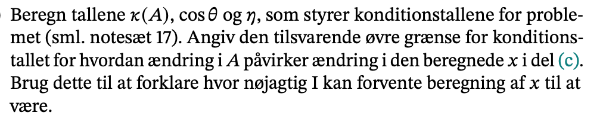

Til en start laver jeg de adspurgte beregninger. 


```{python}
u, s, vt = np.linalg.svd(A, full_matrices=False)
kappa_a = s[0] / s[-1]
print(f'{kappa_a:e}')
```
Det er stort.

```{python}
proj_b = u @ (u.T @ y)
cos_theta = np.linalg.norm(proj_b) / np.linalg.norm(y)
print(np.arccos(cos_theta) * 180 / np.pi)
```

```{python}
x = vt.T @ (np.diag(1/s) @ (u.T @ y))
eta = s[0] * np.linalg.norm(x) / np.linalg.norm(proj_b)
print(f'{eta:e}')
```

```{python}
kond_x_b = kappa_a / (eta * cos_theta)
kond_x_a_højst = (kappa_a +(kappa_a**2 * np.sqrt(1-cos_theta**2) / (eta * cos_theta)))
print(f'kond_x_b ={kond_x_b:e}')
print(f'kond_x_a_højst ={kond_x_a_højst:e}')
```


Vores beregning kommer ikke til at være helt så præcis baseret på vores ovenstående resultat. 


# Aflevering 8: handler om egenværdier

- Se word

# Kap 22: Differentialligninger

- Egenværdier kan bruges til differential lingnerg.
- fra **proposition 22.1** handler om løsninger til differential ligninger.
- Eksemp 22.3 minder om afleveringsopgaven. 
- **Den komplekse eksponentialfunktion**. 
- Ser på komplekse tal. 
- Desuden ser vi på **Euler identitet** # side 260. 
- Der er også et afsnit om differential ligninger af højere orden. 

# Kap 23: Matrixfaktorisering fraegenværdier

- Ser på matrix faktorisering.
- Her er **sætning 23.1** væsentlig og en fundamental sætning. 
- Støder på begrebet **unitær** som fortæller os at en matrix er U er netop dette hvis dens transponerede multiplicret på U giver identitetsmatricen. 
- For **sætning 23.8** har vi hvad der kaldes en **schurdekomponering** hvor vi ud fra en unitær matrice kan få en dekomponering hvor T er øvre triangulær. 
- Diagnoaliseringbar resultater er bedre end normale matrice resultater. FOr at opnå det kan vi sætte flere krav. Her bruges **sætning 23.9 spektralsætningen** som er meget vigtig. 
- **Sætning 23.13** er en spektralsætning for **hermitiske matricer**. En hermitisk matrice er en kompleks matrix.
- Der er e snak om egenskaberne for determinanten. Fra **proposition 23.14** er der en oversigt over rækkeoperationer med determinanten.

# Kap 24: Potensmetoden oginverspotensmetoden foregenværdier

- For generelle n x n matricer er der ingen formel, men vi skal bruge numeriske metoder for egenværdier og egenvektor. Der er to metoder, hvor den ene kigger på den største numerisk værdi og den anden kigger på et gæt.
- **Potensmetoden** er en algoritme som finder den største numerisk værdi for egenværdien. 
- Der er en ny notation **Stor O notationen** hvor vi inkluderer en faktor der forbejre potensmetoden.
- Potensmetoden bruges af google i **page rank** hvor man ranger sider.
- Der er også specielle matricer hvor hver søjle summer til 1 og de kaldes **stokastiske matricer**. 
- Der er **sætning 24.5 (Perron Frobenius)** som siger at hvis vi har en stokastisk matrice så vli egenvektor være positiv. 
- Tilnærelse til egenværdi bruger man ofte **rayleighs kvotient**. 
- **INverspotensmetode** bruger istede for den største numeriske værdi en gætte metode. 

# Kap 25: Hessenberg- og tridiagonalform

- Ser på hvordan vi kan bestemme alle egenværdier. 
- **Hessenbergform** ikke når så stærk som schurformen. 
- Handler om vi skal gå til nogle forskellige matricer formler, så vi finder frem til den form der er lettest at regne med.
- Når vi så kommer frem til hessenbergormen vil vi tage det et skridt vider og få tridiagonalformen.
- Her bruger vi igen household matrice og bryder det ned. 

# Kap 26: Egendekomponering via QR - metoden

- QR metoden kan også bruges til beregnign af egenværdier. 
- Den kan være langsom men ved iteration kommer vi ned til e schurform matrice. 
- **ortogonal iteration** gør vi konverger mod en diagonaliserng af A. 
- **Wilkinsons shif**. 

# Kap 27: Singulærværdi beregning ogprincipalkomponent analyse


- I stedet for at se på hvordan egenværdier og egenvektor kan beregnes vender vi blippet mod beregning af singulærværdier. 
- pca ses på.

# kap 28: LU-dekomponering

- Ser igen på lineære ligninssytemer med en metode der er basere på brug af rækkeoperationer. 


# Aflvering 9

Se alf 9

# Aflvering 10

ikke lavet

# Øvelse 11

# Øvelse 12

# Øvelse 13

# Eksamen 1

## 1)
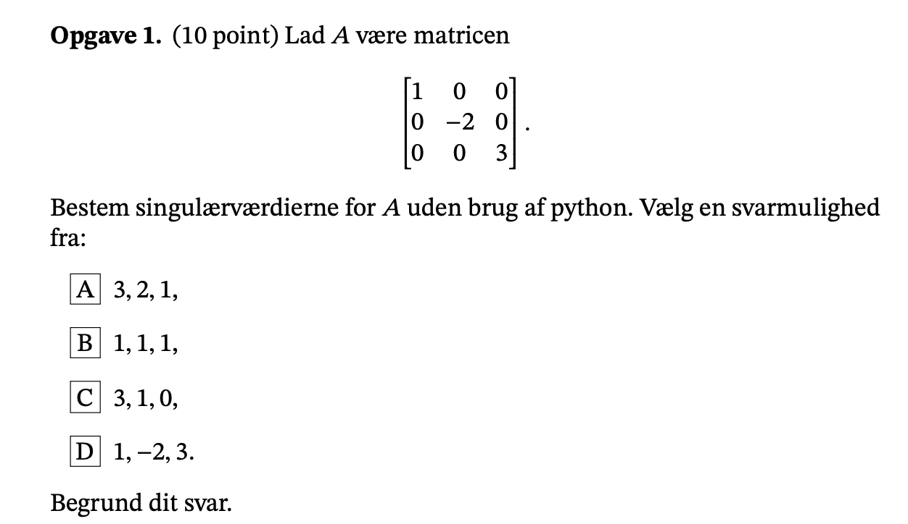

```{python}
a = np.array([[1.0,  0.0,0.0],[0.0,-2.0,0.0],[0.0,0.0,3.0]])

u, s, vt = np.linalg.svd(a, full_matrices = False)

print("Værdien af s, som er vores singulærværdier: \n", s)
```


## 2)

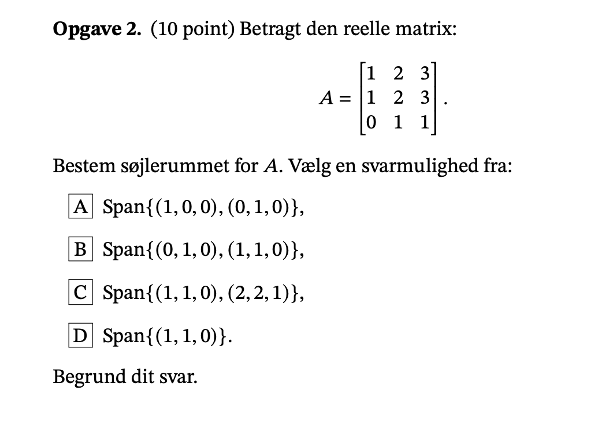


## 3)

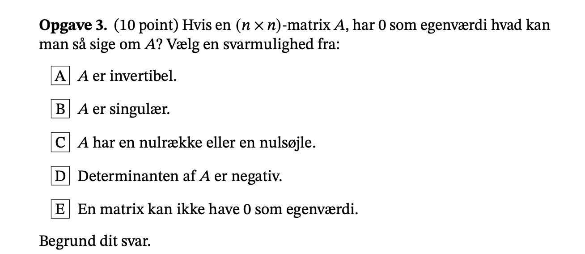

If 0 is an eigenvalue, then the nullspace is non-trivial and the matrix is not invertible. Therefore all the equivalent statements given by the invertible matrix theorem that apply to only invertible matrices are false.

Den er singulær som betyder den ikke er invertibel.

## 4) flops

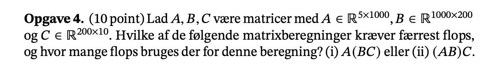

```{python}
# i)
print((2 * 1000 * 200 * 5) + (2 * 1000 * 10 * 1000))

# ii)

print((2 * 5 * 1000 * 200) + (2 * 5 * 200 * 10))

```


## 5)

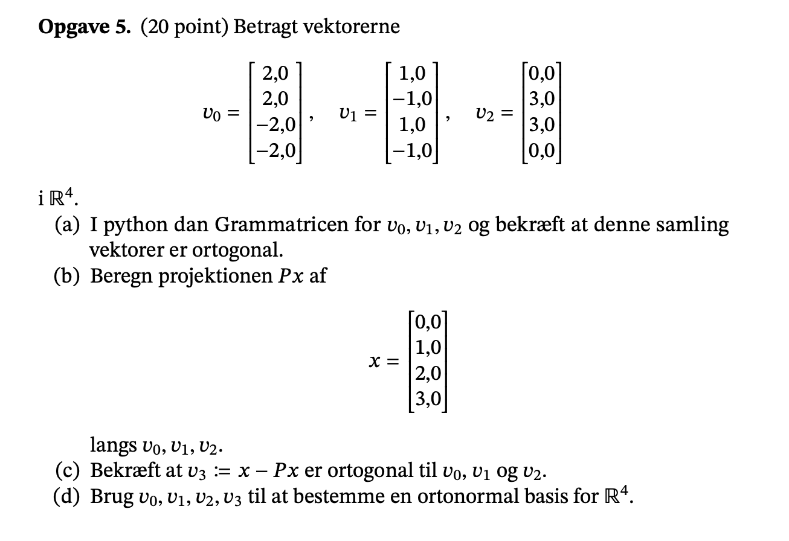

### a) grammatricen

```{python}
import numpy as np
v0 = np.array([2.0, 2.0, -2.0, -2.0])
v1 = np.array([1.0, -1.0, 1.0, -1.0])
v2 = np.array([0.0,  3.0, 3.0,  0.0])
V = np.vstack([v0, v1, v2])
G1 =  V @ V.T
G1
```

### b) projektion

```{python}
x = np.array([0.0, 1.0, 2.0, 3.0])

v0_norm = np.linalg.norm(v0)
v1_norm = np.linalg.norm(v1)
v2_norm = np.linalg.norm(v2)

prov0 = (np.dot(v0, x) / v0_norm**2) * v0
prov1 = (np.dot(v1, x) / v1_norm**2) * v1
prov2 = (np.dot(v2, x) / v2_norm**2) * v2
Px = prov0 + prov1 + prov2
print("Projektionen er:  =\n", Px)
```

### c) v3 skal vies er ortogonal

```{python}
v3 = np.round(x - Px)

print("v3 og v0 er ortogonale da deres indre produkt er", np.dot(v0,v3))
print("v3 og v0 er ortogonale da deres indre produkt er", np.dot(v1,v3))
print("v3 og v0 er ortogonale da deres indre produkt er", np.dot(v2,v3))
```

### d) Ortonormal basis

```{python}
V = np.vstack([v0 / v0_norm, \
               v1 / v1_norm, \
               v2 / v2_norm, \
               v3 / np.linalg.norm(v3)])
print(V, '\n')
print(np.round(V.T @ V))
```

## 6) mindste kvadrat metode

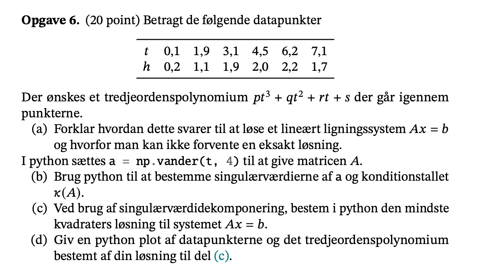

### a) ligninger og så videre

Der er 6 ligninger med 4 ubekendte så den kan ikke løses.

### b) svd beregnign og 

```{python}
t = np.array([0.1, 1.9, 3.1, 4.5, 6.2, 7.1])
h = np.array([0.2, 1.1, 1.9, 2.0, 2.2, 1.7])
a = np.vander(t, 4)

u, s, vt = np.linalg.svd(a, full_matrices = False)

kappa_a = s[0] / s[-1]

print("Værdien af s, som er vores singulærværdier: \n", s)
print(f'Vores konditionstal \n {kappa_a}')
```


### c) bestem løsning mindste kvadrat metode

```{python}
koeffs_svd = vt.T @ (np.diag(1 / s) @ (u.T @ h[:, np.newaxis]))

print(f'Vores koefficienter \n {koeffs_svd}')
```

### d) data plot af punkter

```{python}
tt = np.linspace(t.min() - 0.5, t.max() + 0.5, 100)
fig, ax = plt.subplots()
ax.set_ylim(0.0, 2.5)
ax.plot(t, h, 'o')
ax.plot(t, np.vander(t, 4) @ koeffs_svd)
plt.show()
```


## 7) Karakteristisk polynomium, egenværdier

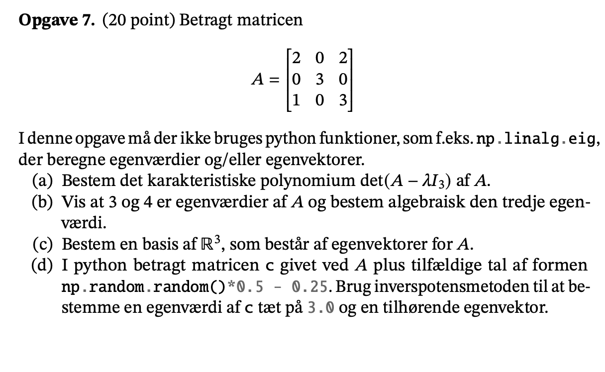


### a) Karakteristik polynomium

Se : https://www.emathhelp.net/calculators/linear-algebra/characteristic-polynomial-calculator/?i=%5B%5B2%2C0%2C2%5D%2C%5B0%2C3%2C0%5D%2C%5B1%2C0%2C3%5D%5D

$$
-\lambda^3 + 8\lambda^2 - 19\lambda + 12
$$

### b) egenværdier

Se https://www.emathhelp.net/calculators/linear-algebra/eigenvalue-and-eigenvector-calculator/?i=%5B%5B2%2C0%2C2%5D%2C%5B0%2C3%2C0%5D%2C%5B1%2C0%2C3%5D%5D


### c) egenvektor

se her:

https://www.emathhelp.net/calculators/linear-algebra/eigenvalue-and-eigenvector-calculator/?i=%5B%5B2%2C0%2C2%5D%2C%5B0%2C3%2C0%5D%2C%5B1%2C0%2C3%5D%5D

### d) inverspotensmetodeen


```{python}
a = np.array([[2., 1., 1.],[1., 3., 1.], [1., 1., 4.]])
A = np.array([[2.0, 0.0, 2.0],
              [0.0, 3.0, 0.0],
              [1.0, 0.0, 3.0]])

c = A + (np.random.random() * 0.5 - 0.25)

mu = 3
rng = np.random.default_rng()
w = rng.standard_normal((c.shape[0], 1))
w /= np.linalg.norm(w)
n = 20

lambda_out = np.empty(n)

for i in range(n):
  v = np.linalg.solve(c - mu * np.eye(c.shape[0]), w)
  w = v / np.linalg.norm(v)
  lambda_out[i] = w.T @ (c @ w)

np.set_printoptions(linewidth = 60)

print(lambda_out)
```

**Med rayleighkvotienmetoden**

```{python}
for j in range(5):
  w = rng.standard_normal((c.shape[0], 1))
  w /= np.linalg.norm(w)
  
  for i in range(20):
    lambda_est = (w.T @ (c @ w))[0,0]
    print(lambda_est)
    if np.allclose(c @ w, lambda_est * w,
                   atol = np.finfo(float).eps):
                  print(f'efter {i} iterationer \n')
                  break
    b = c - lambda_est * np.eye(c.shape[0])
    v = np.linalg.solve(b, w)
    w = v / np.linalg.norm(v)
```

# Eksamen 2

## 1)

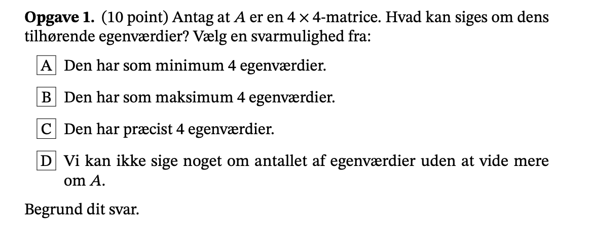
Se https://docs.google.com/document/d/1LkTNiCNe9K6cqIT2MUnpAIobzRl9a33rkOS6LqPHYoo/edit


## 2)

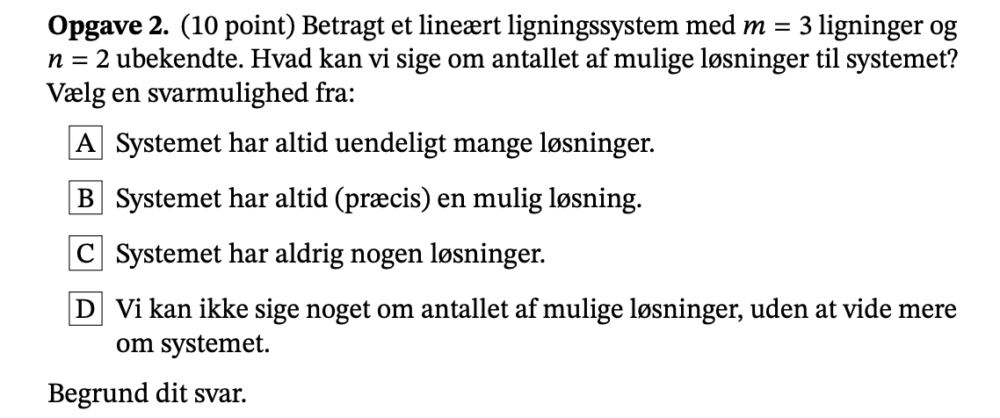
Ligningssystemet could be anything! :O 

Er der nogen som ved hvorfor? :)

Fra bemærkning 6.5 ved vi ihvertfald det ikke kan være A. Tilgengæld står der ikke noget i noterne om m = n eller  m>n så tænker derfor det er situationsbaseret i de tilfælde. Altså vi skal altså vide, hvordan systemet ser ud for at kunne bestemme hvor mange løsninger det har eller slet ikke har. Men ved sgu ikke helt om det er god nok matematisk forklaring.

Yderligere kan man se i figur 6.3 hvori der er et eksempel med 3 ligninger og 2 ubekendte, som viser at systemet er ‘inkonsistent’ og derfor kan vi ikke sige noget om antal løsninger


## 3)

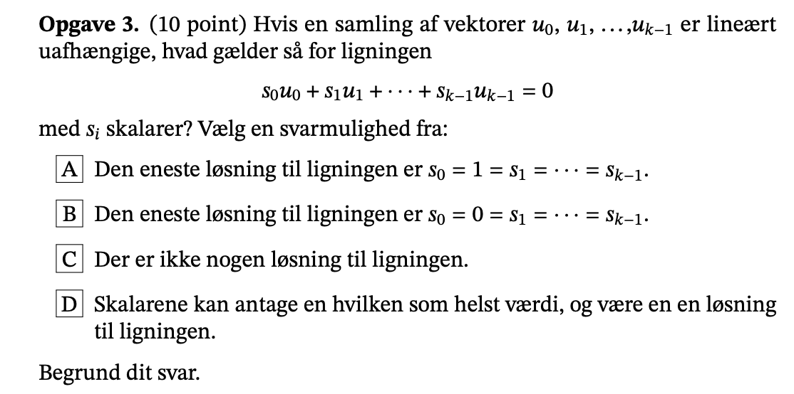
af 14.2 er svaret B.


## 4)

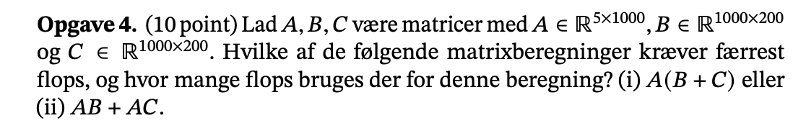
### flops tabel

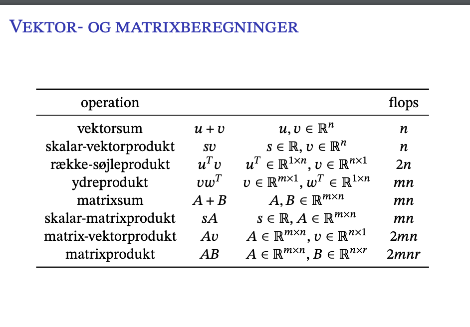
```{python}
# i)
# A(B´+ C)
(2 * 5 * 1000 * 200)
# ii)
(2* 5 * 1000 * 200) + (2 * 5 * 1000 * 200)
```

Nogenlunde rigtig

## 5)

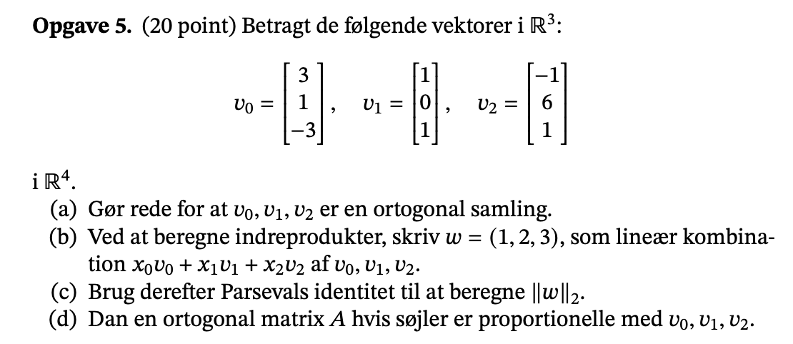

### a) ortogonal samling

```{python}
v0 = np.array([3.0,  1.0, -3.0])
v1 = np.array([1.0,  0.0,  1.0])
v2 = np.array([-1.0, 6.0,  1.0])

print(f'ortogonal {np.dot(v0,v1)}')
print(f'ortogonal {np.dot(v0,v2)}')
print(f'ortogonal {np.dot(v2,v1)}')
```

### b) indreprodukt og lineær kombination

brug proposition 8.17.

```{python}
w = np.array([1.0, 2.0, 3.0])
x0 = np.vdot(w, v0) / np.vdot(v0, v0)
x1 = np.vdot(w, v1) / np.vdot(v1, v1)
x2 = np.vdot(w, v2) / np.vdot(v2, v2)
print(f'Den lineær kombination: \n {x0}, {x1}, {x2}')
```

### c) Parsevals identitet


```{python}
v0 = np.array([3.0,  1.0, -3.0])[:, np.newaxis]
v1 = np.array([1.0,  0.0,  1.0])[:, np.newaxis]
v2 = np.array([-1.0, 6.0,  1.0])[:, np.newaxis]
V = np.hstack((v0, v1, v2))
w = np.array([1.0, 2.0, 3.0])[:, np.newaxis]
x = np.linalg.inv(V) @ w
print('det(V)=', np.linalg.det(V))
print('x= \n', x)
```

Ovenståender har vi løst ligning system.

Parcevals identitet siger at:

```{python}
norm_w = x[0] **2 * np.linalg.norm(v0) **2 + \
         x[1] **2 * np.linalg.norm(v1) **2 + \
         x[2] **2 * np.linalg.norm(v2) **2 
print('norm med parcevals identitet;', np.sqrt(norm_w[0]))         
print('norm med numpys identitet;', np.linalg.norm(w))         
```


### d) ortogonal matrix

```{python}
v0_norm = np.linalg.norm(v0)
v1_norm = np.linalg.norm(v1)
v2_norm = np.linalg.norm(v2)

V = np.hstack([v0 / v0_norm, \
               v1 / v1_norm, \
               v2 / v2_norm])
print(V, '\n')
```

## 6)

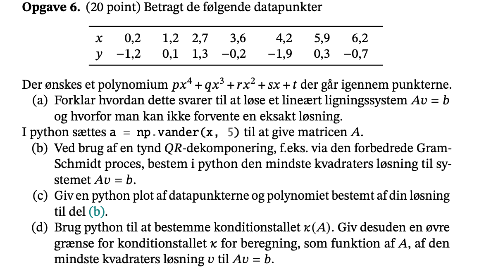

### a) lineært ligning system ikke eksakt løsning


### b) tynd QR forberede gram schmidt

```{python}
def gram_schmidt(a):
    k = a.shape[1]
    q = np.copy(a)
    r = np.zeros((k,k))
    for i in range(k):
        r[i, i] = np.linalg.norm(q[:, i])
        q[:, i] /= r[i,i]
        r[[i], i+1:] = q[:, [i]].T @ q[:, i+1:]
        q[:, i+1:] -= q[:, [i]] @ r[[i], i+1:]
    return q, r
  
x = np.array([0.2, 1.2, 2.7, 3.6, 4.2, 5.9, 6.2])
y = np.array([-1.2, 0.1, 1.3, -0.2, -1.9, 0.3, -0.7])
a = np.vander(x, 5)
q, r =  gram_schmidt(a)
c = q.T @ y[:, np.newaxis]
koe = np.linalg.solve(r, c)
koe
```

### c) plot data punkter

```{python}
xaxis = np.linspace(0, 6.5, 100)
fig, ax = plt.subplots()
ax.plot(x,y, 'bo') #atl ax.scatter(x,y)
ax.plot(xaxis, np.vander(xaxis, 5) @ koe, 'r');
plt.show()
```


### d) brug python til konditiontal grænser.

lingning 17.3

```{python}
u, s, vt = np.linalg.svd(a, full_matrices=False)

kappa_a = s[0] / s[-1]

lenPb = np.linalg.norm(a @ koe) 
lenb = np.linalg.norm(y)
cosT = lenPb/lenb
theta = np.arccos(cosT)

lenA = np.linalg.norm(a)
lenx = np.linalg.norm(koe)
lenAx = np.linalg.norm(a @ koe)
eta = lenA*lenx/lenAx

kappa_høj = kappa_a + (kappa_a**2 * abs(np.tan(theta))) / eta

print(f'Kappa \n: {kappa_a}')
print(f'kappa_høj \n: {kappa_høj}')
```

## 7)

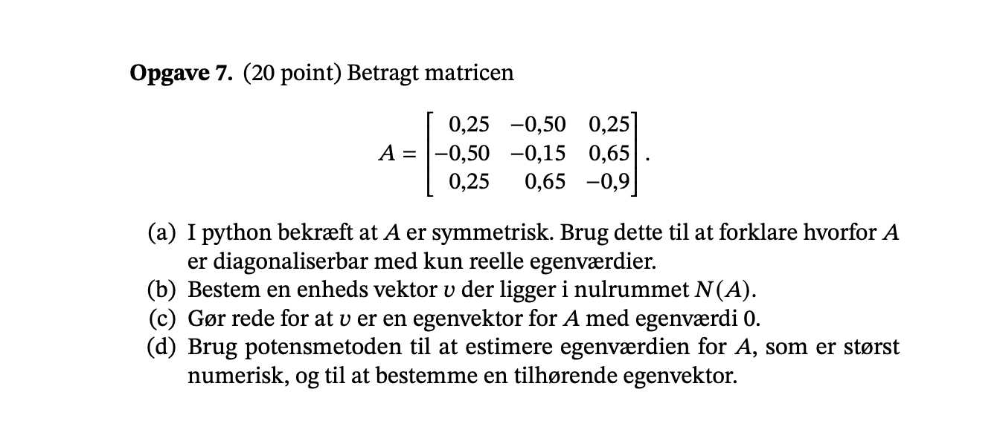

### a) A symmetisk, A diagonaliserbar

```{python}
A = np.array([[0.25, -0.50, 0.25],
              [-0.50, -0.15, 0.65],
              [0.25, 0.65, -0.9]])
print(A)
print(A.T)
```
Brug spektralsætning 

### b) enheds vektor v nulrum

Beregn echelon form

https://www.emathhelp.net/calculators/linear-algebra/reduced-row-echelon-form-rref-caclulator/?i=%5B%5B0.25%2C-0.50%2C0.25%5D%2C%5B-0.50%2C-0.15%2C0.65%5D%2C%5B0.25%2C0.65%2C-0.9%5D%5D&reduced=on

He får vi den til

$$
\begin{bmatrix}
1 & 0 & -1 \\
0 & 1 & -1 \\
0 & 0 &  0
\end{bmatrix}
$$
af oventåsen får vi lignignsystem Ax=0 er ævivalent med følgende system hvor x2 er fri.
Dermed er en general løsnig

$$
x =
x_2 \cdot
\begin{bmatrix}
1\\1\\1
\end{bmatrix}
$$

Denne vektor udgør således nulrummet af A. Denne normaliseres for at finde enhedsvektor

```{python}
x = np.array([1., 1., 1.])[:, np.newaxis]
x_norm = x / np.sqrt(3)
print(x_norm)
```


### c) v egenvektor egenværdi

### d) potensmetoden

```{python}
import numpy as np

rng = np.random.default_rng()
a = np.array([[0.25, -0.50, 0.25],
              [-0.50, -0.15, 0.65],
              [0.25, 0.65, -0.9]])

w = rng.standard_normal((a.shape[0], 1))
n = 30

lambda_out = np.empty(n)
for i in range(n):
  v = a @ w
  w = v / np.linalg.norm(v)
  lambda_out[i] = w.T @ (a @ w)
  
print(lambda_out)
```

```{python}
print(a @ w)

print(lambda_out[-1] * w)

print(np.allclose(a @ w, lambda_out[-1] * w,atol = np.finfo(float).eps))
```

