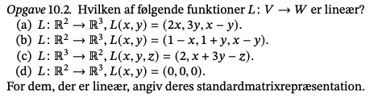
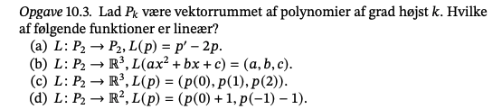
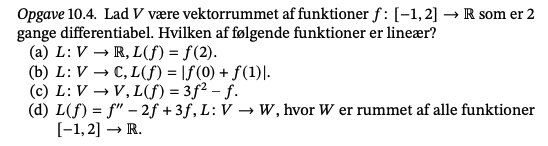
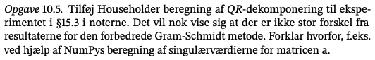
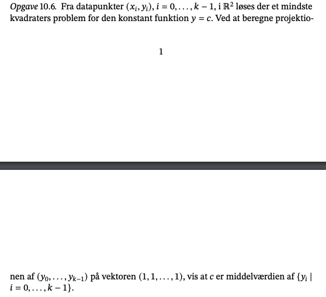
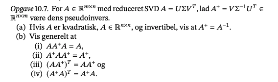

```{r setup, include=FALSE}
knitr::opts_chunk$set(echo = TRUE)
```

## 10.2



#### c)

## 10.3



a)  p' og 2p er lineære afbildninger, per proposition 18.16, er p' - 2p det også.

b)  

## 10.4



## 10.5



## 10.6



## 10.7



```{python}

```
