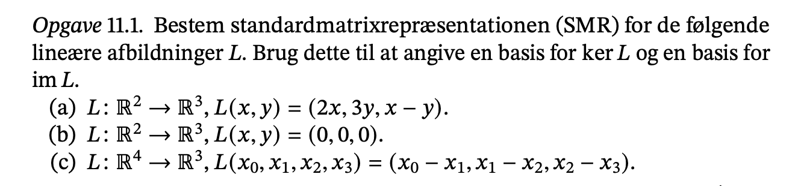
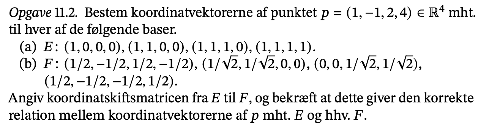
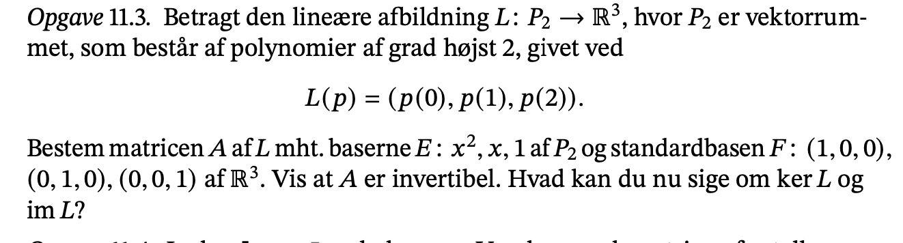
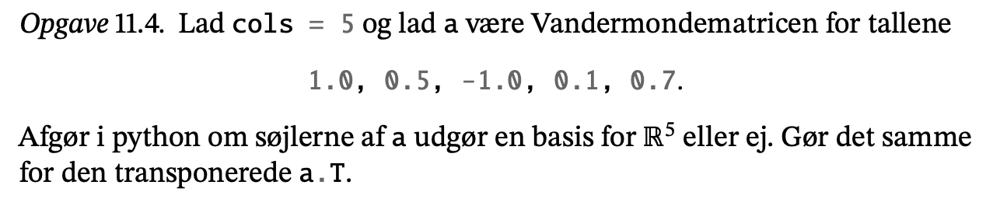
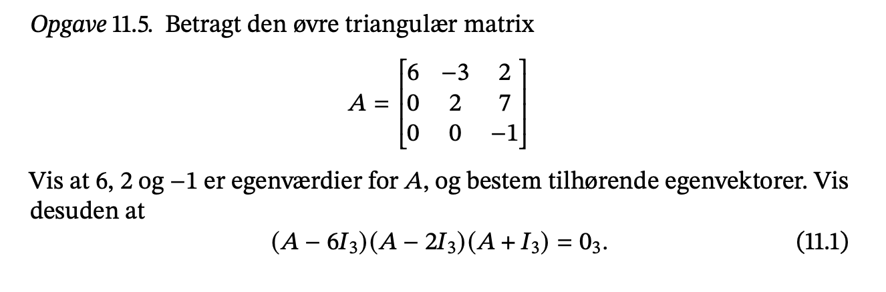
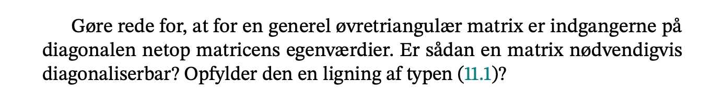

```{r setup, include=FALSE}
knitr::opts_chunk$set(echo = TRUE)
```



### 11.1

-   SMR?

-   Jeg anvender proposition 18.13

    -   18.13

-   samt eksempel 18.15

$$
u_0=L(e_0)=L(\begin{pmatrix} 1 \\ 0 \end{pmatrix}) = \begin{pmatrix} 2 \\ 0 \\ 1 \end{pmatrix}
$$

$$
u_1=L(e_1) = L(\begin{pmatrix} 0 \\ 1 \end{pmatrix}) = \begin{pmatrix} 0 \\ 3 \\ -1 \end{pmatrix}
$$

-   Vi får således **standard matrix repræsentationen**

$$
A=[u_0|u_1] = \begin{pmatrix} 2&0 \\ 0&3 \\ 1&-1 \end{pmatrix}
$$

-   Reducer til echelon form

$$
\begin{pmatrix} 2&0 \\ 0&3 \\ 1&-1 \end{pmatrix} \sim \begin{pmatrix} 1&0\\0&1\\0&0 \end{pmatrix}
$$

-   Der er pivotelementer i søjle 0 og 1 og dermed vil dens pivotsøjler være søjle 0 og 1.

$$
S(A)=\begin{pmatrix} 2&0 \\ 0&3 \\ 1&-1 \end{pmatrix} , \begin{pmatrix} 1&0\\0&1\\0&0 \end{pmatrix}
$$

-   Fra side 7 i notesæt 18 fås det at $ImL=S(A)$ .

-   Jeg vil se på nulrummet N(A) til A. Det består af alle løsninger til Ax=0.

-   Fra den reducerd EF af A har vi ligningsystemet:

$$
x=0\\y=0
$$

-   vi få så y=0 og x=0.

-   Nulvektoren (0,0) undspænder altså nulrummet for A.

-   I følge notesæt 18 side 7 vil ker=N(A) så en basis for N(A) vil vær een basis for ker L.

$$
ker \ L= Az=0=
\begin{bmatrix}
2 & 0 \\
0 & 3 \\
1 & -1 
\end{bmatrix} 
\begin{bmatrix}
x \\
y
\end{bmatrix} =
\begin{bmatrix}
0\\0\\0
\end{bmatrix}
\rightarrow
\begin{bmatrix}
x\\y
\end{bmatrix}
=
\begin{bmatrix}
0\\0
\end{bmatrix}
$$

-   løsningne kun når z =0 Der for er A lineær uafhængig.

-   dermed

$$
N(A)=ImL=(0,0)
$$

#### b)

-   Jeg anvender propositoin 18.13 samt eksempel 18.15

$$
u_0=L(e_0)=L(\begin{pmatrix} 1 \\ 0 \end{pmatrix}) = \begin{pmatrix} 0\\0\\0\end{pmatrix}
$$

$$u_1=L(e_1)=L(\begin{pmatrix} 0 \\ 1 \end{pmatrix}) = \begin{pmatrix} 0\\0\\0\end{pmatrix}
$$

$$
ker \ L= Az=0=
\begin{bmatrix}
0 & 0 \\
0 & 0 \\
0 & 0 
\end{bmatrix} 
\begin{bmatrix}
x \\
y
\end{bmatrix} =
\begin{bmatrix}
0\\0\\0
\end{bmatrix}
\rightarrow
\begin{bmatrix}
x\\y
\end{bmatrix}
=
\begin{bmatrix}
x\\y
\end{bmatrix}
$$

-   Billede mængden bliver er nulvektor.

$$
im \ L =S(A)=
\begin{bmatrix}
0\\0\\0
\end{bmatrix}
$$

vi får så SMR

$$
A=[u_0|u_1] = \begin{pmatrix} 0&0 \\ 0&0 \\ 0&0 \end{pmatrix}
$$

-   Billedemængden vil altså være (x,y)=(0,0) og nulrummet (kernen) er alle talpar (x,y) for $x,y\in R^2$ kernen vil altså være R2.

#### c)

$$
u_0=L(e_0)=L(\begin{pmatrix} 1 \\ 0\\0\\0 \end{pmatrix}) = \begin{pmatrix} 1\\0\\0\end{pmatrix}
$$

$$
u_1=L(e_1)=L(\begin{pmatrix} 0 \\ 1\\0\\0 \end{pmatrix}) = \begin{pmatrix} -1\\1\\0\end{pmatrix}
$$

$$
u_2=L(e_2)= L(\begin{pmatrix} 0\\ 0\\1\\0 \end{pmatrix}) = \begin{pmatrix} 0\\-1\\1\end{pmatrix}
$$

$$
u_3=L(e_3)= L(\begin{pmatrix} 0\\ 0\\0\\1 \end{pmatrix}) = \begin{pmatrix} 0\\0\\-1\end{pmatrix}
$$

-   Her får vi SMR

$$
A=[u_0|u_1|u_2|u_3] = \begin{pmatrix} 1&-1&0&0 \\ 0&1&-1&0 \\ 0&0&-1&-1 \end{pmatrix}
$$

-   dens kernemængde

$$
ker \ L= Az=0=
\begin{pmatrix} 1&-1&0&0 \\ 0&1&-1&0 \\ 0&0&1&-1 \end{pmatrix} 
\begin{bmatrix}
a \\
b \\
c\\
d
\end{bmatrix} =
\begin{bmatrix}
0\\0\\0\\0
\end{bmatrix}
\rightarrow
a=b=c=d
$$

-   Vi ser at løsninge til systemeter er når de er lig hinanden.

Hvor A a llerede er i echolon form.

-   dens pivotsøjler er søjle 0, 1 og 2. FOr enhver x er Ax lineær kombination af pivotsøjerler så

$$
\begin{pmatrix} 1\\0\\0 \end{pmatrix}, \begin{pmatrix} -1\\1\\0\end{pmatrix}, \begin{pmatrix} 0\\-1\\0\end{pmatrix}
$$

-   udspænder S(A) og dermed:

$$
S(A)=\begin{pmatrix} 1&-1&0\\0&1&-1\\0&0&1 \end{pmatrix}
$$

-   Her kan vi bruge side 7 fra 18 så vi får $ImL=S(A)$ så vil det også være en basis for im L så

$$
ImL = \begin{pmatrix} 1&-1&0\\0&1&-1\\0&0&1 \end{pmatrix}
$$

-   Jeg ønkser nu at kigge på nulrummet N(A) til A. Dette består af alle løsninger til Ax=0.

-   Fra den reducerede echelonform af A har vi et ligningsystem:

$$
x_0-x_1=0 \\
x_1-x_2 = 0 \\
x_3-x_2 = 0
$$

-   vi får så: $x_0=x_1=x_2=x_3$

-   dermed får vi vektoren som udspædener nulrummet for A:

$$
\begin{pmatrix} x_0 \\x_1 \\ x_2 \\ x_3 \end{pmatrix}, \begin{pmatrix} x_0\\x_0\\x_0\\x_0 \end{pmatrix} =x_0 \begin{pmatrix} 1\\1\\1\\1 \end{pmatrix}
$$

-   ifølge notesæt 18 side 7 vil $ker L = N(A)$ så være basis for N(A) dermed er følgende kerne som ovenstående skrevet.

#### ekstra

-   For at bestemme kernen og billedemængden starter vi med at reducerer A til echelonformen. S(A) er de søjler hvor der er et pivotelement.

    <div>

    S(A) er billedemængden

    </div>

-   Kollary 20.3 kernen er den vektor som ganget på giver 0 , **nulrummet**.



#### a)

-   jeg anvender definition **19.6** for at finde koordinatvektoreen.

-   E er vores base:

$$
\begin{pmatrix} 1\\0\\0\\0 \end{pmatrix}, 
\begin{pmatrix} 1\\1\\0\\0 \end{pmatrix},
\begin{pmatrix} 1\\1\\1\\0 \end{pmatrix},
\begin{pmatrix} 1\\1\\1\\1 \end{pmatrix}
$$

-   Vi kan så bestemme koordinatvektoren for p:

-   x_0

$$
\begin{pmatrix} 1\\0\\0\\0 \end{pmatrix}\begin{pmatrix} 1\\1\\0\\0 \end{pmatrix}x_2\begin{pmatrix} 1\\1\\1\\0 \end{pmatrix}x_3\begin{pmatrix} 1\\1\\1\\1 \end{pmatrix}=\begin{pmatrix} 1\\-1\\2\\4 \end{pmatrix}
$$jeg anvender eksempel 19.7

-   Dette svare til at løse det lineære lignignsystem:

$$
\begin{pmatrix} 1&1&1&1\\
0&1&1&1\\
0&0&1&1\\
0&0&0&1
 \end{pmatrix}
\cdot\begin{pmatrix} x_0\\x_1\\x_2\\x_3 \end{pmatrix}
=\begin{pmatrix} 1\\1\\1\\1 \end{pmatrix}
$$

```{python}
import numpy as np
```

```{python}
p = np.array([1,-1,2,4])[:, np.newaxis]
```

```{python}
a_e = np.array([
  [1,1,1,1],
  [0,1,1,1],
  [0,0,1,1],
  [0,0,0,1]
])
print(f'a_e: [ndarray(4,4)]: \n {a_e}')
```

-   Nu kan vi løse for den:

```{python}
p_e = np.linalg.solve(a_e, p)
print(f'Vores løsning \n {p_e}')
```

#### b)

```{python}
a_f = np.array([
  [ 1/2,  1/np.sqrt(2), 0,  1/2],
  [-1/2,  1/np.sqrt(2), 0, -1/2],
  [ 1/2,  0,1/np.sqrt(2),  -1/2],
  [-1/2, 0, 1/np.sqrt(2), 1/2]
])
p_f = np.linalg.solve(a_f, p)
print(f'Løsning \n {p_f}')
```

-   VI skal have **koordinat skifte**.

```{python}
# den inverse formel 19.2
a_f_i = np.linalg.inv(a_f)

print(f'a_f: [ndarray: (4,4)] \n {a_f_i}')
```

```{python}
e_til_f = a_f_i @ a_e
print(f'printer e_til_f: [ndarray(4,4] \ {e_til_f}')
```

-   Regn koordinatvektor for P givet du har fundet x = koordinatvektor for P i E. Kan gange sammen.

```{python}
print(f'printer {e_til_f @ p_e}')
```



-   Jeg anvender eksempel 20.2 notesæt 20. Matricen A af L mht baservil E vil være:

$$
a_0=[L(x^2)]_F=[(0,1,4)]=
\begin{pmatrix} (0,1,4) & 
\begin{pmatrix} 1 \\ 0 \\ 0\end{pmatrix} \\
(0,1,4) & 
\begin{pmatrix} 0 \\ 1 \\ 0\end{pmatrix} \\
(0,1,4) & 
\begin{pmatrix} 0 \\ 0 \\ 1\end{pmatrix}
\end{pmatrix}
= \begin{pmatrix} 0 \\ 1 \\ 4\end{pmatrix}
$$

$$
a_1=[L(x)]_F=[(0,1,2)]=
\begin{pmatrix} (0,1,2) & 
\begin{pmatrix} 1 \\ 0 \\ 0\end{pmatrix} \\
(0,1,2) & 
\begin{pmatrix} 0 \\ 1 \\ 0\end{pmatrix} \\
(0,1,2) & 
\begin{pmatrix} 0 \\ 0 \\ 1\end{pmatrix}
\end{pmatrix}
= \begin{pmatrix} 0 \\ 1 \\ 2\end{pmatrix}
$$

$$
a_2=[L(1)]_F=[(1,1,1)]=
\begin{pmatrix} (1,1,1) & 
\begin{pmatrix} 1 \\ 1 \\ 1\end{pmatrix} \\
(1,1,1) & 
\begin{pmatrix} 0 \\ 1 \\ 0\end{pmatrix} \\
(1,1,1) & 
\begin{pmatrix} 0 \\ 0 \\ 1\end{pmatrix}
\end{pmatrix}
= \begin{pmatrix} 1 \\ 1 \\ 1\end{pmatrix}
$$

-   vi får så:

$$
A=[a_0|a_1|a_2]=\begin{pmatrix}
0&0&1 \\
1&1&1 \\
4&2&1
 \end{pmatrix}
$$

```{python}
A = np.array([
  [0,0,1],
  [1,1,1],
  [4,2,1]
])
A_inv = np.linalg.inv(A)
print(f'den inverse af A \n {A_inv}')
```

-   Da A er invertibel vil nulrummet være nulvektoren - demed vil keren være nulvektoren ifølge kollary 20.3

-   For at vise A er invertible skal vi reducer til rchelor form.

-   nulrummet er det som opfylder Ax=0

-   det gælder at for en invetibel matri A vil det kun være nulvektoen som opfydler dette dermed vil

$$
ker L=N(A)=(0,0,0)
$$

-   Da A er invetibel vil den reduceren ecelonform være identitetsmatricen altså være span(A) af søjlerne med pivotelementer i udgør søjle rummet altså billedrummet dermed vil

$$
ImL=S(A)=SPAN(
\begin{pmatrix}0\\1\\4 \end{pmatrix},
\begin{pmatrix}0\\1\\2 \end{pmatrix},
\begin{pmatrix}1\\1\\1 \end{pmatrix}
= \begin{pmatrix}
0&0&1\\
1&1&1 \\
4&2&1
 \end{pmatrix}
$$

-   en kvadratisk matrix er invertibel hvis søjlerne er uafhængige gælder begge veje.

{width="756"}

```{python}
x = np.array([1.0, 0.5, -1.0, 0.1, 0.7])
v = np.vander(x, 5)
v_i = np.linalg.inv(v)
print(np.allclose(v @ v_i, np.eye(5)))
```

```{python}
vt = v.T
vt_i = np.linalg.inv(vt)
print(np.allclose(vt @ vt_i, np.eye(5)))
```





-   vi de er egenværdier

-   Brug definition 21.1, hvor det er en egenværdi hvis $Av=\lambda v$

$$
\lambda =6\\
\begin{bmatrix}
6&-3&2\\
0&2&7\\
0&0&-1
\end{bmatrix}
\begin{bmatrix}
v_1\\v_2\\v_3
\end{bmatrix} 
=
b
\begin{bmatrix}
v_1\\v_2\\v_3
\end{bmatrix}\\
6v_1-3v_2+2v_3=6v_1\\
2v_2+7v_3=6v_2\\
1v_3=6v_3
$$

-   6 er en egenværdi da ovenståend fra 21.1 er opfyldt og således er

$$
v=
\begin{bmatrix}
1\\0\\0
\end{bmatrix}
$$

-   en anden vektor.

#### b)
