```{r setup, include=FALSE}
knitr::opts_chunk$set(echo = TRUE)
```

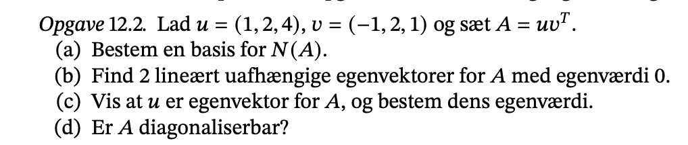

### a)

Tager A

```{python}
import numpy as np

u = np.array([1,2,4])[:, np.newaxis]
v = np.array([-1,2,1])[:, np.newaxis]

A = u @ v.transpose()
print(f'Vores A matric \n: {A}')
```

Når vi skal bestemme basen så reduceres den til echelor form.

```{python}
A_reduced = np.array([
  [-1, 2, 1],
  [0,0,0],
  [0,0,0]
])
print(f'Vores A matric \n: {A_reduced}')
```

-   her får vi N(A) er søjle 2 og 3.


```{python}
V = np.array([[2,1,0], [1,0,1], [1,2,4]]).T
L = np.diag([0,0,4])
print( V @ L@ np.linalg.inv(V) * (7/4) )
```

Man kan ogå bruge 21.6 der siger at hvis vi har en basis af egenvektor, så ve vi den er diagonalisber bar. 

check om det passer.

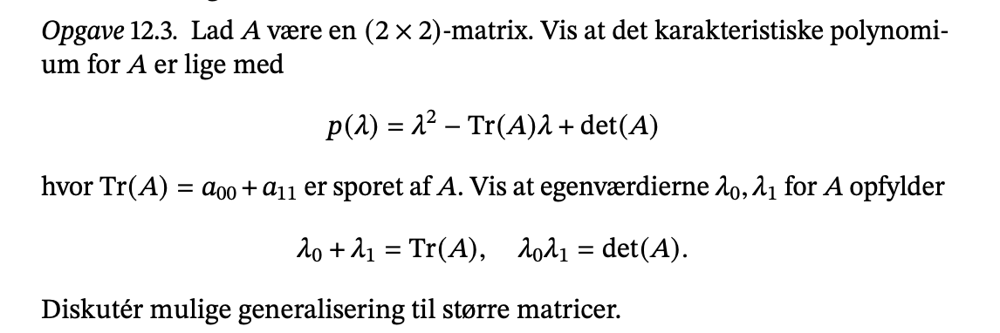

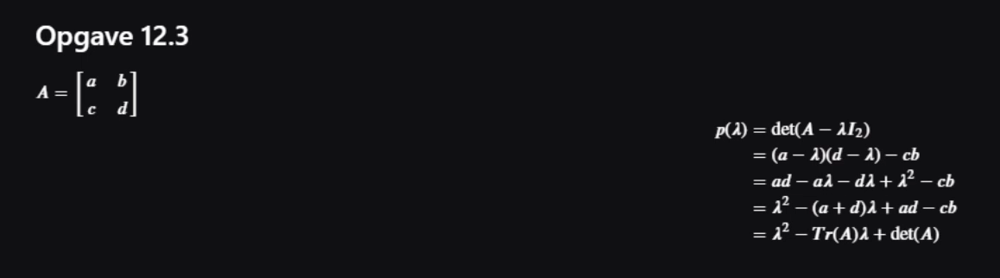

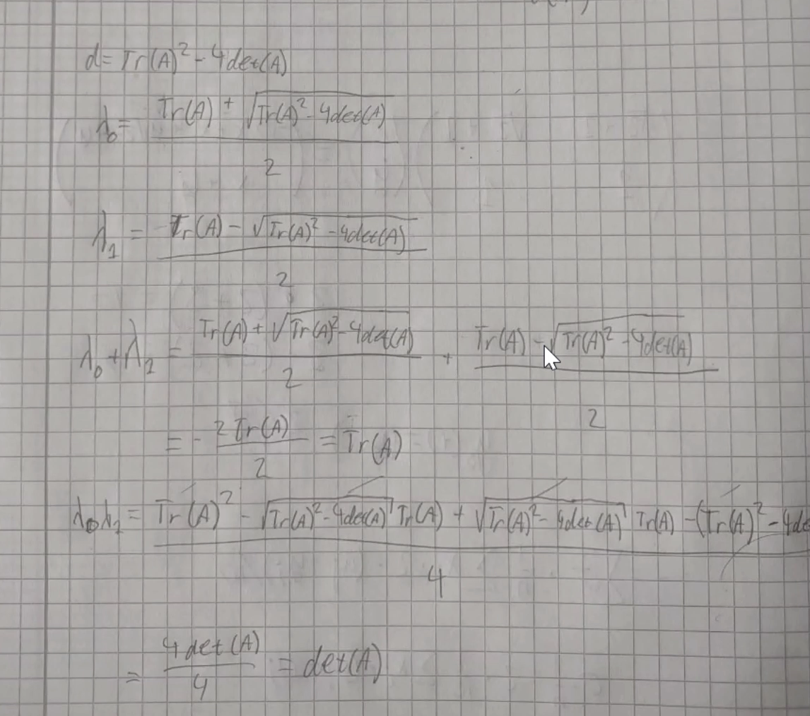

Genealisering er at trace (Tr) er summen af egenværværider hvor vi ganger med multipliciteten (altså antal gange de optræder i det karakteristik polynomium). Det samme gælder for determinanten som er produktet af egenværider.

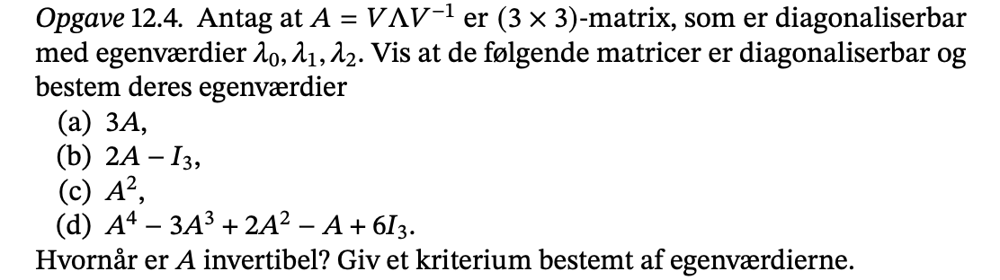

- Der står $V \Lambda V^{-1}$ betyder også den er diagonaliserbar. 

### a)

Her skaler vi matricen med 3

Husk at med en skalar, så må vi gange rundt med den som vi har lyst. V og V¨-1 er det samme som før Lambda er en diagonal matrix med tre lambda.  Derfor bliver egenværdier bare 3 ganget.

### b) 

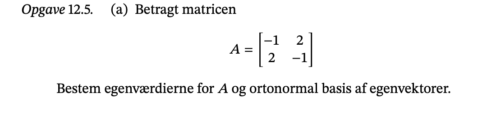

### a), karakteristik pol, egenvordi og egenvektor

```{python}
A = np.array([
  [-1., 2.],
  [2., -1.]
])
```


#### egienvalues

https://www.emathhelp.net/calculators/linear-algebra/eigenvalue-and-eigenvector-calculator/?i=%5B%5B-1%2C2%5D%2C%5B2%2C-1%5D%5D

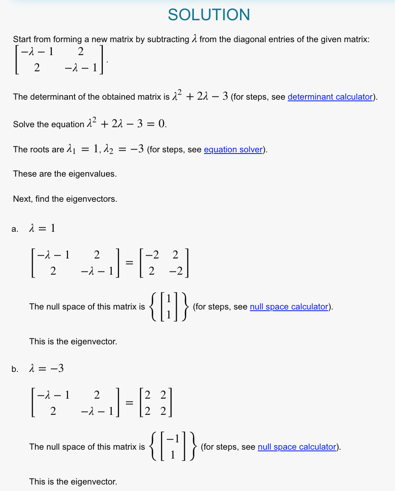

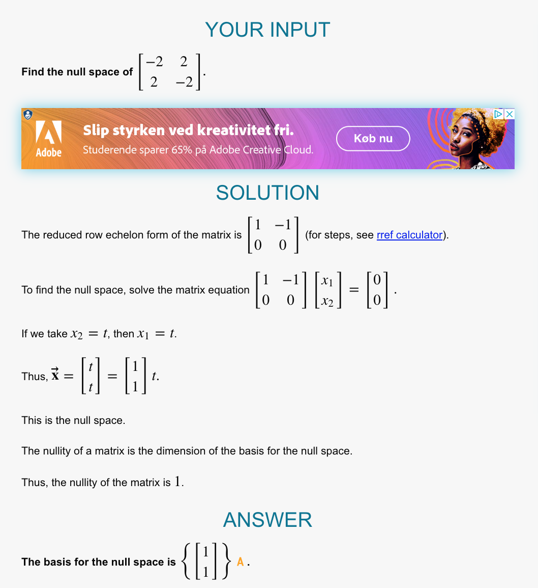

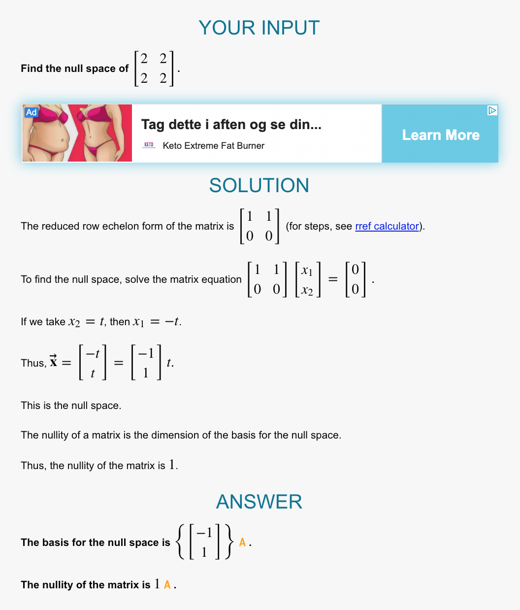
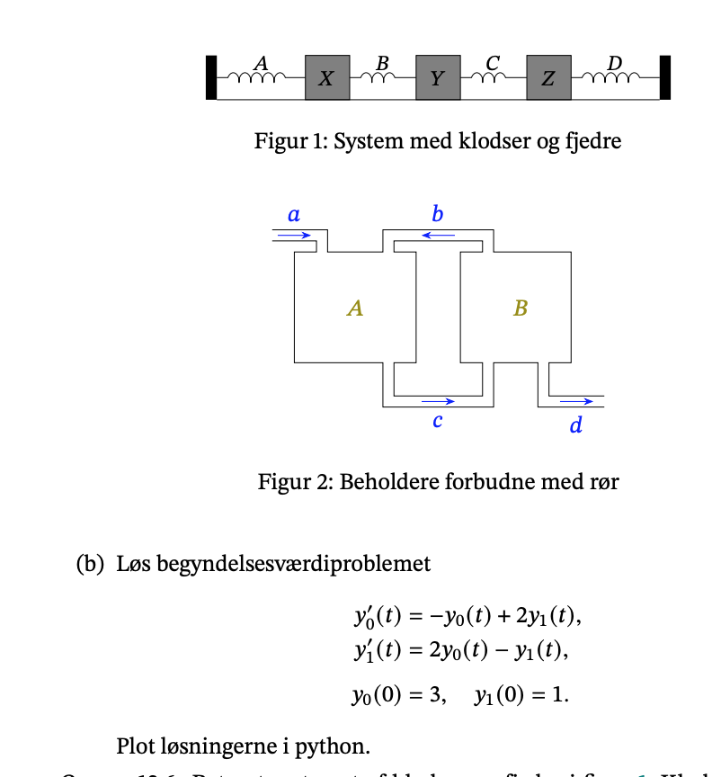

Nu skal vi sige noget om den er en ortognormal basis. 

Her skal vi se på lektion 9 og om Gram matricen og lemma 9.8

G=V.tV=I
så er det en ortonormal samling. 

Hvis vi regner vores ud får vi 2 i diagonalen, så er den en ortogonal samling men ikke ortonormal. Dog må eigenvector skaleres som vi vil, så vi kan gange med en skalar 1/2 og dermed får vi identitetmatricen og den er en ortonormal samling.


### b) begyndelsesværdiproblemet

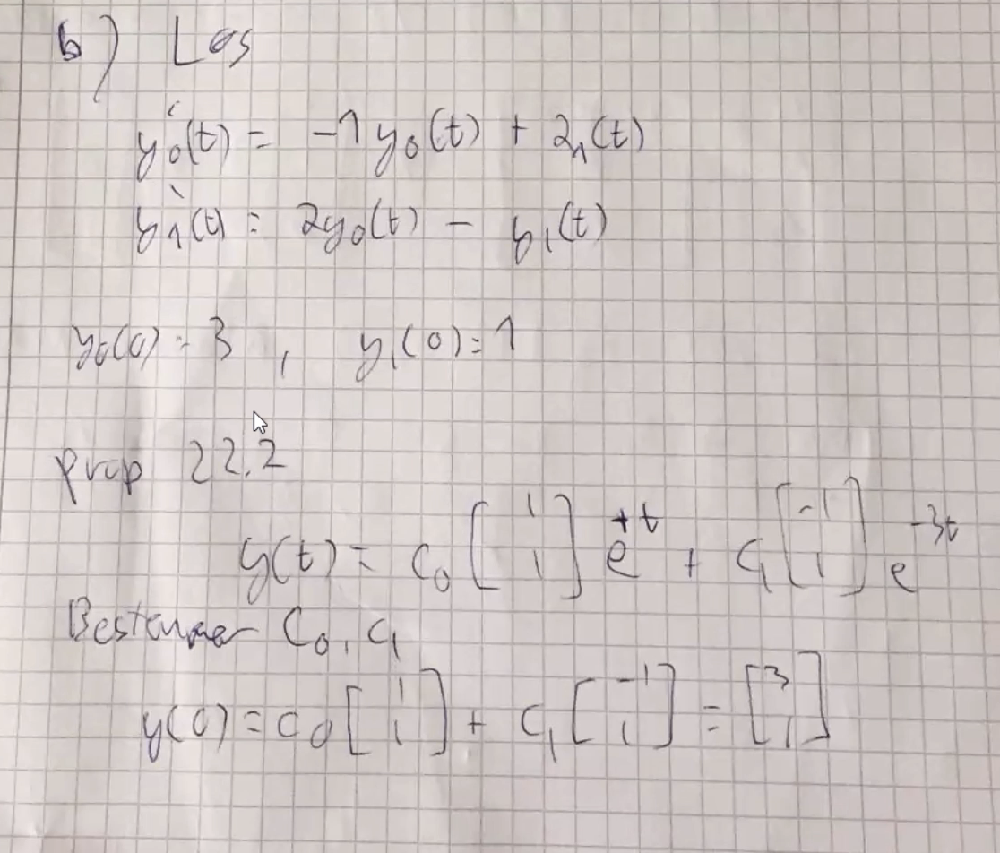

Man er garanteret en løsning når man får giver begyndelsesværdier. 

nu skal det plottes

```{python}
import matplotlib.pyplot as plt

a = np.array([
  [1, 1],
  [1, -1]
])

b = np.array([
  [3.],
  [1.]
])

c0, c1 = np.linalg.solve(a, b)

v0 = np.array([1, 1])[:, np.newaxis]
v1 = np.array([-1, 1])[:, np.newaxis] 
lamb1 = 1
lamb2 = -3

t = np.linspace(0, 100, 100)

y_0 = (c0 * v[0][0] * np.exp(t * lamb1) + c1 * v1[0][0] * np.exp(t * lamb2))
y_1 = (c0 * v[0][0] * np.exp(t * lamb1) + c1 * v1[1][0] * np.exp(t * lamb2))

y0y1 = y_0 + y_1

fig, ax = plt.subplots()
ax.plot(t, y_0, marker = 'o')
ax.plot(t, y_1, marker = 'o', markersize = 4, alpha = 0.5)
plt.show()
```


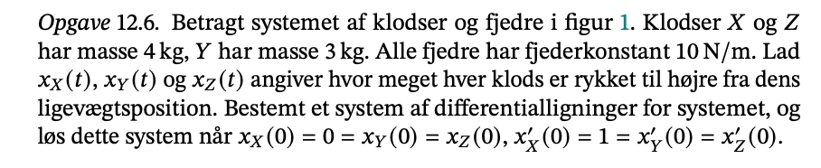

