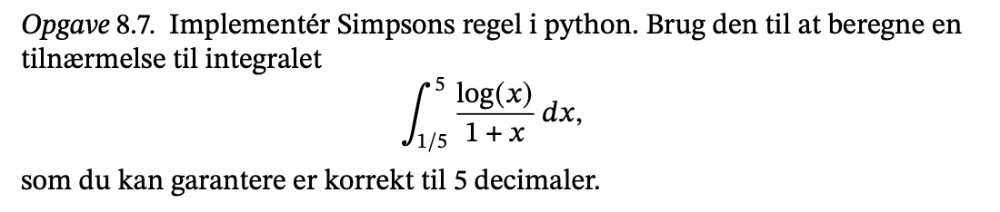

```{r setup, include=FALSE}
knitr::opts_chunk$set(echo = TRUE)
```


## 8.2

#### a)

Det indre produkt kan beregnes som:

$$
7\cdot 1\cdot(-1)+2\cdot (-1) \cdot (-2) + 3 \cdot 1 \cdot 1=0
$$

Altså er u og v ortogonal for dette indre produkt.

#### b)

Brug:

$$
Pr_v(u)=\frac{\langle u, v \rangle}{||v||_2^2}v
$$

```{python}
import numpy as np
```

```{python}
def indreProd(u, v):
  return 7 * u[0] * v[0] + 2 * u[1] * v[1] + 3 * u[2] * v[2]

def projektionLangs(v, u):
  ip = indreProd(u, v)
  norm =  indreProd(v, v)   
  return (ip / norm) * v

u = np.array([1., -1., 1.])[:, np.newaxis]
v = np.array([-1., -2., 1.])[:, np.newaxis]
w = np.array([1., 0., 0.])[:, np.newaxis]

proj_w = projektionLangs(u,w)
print("Projektion langs u",proj_w)  

proj_v = projektionLangs(v,w)
print("Projektion langs v",proj_w)
```

#### c)

A skal sørge for transformationen af det indre produkt - da $x^Ty=\langle x, t \rangle \text{ som singulær værid, } \Sigma$

$$
x^T\begin{pmatrix}
7&0&0\\
0&2&0\\
0&0&3
 \end{pmatrix} y = \begin{pmatrix} x_0 & x_1&x_2 \end{pmatrix}
\begin{pmatrix}   
7y_0+0+0\\0+2y_1+0\\0+0+3y_3
\end{pmatrix} =7x_0y_0+2x_1y_1+3x_2y_2
$$ Når frem til en Sigma matrice hvor vi langs diagonalen har vores transformation.

Det kan checkes:

```{python}
A = np.array([
  [7., 0., 0.],
  [0., 2., 0.],
  [0., 0., 3.]])
  
print(u.T @ A @ v)
```


## 8.3

```{python}
def switch(A, i, j):
  A[[i, j], :] = A[[j, i], :]
  
def scale(A, i, s):
  A[i, :] *= s
  
def increase(A, i, j, s):
  A[i, :] += A[j, :] * s
```

#### a)

```{python}
a1 = np.array([1., 0., 0.])[:, np.newaxis]
a2 = np.array([1.,1., 0.])[:, np.newaxis]
a3 = np.array([1., 1., 1.])[:, np.newaxis]
A  = np.hstack([a1, a2, a3])

print("Er på echelon form og dermed lineær uafhængig \n", A)
```

#### b)

```{python}
b1 = np.array([1., 1., 0.])[:, np.newaxis]
b2 = np.array([1., 0., 1.])[:, np.newaxis]
b3 = np.array([0., 1., 1.])[:, np.newaxis]
B  = np.hstack([b1, b2, b3])

print("B matricen: \n", B)
switch(B, 0, 1)
increase(B, 1, 0, -1)
increase(B, 2, 1, -1)
scale(B, 2, 1/2)
print("B på echelor form og dermed lineær uafhængig: \n", B)
```

Tager tre række operationer.

#### c)

```{python}
c1 = np.array([1., -1., 0.])[:, np.newaxis]
c2 = np.array([-1., 0., 1.])[:, np.newaxis]
c3 = np.array([0., 1., -1.])[:, np.newaxis]
C  = np.hstack([c1, c2, c3])

print("B matricen: \n", C)
increase(C, 1, 0, 1)
switch(C, 1, 2)
increase(C, 2, 1, 1)
print("C har ikke pivot og dermed ikke lineær uafhængig: \n", C)
```

#### d)

```{python}
d1 = np.array([1., 1.j, 1. + 1.j])[:, np.newaxis]
d2 = np.array([1.j, 1. -1.j , 1.])[:, np.newaxis]
d3 = np.array([-1. + 1.j, 1., 1.j])[:, np.newaxis]
D  = np.hstack([d1, d2, d3])

print("D matricen: \n", D)
increase(D, 2, 1, -1)
scale(D, 1, -1.j)
increase(D, 1, 0, -1)
increase(D, 2, 0, -1)
scale(D, 1, -1)
print("D mangler pivot i mindst en søjle og dermed ikke lineær uafhængig: \n", D)
```

Får en nul række igen.


## 8.4

#### a)

Alternativ med python

```{python}
def f_norm(a):
  temp = []
  for i in range(len(a)):
    for j in range(len(a)):
      if a[i][j] != 0:
        temp.append(a[i][j])
  L = [x**2 for x in temp]
  return np.sqrt(sum(L))

A = np.array([[6.0, 0.],
              [0.,-3.]])
B = np.array([[1., 2.],
              [-1.,-2.]])
              
Af = f_norm(A)
Bf = f_norm(B)
print(f'af: {Af}, \n Bf: {Bf}')
```

indre produkt

$$
\langle A,B \rangle =\langle (a_{ij}),(b_{ij})\rangle=\sqrt{\sum \sum (a_{ij})^2}
$$

Også i python

```{python}
def inner_produkt(a,b):
  temp = []
  for i in range(len(a)):
    for j in range(len(a)): 
      product = a[i][j] * b[i][j]
      if product != 0:
        temp.append(product)
  return sum(temp)

print(f'Inner product: {inner_produkt(A,B)}') 
print(f'Cauchy Schwart uligheden {inner_produkt(A,B) <= Af * Bf}, da {inner_produkt(A,B)} <= {Af * Bf}')
```

fro-ben-i-us, bestemmes med formlen

$$
\begin{align*}
||A||_F &=\sqrt{\sum^M_{i=1} \sum^n_{j=1}(a_{ij}^2) } \\
&=\sqrt{6^2+3^2}\\
&=\sqrt{36 + 9}\\
&=\sqrt{45}
\end{align*}
$$

$$
\begin{align*}
||B||_F &=\sqrt{1^2+2^2+(-1)^2+(-2)^2} \\
&=\sqrt{1+4+1+4}\\
&=\sqrt{10}
\end{align*}
$$

Det indre produkt:

$$
\begin{align*}
\langle A, B\rangle &= \sum^M_{i=1} \sum^n_{j=1}a_{ij}b_{ij}\\
&= 6 \cdot1+0+0-3\cdot(-2)\\
&=6+6\\
&=12 
\end{align*}
$$

Cauchy Schwarz:

$$
|\langle u, v \rangle | \le ||u||_2||v||_2 \text{ gælder da } 12\le \sqrt{45} \cdot \sqrt{10} 
$$

Vinklen:

$$
\begin{align*}
cos(\theta) &= \frac{\langle u, v \rangle}{||u||_2||v||_2} \\
&= \frac{12}{\sqrt{45} \cdot \sqrt{10}}\\
&= arccos(0.5656)\\
&= 0.96 \\
& = 0.55 \text{ i grader}
\end{align*}
$$

#### b)

Den største singulær værdi, $\sigma_0$ , af singulærværdidekomponeringen af A er givet ved 2-normen af A, per lemma 11.6.

```{python}
A4 = np.array([[6., 0.], [0., -3.]])
B4 = np.array([[1., 2.], [-1., -2.]]) 

ua, sa, vta = np.linalg.svd(A4)
ub, sb, vtb = np.linalg.svd(B4)

print("2-normen af A: \n", str(sa[0]))
print("2-normen af B: \n", str(sb[0]))
```

-   Den størse sigma værdi skal være lig a 2 normen. 6 og får 3 det samme som f normen som ikke må ære ens, men bare nogelunde lige.

Alternativ:

```{python}
A_f = np.linalg.norm(A4, ord = 'fro')
A_2 = np.linalg.norm(A4, ord = 2)
B_f = np.linalg.norm(B4, ord = 'fro')
B_2 = np.linalg.norm(B4, ord = 2)

inner = np.inner(A4.flatten(), B4.flatten())

print("A_F =", A_f)
print("B_F =", B_f)
print("<A,B>", inner)
# laver flatten laver lange vektor. 
print("CS: <A,B> = {} < {} = A_f*B_f".format(inner,A_f*B_f))
print("A_2 =", A_2)
print("B_2 =", B_2)
```

Se kode fra Ditte.


## 8.5

#### a)

Skal udelukke den sidste værdi

```{python}
x = np.array([-2.0, -1.0, 0.0, 1.0, 2.0]) # angies i tekseten
h = 1 #  b - a delt med antal elementer
f_x = 1.0 / (1.0 + x**2)

a = h * np.sum(f_x[:-1]) # gøres for alle indgange på nær den sidste 
print("a = ", a)
```

#### b)

skal udelukke den første værdi

```{python}
b = h * np.sum(f_x[1:]) # gøres for alle indgange på nær den sidste 
print("b = ", b)
```

#### c)

Simon bruger en formel

```{python}
c = np.trapz(f_x, dx = h) # gøres for alle indgange på nær den sidste 
print("c = ", c)
```

#### d)

for hver anden ganger vi med 4, 2 og det

```{python}
# simps formel.
d = 1/3 * h * (f_x[0] + 4 * f_x[1] + 2* f_x[2] + 4 * f_x[3] + f_x[4])
print(d)
```

Ved at lave integralet får man r = 2.2142

```{python}
r = 2.2142
fejl_relativ = (r- a) / r # relativ fejl
fejl_abs = (r- a)
print("relativ",fejl_relativ)
print("abs", fejl_abs)
```

{width="417"}


```{python}
def klassisk_gram_schmidt(a):
  n, k = a.shape
  q = np.empty((n, k))
  r = np.zeros((k, k))
  for j in range(k):
    r[:j, [j]] = q[:, :j].T @ a[:, [j]]
    w = a[:, [j]] - q[:, :j] @ r[:j, [j]]
    r[j, j] = np.linalg.norm(w)
    q[:, [j]] = w / r[j, j]
  return q, r

def forbedret_gram_schmidt(a):
  _, k = a.shape
  q = np.copy(a)
  r = np.zeros((k, k))
  for i in range(k):
    r[i, i] = np.linalg.norm(q[:, i])
    q[:, i] /= r[i,i]
    r[[i], i+1:] = q[:, [i]].T @ q[:, i+1:]
    q[:, i+1:] -= q[:, [i]] @ r[[i], i+1:]
  return q, r

def qr_simon(A):
  k, n = A.shape
  R = np.zeros((n, n))
  Q = np.zeros((n, n))
  for j in range(0, k):
    wj = A[:, j]
    for i in range(0, j):
      R[i, j] = np.vdot(A[:, j], Q[:, i])
      wj = wj - R[i, j]*Q[:, i]
    rjj = np.linalg.norm(wj)
    Q[:, j] = wj * 1/rjj
    R[j, j] = rjj
  return np.round(Q,2), np.round(R, 2)
```

## 8.6

#### a)

```{python}
a = np.array([[2, 0], [0, 1]])
q1, r1 = klassisk_gram_schmidt(a)
print(q1)
print(r1)
q_simon, r_simon = qr_simon(a)
print(f'Ser på simons version \n{q_simon} \n og r: \n {r_simon}')
```

Får det samme ud, vi kan se qr er en ortonormal samling da vi får identitetsmtri

#### b)

```{python}
b = np.array([[2, 1], [0, 3]])
q2, r2 = klassisk_gram_schmidt(b)
print(q2)
print(r2)
```

#### c)

r er øvre triangulær, alt under diagonal skal være nul ikke opfyldt her

```{python}
import numpy as np
c = np.array([[1, 0, 1], [0, 1, 1], [1, 1, 0]])
#c = np.array([[1, 1, 3], [1, -2, 1], [1, 1, 1]])
q3, r3 = klassisk_gram_schmidt(c)
print(q3)
print(r3)
print(q3.T @ q3) # ligner identitetsmatricen
```

Nu skal vi endelig bruge gs. Ikke kvadratisk.

#### d)

```{python}
d = np.array([[-1, 0, 1], [0, 1, -1], [1, -1, 0]])
q4, r4 = klassisk_gram_schmidt(d)
print(q4) # ikke ortonormal samling. 
print(r4)
print( q4.T @ q4) # ikke nær nul. 
q_simon, r_simon = qr_simon(d)
print(f'Ser på simons version \n{q_simon} \n og r: \n {r_simon}')
```

```{python}
d = np.array([[-1, 0, 1], [0, 1, -1], [1, -1, 0]])
q4, r4 = klassisk_gram_schmidt(d)
print(q4) # ikke ortonormal samling. 
print(r4)
print( q4.T @ q4) # ikke nær nul. 
q_simon, r_simon = qr_simon(d)
print(f'Ser på simons version \n{q_simon} \n og r: \n {r_simon}')
```

qr decomponering kan vi afgøre om vi har en linær uafhængighed.

gs giver ikke menign når vi ikke får q er en ortonomal samling. Derfor er den numerisk ukorrekt. Beskotnig er høj.

INput til gs skal være lineær uafhængig.



## 8.7

```{python}
def simpson(f, xs, h):
  result = h / 3.0
  sum = f(xs[0])
  for i in range(1, len(xs) -1):
    if i % 2 == 0:
      sum += 2*f(xs[i])
    else:
      sum += 4*f(xs[i])
  sum += f(xs[len(x) - 1])
  return result * sum

def simpson_simon(f, a, b, n):
  h = (b-a) / (n-1)
  l = enumerate(np.linspace(a, b, n)[1:-1]) # 1 til -1 så vi ikke får den første med.
  middle = sum([4*f(v) if (k % 2 == 0) else 2*f(v) for (k, v) in l])
  return (h/3) * (f(a) + middle + f(b))

def g(x):
  return np.log(x)/(1+x)

y, s = np.linspace(1/5, 5, 100, retstep = True)
y2, s2 = np.linspace(1/5, 5, 10000, retstep = True)  
print(simpson(g, y, s))
print(simpson(g, y2, s2))
print(simpson(lambda x: np.log(x)/(1+x), y, s))

print("Integral of function: ", simpson_simon(lambda x: np.log(x)/(1 + x), 1/5, 5, 251))
```

```{python}
def simpson(f, xs, h):
  result = h / 3.0
  sum = f(xs[0])
  for i in range(1, len(xs) -1):
    if i % 2 == 0:
      sum += 2*f(xs[i])
    else:
      sum += 4*f(xs[i])
  sum += f(xs[len(x) - 1])
  return result * sum

def simpson_simon(f, a, b, n):
  h = (b-a) / (n-1)
  l = enumerate(np.linspace(a, b, n)[1:-1]) # 1 til -1 så vi ikke får den første med.
  middle = sum([4*f(v) if (k % 2 == 0) else 2*f(v) for (k, v) in l])
  return (h/3) * (f(a) + middle + f(b))

def g(x):
  return np.log(x)/(1+x)

y, s = np.linspace(1/5, 5, 100, retstep = True)
y2, s2 = np.linspace(1/5, 5, 10000, retstep = True)  
print(simpson(g, y, s))
print(simpson(g, y2, s2))
print(simpson(lambda x: np.log(x)/(1+x), y, s))

print("Integral of function: ", simpson_simon(lambda x: np.log(x)/(1 + x), 1/5, 5, 251))
```

jo flere små andengrad jeg deler op desto mere prævis, så de 5 decimaler skal ikke flytte sig for meget.

her kan man lave et loop som iterer over mange små 2 grads polynomier så vi får at væriden ikke ændre sig.

```{r}
x <- cbind(c(1,1,1),c(1,-2,1), c(3, 1, 1))
x

```

```{python}
x1 = np.array([1, 0, 2, -1])[:, np.newaxis]
x2 = np.array([-1, 1, 0, 1])[:, np.newaxis]
x3 = np.array([2, 0, 0, -2])[:, np.newaxis]
X = np.hstack([x1, x2, x3])

q5, r5 = klassisk_gram_schmidt(X)
print(q5)
print(r5)
print(q5.T @ q5)
```
