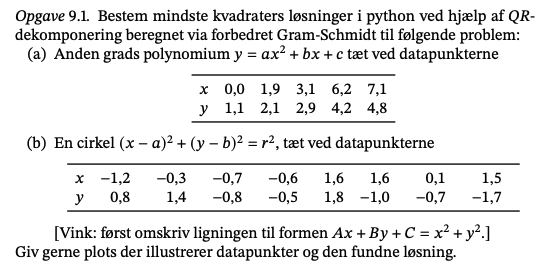
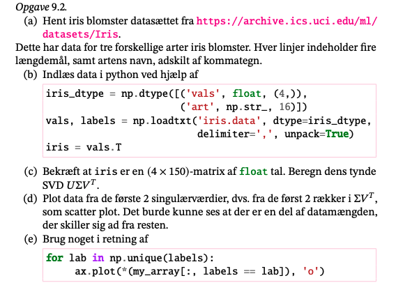
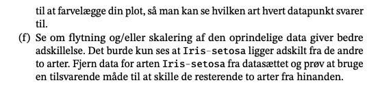
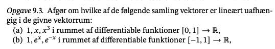
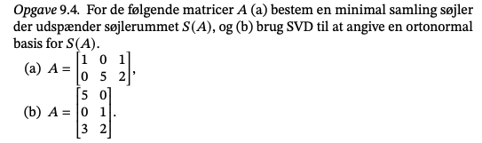
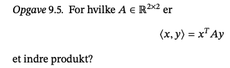

```{r setup, include=FALSE}
knitr::opts_chunk$set(echo = TRUE)
```



### 9.1

```{python}
import numpy as np
def forbedret_gram_schmidt(a):
  _, k = a.shape
  q = np.copy(a)
  r = np.zeros((k, k))
  for i in range(k):
    r[i, i] = np.linalg.norm(q[:, i])
    q[:, i] /= r[i,i]
    r[[i], i+1:] = q[:, [i]].T @ q[:, i+1:]
    q[:, i+1:] -= q[:, [i]] @ r[[i], i+1:]
  return q, r

x = np.array([0.0, 1.9, 3.1, 6.2, 7.1])
y = np.array([1.1, 2.1, 2.9, 4.2, 4.8])
cols = 3
a = np.vander(x, cols)
print(f'værdien af a: \n{a}')
```

#### a) lav anden grads polynomium. 

```{python}
# lav forbedret gram smith
q, r = forbedret_gram_schmidt(a) # a: {ndarray: (1,)}
c = q.T @ y[:, np.newaxis] # 
koeffs = np.linalg.solve(r, c)
print(f'Vores koefficienter er \n{koeffs}')
```

Løser for koefficienterne.

Vi kan også plotte det:

```{python}
import matplotlib.pyplot as plt
t = np.linspace(x.min() - 0.5, x.max() + 0.5, 100)
fig, ax = plt.subplots()
ax.plot(x, y, 'o')
ax.plot(t, np.vander(t, cols) @ koeffs)
plt.show()
```

Ser anden grad linej med punkterne. Det passer fint.

#### b) for en cirkel

For en cirkel:

$$
(x-a)^2+(y-b)^2=r^2
$$

Kan skrives som

$$
Ax+By+C=x^2+y^2
$$

Hvor lignignen kan omskrive til

$$
\begin{align*}
(x-a)^2+(y-b)^2=r^2 &\Longleftrightarrow x^2+a^2-2ax+y^2+b-2yb=r^2 \\
&\Longleftrightarrow x^2+y^2=2ax+2yb-a^2-b^2+r^2\\
&\Longleftrightarrow x^2+y^2=Ax+By+C\\
&\Longleftrightarrow A=2a \ B=2b, \ C=r^2-a^2-b^2
\end{align*}
$$

Åbner parenteser så vi får et mere sigende udtryk.

```{python}
x_cir = np.array([-1.2, -0.3, -0.7, -0.6,  1.6,  1.6,  0.1, 1.5])
y_cir = np.array([ 0.8,  1.4, -0.8, -0.5,  1.8, -1.0, -0.7, -1.7])
# (x-a)^2+/y-b)^2=r^2
# omskriv
# x^2+y^2 =r^2-a^2-b^2+2ax+2by
# kan ses som 2. grad 
koef_c = np.stack((x_cir, y_cir, np.ones(len(x_cir))), axis = 1) # tre søjler
print(f'Koefficienter: \n{koef_c}')

b_c = np.float_power(x_cir, 2) + np.power(y_cir, 2) # laver anden sidste ligni   gn
print(f'værdien: \n {b_c}')
```

```{python}
q, r = forbedret_gram_schmidt(koef_c)
svar_c = np.linalg.solve(r, q.T @ b_c)
print(f'Svare for denne: \n {svar_c}')
```

Jeg har nu værdierne $A=1.52, b=0.49, C=2.27$ og kan så finde a, b og r ved at løse de 3 ligninger

$$
A=2a, B=-2b, C=r^2-a^2-b^2
$$

$$
A=2a \\
1.52=2a\\
a=0.76\\
b=0.25
\\
2.27 =r^2-(0.76)^2 - (0.25)^2\\
r = 1.71
$$

Det kan vi plotte

```{python}
a = -0.76
b = 0.25
r = 1.71

x_ny = np.linspace(-2, 2, 100)
y_ny = np.linspace(-2, 2, 100)

X, Y =  np.meshgrid(x_ny, y_ny)
F = X**2 + Y**2 - r**2
ax = plt.subplot()
plt.plot(x_cir, y_cir, 'ro')
ax.contour(X-a, Y-b, F, [0])
ax.set_aspect(1)
plt.show()
```

### 9.2

#### a) hent iris data



#### b)

```{python}
iris_dtype = np.dtype([('vals', float, (4,)),
('art', np.str_, 16)])
vals, labels = np.loadtxt('iris.data', dtype=iris_dtype, delimiter=',', unpack=True)
iris = vals.T
```

#### c) tynd svd

```{python}
print(f'Shapen på data er: \n {iris.shape}')
```

```{python}
# svd
U, s, Vt = np.linalg.svd(iris, full_matrices = False)
#print(U, s, Vt)
```

#### d)

Skal plotte de tor første singulær værdie rog gange med V transponerede. Vi får to rækker værider ud, hvor man tydligt kan se der er en gruppering.

```{python}
E = np.diag(s)
values = (E @ Vt)[[0,1], :]

fig, ax = plt.subplots()
ax.plot(values[0], values[1], 'o')
plt.show()
```

#### e)

her brug label fra filen

```{python}
for lab in np.unique(labels):
  ax.plot(*(values[:, labels == lab]), 'o')
plt.show()
```



#### f)

Hvordan skal det gøres?

### 9.3

#### a)

$$
[x|x|x^3]\\
Ax=0 \text{ hvordan kan vi få nul, de er uafhængig, så ligesom}\\
a+bx+cx^3=0 \text{ Differentiere}\\
\frac{d}{d^3x}(a+bx+cx^3) = 3*2c=0 \text{ c må være nul} \\
\frac{d}{dx}=b= \text{ b må være nul} \\
\text{a er også nul så de er lineær uafhængig}
$$

#### b)

$$
[1,e^x,e^{-x}] \text{ vores lininger vi får givet} \\
Ax=0\text{ vil vi gerne have.} \\
a+be^x+ce^{-x}=0
$$

Her hjælper det ikke at differentiere. Når vi diff et lige antal gange så få vi

$$
be^x+ce^{-x}=0 \text{ lige}\\
be^x-ce^{-x}=0 \text{ ulige}
$$

her kan vi få den ide og skrive det om

$$
be^x+ce^{-x}=0 \text{ lige} \rightarrow be^{2x}=-c\\
be^x-ce^{-x}=0 \text{ ulige} \rightarrow be^{2x}=c \\
e^{2x}=+-\frac{c}{b}\\
e^{2x}=+- d
$$

ideen er at e2x kun kan give positive værdier. For at vi kan få +lus og negativ tal. Vi indsæter at alle a, b og c er nul.

Derfor er de lineært uafhængige.



### 9.4

#### a)

```{python}
A = np.array([
  [1., 0., 1.],
  [0., 5., 2.]])
A
```

anna viser en tegning. Her viser kun at de to først vektor udspænder hele planen og vælge dem som den ortonormale samling altså: (1,0)(0,5).

#### b)

```{python}
B = np.array([
  [5., 0.],
  [0., 1.],
  [3., 2.]
])

```



Søjler er 3 dimensioner vi har færre søjle end dimensioner.Den ene søjle må ikke være et multimum af den anden. Det kan vi let se da den først række ikke har en x værdi. Derfå skal vi vilge begge søjler som udspænder det hele.

Tre dimensioner.

```{python}
u, s, vt = np.linalg.svd(B)
print(u)
```

u udgør en ortonormal samling.

### 9.5 



skal tænke på vægtede indre produkt. Hvis vi vil beholde en standard skal A være idnetitet matricen. A kan være alle diagonal matricer. Derfor må det være et gyldig indre produkt.

Indgange skal være større end 0.
