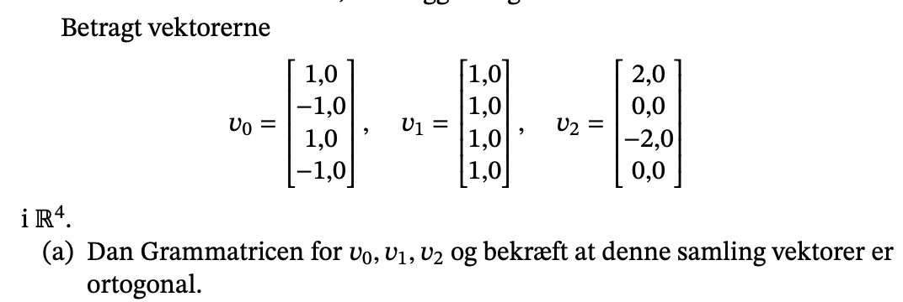
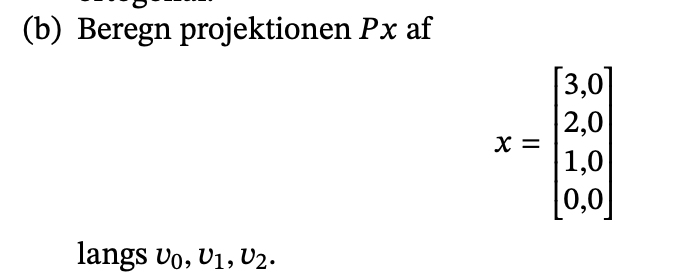
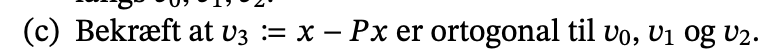

```{r setup, include=FALSE}
knitr::opts_chunk$set(echo = TRUE)
library(reticulate)
```


## a)



```{python}
import numpy as np
v0 = np.array([1.0, -1.0, 1.0, -1.0])
v1 = np.array([1.0,  1.0, 1.0,  1.0])
v2 = np.array([2.0,  0.0,-2.0,  0.0])
V = np.vstack([v0, v1, v2])
G1 =  V @ V.T

print('G=\n', G1)
```

Når vi har et sæt af vektorer og vi vil vurdere om de er ortogonale, så skal Gram matricen indgange udover diagonalen være nul, som er tilfældet i ovenstående.

## b)



Til en start opskriver jeg x.

```{python}
x = np.array([3., 2., 1., 0.])
```

Herefter bestemmes normel.

```{python}
v0_norm = np.linalg.norm(v0)
v1_norm = np.linalg.norm(v1)
v2_norm = np.linalg.norm(v2)
```

Nu kan vi således bestemme projektion af x langs v0.

```{python}
prov0 = (np.dot(v0, x) / v0_norm**2) * v0
prov1 = (np.dot(v1, x) / v1_norm**2) * v1
prov2 = (np.dot(v2, x) / v2_norm**2) * v2
Px = prov0 + prov1 + prov2
print("Px =\n", Px)
```

## c)



```{python}
v3 = np.round(x - Px)

print("v3 og v0 er ortogonale da deres indre produkt er", np.dot(v0,v3))
print("v3 og v0 er ortogonale da deres indre produkt er", np.dot(v1,v3))
print("v3 og v0 er ortogonale da deres indre produkt er", np.dot(v2,v3))
```

## d)


En Ortonormal basis er hvor alle vektor er en enhedsvektor med længden 1. En
andem måde man kan sige det på er de er blevet normaliseret. 

Desuden er de også ortogonale til hinanden, som vi så i c. 

Udover de allerede to egenskaber ved en ortonormal så vil et ortonormal basis
også være lineær uafhængig. 

Så for at besvarer d, skal vi egentlig bare dele med længden af de respektive
vektor, da vi allerede har vist ortogonalitet i opgave c. 


```{python}
V = np.vstack([v0 / v0_norm, v1 / v1_norm, v2 / v2_norm, v3/np.linalg.norm(v3)])
print(V, '\n')
print(np.round(V.T @ V))
```

SÅ har vi en ortonormal basis og vi ser vi får samme diagonal som i opgave a.