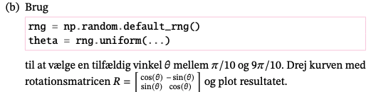

```{r setup, include=FALSE}
knitr::opts_chunk$set(echo = TRUE)
library(reticulate)
```

{width="567"}

### a)

I den første del af opgaven skal vi tage de angivende funktioner:

$$
(3 cos(t), sin(2t)), \text{for } 0 \le t \le 2\pi
$$

Hertil vil jeg hente \`numpy\` og matplotlib modulerne.

```{python}
import numpy as np
import matplotlib.pyplot as plt
```

Nu kan jeg således danne vores punkter til figuren.

```{python}
t = np.linspace(0, 2*np.pi, 1000)
y_1 = 3 * np.cos(t)
y_2 = np.sin(2*t)
eight = np.array([y_1, y_2])
```

Herefter kan vi plotte det.

```{python}
fig, ax = plt.subplots()
ax.set_aspect('equal')
ax.plot(*eight)
plt.show()
```

Som giver mig det ønskede 8 tal.



### b) 

Jeg opskriver funktioner der skal til for at lave vores plot med støjen.

```{python}
rng = np.random.default_rng()
theta = rng.uniform(np.pi / 10, (9 * np.pi) / 10)
```

Herefter definerer jeg min rotationsmatrice:

```{python}
c = np.cos(theta)
s = np.sin(theta)
R = np.array([[c, -s],
              [s, c]])

```


```{python}
rotated = R @ eight
fig, ax = plt.subplots()
ax.set_aspect('equal')
ax.plot(*(rotated))

plt.show()
```

Her kan vi se at vores ottetals er blevet roteret

## c)


Dan den matricen angivet i opgave beskrivelsen:


```{python}
noise = rng.normal(0.0, 0.1, (2, 1000))
A = rotated + noise 
fig, ax = plt.subplots()
ax.set_aspect('equal')
ax.plot(*A, 'o', markersize = 2)
plt.show()
```

Jeg har tilføjet noget støj til ottetallet og herefter plottet det.

## d)


For at gøre ovenstående skal jeg trække mean fra hver enkelt vektor i A.

```{python}
B = np.vstack([A[0] - np.mean(A[0]), A[1] - np.mean(A[1])])
```

```{python}
fig, ax = plt.subplots()
ax.scatter (*B, color = "blue")
plt.show()
```


## e)


SVD er en matrix dekomponering metode der reducere en matrice i tre komponenter for senre at gøre udregninger til andre matricer simpler. 

$U$ er en m x m matic, $\Sigma$ er en m x n diagonal matrix og $V^T$ er den transponerede af en n x n matrix.

De diagonale værdier i $\Sigma$ kendes som singulærværdierne af den orginale matrice. Kolonnerne af U kaldes venstre-singulær vektor af den orginale matrix og kolonnen af V kaldes højre singulær vektor af A.


For vores B matrices komponenter er givet som følgende:

```{python}
u, s, vt = np.linalg.svd(B, full_matrices = False)

print("Dimensioner af vores singulærværdier: \n",u.shape, s.shape, vt.shape)
print("Værdien af u: \n", u)
print("Værdien af s, som er vores singulærværdier: \n", s)
print("Værdien af vt: \n", vt)
```


## f)

I opgave f skal vi se på hvordan singulærværdierne for B er relateret til den
første figur.

 
Det jeg vil starte med a gøre er at plotte matricen U: 
```{python}
n = 1000
scale = 2/np.sqrt(n)
tscale = 1.2*scale
origo = np.zeros((2,1))
fig, ax = plt.subplots()
ax.set_aspect('equal')
ax.scatter (*B, color = "blue")
ax.plot(*np.hstack([origo, u[:,[0]]]))
ax.plot(*np.hstack([origo, u[:,[1]]]))
plt.ylim([-6.0,6.0])
plt.xlim([-6.0, 6.0])
plt.show()
```

Ud fra ovenstående figur kan vi se hvilken retning der giver mest varians. I dette tlfælde er det de venstresingulærvektorer, som også bliver af vores singulærværdier:

```{python}
print("Singulærværdier: \n", s)
```

Her kan vi se at 67 er støsrt som er vores s[0].

Denne singulærværdi har venstesingulærvektor som er den første føjle af u. Vores figur foroven viser at det således er de venstresingulærvektorer giver retningerne hvor variationen af punkterne er størst.


## g) 

Her forsøger jeg at gange u med B:

```{python}
opg_g = u @ B
```

```{python}
fig, ax = plt.subplots()
ax.set_aspect('equal')
ax.plot(*opg_g)
plt.show()
```

Her foroven ser vi at vi tilnærmelsesvis har fået den samme figur som i a.
