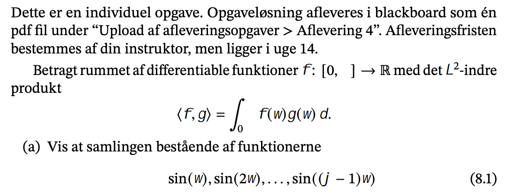
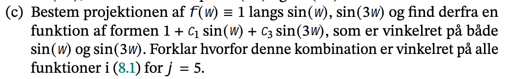
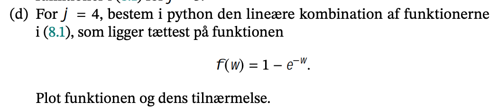

```{r setup, include=FALSE}
knitr::opts_chunk$set(echo = TRUE)
```


### a)


er ortogonal

I ovenstående opgave beskrivelse ligner det der mangler et tegn i grænserne for integralet. Her følger jeg 13.10 og antager at der skal stå $\pi$.

Her kan vi følge ovenstående nævnte eksempel og vise følgende:

$$
\int^\pi_0sin(m\cdot w)sin(n \cdot w) dx = 0 \text{, hvor  }  m\ne n
$$
Hvor vi kan bruge følgende identitet:

$$
sin(\theta)sin(\phi)=\frac{1}{2}[cos(\theta-\phi)- cos(\theta+\phi)]
$$

Således kan ovenstående skrives som:

$$
\int^\pi_0\frac{1}{2}[cos(mw-nw))- cos(nw+mw)]
$$
Smid 1/2 og w ud

$$
\frac{1}{2}\int^\pi_0 cos(m-n)w- cos(n+m)w
$$
Hvor vi nu kan integrerer

$$
\frac{1}{2}[\frac{1}{m-n} sin(m-n)w-\frac{1}{m+n}sin(m+n)w]^\pi_0
$$

Her får vi at sin(m-n) bare er nul, så år vi evaluerer udtrykket så får vi nul.
Dermed får vi nul og vi har de er ortogonale.  


### b)


For at vise dette kan vi bare beregne det indre produkt af funktionerne

$$
\begin{align*}
\langle 1, sin(w) \rangle &= \int^\pi_01\cdot sin(w) \ dw\\
&=[-cos(w)]^\pi_0\\
&=2
\end{align*}
$$

Ikke vinkelret.

$$
\begin{align*}
\langle 1, sin(3w) \rangle &= \int^\pi_01\cdot sin(3w) \ dw\\
&=\frac{1}{3}[-cos(w)]^{3 \pi}_0\\
&=\frac{2}{3}
\end{align*}
$$
Ikke vinkelret.

$$
\begin{align*}
\langle 1, sin(2w) \rangle &= \int^\pi_01\cdot sin(3w) \ dw\\
&=\frac{1}{2}[-cos(w)]^{2 \pi}_0\\
&=0
\end{align*}
$$
Vinkelret

$$
\begin{align*}
\langle 1, sin(4w) \rangle &= \int^\pi_01\cdot sin(3w) \ dw\\
&=\frac{1}{4}[-cos(w)]^{4 \pi}_0\\
&=0
\end{align*}
$$
Den er vinkelret.

Således har jeg vist at f(w)=1 er vinkelret på sin(2w) og sin(4w), men ikke vinkelret for sin(w) og sin(3w). 

### c)



Opskriv projektionen:

$$
pr_{sin(x),sin(3w)}(1)=\frac{\langle 1, sin(w)\rangle}{||sin(w)||^2}sin(w) + 
\frac{\langle 1, sin(3w)\rangle}{||sin(3w)||^2}sin(3w)
$$

Herefter foretages der en del udregning af det indre produkt og normen, men ender ud med:

$$
1-\frac{4}{\pi}sin(w)-\frac{4}{3\pi}sin(3w)
$$

Denne kombination er vinkelret på alle funktioenr i 8.1, da det er et eksempel på en Gram Schmidt process, hvor ideen er at vi kan trække fra vores vektor en projektion på hver vektor (her sin w, sin 2w, sin 3w og sin 4w) så vi får en vekto der er ortogonal til hver vektor. For vores *f*, som er ortogonal til sin (m w) når m er positiv og lige.  Derfor skal man trække projektionen med sin w og sin 3w fra.

### d)




