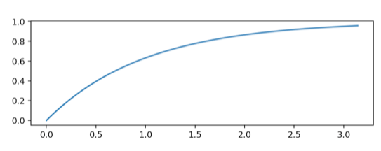

```{r setup, include=FALSE}
knitr::opts_chunk$set(echo = TRUE)
```


### a)


er ortogonal

I ovenstående opgave beskrivelse ligner det der mangler et tegn i grænserne for integralet. Her følger jeg 13.10 og antager at der skal stå $\pi$.

Her kan vi følge ovenstående nævnte eksempel og vise følgende:

$$
\int^\pi_0sin(m\cdot w)sin(n \cdot w) dx = 0 \text{, hvor  }  m\ne n
$$
Hvor vi kan bruge følgende identitet:

$$
sin(\theta)sin(\phi)=\frac{1}{2}[cos(\theta-\phi)- cos(\theta+\phi)]
$$

Således kan ovenstående skrives som:

$$
\int^\pi_0\frac{1}{2}[cos(mw-nw))- cos(nw+mw)]
$$
Smid 1/2 og w ud

$$
\frac{1}{2}\int^\pi_0 cos(m-n)w- cos(n+m)w
$$
Hvor vi nu kan integrerer

$$
\frac{1}{2}[\frac{1}{m-n} sin(m-n)w-\frac{1}{m+n}sin(m+n)w]^\pi_0
$$

Her får vi at sin(m-n) bare er nul, så år vi evaluerer udtrykket så får vi nul.
Dermed får vi nul og vi har de er ortogonale.  


### b)


For at vise dette kan vi bare beregne det indre produkt af funktionerne

$$
\langle 1, sin(w) \rangle = \int^\pi_01\cdot sin(w) \ dw\\
=[-cos(w)]^\pi_0\\
=2
$$

Ikke vinkelret.

$$
\langle 1, sin(3w) \rangle = \int^\pi_01\cdot sin(3w) \ dw\\
=\frac{1}{3}[-cos(w)]^{3 \pi}_0\\
=\frac{2}{3}
$$
Ikke vinkelret.

$$
\langle 1, sin(2w) \rangle = \int^\pi_01\cdot sin(3w) \ dw\\
=\frac{1}{2}[-cos(w)]^{2 \pi}_0\\
=0
$$
Vinkelret

$$
\langle 1, sin(4w) \rangle = \int^\pi_01\cdot sin(3w) \ dw\\
=\frac{1}{4}[-cos(w)]^{4 \pi}_0\\
=0
$$
Den er vinkelret.

Således har jeg vist at f(w)=1 er vinkelret på sin(2w) og sin(4w), men ikke vinkelret for sin(w) og sin(3w). 

### c)


Det indre produkt for $L^2$ er

$$
\langle f,g\rangle = \int^b_a f(x)g(x) dx
$$

Opskriv projektionen:

$$
pr_{sin(x),sin(3w)}(1)=\frac{\langle 1, sin(w)\rangle}{||sin(w)||^2}sin(w) + 
\frac{\langle 1, sin(3w)\rangle}{||sin(3w)||^2}sin(3w)
$$
Lad os udregne nogle enkelte skridt ad gangen:

$$
\langle 1, sin(w) \rangle = \int^\pi_0 1\cdot sin(w) dw \\
= 2
$$

$$
||sin(w)||^2=\int^\pi_0 sin(w)^2 \\
= \frac{\pi}{2}
$$

Indsæt i formlen:


Herefter foretages der en del udregning af det indre produkt og normen, men ender ud med:

$$
pr_{sin(x),sin(3w)}(1)=
\frac{2}{\frac{\pi}{2}}\cdot sin(w) + 
\frac{\langle 1, sin(3w)\rangle}{||sin(3w)||^2}sin(3w)
$$

$$
pr_{sin(x),sin(3w)}(1)=
\frac{4}{\pi}\cdot sin(w) + 
\frac{\langle 1, sin(3w)\rangle}{||sin(3w)||^2}sin(3w)
$$
Så udregner vi andet led:

$$
||sin(3w)||^2=\int^\pi_0sin(3w)^2\\ = \pi/2
$$

$$
\langle 1, sin(w) \rangle = \int^\pi_0 1\cdot sin(3w) dw \\
= \frac{2}{3}
$$

$$
pr_{sin(x),sin(3w)}(1)=
\frac{4}{\pi}\cdot sin(w) + 
\frac{\frac{2}{3}}{\frac{\pi}{3}} \cdot sin(3w)\\
= \frac{4}{\pi}\cdot sin(w) + \frac{4}{3\pi}\cdot sin(3w)
$$

Med ovenståedne projektion kan vi nu finde den vinkelrette funktion:

$$
1-\frac{4}{\pi}sin(w)-\frac{4}{3\pi}sin(3w)
$$

Denne kombination er vinkelret på alle funktioenr i 8.1, da det er et eksempel på en Gram Schmidt process, hvor ideen er at vi kan trække fra vores vektor en projektion på hver vektor (her sin w, sin 2w, sin 3w og sin 4w) så vi får en vekto der er ortogonal til hver vektor. For vores *f*, som er ortogonal til sin (m w) når m er positiv og lige.  Derfor skal man trække projektionen med sin w og sin 3w fra.

### d)


I denne opgave skal vi bruge python til at plotte ovenstående funktion og beregne en approximering baseret på vores funktion givet i 8.1.

Allerførst indlæser modulerne  numpy og matplotli.

```{python}
import numpy as np
#import matplotlib.pyplot as plt
```

Efterfølgende bruger jeg samme metode som Andrew vise i hans undervisning, men hvor han viste en fourier cosinus udvikling. 

```{python}
n = 100
x, h = np.linspace(0, np.pi, n, retstep = True)
print("De først 10 obervationer i x: \n",x[:10])
print("Vores h observation, som er pi: \n", h)
```
Nu vil jeg plotte vores eksponential funktion.
 
```{python}
# fig, ax = plt.subplots()
# ax.set_aspect("equal")
# ax.plot(x, 1-np.exp(-x))
# plt.show()
```



Herefter benytter jeg mig ad de tre funktioner vi så i undervisning:

- `indre_produkt` den beregner det indre produkt ved hjælp af **Trapezreglen**.
- ´nor_sq´ beregner længden.
- `proj` beregner projektionen for os.

```{python}
def indre_produkt(f, g, h):
  return np.trapz(f * g, dx = h)

def nor_sq(f, h):
  return indre_produkt(f, f, h)

def proj(f, k, x, h):
  konstant = np.ones_like(x)
  out = 0
  for m in range(1, k):
    out += indre_produkt(f, np.sin(m * x), h) / nor_sq(np.sin(m * x), h) * np.sin(m * x)
  return out
```

```{python}
# f = 1 - np.exp(-x)
# 
# fig, ax = plt.subplots()
# ax.set_aspect('equal')
# ax.plot(x, f)
# ax.plot(x, proj(f, 2, x, h), label = "til sin(w)")
# ax.plot(x, proj(f, 3, x, h), label = "til sin(2w)")
# ax.plot(x, proj(f, 4, x, h), label = "til sin(3w)")
# ax.plot(x, proj(f, 5, x, h), label = "til sin(4w)")
# plt.legend(loc = "lower right")
# plt.show()
```


Ovenstående plot viser vores funktion og dens tilnærmelser.


 