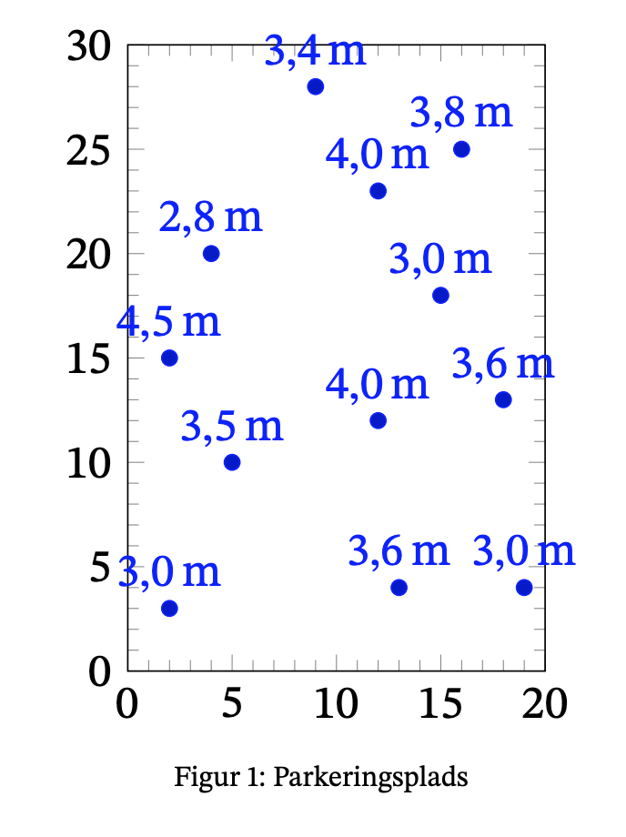
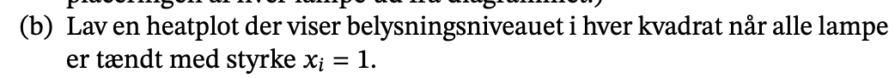

```{r setup, include=FALSE}
knitr::opts_chunk$set(echo = TRUE)
library(reticulate)
```

```{python}
import numpy as np
import matplotlib.pyplot as plt

def forbedret_gram_schmidt(a):
  _, k = a.shape
  q = np.copy(a)
  r = np.zeros((k, k))
  for i in range(k):
    r[i, i] = np.linalg.norm(q[:, i])
    q[:, i] /= r[i,i]
    r[[i], i+1:] = q[:, [i]].T @ q[:, i+1:]
    q[:, i+1:] -= q[:, [i]] @ r[[i], i+1:]
  return q, r
```


## Intro



### a)


```{python}
x = np.array([2.0,  5.0,  2.0,  4.0, 13.0, 20.0, 12.0, 19.0, 15.0, 13.0, 17.0, 10.0])
y = np.array([3.0, 10.0, 15.0, 20.0,  5.0,  5.0, 12.0, 13.0, 18.0, 23.0, 25.0, 28.0])

cols = 12
a = np.vander(x, cols)
print(f'værdien af a: \n{a}')
```

```{python}
t = np.linspace(x.min() - 0.5, x.max() + 0.5, 100)
fig, ax = plt.subplots()
ax.plot(x, y, 'o')
plt.show()
```

```{python}
q, r = forbedret_gram_schmidt(a) # a: {ndarray: (1,)}
c = q.T @ y[:, np.newaxis] # 
koeffs = np.linalg.solve(r, c)
print(f'Vores koefficienter er \n{koeffs}')
```


### b)


- hvordan får vi at x = 1?

```{python}
fig, ax = plt.subplots()
ax.set_aspect('equal')
ax.matshow(a, cmap='Reds')
plt.show()
```


### c)


#### i) QR dekomponering via forbedret gram schimidt

er allerede lavet.

#### i) QR dekomponering via SVD dekomponering


### d)


### e)


