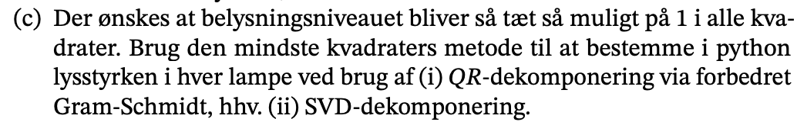
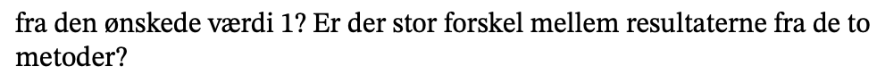

```{r setup, include=FALSE}
knitr::opts_chunk$set(echo = TRUE)
library(reticulate)
```

```{python}
import numpy as np
import matplotlib.pyplot as plt
```


## Intro


### a)


I denne opgave skal vi opstille et ligning system på formlen:

$$
Ax=b
$$

Til en start kan vi se hvordan y og x er udtrykt af hinanden:

$$
y_0 = \frac{x_0}{d^2_{0,0}}+ \frac{x_1}{d_{1,0}^2}+...+\frac{x_{11}}{d_{11,0}^2}\\
\\.
\\.\\.\\
y_{599} = \frac{x_0}{d^2_{0,599}}+ \frac{x_1}{d_{1,599}^2}+...+\frac{x_{11}}{d_{11,599}^2}
$$

For at opstille koefficient matricen skal vi bruger en række ting.

Først skal vi have en funktion til at beregne afstanden. Det gør jeg med min funktion `afstand`:

```{python}
def afstand(i, point):
  x = i % 20
  y = i //  20
  return (point[0] - x - 0.5)**2 + (point[1] - y - 0.5)**2 + (point[2])**2
```

Herefter kan vi udfra billede fra opgave beskrivelsen opskrive vores data, med x og y koordinaterne samt afstand værdi.

```{python}
lamps = np.array([
  [2, 3, 3.0],
  [14, 4, 3.6],
  [19, 4, 3.0],
  [10, 5, 3.5],
  [12, 12, 4.0],
  [18, 13, 3.6],
  [2, 15, 4.5],
  [15, 10, 3.0],
  [5, 20, 2.8],
  [12, 23, 4.0],
  [10, 29, 3.4],
  [16, 26, 3.8]
])
```

Nu er vi klar til selve beregning. Til en start laver jeg en `afstand_matrix`, hvor data skal gemmes i. 

```{python}
afstand_matrix = np.ones((600,12))

for i in range(600):
  for j, lamp in enumerate(lamps):
    Afstand = 1 / afstand(i, lamp)
    afstand_matrix[i, j] = Afstand
print(f' Hermed får vi vores koefficient matrice til følgende: \n {afstand_matrix}')
```

### b)


Til at lave et heatplot skal vi først sørge for at x har værdien 1:

```{python}
x = np.ones(12)
```

Herefter kan vi beregne y og dernæst reshaper vi vores y, så den er i en form der matcher vores tegning. Dermed bliver det en 30 x 20 matrice. For at ændre matricen kan vi benytte os af klassen array `reshape` attribute.

```{python}
y = afstand_matrix @ x
y_reshape = y.reshape((30, 20))

fig, ax = plt.subplots()
ax.set_aspect('equal')
ax.matshow(y_reshape, cmap='Reds')
plt.show()
```

Foroven ser vi belysningniveauet når alle lamper lyser med en styrke på $x_i$ = 1. 

### c)



I denne opgave skal vi have at belysningsniveauet er tæt på 1 i alle kvadrater. Her skal vi vise vi kan gøre brug af mindste kvadraters metode ved Gram Schimidt og SVD komponering.


#### i) QR dekomponering via forbedret gram schimidt

Til

```{python}
def gram_schmidt(a):
    k = a.shape[1]
    q = np.copy(a)
    r = np.zeros((k,k))
    for i in range(k):
        r[i, i] = np.linalg.norm(q[:, i])
        q[:, i] /= r[i,i]
        r[[i], i+1:] = q[:, [i]].T @ q[:, i+1:]
        q[:, i+1:] -= q[:, [i]] @ r[[i], i+1:]
    return q, r

def least_squares(A, b):
    Q, R = gram_schmidt(A)
    b0 = Q.T @ b
    return np.linalg.solve(R, b0)

A = afstand_matrix
y_new = np.ones(600)
koeffs_gs = least_squares(A, y_new)

print(f'Lystyrken skal være \n: {koeffs_gs}')
```

Her foroven ser vi for hvilke værdeir der skal til for at vores belysning niveau er 1.

#### ii) QR dekomponering via SVD dekomponering

Den samme problemstillign har vi for SVD:

```{python}
u, s, vt = np.linalg.svd(A, full_matrices = False)
koeffs_svd = vt.T @ (np.diag(1/s) @ (u.T @ y_new))
print(f'Resultatet når vi gør brug af svd \n {koeffs_svd}')
```

Vi opnår samme resultat næsten. 

### d)




Her vil jeg først lave en ny heatmap, hvor vi kan se vores resultater fra c.

```{python}
x = np.ones(12)
res_test = A @ koeffs_svd
res_test_reshape = res_test.reshape((30,20))

fig, ax = plt.subplots()
ax.set_aspect('equal')
ax.matshow(res_test_reshape, cmap='Reds')
plt.show()
```

```{python}
x = np.ones(12)
res_test = A @ koeffs_gs
res_test_reshape = res_test.reshape((30,20))

fig, ax = plt.subplots()
ax.set_aspect('equal')
ax.matshow(res_test_reshape, cmap='Reds')
plt.show()
```

Heat plottene for de to metoder ser meget ens ud. 

Ud fra et øjemål og hvad vi har set tidliger, så er der ingen stor forkskel på de to metoder. 

### e)


Til en start laver jeg de adspurgte beregninger. 


```{python}
u, s, vt = np.linalg.svd(A, full_matrices=False)
kappa_a = s[0] / s[-1]
print(f'{kappa_a:e}')
```
Det er stort.

```{python}
proj_b = u @ (u.T @ y)
cos_theta = np.linalg.norm(proj_b) / np.linalg.norm(y)
print(np.arccos(cos_theta) * 180 / np.pi)
```

```{python}
x = vt.T @ (np.diag(1/s) @ (u.T @ y))
eta = s[0] * np.linalg.norm(x) / np.linalg.norm(proj_b)
print(f'{eta:e}')
```

```{python}
kond_x_b = kappa_a / (eta * cos_theta)
kond_x_a_højst = (kappa_a +(kappa_a**2 * np.sqrt(1-cos_theta**2) / (eta * cos_theta)))
print(f'kond_x_b ={kond_x_b:e}')
print(f'kond_x_a_højst ={kond_x_a_højst:e}')
```


Vores beregning kommer ikke til at være helt så præcis baseret på vores ovenstående resultat. 
