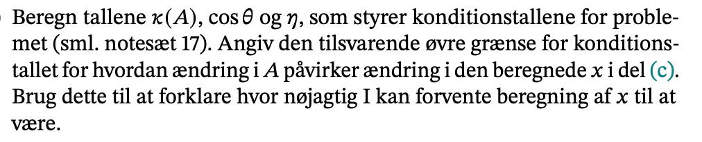

```{r setup, include=FALSE}
knitr::opts_chunk$set(echo = TRUE)
library(reticulate)
```

```{python}
import numpy as np
import matplotlib.pyplot as plt

def forbedret_gram_schmidt(a):
  _, k = a.shape
  q = np.copy(a)
  r = np.zeros((k, k))
  for i in range(k):
    r[i, i] = np.linalg.norm(q[:, i])
    q[:, i] /= r[i,i]
    r[[i], i+1:] = q[:, [i]].T @ q[:, i+1:]
    q[:, i+1:] -= q[:, [i]] @ r[[i], i+1:]
  return q, r
```


## Intro


### a)


```{python}
def afstand(i, point):
  x = i % 20
  y = i //  20
  return (point[0] - x - 0.5)**2 + (point[1] - y - 0.5)**2 + (point[2])**2

afstand_matrix = np.ones((600,12))

lamps = np.array([
  [2, 3, 3.0],
  [14, 4, 3.6],
  [19, 4, 3.0],
  [10, 5, 3.5],
  [12, 12, 4.0],
  [18, 13, 3.6],
  [2, 15, 4.5],
  [15, 10, 3.0],
  [5, 20, 2.8],
  [12, 23, 4.0],
  [10, 29, 3.4],
  [16, 26, 3.8]
])

for i in range(600):
  for j, lamp in enumerate(lamps):
    Afstand = 1 / afstand(i, lamp)
    afstand_matrix[i, j] = Afstand
print(afstand_matrix)
```


### b)


```{python}
x = np.ones(12)

y = afstand_matrix @ x
y_reshape = y.reshape((30, 20))

fig, ax = plt.subplots()
ax.set_aspect('equal')
ax.matshow(y_reshape, cmap='Reds')
plt.show()
```

### c)


Husk at belysningsniveauet er vores **y**.


#### i) QR dekomponering via forbedret gram schimidt

```{python}
def gram_schmidt(a):
    k = a.shape[1]
    q = np.copy(a)
    r = np.zeros((k,k))
    for i in range(k):
        r[i, i] = np.linalg.norm(q[:, i])
        q[:, i] /= r[i,i]
        r[[i], i+1:] = q[:, [i]].T @ q[:, i+1:]
        q[:, i+1:] -= q[:, [i]] @ r[[i], i+1:]
    return q, r

def least_squares(A, b):
    Q, R = gram_schmidt(A)
    b0 = Q.T @ b
    return np.linalg.solve(R, b0)

A = afstand_matrix

print(f'Lystyrken skal være \n: {least_squares(A, y)}')
```

```{python}
q, r = gram_schmidt(A)
c = q.T @ y

test_solve=np.linalg.solve(r, c)
test_solve
```

#### ii) QR dekomponering via SVD dekomponering

```{python}
u, s, vt = np.linalg.svd(A, full_matrices = False)
koeffs_svd = vt.T @ (np.diag(1/s) @ (u.T @ y))
print(f'Resultatet når vi gør brug af svd \n {koeffs_svd}')
```


### d)


Nej der er ikke særlig stor forskel fra de to metoder.

### e)



Beregn


```{python}
u, s, vt = np.linalg.svd(A, full_matrices=False)
kappa_a = s[0] / s[-1]
print(f'{kappa_a:e}')

```
Det er stort.

```{python}
proj_b = u @ (u.T @ y)
cos_theta = np.linalg.norm(proj_b) / np.linalg.norm(y)
print(np.arccos(cos_theta) * 180 / np.pi)
```

```{python}
x = vt.T @ (np.diag(1/s) @ (u.T @ y))
eta = s[0] * np.linalg.norm(x) / np.linalg.norm(proj_b)
print(f'{eta:e}')
```

```{python}
kond_x_b = kappa_a / (eta * cos_theta)
kond_x_a_højst = (kappa_a +(kappa_a**2 * np.sqrt(1-cos_theta**2) / (eta * cos_theta)))
print(f'kond_x_b ={kond_x_b:e}')
print(f'kond_x_a_højst ={kond_x_a_højst:e}')
```


