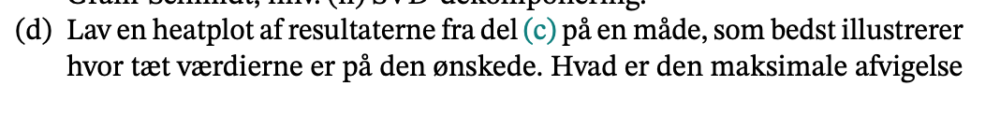

```{r setup, include=FALSE}
knitr::opts_chunk$set(echo = TRUE)
library(reticulate)
```

```{python}
import numpy as np
#import matplotlib.pyplot as plt
```


## Intro


### a)


```{python}
# linspace (a (x0),  b(x_n-1), n)
np.linspace(0, 11, 20)
np.linspace(0, 30, 600)
```


### b)

### c)


### d)




### e)


