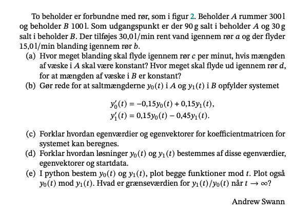

```{r setup, include=FALSE}
knitr::opts_chunk$set(echo = TRUE)
library(reticulate)
virtualenv_create("na-aflevering-9")
use_virtualenv("na-aflevering-9")
reticulate::repl_python()
```



## a)


## b)

## c)

## d)

## e)
