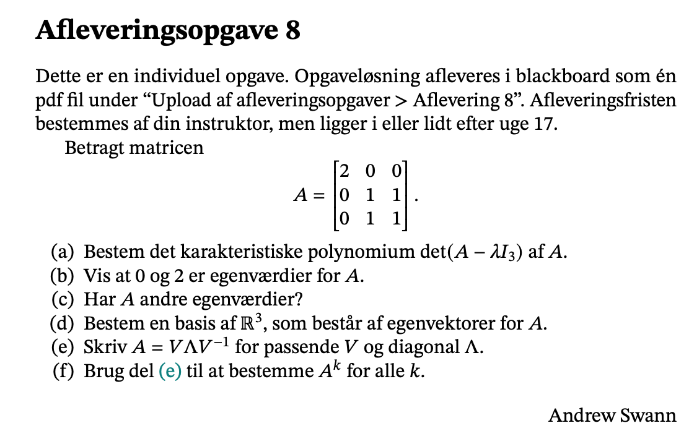
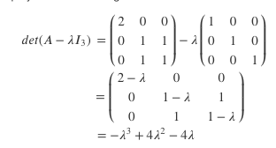
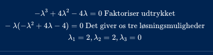
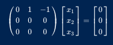
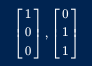

```{r setup, include=FALSE}
knitr::opts_chunk$set(echo = TRUE)
```



### 

### a)

Vi har følgende matrice:

$$
A=
\begin{pmatrix}
2&0&0\\
0&1&1\\
0&1&1
\end{pmatrix}
$$

Hvor vi vil bestemme det karakteristisk polynomium så vi følger formlen



Som er det karakteristisk polynomium for A.

### b)

Nu skal vi vise at 0 og 2 er egenværdier for A. Det kan vi gøre ved at løse det karakteristisk polynomium som vi fandt i opgave a:



### c)

Ja fra c har jeg vist der er flere en egenværdi mere som er 2.

### d)

Nu finder vi egenvektorer.

Vi starter med $\lambda_1=2$

$$
A=
\begin{pmatrix}
2-2&0&0\\
0&1-2&1\\
0&1&1-2
\end{pmatrix}
$$

$$
A=
\begin{pmatrix}
0&0&0\\
0&-1&1\\
0&1&-1
\end{pmatrix}
$$

Hvor vi skal finde nul rummet. Her skal vi finde echelon form af ovenstående:

$$
\begin{pmatrix}
0&0&0\\
0&-1&1\\
0&1&-1
\end{pmatrix}
\sim\begin{pmatrix}
0&-1&1\\
0&0&0\\
0&1&-1
\end{pmatrix}
\sim 
\begin{pmatrix}
0&1&-1\\
0&0&0\\
0&1&-1
\end{pmatrix}
\sim
\begin{pmatrix}
0&1&-1\\
0&0&0\\
0&0&0
\end{pmatrix}

$$

Herefter skal vi løse følgende:

$$
\begin{pmatrix}
0&1&-1\\
0&0&0\\
0&0&0
\end{pmatrix}
\begin{bmatrix} x_1\\x_2\\x_3 \end{bmatrix}=
\begin{bmatrix} 0\\0\\0 \end{bmatrix}
$$

Dermed får vi



Dermed er egenvektoren:


