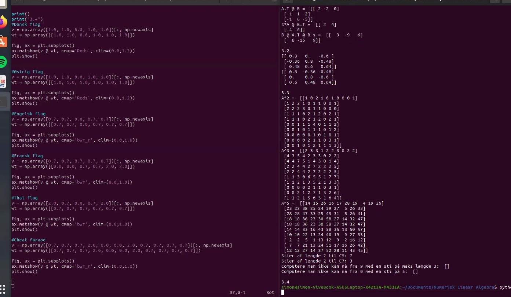

```{r setup, include=FALSE}
knitr::opts_chunk$set(echo = TRUE)
library(reticulate)
```

## 3.1 

```{python}
import numpy as np
```


```{python}
s = 2
t = 3
A = np.array([[2, 1, -1],[0, 2, 5]])
B = np.array([[1, -1, 0],[0, 1, -1]])
```

### a) sB

```{python}
s*B
```

### b) A+tB

```{python}
A+t*B
```


Lav ikke resten

## opgave 3.1 Lad 𝑅0 og 𝑅1 være rotationsmatricerne fra Eksempel 4.8 i Notesæt 4,
taget med 𝑐 = 0,8, 𝑠 = 0,6. Beregn matrixprodukterne

og bekræft at resultaterne er forskellige. Hvad betyder dette for en opgraderet
version af robotarmen fra Aeveringsopgave 1 hvor ledende kan bøje sig i tre
dimensioner?

```{python}
c = 0.8
s = 0.6
R0 = np.array([[1, 0, 0],[0, c, -s], [0,s,c]])
R1 = np.array([[c, 0, -s],[0, 1, 0], [s,0,c]])
```
Beregn matric produkt

```{python}
R0 @ R1
```

```{python}
R1 @ R0
```

Resultaterne er forskelligl

I forhold til aflerverings 1 så må det betyder vi får en dimension
mere hvor den kan bøje sig.

## 3.3 

```{python}
A = np.array([
  [0,1,0,1,0,0,0,0,0,0],
  [1,0,1,1,0,0,0,0,0,0],
  [0,1,0,1,1,0,0,0,0,0],
  [1,1,1,0,0,0,1,0,0,0],
  [0,0,1,0,0,1,0,0,0,1],
  [0,0,0,0,1,0,1,0,1,1],
  [0,0,0,1,0,1,0,0,0,0],
  [0,0,0,0,0,0,0,0,1,0],
  [0,0,0,0,0,1,0,1,0,1],
  [0,0,0,0,1,1,0,0,1,0]])
```


```{python, udregn A2}
A@A
```

### a) hvor mange har en sti af længe 2 til c5

vi ser på 5 række og summer den

det er der 7 computer

### b) hvor mange pc har en sti af længde 2 til c7

vi ser på den 7 række og sumer den og ser det er 3.


### c) computer kan nås fra c9 med en sti længde 3

```{python}
A+A@A+A@A@A
```


```{python}
from numpy.linalg import matrix_power

A@A@A@A@A
```


## 3.4




```{r}
# dansk
```

