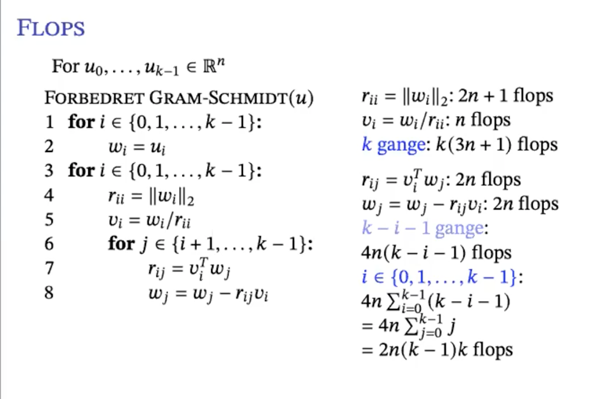

```{r setup, include=FALSE}
knitr::opts_chunk$set(echo = TRUE)
library(reticulate)
```

## Forlæsning 15

-   Skal se på gram scmith (GS) igen, en måde at danne ortognale vektor.
    Danne ortonormale matricer

-   Se på eksempel i python.

-   Spørger ind til $u-pr_v(u)$ og dens egenskaber. Hvad gælder
    generelt?

    -   Den skal være vinkelret på v. Viser tegning som er
        $u\cdot pr_v(u)$ . Hvis vi har en v og lave en anden vektor er
        er ortogonal på v, så får vi u.

    -   Det er GS process hvor vi får dannet en ortonormal samling.

### klassisk gram schmit process

-   Giver $u_0,.u_1,..u_{k-1}\in V$ lineært uafhænigg. Skal være en
    ortonormal baiss og ikke ortogonal.

-   sæt $w_0=u_0$ ,

    -   $v_0=\frac{w_0}{||w_0||}$

-   Sæt $w_1=u_1-pr_{v_0}(u_1)$ ,

    -   $v_1=w_1/||w_1||$ ,

-   sæt $w_2=u_2-pr_{v_0,v_1}(u_2)$

    -   $v_2=w_2/||w_2||$

-   sæt $w_r=u_r-pr_{v_0,..,v_{r-1}}(u_r)$

    -   $v_r=w_r/ ||w_r||$

-   skal ligge vinkelret

-   Dermed får vi en ortonormal samling, der udspænder det samme som som
    u0..$u_{k-1}$ .

-   Har laver eksempler i forlæsning 14.

#### Eksempel i python på klassisk GS

```{python}
import numpy as np
```

```{python}
s = 1e-8
u_0 = np.array([1.0, s, 0.0, 0.0])[:, np.newaxis]
u_1 = np.array([1.0, 0.0, s, 0.0])[:, np.newaxis]
u_2 = np.array([1.0, 0.0, 0.0, s])[:, np.newaxis]
```

```{python}
a = np.hstack([u_0,u_1,u_2])
a
```

```{python}
def proj_på(v, u):
  return np.vdot(v,u)/np.vdot(v,v)*v
```

-   Ikke helt ned i machine epsilon.

-   Skal lave projektion (pr) mange gange.

```{python}
v0 = u_0 / np.linalg.norm(u_0)
w1 = u_1 - proj_på(v0, u_1)
v1 = w1 / np.linalg.norm(w1)
w2 = u_2 - proj_på(v0, u_1) - proj_på(v1,u_2)
v2 = w2 / np.linalg.norm(w2)
q  = np.hstack([v0,v1,v2])
q
```

-   Har lavet GS processen.

-   Lad os se om de er ortonormale. Er kan vi bruge GS

-   Ved nedenstående output får vi ikke identitetmatricen det går mest
    galt ved indgange med 5.000e-01. Resten er ikke dårlig, ikkelt helt
    nede ved machine epsilon.

```{python}
gram = q.T @ q
gram

```

```{python}
# beregner vinklen
np.arccos(np.vdot(v1,v2)/\
          (np.linalg.norm(v1)*\
          np.linalg.norm(v2))) * \
          360 / (2 * np.pi)
```

-   vinklen mellem v1 og v2 er 60 hvor den skal være 90 grader.

-   flytter rundt på vores operationer

-   vi indfører x2 som er en ny operation og det samme for u2 og gemme
    det i x2.

```{python}
v0 = u_0 / np.linalg.norm(u_0)
w1 = u_1 - proj_på(v0, u_1)
x2 = u_2 - proj_på(v0, u_2) # konstueret til at være vinkelret på w1.
v1 = w1 / np.linalg.norm(w1)
w2 = x2 - proj_på(v1, x2)
```

```{python}
v2 = w2 / np.linalg.norm(w2)
q = np.hstack([v0,v1,v2])
q
```

```{python}
q.T @ q
```

-   I den sidste søjle har vi en ændring har vi 0.4.

-   Vi er mere tilfreds, så vi har bedre ortogonalitet.

-   Vi har lavet en lille omskrivning der giver et bedre resultat.

-   beregning af vinklen igen:

```{python}
# beregner vinklen
np.arccos(np.vdot(v1,v2)/\
          (np.linalg.norm(v1)*\
          np.linalg.norm(v2))) * \
          360 / (2 * np.pi)
```

-   vi sørgede for at arbjed med vektor der allerede er vinkel ret på v0
    og fixer det efterfølgende, så vi får ortogonale vektor.

-   Viser eksempel med R5, u skal bestå af vektor hvor der er 1 på
    diagonalen og er øvre triangulær.

### Forberedet gram schmidt

-   Bytter rundt om rækkefølgende af.

-   Vi kan glemme v0 når den er udregnet.

-   krav: lineær uafhængig

1.  $w_i^{(0)}=u_i,i=0,..,k-1,v_0=w_0^{(0)}/||w_0^{0)}||$

2.  $w_i^{(1)}=w_i^{0}-pr_{v_0}, v_1=w_1^{(1)}/||w_1^{(1)}||$

3.  Fortsætter.

4.  ...

5.  return får en ortonormal samling der udsspænder det samme rum som u.

-   x2 er i koden definere som $u_2-pr_{v_0}(u_2)$ . Som er det samme
    udtryk som i den klassiske GS.

-   Så det vi ser af forskel notationsmæssig er $w^{(0)}_0$ .

-   Vi arbejder med vektor der er vinkelrette.

-   hvordan kan de skrives som en algoritme?

### Algoritme form

#### klassisk GS algoritme:

1.  for j $\in$ {0,1,..,k-1}:

2.  $w_j=u_j$

3.  for i $\in$ {0,1,..j-1}:

4.  $r_{ij}=v_i^Tu_j$

5.  $w_j=w_j- r_{ij}v_i \text{ som er det samme  } w_j-pr_{ij}(u_j)$

6.  $r_{jj}= ||w_j||_2$ normaliser

7.  $v_j=\frac{w_j}{r_{jj}}$

#### Forbedret GS

1.  for i $\in$ {0,1,..,k-1}:

2.  $w_i=u_i$

3.  for i $\in$ {0,1,..i-1}:

4.  $r_{ij}=||w_i||_2$

5.  $v_i=w_i/r_{ii}$

6.  for j $\in$ {i+1,,...,k-1}:

7.  $r_{ij}=v_i^Tw_j$

8.  $w_j = w_j-r_{ij}v_i$

-   Lad os vise dem i python:

```{python}
import matplotlib.pyplot as plt
```

```{python}
def klassisk_gram(a): # a matricen har vektor u som vores søjler
  n, k = a.shape
  q = np.empty((n, k)) # q samme shape som a. Den er tom, men der værdier sættes
  r = np.zeros((k, k))
  for j in range(k): 
                #v0-vj          # u_j
    r[:j, [j]] = q[:, :j].T @ a[:, [j]] # indre produkt
          #w_j                  #r_ij * v_i
    w = a[:, [j]] - q[:, :j] @ r[:j, [j]]
    r[j, j] = np.linalg.norm(w) # længden. 
    q[:, [j]] = w / r[j, j]
  return q, r

```

```{python}
def forbedret_gram(a): # a matricen har vektor u som vores søjler
  _,k = a.shape # _ gør vi ikke gemme rækker, men kun søjler i k.
  q = np.copy(a) # indeholder v og w. Svarer til første løkke i algoritmen
  r = np.zeros((k, k))
  for i in range(k):
    r[i, i] = np.linalg.norm(q[:, i]) # beregning af norm
    q[:, i] /= r[i, i] # deler
    # træk projektionen fra. 
    # først skal vi regne rij
    r[[i], i + 1:] = q[:, [i]].T @ q[:, i + 1:] # v_i^T*w_j, indre produkt. 
    q[:, i + 1:] -= q[:, [i]] @ r[[i], i + 1:]
  return q, r
```

```{python}
s = 1e^-8
a = np.array([
  [1.0, 1.0, 1.0],
  [  s, 0.0, 0.0],
  [0.0,   s, 0.0],
  [0.0, 0.0,   s]
])
a
```

```{python}
q, r = klassisk_gram(a)
print(a - q @ r) # giver nul.
print()
print(q.T @ q) # problem med vi får en halv
```

```{python}
q, r = forbedret_gram(a)
print(a - q @ r) # giver nul.
print()
print(q.T @ q) # Nu er de ortogonale
```

-   ovenstående eksempel tager hvad vi så tidligere. Nemlig at ved den
    klassiske fik vi en fejl således vektor ikke stod vinkel rette på
    hianden, men ved forbedring får vi netop det.

-   Lad os se på det mere generelt eksperiment.

-   

```{python}
n = 100
rng = np.random.default_rng()
# tag svd, men uden singulærværdien
u, _, vt = np.linalg.svd(rng.random((n, n)))
i = np.arange(n)
s = np.array(2.0 ** (-i))
a = u @ np.diag(s) @ vt 
# halvere dem.
s[:10]
```

```{python}
qk, rk = klassisk_gram(a)
qf, rf = forbedret_gram(a)
```

```{python}
# sammenligne de to metoder.
fig, ax = plt.subplots()
ax.set_yscale("log")
ax.plot(i, rk[i,i], 'o')
ax.plot(i, rf[i,i], 'x')
plt.show()
```

-   vi plotter her diagonalen som burde være de singulærværiden fra svd.
    Plotter viser de diagonale indgange. Vi ser de kGC ikke falder, som
    den forbedret. 10\^-16 er machine epsilon, hvor vi ikke kan forvente
    noget bedre.

-   ved 55 når vi platue, hvor ikke vi kan forvente noget bedre og det
    ser vi er ved machine epsilon. KGS, går galt ved kvadrat machine
    epsilon.

-   Hvor flops er der i den forbedret?

{width="475"}

-   $\text{i alt } 2n(k-1)k+k(3n+1)=nk^2+kn+k\sim 2nk^2$ flops.

### QR dekomponering

-   går tilbage algoritme for den forbedret GS og henvise til q hvor vi
    kopier a.

## Forlæsning 16

### QR dekomponering

-   GS for lineært uafhængig giver os QR. Her r Q ortonormal esøjler og
    Grammatricen opfylder

$$
Q^TQ=I_n
$$

-   Vi vil se på lineær lignignsystemer.

$$
\begin{align*}
Ax=b \\
QR_x=b \\
\text{Gang med Q.T}\\
Rx = Q^Tb
\end{align*}
$$

-   Den kan løses backsuptitution.

-   Ser på et eksempel.

```{python}
a = np.array([
  [1.0, 1.0],
  [1.0, 2.0],
  [0.0, 2.0]])
a
```

```{python}
b = np.array([1.0,2.0, 0.0])[:, np.newaxis]
b
```

```{python}
# løsning fra slide
xy = np.array([1.0, 1/3.0])[:, np.newaxis]
xy
```

```{python}

a @ xy
```

-   får en vektor system er ikke konsisten så bil ikke blive b. INdgange
    er ikke lang fra hianden.

```{python}
b - a @ xy
```

-   fejlen i løsningen

```{python}
# vinklen af fejlen:
np.linalg.norm(b - a @ xy)
```

```{python}
rng = np.random.default_rng()

```

```{python}
for i in range(10):
  random_xy = rng.standard_normal((2,1))
  print(np.linalg.norm(b - a @ random_xy))
```

-   den mindster er omkring 2.

-   ingen der ligger under den værdi jeg fandt for oven for vinklen.

```{python}
# andet eksperiment

m = 100
for i in range(1000):
  random_xy = rng.standard_normal((2,1))
  norm = np.linalg.norm(b - a @ random_xy)
  if norm < m:
    m = norm
print(m)
```

-   Kommer tætter på værdien.

-   QR metoden giver et god løsning der er tæt på b.

-   Så vi skal finde løsninger til Ax=b.

-   Det kaldes mindste kvadratrods problem.

-   Ser på lineær lingigns system.

#### restvektor

-   sæt

$$
r = b- Ax\in R^m
$$

-   min:

$$
||r||_2=||b-Ax||_2
$$

-   min opnås når Ax er projektion af b på søjlerummet S(A).

#### brug af QR

-   hvis søjlerne A er linært uafhngig kan vi brug GS til at danne
    ortonormal basis og få

$$
A=QR
$$

-   projektionen på søjlerummet er

$$
\begin{align*}
P&=q_0q_0^T +q_1q_1^T+...+q_{n-1}q^T_{n-1} \\
&=QQ^T
\end{align*}
$$

-   Nu har vi et matrix produkt. Her vil løses

$$
QRx=QQ^Tb
$$

-   Som er det samme som $Ax=P$

-   Det kan vi løse og vi får

$$
Rx=Q^Tb
$$

#### QR metode

-   krav A er lineær uafhængig.

-   beregn tynd QR dekomponering $A=QR$

-   beregn $Q^Tb$

-   løs $Rx=Q^Tb$ med back substitution.

-   flops $\sim 2mn^2$ ved brug af forbedret GS.

-   Se på det i python

```{python}
x = np.array([-2.1, -1.9, -1.5, -0.8, -0.3, 0.1, 0.5, 1.2, 1.3, 1.7, 2.4])
y = np.array([ 0.1,  0.4, -0.1, -0.6, -0.5, 0.1, 1.0, 1.3, 0.7, 0.1, 0.2])

fig, ax = plt.subplots()
ax.plot(x, y, 'o')
plt.show()

cols = len(x)
print("cols \n ", cols)

# vander munder matrice.  
#  
a = np.vander(x, cols)
print("vander: \n ", a)

koeffs = np.linalg.solve(a, y[:, np.newaxis])
print("koeffs \n", koeffs)
```

```{python}
t = np.linspace(x.min() - 0.5, x.max() + 0.5, 100)

fig, ax = plt.subplots()
ax.set_ylim(-2, 2)
ax.plot(x, y, 'o')
ax.plot(t, np.vander(t, cols) @ koeffs)
plt.show()
```

-   går genem punkterne.

-   Skal finde en ret linje. Det er lineær regression.

-   Er det godt?

```{python}
cols = 7
cols

a = np.vander(x, cols)
q,r = forbedret_gram(a)
c = q.T @ y[:, np.newaxis]

koeffs = np.linalg.solve(r, c)

t = np.linspace(x.min() - 0.5, x.max() + 0.5, 100)

fig, ax = plt.subplots()
ax.set_ylim(-2, 2)
ax.plot(x, y, 'o')
ax.plot(t, np.vander(t, cols) @ koeffs)
plt.show()

```

-   svinger bedre i punkterne.

```{python}
rest = y[:, np.newaxis] - np.vander(x, cols) @ koeffs
np.linalg.norm(rest)
```

```{python}
a = np.vander(x, cols)
a.shape
```

#### reduceret svd

#### psudoinversen af A

$$
A^+=V \Sigma^{-1}U^T
$$

#### normalligninger

-   anden metode til mindste kvadrater

<!-- -->

-   

```{python}

```

-   

### mindste kvadraters metode
