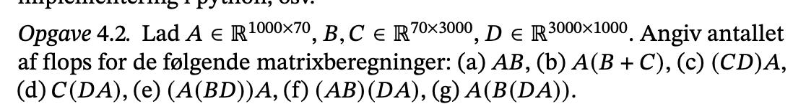
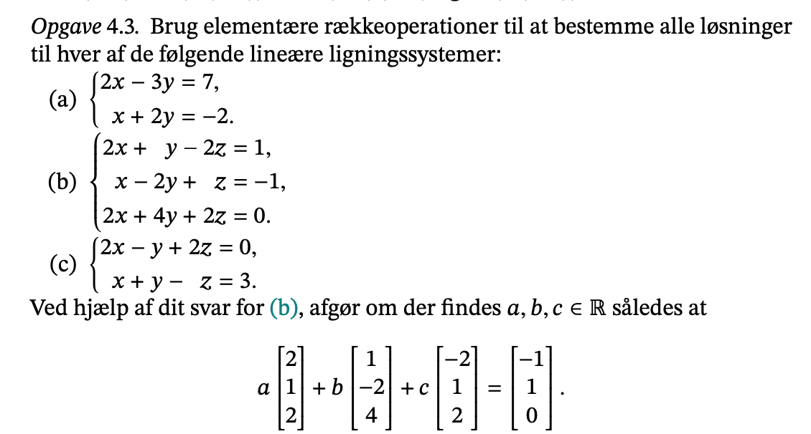
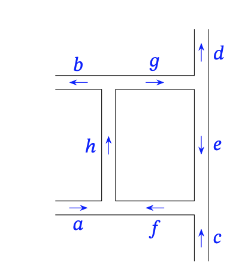
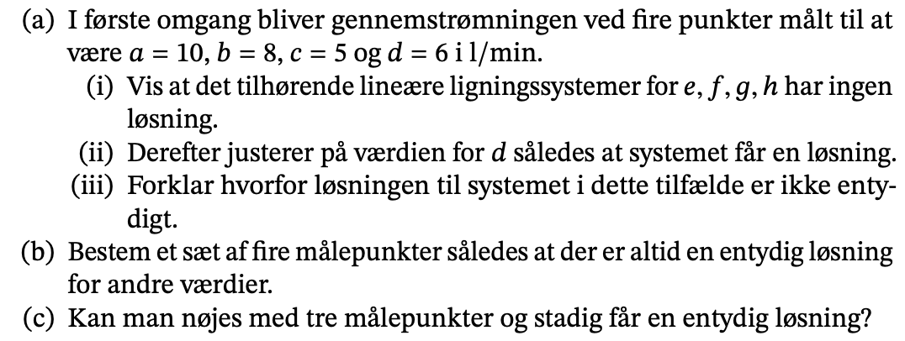
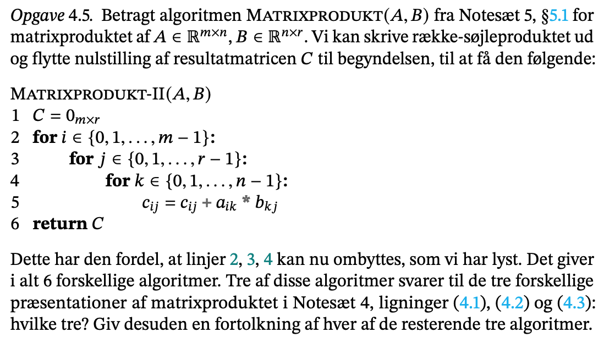

```{r setup, include=FALSE}
knitr::opts_chunk$set(echo = TRUE)
library(reticulate)
```

```{python}
import numpy as np
```


## lektion 1

### sidste gang

- **ortogonal samling** er en samling hvor de står vinkelrette på hinanden.
- Vi kan regne koefficienter ud fra en nem metode, 

$$
x_i = \frac{\langle u_i, v_i \rangle}{||v_i||^2_2}
$$

- så her behøver vi ikke løse ligningssystemet.
- **Projektionen** har et ligende simpel udtryk. 


### ortogonale matricer

- er kvadratiske matrix

$$
A^TA=I_n
$$
- En rotationsmatrix vil være ortogonal. 
- Han viser nogle eksempler på ovenstående definition. 

```{python}
u = np.array([0.5, -0.5, 0.5, -0.5])[:, np.newaxis]
u
```
```{python}
# u er en enhedsvektor
np.linalg.norm(u)
# den kan vi bruge i vores aflevering
```

```{python}
a = np.eye(4) - 2 * u @ u.T
a
```
- Givet fra formlen

$$
A=I_n-2uu^T
$$
- Det er en konkret eksempel på en ortogonal matrix.

```{python}
a.T @ a
```
- Her får vi identitetsmatricen.

- Gør det mere generelt

```{python}
rng = np.random.default_rng()
```

```{python}
v = np.random.standard_normal((4,1))
v
```
- længden 4.

```{python}
u = v / np.linalg.norm(v)
u
```

```{python}
np.linalg.norm(u)
```

```{python}
a = np.eye(4) - 2* u @ u.T
a
```

```{python}
a.T @ a
```
- checker om den er ortogonal. Det er den da det er nærmest nul. 

```{python}
# check 
np.allclose(a.T @ a, np.eye(4), atol = np.finfo(float).eps)
```
- Det er godt nok. 

```{python}
n = 100
v = rng.standard_normal((n,1))
u = v / np.linalg.norm(v)
a = np.eye(n) - 2 * u @ u.T
np.allclose(a.T @ a, np.eye(n), atol = np.finfo(float).eps)
```
- Laver en stor matrix og laver det sammen som før. 
- Det er en god måde at lave ortogonale matricer på. 
- **machine epsilon** er en værdi, som man vil bruge til at adskille floats og 
  tal fra hinanden. Så man kan sige det er en præcisations mål.

#### egenskaber

- Ortogonale matricer bevarer længde og vinkler. 
- Ortogonal matrice er invertibel. 
- Hvis B også er ortogonal så er AB ortogonal. 

$$
(BC)^T = C^TB^T\\
(AB)^T(AB)=B^TA^TAB\\
B^TI_nB=B^TB=I_n
$$
- Produktet BC har nogle indgange, i og j. Den transponede indgang vil være (j,i).
- Den ji indgang:

$$
(C^TB^T)_{ji}=\sum^{n-1}_{k=0}(C^T)_{jk}(B^T)_{ki}=\sum^{i-1}_{k=0}c_{kj}b_{ik}=((BC)^T)_ji
$$

- vi viser at indgangene er ens når vi har ortogonale matricer, som er en fordel. 

- Ser lidt på betingelse: $(BC)^T=C^TB^T$. 

$$
\langle Au,Av \rangle = (Au)^T(av)=u^T(A^TA)v=u^TI_nv=u^Tv = \langle u,v \rangle
$$
- er super let at vise fordeln ved ortogonale matrice. 

#### Grammatrix

- givet vektor v kan vi danne

$$
V=[v_0|v_1|..|v_{k-1}]\in R^{n x k}
$$
- matricken

$$
G=V^TV \in R^{kxk}
$$
- kaldes **grammatricen**

- Så viser han hvordan det regner for en søjle og en række. Det indre produkt er v_i,v_j.

#### ortogonal samling

- Hvor samling vektor er ortonormal hvis det indre produkt er lig med 1 eller 0.
- v er ortonormal hvis og kun hvis 

$$
G=V^TV \ er \ I_k
$$
- For k = n har vi så v er ortonormal hvis og kvuns hvis V er en ortogonal matrix.
- En ortonormal samling i R bestående af n vektor kaldes en **ortonormal basis**.
- 

#### ortonormal basis er maksimal

- en samlingv har højst k O n vektorer. 
- Gennengår bevis. 


### householder matricer

- Ser lidt konkret konstruktion. 
- En **householdmatrix** $H\in R^{nxn}$ ortogonal og på formen

$$
H=I_n-svv^T
$$

- Minder om det første eksempel vi havde. 
- Identitets matrix er et enkesel på household matrix. 
- Han viser et billede af household matrix. En matric på en household matrix vil
  være ortogonal. Det kan udtrykkes i formler. 
- Gør vi det to gange vil vi få identitetsmatricen. 
- hv = -v. Hw=w for alle w er ortogonal med v. 
- Så vi får en spejling med ortogonale vektorer. 

#### householdtransformation

- ønske konstruer H så den flytter et givet enhedsvektor u.

$$
\epsilon = -1 \ hvis \ u_0 >=0 \\
\epsilon = +1 \ hvis \ u_0 \le 0 \\

$$

- Så finder der $H=I_nsvv^T$ householder med

$$
He_0=\epsilon u, \ v=(1,v_1,..,v_{n-1}) \ og \ s=1+|u_0|
$$
- Her ser vi på konstruktionen har den først ligning

$$
\epsilon u = He_0=e_0-sv(v^Te_0) = e_0-sv\\ 
e_0=(1,0,...,0) \\

$$

- e og sv leder vi, men er lig med

$$
H=I_n-svv^T\\
\epsilon = -1 \ hvis \ u>=0 \ ellers \ +1\\
sv=e_0 -\epsilon u \\
s=1-\epsilon u_0 = 1 + |u_0| \\
v=\frac{1}{s}(e_0-\epsilon u)
$$

- Dem skal vi bruge en del.

```{python}
x = np.array([1., 2., 3.])[:, np.newaxis]
```

```{python}
# længden?
u = x / np.linalg.norm(x)
u
```
```{python}
u[0,0] 
```
- et positiv tal, så er epsilon 1-

```{python}
eps = -1 if u[0,0] >= 0 else 1
eps
```

```{python}
s = 1+ np.abs(u[0,0])
s
```

```{python}
# regner v men kun alt anden end 1.
v = (-eps/s) * u 
v[0,0] = 1
v
```

- Dan household matrix

```{python}
Hx = x - s * v @ (v.T @ x)
Hx
```

- De er størrelse machine epsilon så de er nærmest nul. 
- x er længden 

```{python}
np.linalg.norm(x), np.sqrt(14)
```
- Brug H på andre vektor.

```{python}
# stil transformationen H op som en funktion

def House(s,v, x):
  return x - s * v @ (v.T @ x)

```

```{python}
House(s,v,x) == Hx
```

- Vi får det samme resultat som i vores manuel regnign. 

```{python}
# tilfældig vektr

rng = np.random.default_rng()
v = rng.random((10,1))
s = 2/np.vdot(v,v)
```
```{python}
x = rng.random((10,1))
Hx = House(s,v,x)
Hx
```

- Household transformation.

```{python}
np.allclose(House(s,v,Hx), x, atol = np.finfo(float). eps)
```

```{python}
np.allclose(House(s,v,v), -v, atol = np.finfo(float).eps)
```

#### Udvidelse til ortonormal basis

- HOuse bruges til basis.
- Givet en enhedsvekto u, findes der en ortonormal basis v0 for Rn med v0=0
- Laver et bevis hvor vi laver H.  


## Opgave sæt 4

### Opgave 4.2



#flopmatrix?

```{python}
2 * 1000 * 70 * 3000 
```

```{python}
 (2 * 70 * 3000 * 1000) + 2 * 70 *1000*70
```

```{r}
(2 * 70 *3000 * 1000) + 2 * 1000 * 70 * 70

```

```{python}
# f): (AB)(DA)
2 * 1000 * 70 * 3000 + 2 * 3000 * 1000 * 70 +2 * 1000 * 3000 * 70
```


### Opgave 4.3


#### a)

```{python}
a = np.array([
  [2, -3, 7],
  [1, 2, -2]
  ])
```


#### b)

```{python}
np.array([
  [2, 1, -2, 1],
  [1, -2, 1, -1],
  [2, 4, 2, 0  ]
])

# løsning
np.array([
  [1, 0, 0, -0.0625],
  [0, 1, 0, 0.25],
  [0, 0, 0, -0.4375]
])
```


#### c)

her ser vi har fri elementer så der er uendelig mange løsninger 


```{python}
np.array([
  [2, -1, 2, 0],
  [1, 1, -1, 3]
])
```


bestem det

rasmus får

```{python}
np.array([
  [1, 0, 1.14],
  [0, 1, -1.57]
])
```


### Opgave 4.4

Betragt det følgende system af vandrør:




#### a)

```{python}
#definer abxd
a, b, c, d = 10., 8., 5., 6.

# opskriv ligning system ud fra knudepunkterne 
Ab = np.array([
  [1., -1., 0., 1., a],
  [-1., 1., 0., 0., c],
  [0., 0., -1., 1., b],
  [-1., 0., 1., 0., d]
])
print(Ab, "\n")

Ab[[0,1]] = Ab[[1,0]]
Ab[3,:] = Ab[3,:] -Ab[0,:] - Ab[1,:]
Ab[1,:] = -1*Ab[1,:]
Ab[2,:] = Ab[2,:] + Ab[3,:]
Ab[0,:] = Ab[0,:] - Ab[1,:]
Ab[[2,3]] = Ab[[3,2]]
print(Ab, "\n")
```


Her ser vi der ingen løsning er

#### b) entydig løsning

Der er uendelig mange løsning i abc og d men i fgh e så vli d være forskellen
mellem d og g. osv. 

Sætter vi målpunkterne i g e f og h så kan vi udregne værdier i c a b og d.

#### c)

Kan vi nøje med 3 målpunkter?  Nej det vil der ikke være, da der er aldig et 
sted hvor to ubekendte kollidere med en bekendt og så kan man ændre på dem.

### Opgave 4.5



Hvis vi har algoritmen, så har vi rækker i a, søjler i b, og så har
vi rækker og søjler. Vi bliver spurgt om hvem der passer sammen.
For lækker afhnger ikke af hinande. 


