```{r setup, include=FALSE}
knitr::opts_chunk$set(echo = TRUE)
library(reticulate)
```

# Opgave 5.1. Lad a være en ndarray med to akser. Forklar hvad de følgende operationer gøre ved a:

```{python}
import numpy as np
```

## (a) a[0, [1,3,4,6]] = 1

```{python}
a = np.array([
  [1,2,3,4,5,6],
  [4,3,6,2,6,8],
  [1,2,3,4,5,5]
])
a
```

## (b) a[[1,2], [2,3]] = np.array([0,1])

```{python}
a[[1,2], [2,3]] = np.array([0,1])
a
```

den giver de pladser i a nogle nye værdier.

## (c) a[:, [3,1]] = a[:, [1,3]]

```{python}
a[:, [3,1]] = a[:, [1,3]]
```

```{python}
a
```

Bytter rundt på værdierne.

## (d) a[2:5, 0] = np.array([0, 1, 2])

```{python}
a.ndim  

np.array([0, 1, 2])
```

i række 2, 3 og 4 sætter den væriden 0, 1 og 2.

## (e) a[2, 3:8:2] += 6

pluser med 6

```{python}
a[2, 3:8:2] += 6
a
```

# Opgave 5.2. Tre klodser af brede 5 cm er forbundne med fjeder som i diagrammet.

Fjederen 𝐴 har naturlig længde 10 cm og fjederkonstant 20 N/m, 𝐵 har
naturlig længde 20 cm og fjederkonstant 10 N/m, 𝐶 har naturlig længde 20
cm og fjederkonstant 5 N/m og 𝐷 har naturlig længde 10 cm og
fjederkonstant 30 N/m. Hookes lov siger at kræften fjederen yder er
fjederkonstanten ganget med afvigelsen fra den naturlige længde.
Systemet er i stilstand, så kræfterne opvejer hinanden i hver klods. Der
er 90 cm mellem de to endevægge. Opstil et lineært ligningssystem for
𝑥-koordinaterne af centrum af hver klods, og løs systemet.

A \| B \| C \| D 10 cm \| 20 cm \| 20 cm \| 10 cm 20 N/m \| 10 N/m \| 5
N/m \| 30 N/m

Ser systemet og så skal det give lidt mening.

Ser på længden af fjerderne.

200 -2x = F 20(10-x) = F

kraften skal være ens for alle derfor ha vi 1 i en kolonne.

vi har 20 cm til at strte med

200-10y=F 10(20-y)=F

centrum af første fjerder

dem der er 1 og 0 er vorea kraft m.

```{python}
aub = np.array([
  [20,0,0,0,1]
])
```

\# Opgave 5.3. Brug metoden fra det sidste afsnit af Notesæt 7 til at
beregne den inverse til matricen

```{python}
a = np.array([
  [1, 2, 2],
  [2, 1, -1],
  [-1, 2, 1]
])
a
```

via rækkeoperationer. Hvor mange ops har du brugt? Forsøg at reducere
antallet af ops.

```{python}
def switch_rows(A,i,j):
    "Switch rows i and j in matrix A."
    n = A.shape[0]
    E = np.eye(n)
    E[i,i] = 0
    E[j,j] = 0
    E[i,j] = 1
    E[j,i] = 1
    return E @ A
```

```{python}
ab = np.array([
  [1, 2, 2, 1, 0, 0],
  [2, 1, -1, 0, 1, 0],
  [-1, 2, 1, 0, 0, 1]
])
ab[2, :] += ab[0, :]
ab[1, :] += -2*ab[0, :]
ab = switch_rows(ab, 1, 2)
ab[1, :] +=  ab[2, :]
ab[0, :] += -2*ab[1, :]
ab[2, :] += 3 * ab[1, :]
ab[2, :] *= 1/11
ab[1, :] += (-2) * ab[2, :]
ab[0, :] += 6 * ab[2, :]
ab[2, :] *= -1
ab.round(2)
```

Som er løsningen ud fra den metode der er blevet vist.

Jeg bruger 10 flops.

det mindste er vi enten skaler en række eller trækker til og fra i en
række.

flobs angiver hver enkelt skift i indgangene. Når vi gange noget på så
koster det også endnu flere flobs på.

Huns får i alt 78 flobs.

Hvis vi lægger 0 til så er det også en flob. Alt der har et +-\* har en
flob

-   En række operation per indgang.

# Opgave 5.4.

## (a) Lad 𝐴 = 𝑢𝑣𝑇 med 𝑢 = (1, −1, 2) og 𝑣 = (1, 2, −1, −2). Hvor

mange pivotelementer er der i echelonformen for 𝐴?

```{python}
u = np.array([[1, -1, 2]])
u
v = np.array([
  [1, 2, -1, -2]
])
A = u * v.T
A
```

ydre produkt så de bliver 3 x 4 matrice. Der skal kun være en enkelt.

Lav ydre produkt så vi får en3 x 4 matricer. Vi finder der er en enkelt:
se
<https://www.emathhelp.net/calculators/linear-algebra/reduced-row-echelon-form-rref-caclulator/?i=%5B%5B1%2C-1%2C2%5D%2C%5B2%2C-2%2C4%5D%2C%5B-1%2C1%2C-2%5D%2C%5B-2%2C2%2C-4%5D%5D&reduced=on>
Alle rækker er multipler af hinanden. Udreger og finder er er en enkelt
pivot.

## (b) Hvis 𝐵 = 𝑢𝑣𝑇 med 𝑢 ∈ ℝ𝑚 og 𝑣 ∈ ℝ𝑛 vilkårlige, hvor mange pivotelementer kan der være i echelonformen for 𝐵?

Vi har et ydre produkt og er i at gange en skalar på vektoren. Så hver
rækker er en skalering. Vi vil bare kunne gange rænkkerne med et tal og
træk fra næste. Det er den fixe ide med det ydre produkt. Det er en
generalisering af første opgave. Der vil altid være en pivot.

## (c)

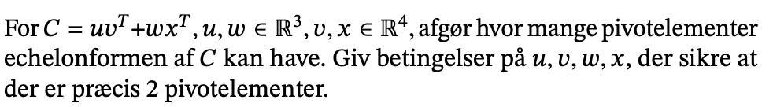

$$
\begin{pmatrix} 
u_1v_1 & u_1v_2 &u_1v_3 & u_1v_4 \\
u_2v_1 & u_2v_2 &u_2v_3 & u_2v_4 \\
u_3v_1 & u_3v_2 &u_3v_3 & u_3v_4
\end{pmatrix} +
\begin{pmatrix} 
w_1x_1 & w_1x_2 &w_1x_3 & w_1x_4 \\
w_2x_1 & w_2x_2 &w_2x_3 & w_2x_4 \\
w_3x_1 & w_3x_2 &w_3x_3 & w_3x_4
\end{pmatrix} =
\begin{pmatrix} 
u_1v_1 + w_1x_1 & u_1v_2 + w_1x_2 &u_1v_3 + w_1x_3 & u_1v_4 + w_1x_4 \\
u_2v_1 + w_2x_1 & u_2v_2 + w_2x_2 &u_2v_3 + w_2x_3 & u_2v_4 + w_2x_4 \\
u_3v_1 + w_3x_1 & u_3v_2 + w_3x_2 &u_3v_3 + w_3x_3 & u_3v_4 + w_3x_4
\end{pmatrix}
$$

Gamg første rækker $u_1^{-1}$

$$
\begin{pmatrix} 
v_1 + w_1x_1u_1^{-1} & v_2 + w_1x_2u_1^{-1} & v_3 + w_1x_3u_1^{-1} & v_4 + w_1x_4u_1^{-1} \\
u_2v_1 + w_2x_1 & u_2v_2 + w_2x_2 &u_2v_3 + w_2x_3 & u_2v_4 + w_2x_4 \\
u_3v_1 + w_3x_1 & u_3v_2 + w_3x_2 &u_3v_3 + w_3x_3 & u_3v_4 + w_3x_4
\end{pmatrix}
$$ Gang første række med med $u_2$ og træk fra anden række:

$$
 \begin{pmatrix} 
v_1 + w_1x_1u_1^{-1} & v_2 + w_1x_2u_1^{-1} & v_3 + w_1x_3u_1^{-1} & v_4 + w_1x_4u_1^{-1} \\
w_2x_1-w_1x_1u_1^{-1}u_2 & w_2x_2-w_1 x_2 u_1^{-1}u_2 & w_2x_3-w_1x_3u_1^{-1}u_2 & w_2x_4-w_1x_4u_1^{-1}u_2 \\
u_3v_1 + w_3x_1 & u_3v_2 + w_3x_2 &u_3v_3 + w_3x_3 & u_3v_4 + w_3x_4
\end{pmatrix}
 $$

Det kan reduceres til:

$$
 \begin{pmatrix} 
v_1 + w_1x_1u_1^{-1} & v_2 + w_1x_2u_1^{-1} & v_3 + w_1x_3u_1^{-1} & v_4 + w_1x_4u_1^{-1} \\
x_1(w_2-w_1u_1^{-1}u_2) & x_2(w_2-w_1  u_1^{-1}u_2) & x_3(w_2-w_1u_1^{-1}u_2) & x_4(w_2-w_1u_1^{-1}u_2) \\
u_3v_1 + w_3x_1 & u_3v_2 + w_3x_2 &u_3v_3 + w_3x_3 & u_3v_4 + w_3x_4
\end{pmatrix}
 $$

Nu lægger vi mærke til at anden række er egentlig vores vektor, x ganget
med en skalar.

Det samme skal vi gøre med 3. række. Brug første række og ganger med u3:

$$
 \begin{pmatrix} 
v_1 + w_1x_1u_1^{-1} & v_2 + w_1x_2u_1^{-1} & v_3 + w_1x_3u_1^{-1} & v_4 + w_1x_4u_1^{-1} \\
x_1(w_2-w_1u_1^{-1}u_2) & x_2(w_2-w_1  u_1^{-1}u_2) & x_3(w_2-w_1u_1^{-1}u_2) & x_4(w_2-w_1u_1^{-1}u_2) \\
x_1(w_3-w_1u_1^{-1} u_3) & x_2 (w_3 - w_1  u_1^{-1} u_3) & x_3 (w_3 - w_1 u_1^{-1} u_3) & x_4 (w_3 - w_1 u_1^{-1} u_3) 
\end{pmatrix}
 $$ Igen er det indeni parentesen blot en skalar.

Nu skal 3. række fjernes. 3 række er en skalaering af 2 række. Således
kan 3. række fjernes ved at gange igennem med
$\frac{w_3 - w_1 u_1^{-1} u_3}{w_2 - w_1 u_1^{-1} u_2}$ og trække fra 3.
række.

$$
 \begin{pmatrix} 
v_1 + w_1x_1u_1^{-1} & v_2 + w_1x_2u_1^{-1} & v_3 + w_1x_3u_1^{-1} & v_4 + w_1x_4u_1^{-1} \\
x_1(w_2-w_1u_1^{-1}u_2) & x_2(w_2-w_1  u_1^{-1}u_2) & x_3(w_2-w_1u_1^{-1}u_2) & x_4(w_2-w_1u_1^{-1}u_2) \\
0 & 0 & 0 & 0
\end{pmatrix}
 $$

Hvis $v_1$ er en skalar af $x_1$ så kan den sættes ud froan en parentes.

$$
x_1(\frac{v_1}{x_1} + w_1 u_1^{-1})
$$ Det kan vi hvis v1 er en skalar af x1.

Hvis vi vil fjerne anden række, så skal første række ganges med

$$\frac{w_2 - w_1 u^{-1} u_2 }{\frac{v_1}{x_1} + w_1 u_1^{-1}}$$

Tager vi og ganger første række med ovenstående og tækker fra 2 række så
får vi nul. Det kan vi så med følgende $$
\frac{x_1(\frac{v_1}{x_1} + w_1 u_1^{-1}) (w_2 - w_1 u^{-1} u_2) }{\frac{v_1}{x_1} + w_1 u_1^{-1}}
$$

Delene går ud med hinanden så vi ender med

$$
x_1(w_2 - w_1 u_1^{-1} u_2)
$$

Hvis vi trækker det fra 2 række vil den bliver nul. Så vil vi kun have 1
pivot element. Derfor kan man sige at hvis ikke det er muligt at dele v1
med x1 så kan vi ikke fjerne 2 række og vi vil have to pivot elementer.

# Opgave 5.5. Betragt

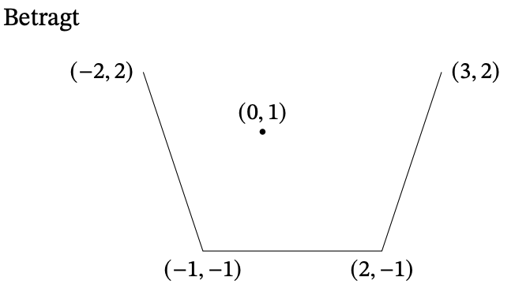

Bestem afstanden af punktet (0, 1) fra hver af disse linjer.

Vi har denne figur. Der er nogle punkter og for hver ende punkt er der
koordinater. VI vil bestemme afstande fra de tre linjer. Brug formlen
for projektion

Formel for $pr_v(u)$ punktet på L som ligger tættest på u er (projektion
til u):

$$
pr_v(u)=\frac{\langle u,v \rangle}{||v||_2}v
$$

formel for afstand mellem u og dens projektion er:

$$
||u-pr_v(u)||_2=\sqrt{||u_2^2||-||pr_v(u)||_2^2}
$$

Vi finder en vektor mellem to punktet og ud mod midten.

```{python}
import numpy as np
o = np.array([0.0, 1.0]) # punkt i midten
a = np.array([-2., 2.])
b = np.array([-1., -1.])
c = np.array([2., -1.])
d = np.array([3., 2.])
# Funktion til at beregne afstand.
# UUdregner projektionen
def afstand(a0, b0, o0):
  u_1 = o0 - a0 #  vektor fra ene endepunkt til anden.
  v_1 = b0 - a0 # mellem de to endepunkter. Dene ene vektor minus den anden. 
  pr_v = ((u_1 @ v_1) / np.linalg.norm(v_1) ** 2) * v_1 # det er formlen for projektionen.
  
  afstand = np.linalg.norm(u_1 - pr_v) # her bruger vi den anden formel. 
  return afstand
```

```{python}
afstand(a,b,o)
afstand(b,c,o)
```

# Opgave 5.6. Lad v0, v1, v2, v3, v4 være funktionerne 1, sin(𝑥), cos(𝑥), sin(2𝑥)

og cos(2𝑥) evalueret på 100 punkter jævnt fordelt over intervallet [0,
2𝜋], så disse kan betragtes som vektorer i ℝ100.

```{python}
import matplotlib.pyplot as plt
import numpy as np

```

-   Laver funktioenr forneden.

```{python}
x = np.linspace(0.0, 2 * np.pi, 100)
v0 = np.ones(100)[:, np.newaxis]
v1 = np.sin(x)[:, np.newaxis]
v2 = np.cos(x)[:, np.newaxis]
v3 = np.sin(2 * x)[:, np.newaxis]
v4 = np.cos(2 * x)[:, np.newaxis]
fig, ax = plt.subplots()
```

Plot funktionerne:

```{python}
ax.plot(x, v0)
ax.plot(x, v1)
ax.plot(x, v2)
ax.plot(x, v3)
ax.plot(x, v4)
plt.show()
```

Ud fra den kan vi se de er ca ortogonale. Man skal tænke de som vektor i
100 dimensionel space. De rører ikke hinanden og det betyder at de er
ortogonale.

Find prik produktet

Find prik produktet som vi gør forneden:

```{python}
print("v0, v1")
print(np.vdot(v0, v1) / (np.linalg.norm(v0) * np.linalg.norm(v1)))

print("v0, v2")
print(np.vdot(v0, v2) / (np.linalg.norm(v0) * np.linalg.norm(v2)))

print("v0, v3")
print(np.vdot(v0, v3) / (np.linalg.norm(v0) * np.linalg.norm(v3)))

print("v0, v4")
print(np.vdot(v0, v4) / (np.linalg.norm(v0) * np.linalg.norm(v4)))

print("v1, v2")
print(np.vdot(v1, v2) / (np.linalg.norm(v1) * np.linalg.norm(v2)))
```

Her ser vi at mange af dem ligger tæt på nul. De er mindre end machine
epsilon. De er ca ortogonale.

```{python}
# matrix til at projekterer.
P = 1 / np.vdot(v0, v0) * v0 * v0.T + \
    1 / np.vdot(v1, v1) * v1 * v1.T + \
    1 / np.vdot(v2, v2) * v2 * v2.T + \
    1 / np.vdot(v3, v3) * v3 * v3.T + \
    1 / np.vdot(v4, v4) * v4 * v4.T 
    
```

```{python}
u = (x ** 2)[:, np.newaxis] # x: {ndarray: (100, 1)}
u_proj = P @ u

print(np.amax(abs(u - u_proj)))
```

Det viser den største forskel mellem u og u proj.

```{python}
ax.plot(x, u)
ax.plot(x, u_proj) 
ax.plot(x, abs(u - u_proj))
plt.show()
```

Man kan se en forskel.

## (a) Bekræft at v0, v1, v2, v3, v4 er næsten ortogonal, ved at beregne cos 𝜃 for

vinklerne 𝜃 mellem de forskellige vektorer. Plot funktionerne.

Er gjort foroven.

## (b) Lad u være vektoren i ℝ100, som dannes ved at evaluere funktionen 𝑥

2 på de samme 100 punkter. Bestem projektionen af u langs samlingen v0,
v1, v2, v3, v4 og plot resultatet. Hvad er den maksimale afvigelse
mellem u og dens projektion?

## (c) Tilføj to ekstra vektorer v5, v6 svarende til funktionerne sin(3𝑥) og

cos(3𝑥). Find og plot den nye tilnærmelse til 𝑥 2 via projektion af u
langs samlingen v0,...,v6.

```{python}
v5 = np.sin(3 * x)[:, np.newaxis]
v6 = np.cos(3 * x)[:, np.newaxis]
```

```{python}
P_2 = 1 / np.vdot(v0, v0) * v0 * v0.T + \
    1 / np.vdot(v1, v1) * v1 * v1.T + \
    1 / np.vdot(v2, v2) * v2 * v2.T + \
    1 / np.vdot(v3, v3) * v3 * v3.T + \
    1 / np.vdot(v4, v4) * v4 * v4.T  + \
    1 / np.vdot(v5, v5) * v5 * v5.T  + \
    1 / np.vdot(v6, v6) * v6 * v6.T 
```

```{python}
u_proj2 = P_2 @ u

ax.plot(x, u_proj2)
ax.plot(x, abs(u - u_proj2))
plt.show()
```

Får ikke helt samme plot.

## (d) Prøv at lave tilsvarende approksimationer til funktionen

```{python}
w = np.concatenate((np.ones(50), np.zeros(50)))[:, np.newaxis]
w_proj = P @ w
ax.plot(x,w)
ax.plot(x,w_proj)
plt.show()
```

# Opgave 6.2 Betragt de følgende vektorer

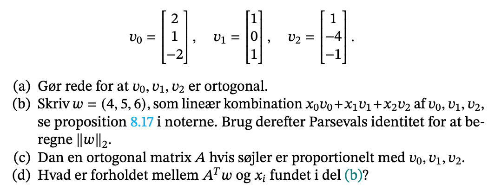

## c) dan en ortogonal matrix A hvis søjler er proportionalet med v0, v1, v2.

Vi kan opstile en ortogonal matrix A hvis søjler er proportionelle med
vores samling

$$
A = 
$$

```{python}
A = np.array([
  [2, 1, 1],
  [1, 0, -4],
  [-2, 1, -1]
])
A
np.linalg.inv(v_0).dot(np.array([1])) 

```

For den er ortoginal skal den transponeres være identitet


ortonormale vektorer har længden 1.

## d) hvad er forholdet

Hvis vi transporonerer denne og anvender den på w får vi:

$$
A^Tw=A^TVx=diag(a,b,c)V^TVx=diag(a,b,c)Gx
$$

Vi kender grammatricen fra tidligere og dermed får vi sammenhængen

$$
\begin{pmatrix}
9a & 0 & 0 \\
0 & 2b & 0 \\
0 & 0 & 18c
\end{pmatrix}
$$ Hvis vi havde valgt nogle værdier for bogstaverne ville det blive
identitets matricen.

## a) gør rede for de er ortogonale

To vektorer er vinkelrette på hianden hvis deres indre produkt er lig 0
(8.1)

```{python}
import numpy as np
v_0 = np.array([[2],
                [1],
                [-2]])
                
v_1 = np.array([[1],
                [0],
                [1]])
                
v_2 = np.array([[1],
                [-4],
                [-1]])                
                
```

```{python}
a = np.vdot(v_0, v_1)
b = np.vdot(v_0, v_2)
c = np.vdot(v_1, v_2)

print(a)
print(b)
print(c)
```

Dermed kan vi se de er nul og de er ortogonale.

> vdot transponerer dem automatisk.

### med gram matricen

```{python}
v0 = np.array([2.0, 1.0, -2.0])[:, np.newaxis]
v1 = np.array([1.0, 0.0, 1.0])[:, np.newaxis]
v2 = np.array([1.0, -4.0, -1.0])[:, np.newaxis]
V = np.hstack((v0, v1, v2))
G = V.T @ V

print('G=\n', G)

```

Ser den er diagonal så det betyder den er ortogonal.

## b) Lineær kombinatoin, parsevals identitet.

Brug her proposition 8.17:


```{python}
w = 4 * v_0 + 5 * v_1 + 6 * v_2
w

x_0 = np.vdot(w, v_0) / np.linalg.norm(v_0)**2
x_1 = np.vdot(w, v_1) / np.linalg.norm(v_1)**2
x_2 = np.vdot(w, v_2) / np.linalg.norm(v_2)**2
print(x_0)
print(x_1)
print(x_2)
```

Lidt i tvivl om det er korret.

Nu skal vi vise Persavals identitet.

```{python}
x_0 **2 * (np.linalg.norm(v_0)) ** 2 + x_1**2+x_1*(np.linalg.norm(v_1))**2 + \
x_2**2 * (np.linalg.norm(v_2))**2
```

Ud fra instruktor skal vi finde

$$
Vx = w\\
w = (4,5,6)\\
x=V^{-1}w
$$

```{python}
w = np.array([4.,5.,6])[:, np.newaxis]
x = np.linalg.inv(V) @ w
print('det(V)=', np.linalg.det(V))
print('x= \n', x)
```

Ovenståender har vi løst ligning system.

Parcevals identitet siger at:

```{python}
norm_w = x[0]**2*np.linalg.norm(v0)**2 + x[1]**2*np.linalg.norm(v1)**2 + \
         x[2]**2*np.linalg.norm(v2)**2 
print('norm med parcevals identitet;', np.sqrt(norm_w[0]))         
print('norm med numpys identitet;', np.linalg.norm(w))         
```

# Opgave 6.3

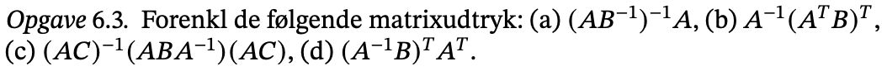

## a)

$$
(AB)^{-1}A\\
= (B^{-1})^{-1}A^{-1}A\\
= BI
= B
$$ \#\# b)

$$
A^{-1}(A^TB)^T\\
= A^{-1}B^T(A^T)^T\\
= B^TI\\
B^T
$$ \#\# c)

$$
(AC)^{-1}(ABA^{-1})(AB)\\
C^{-1}AA^{-1}BA^{-1}AC \\
C^{-1}BA^{-1}AC \\
C^{-1}BC\\
$$

## d)

\$\$ (A^{-1}B)^{T} \cdot A\^{T}\\

B^T(A^{-1})\^T \cdot A\^{T}\\ B^T^\cdot (AA{-1})\^T\\ B^TI^T\\ B\^TI \\
B\^T \$\$

# Opgave 6.4

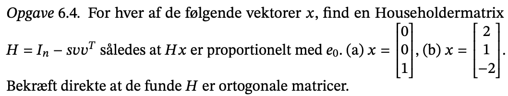

vi ved ikk hvad s, v

Brug noter og se


Der ønskes at

$$
H_x=te_0=\begin{pmatrix} t\\0\\0 \end{pmatrix}
$$ hvor

$$
H=I-svv^T
$$

Fra noterne ved vi at:

$$
v=\frac{1}{s}(e_0-\epsilon u)
$$ hvor u er en enhedsvektor

$$
s=1-\epsilon u_0=1+|u_0|\ge1
$$

## a)

x = (0,0,1) vi finder først enhedsvektor:

$$
u=\frac{x}{\sqrt(0^2+o^2+1^2)}=0
$$ Vi før dermed at $u_0=x_0=0\rightarrow\epsilon=-1$, hvilket mefører
at:

$$
s=1+0=1
$$

\$\$ v=\frac{1}{s}(e\_=-\epsilon u)=\frac{1}{1} ()

```{=tex}
\begin{pmatrix} 
1 \\ 0 \\ 0
\end{pmatrix}
```
-   

    ```{=tex}
    \begin{pmatrix} 
    0 \\ 0 \\ 1
    \end{pmatrix}
    ```

)=

```{=tex}
\begin{pmatrix} 
1 \\ 0 \\ 1
\end{pmatrix}
```
\$\$ det indsætte vi ind i definitionen

$$
H =
\begin{pmatrix} 
1 & 0 & 0 \\ 0 & 1 & 0 \\ 0 & 0 & 1
\end{pmatrix}
-1
\begin{pmatrix} 
1 \\ 0 \\ 1
\end{pmatrix}
\begin{pmatrix} 
1 &0&1
\end{pmatrix}=
\begin{pmatrix} 
0 & 0 & -1 \\ 0 & 1 & 0 \\ -1 & 0 & 0
\end{pmatrix}
$$

Er den ortogonal?

```{python}
Ha = np.array([
  [0,0,-1],
  [0,1,0],
  [-1,0,0]])
x = np.array([0,0,1])[:, np.newaxis]
print(Ha@x)
```

vi får at Hx er en skalering af vores enhedsvektor.

et andet eksempel

```{python}
Ha.T@Ha
```

får identitetsmatricen så vores matrix opfylder det den skulle og så er
den også ortogonal.

## b)

Vi gør det samme, men nu for

$$
x = 2,1,-1
$$

$$
u=\frac{x}{\sqrt{2^2+1^2+(-2)^2)}}=\frac{1}{3}x \\
u_0=\frac{1}{3}x_0=\frac{2}{3}\rightarrow\epsilon=-1 \\
s=1+\frac{2}{3}=\frac{5}{2}\\
v = \frac{3}{5}
(
\begin{pmatrix}
1 \\ 0 \\ 0
\end{pmatrix}
+
\begin{pmatrix}
2/3 \\ 1/3 \\ -2/3
\end{pmatrix}
) =\begin{pmatrix}
1 \\ 1/5 \\ -2/5
\end{pmatrix}\\
$$

$$
H =
\begin{pmatrix} 
1 & 0 & 0 \\ 0 & 1 & 0 \\ 0 & 0 & 1
\end{pmatrix}
-\frac{3}{5}
\begin{pmatrix} 
1 \\ 1/5 \\ -2/5
\end{pmatrix}
\begin{pmatrix} 
1 &1/5&-2/5
\end{pmatrix}=
\begin{pmatrix} 
-2/3 & -1/3 & 2/3 \\ -1/3 & 14/15 & 2/15 \\ 2/3 & 2/15 & 11/15
\end{pmatrix}
$$ vi væler epsilon men det er ligegyldig hvilken værdi den får.

Det kan vi ligesom før også afprøve

# Opgave 6.5

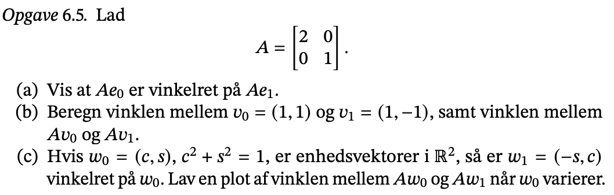

()## a) vis A er vinkelret

```{python}
A = np.array([[2., 0.],
              [0., 1.]])
e0 = np.array([1., 0.])[:, np.newaxis]              
e1 = np.array([0., 1.])[:, np.newaxis]              
```

```{python}
Ae0 = (A @ e0)
Ae1 = (A @ e1)
np.vdot(Ae0, Ae1)
```

den er vinkel ret

da scalar produktet er lig 0 er de to vektorer vinkelrette \#\# b)
beregn vinklen

```{python}
v0 = np.array([1., 1.])
v1 = np.array([1., -1.])
unit_v0 = np.linalg.norm(v0)
unit_v1 = np.linalg.norm(v1)
```

brug

$$
grader = \frac{radianer\cdot180}{\pi}\ \hat a \cdot\hat b=|a|\cdot |b|*cos(v)
$$

```{python}
cosv = (np.dot(v0,v1)) / (unit_v0 * unit_v1)
v    = (np.arccos(cosv)*180)/np.pi
v
```

Vinklen er 90 grader mellem v0 og v1.

```{python}
Av0 = A @ v0
Av1 = A @ v1
unit_Av0 = np.linalg.norm(Av0) 
unit_Av1 = np.linalg.norm(Av1)
cosAv = (np.dot(Av0,Av1)) / (unit_Av0 * unit_Av1)
Av    = (np.arccos(cosAv)*180)/np.pi
Av
```

vinklen er 53 grader mellem av0 og av1

## c) hvis w0= er enheds lav en plot af vinklen mellem.

Vi får af vide at de to vektorer c og s. Det gælder at de i anden er 1.

```{python}
import matplotlib.pyplot as plt
co = np.linspace(-1., 1., 100)
si = np.sqrt(1-co**2)

w00 = np.array([co,si])
w11 = np.array([-si,co])
A   = np.array([[2., 0.],
                [0., 1.]])
A_w00 = A@w00
A_w11 = A@w11
costh = []

for n in range(0,100):
  a = ((A_w00[:,n] @ A_w11[:,n]) / (np.linalg.norm(A_w00)*np.linalg.norm(A_w11)))
  costh.append(a)

costh_rad = np.arccos(costh)
costh_grad = np.arccos(costh) / (np.pi) * 180

fig, ax = plt.subplots()
ax.plot(co, costh_grad)
plt.show()
```

vi har en 2 x 100 matrix.

Hvis cos er 1 er de vinkelrette. så er sin 0. det giver

$$
Aw_0=
\begin{pmatrix}2 &0 \\0 & 1 \end{pmatrix}
\begin{pmatrix} 
c \\ s
\end{pmatrix}=
\begin{pmatrix} 
2c\\s
\end{pmatrix}
$$ \$\$ Aw_0\bot A_w\leftarrow \rightarrow\langle Aw_0,Aw_1\rangle = 0
\\ \langle 

```{=tex}
\begin{pmatrix} 
2c \\s
\end{pmatrix}
```
,

```{=tex}
\begin{pmatrix} 
-2s\\c
\end{pmatrix}
```
\rangle=-4sc+sc=0 \$\$ dette er kun sandt hvis enten c = 0 eller s = 0,
korrsonerede med w0, w1 er parallelle med e0, e1 eller e1 e0.

# Opgave 6.6

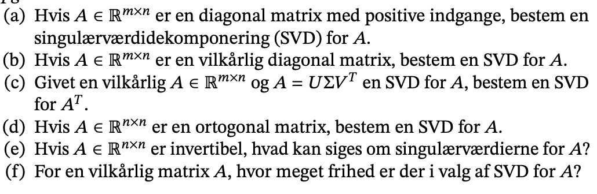

Generalt er svd ikke unik, Så der er meget stor frihed, så længde vores
svd overholder definitionen på en svd. \#\# e) hvis A er invertibel hvad
kan siges om singulærværdier for A

Hvis A er invertibel gælder det at det(A) forskelle 0, så

$$
det(A) = det(V\Sigma U^T)\\
=det(V)det(\Sigma)det(U^T)\ne0
$$

idet det(sigma) = sigma0,sigma1,sigma2.., gælder det at alle sigmai er
forskellig fra 0.

## d) A er ortogonal bestem SVD

Hvis matrix anvendt på sig selv giver dens inverse er det
identitetsmatrice.

idet A er ortogonal må det gælde

$$
A^TA=V\Sigma U^TU \Sigma V^T =I_n \\
A^TA=V\Sigma \Sigma V^T=I_n \\
\Sigma \Sigma=I_n \\
\Sigma =I_n
$$

kender svd for A og transponerede. Det kan vi indsætte så vi ender med
identitet matricen.

Sigma er altså sin egen inverse, hvilket kun opfyldes af
identitetmatricen:

$$
A=UI_nV^T=UV^T
$$

## c) bestem svd for A.T

$$
A^T=(U\Sigma V^T)^T\\
=V\Sigma^T U^T \\
= V\Sigma U^T 
$$

Sigma er diagonal og når vi transponerer den får vi den selv.

## b) nu vilkårlig diagonal

det samme som i a bortset fra at nogen af værdiern i V.T vil være
negative for så singulærværdierne kan være positive.

A må have negative værider.

Sigma er den samme.

En singulær værdi kan ikke være negativ.

Vt må have nogle negative værdier for at udligne dem.

## a) hvis A er diagonal bestem en singulærværdidekomponerin SVD for A

enhver matrix har en singulærværdikomponering, hvor u og v er ortogonal.
sigma er en diagonal matrix. De er sorteres efter størrelse.

Hvi A er en diagonal matrix så er en SVD for A:

$$
A=U\Sigma V^T
$$

hvor U og V.T er matricer der udfører rækkeoperationer på (byt om på
rækker) sigma, som indeholde de samme værider som A, men bare sorteret
efter størrelse. U og V.T vil kun indeholde indgange der er 0 eller 1.


# Opgave 7.1


### a)

sin diff er cos

ser at de er mindre en 1, så hvis vi får en floating fejl, så vil den vokse lineære og ikke en eksponentiel stining. Fejlen skal helst være så tæt på 1 som muligt.

Hvad vhis nævner kommer tæt på nul. Så bliver fejlen uendelig stor. 

### b)

Det ser ud til vi skal bruge en formel for at lave beregningen.

$$

\kappa = \frac{||x||f'(x)}{f(x)}\\
= \frac{x*cos(x)}{sin(x)}
$$

```{python}
import numpy as np
x = np.linspace(0, 6, 100)
y = np.sin(x)
```

Her skal vi bruge den anden formel hvor vi har gradienten. 


Her ser vi at fejlen vil vokse polomiel i stedet. 


# Opgave 7.2

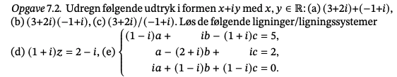

## a)

$$
(3+2i) +(-1+i)
$$

```{python}
z = 3.0 + 2.0j
w = (-1.0+1.0j)
z + w
```


som er løsningen.


## b)

```{python}
(3.0+2.0j)*(-1.0+1.0j)
```

## c)

```{python}
(3.0+2.0j)/(-1.0+1.0j)
```

## d)

```{python}
def switch(A, i, j):
  A[[i, j], :] = A[[j, i], :]
 
def scale(A,i, s):
  A[i, :] *= s
 
def increase(A, i, j, s):
  A[i, :] += A[j, :] * s
```

```{python}
import numpy as np
D = np.array([[1.0 + 1.0j, 2.0-1.0j]])

print("D: \n" + str(D))
scale(D, 0, 1 / D[0,0])
print("\n" + str(D))
increase()
```


## e)

```{python}
E = np.array([ 
  [1- 1j, 1j,-(1+1j)],
  [1, -(2+1j),1j],
  [1j,1-1j,1-1j]
])

b = np.array([5,2,0])
x = np.linalg.solve(E,b)
print(np.round(x,5))
```
  

# Opgave 7.3

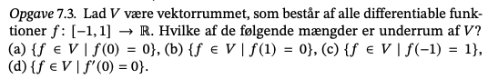

defition 12.1 vektorrum består af mængde V hvis elementer vi kalder vektor.

definition 12.11: en ikke tim delmængde w delmænde V er et underum hvis sum og
skalarmultiplikaiton sender element W til elementer W.

vi skal undersøge om det er et underrum. Vi får af vide f har funktionsværdier mellem -1 og 1. Her skal vi undersøge om de forskellige er underrum. Her skal vi bruge de tre definitioner i 12.11

- a) W er ikke tom,
- b) v,w $\in W$ medfører $n+w\in W$,
- c) $w\in W$ og s en skalar medfører $sw\in W$
 
## a) {f \in V | f(0) = 0}

For alle gælder det at V ikke er tom. FOr den anden regle så deler vi op og pludser. Da 0 er en del af funktionsværdien eller intervallet for værdier vi acceptere, så er b også overholdt.  Det handler altså om at se om hvis vi enden lægger to værdier sammen eller ganger en skalar på, så skal vores resultat være en del af de funktionerværdier som V må antage. 

$$
\begin{align*}
    g=f_i+f_j,&&\text{  } g(0) =f_i(0)+f_j(0)=0\\
    g=sf_i, &&g(0)=sf_i(0)=s0=0\\
    \text{Er underrum}
\end{align*}
$$

## b) f(1) = 0

$$
\begin{align*}
    g=f_i+f_j,&&\text{  } g(1) =f_i(1)+f_j(1)=0\\
    g=sf_i, &&g(1)=sf_i(1)=s0=0\\
    \text{Er underrum}
\end{align*}
$$


## c) f(-1) = 1

 

$$
\begin{align*}
    g=f_i+f_j,&&\text{  } g(-1) =f_i(-1)+f_j(-1)=2\\
    \text{Ikke underrum}
\end{align*}
$$

## d) f'(0)=0


$$
\begin{align*}
    g=f_i+f_j, &&\text{  } g'(0) =f_i'(0)+f_j'(0)=0\\
    g=sf_i, &&\text{} g'(0)=sf_i'(0)=0 \\
    \text{Er underrum}
\end{align*}
$$

# Opgave 7.4

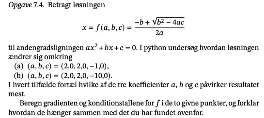
Hvis en delmængde skal være et underrum skal mængden ikke være tom.

Betragt ovenstående løsning til andengradligningen $ax^2+bx+c=0$

Brug wolframe alhp til beregningen af gradienten.

$$
\begin{align*}
\nabla f(x)=(1/4-\sqrt 3 /12, \sqrt 3 / 12-1/4, -\sqrt 3 / 6) && \text{gradienten}
\end{align*} \\
$$
$$
\kappa(x) =\frac{||(2.0, 2.0, -1.0)||_2||(-1,0,1||_2}{|f(x)|} \\
$$
$$ 
= \frac{\sqrt{2.0^2+2.0^2+(-1)^2}||(1/4-\sqrt 3 /12, \sqrt 3 / 12-1/4, -\sqrt 3 / 6)||_2}{|\frac{-b+\sqrt{b^2-4ac}}{2a}|}
$$

### simons løsning

```{python}
def f(a, b, c):
  return (-b + np.sqrt(b**2 -4*a*c))/(2*a)

print(f(2,2,-1))
print(f(2.1,2,-1))
print(f(2,2.1,-1))
print(f(2,2,-1.1))
  
```

Ved ovenstående ser simon hvilken der varier mest, da en del af opgaven netop beståe i at udtale sig om hvilken der.


```{python}
def gradf(a,b,c):
  x = ((-b**2 + 2*a*b)/np.sqrt(b**2 - 4*a*c) + b) / 2*a
  y = (b/np.sqrt(b**2-4*a*c)+1)/2*a
  z = -1/np.sqrt(b**2-4*a*c)
  return np.array([x, y, z])

print("K(2,2,-1) = ", \
        np.linalg.norm(gradf(2,2,-1))*\
        np.linalg.norm(np.array([2,2,-1]))/\
        abs(f(2,2,-1)))
print("K(2,2,-10) = ", \
        np.linalg.norm(gradf(2,2,-10))*\
        np.linalg.norm(np.array([2,2,-10]))/\
        abs(f(2,2,-10)))
```

Udregner gradienten.

FInd konditionstallet for de to punkter. Bruger formlen på noter.

Får to forskellige tal 29 og 15 og dem relateres tli variationen. 

Vi vil gerne have et konditionstal mellem 1 og 10, da det er til at acceptere, menss hvis de er over så sker der for store fejl. 


```{python}
import numpy as np
import math

# definer gradient
first = np.array([(1/4) - (math.sqrt(3) / 6), \
                  (math.sqrt(3)/12 - (1/4)), \
                  (math.sqrt(3) / 6)])
                 
# udregner længden
value1 = np.linalg.norm(first)
 
print("Normen af gradienten for første funktion er: ", value1)
print("Den partiel afledte for a: ", (1/4) - (math.sqrt(3) / 6))
print("Den partiel afledte for b: ", (math.sqrt(3) / 12) - (1/4))
print("Den partiel afledte for c: ", -(math.sqrt(3) / 6))

# Den partielle afledte som varier mest
# siden c har den største absolutte værdi, så er denne den som varier mest.

a = 2.0
b = 2.0
c = -1.0

# udregner konditionstal
((math.sqrt(a**2+b**2+c**2) *value1) * (2*a)) / \
(-b + math.sqrt(b**2 - 4 * a * c)) 
```

c har altså den største påvirkning, hvor den er

$$
\kappa(x)=2.54
$$

## b) lavet foroven.

# Opgave 7.5

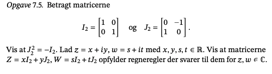


