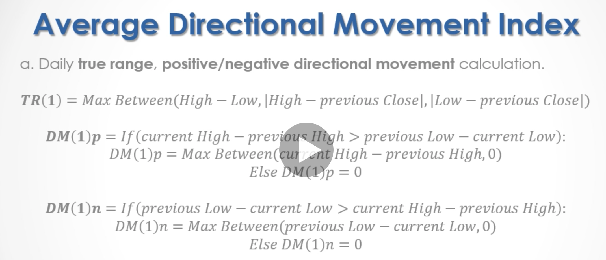

```{r setup, include=FALSE}
knitr::opts_chunk$set(echo = FALSE)
library(quantmod)
library(highcharter)
library(dplyr)
library(magrittr)
library(tidyquant)
library(ggplot2)
library(plotly)
```

Den **simple moving average** (på dansk glidende gennmsnit (SMA)) er en arithmeisk glidende gennemsnit beregning ved at lægge tidligere priser sammen og dele med tidsperioden. F.eks kan vi tage lukke prisen og dele med antal af periode. Det er givet ved formlen:

$$
SMA=\frac{A_1+A_2+...+A_n}{n}
$$

Det er en meget kendt og brugt teknisk indikator, der kan hjælper med at finde ud af om en aktie er i trend eller ej. 

```{r}
buser <- tq_get("ORSTED.CO", get="stock.prices")
my_palette <- c("black", "blue", "red")
```

```{r}
myBBands <- function (price,n,sd){
  mavg <- SMA(price,n)
  sdev <- rep(0,n)
  N <- nrow(price)
  for (i in (n+1):N){
    sdev[i]<- sd(price[(i-n+1):i])
  }
  sdev <- sqrt((n-1)/n)*sdev
  up <- mavg + sd*sdev
  dn <- mavg - sd*sdev
  pctB <- (price - dn)/(up - dn)
  output <- cbind(dn, mavg, up, pctB)
  colnames(output) <- c("dn", "mavg", "up", 
        "pctB")
  return(output)
}
```

```{r}

buser <- tq_get("ORSTED.CO", get="stock.prices")

SPY <- buser

bb <-myBBands(Cl(SPY %>% timetk::tk_xts(date_var = "date")), n = 20, sd = 2)

full_data <- SPY %>% 
  tq_mutate(ohlc_fun = Cl, mutate_fun = SMA, n = 5) %>% 
  rename(SMA.5 = SMA) %>% 
  tq_mutate(ohlc_fun = Cl, mutate_fun = SMA, n = 21) %>%
  rename(SMA.21 = SMA) %>% 
  tq_mutate(
    select = c(high, low),
    mutate_fun = SAR,
    accel = c(0.02, 0.2),
    col_rename = "sar") %>% 
  tq_mutate(
    select = c("high", "low", "close"),
    mutate_fun = ADX,
    n = 14,
    maType = "SMA"
  ) %>% 
    tq_mutate(select     = c(high, low, close), 
            mutate_fun = WPR, 
            n = 14) %>% 
  tq_mutate(
    select = c("high", "low", "close"),
    mutate_fun = CCI,
    n = 14,
    maType = "SMA"
  ) %>%
  tq_mutate(select     = close, 
            mutate_fun = MACD, 
            nFast      = 12, 
            nSlow      = 26, 
            nSig       = 9, 
            maType     = SMA) %>%
  mutate(diff = macd - signal) %>% 
  tq_mutate(select     = close, 
            mutate_fun = ROC, 
            n       = 21) %>% 
  tq_mutate(select     = close, 
            mutate_fun = RSI, 
            n       = 14) %>% 
  tq_mutate(select     = c(high, low, close), 
            mutate_fun = SMI, 
            n = 13,
            nFast = 2, 
            nSlow = 25,
            nSig = 9)

meta_adx <- full_data %>% 
  tidyr::pivot_longer(
    cols = c("DIp", "DIn", "ADX"),
    names_to = "Indicator",
    values_to = "Indicator_value"
  )  

meta_smi <- full_data %>% 
  tidyr::pivot_longer(
    cols = c("SMI", "signal"),
    names_to = "Indicator", 
    values_to = "Indicator_value"
  )
```


```{r,layout="l-screen-inset", fig.width=6, fig.height=20}
highchart(type = "stock") %>% 
  hc_yAxis_multiples(
    create_yaxis(6, height = c(2, 1, 1, 1, 1,1), turnopposite = TRUE)
  ) %>% 
  hc_add_series(SPY %>% timetk::tk_xts(date_var = "date"), yAxis = 0, name = "SPY")  %>% 
  hc_add_series(full_data %>% 
                  select(date, SMA.5) %>% 
                  timetk::tk_xts(date_var = "date"),
                yAxis = 0, 
                name = "SMA - 5") %>% 
  hc_add_series(full_data %>% 
                  select(date, SMA.21) %>% 
                  timetk::tk_xts(date_var = "date"),
                yAxis = 0, 
                name = "SMA - 21") %>% 
  hc_add_series(full_data %>% 
                  select(date, sar) %>% 
                  timetk::tk_xts(date_var = "date"),
                yAxis = 0, 
                name = "SAR",
                type = "line") %>% 
  hc_add_series(SPY %>% timetk::tk_xts(date_var = "date") %$% volume , color = "gray", yAxis = 1, name = "Volume", type = "column") %>% 
  hc_add_series(full_data %>% timetk::tk_xts(date_var = "date") %$% ADX, yAxis = 2, name = "ADX", type = "line") %>% 
  hc_add_series(full_data %>% timetk::tk_xts(date_var = "date") %$% DIn, yAxis = 2, name = "DIn", type = "line") %>% 
  hc_add_series(full_data %>% timetk::tk_xts(date_var = "date") %$% DIp, yAxis = 2, name = "DIp", type = "line") %>% 
  hc_add_series(full_data %>% timetk::tk_xts(date_var = "date") %$% WPR, yAxis = 3, name = "WPR", type = "line") %>% 
  hc_add_series(full_data %>% timetk::tk_xts(date_var = "date") %$% ROC, yAxis = 4, name = "ROC", type = "line") %>%
  hc_add_series(bb %$% dn, yAxis = 5, name = "bb-down", type = "line") %>% 
  hc_add_series(bb %$% mavg, yAxis = 5, name = "bb-mavg", type = "line") %>% 
  hc_add_series(bb %$% up, yAxis = 5, name = "bb-up", type = "line") %>% 
  hc_add_series(SPY %>% timetk::tk_xts(date_var = "date"), yAxis = 5, name = "SPY")
  
```


## Udemy course

- Ser på technical indicator til at finde trend. 
- momentum (tendenct of either rising or falling prices to keep doing so)
- Bruger S%P 500 state exchange traded. 
- Kan hente det eller bruge yahoo.
- Bruger TTR, quantmod og performanceAnalytics r pakker. 


```{r}
library(TTR)
library(quantmod)
library(PerformanceAnalytics)
library(tidyquant)
```


```{r}
SPY %>% 
  ggplot(aes(x = date, y = close)) +
  geom_line() +
  labs(title = "AAPL Line Chart", y = "Closing Price", x = "") + 
  theme_tq()
```

```{r}
SPY %>%
  ggplot(aes(x = date, y = close)) +
  geom_barchart(aes(open = open, high = high, low = low, close = close)) +
  labs(title = "AAPL Bar Chart", y = "Closing Price", x = "") + 
  theme_tq()
```

```{r}
SPY %>%
  ggplot(aes(x = date, y = close)) +
  geom_candlestick(aes(open = open, high = high, low = low, close = close)) +
  labs(title = "AAPL Bar Chart", y = "Closing Price", x = "") + 
  theme_tq()
SPY %>% 
  timetk::tk_xts(date_var = "date") %>% 
  hchart()
```

## Appendix

- Laggin stock technical indicator bruges til at følge pris bevægelser.
- Moving averages MA bruges til at identificer trend. SMA og EMA er populær

$$
SMA_n=\frac{sum_n(Close)}{n}
$$

$$
EMA_n = \frac{2}{n+1}\cdot (currenc Close - preciois EMA) + previous EMA
$$

### SMA

```{r}
SPY %>% 
  tq_mutate(ohlc_fun = Cl, mutate_fun = SMA, n = 5) %>% 
  rename(SMA.5 = SMA) %>% 
  tq_mutate(ohlc_fun = Cl, mutate_fun = SMA, n = 21) %>%
  rename(SMA.21 = SMA) %>% 
  select(date, close, SMA.5, SMA.21) %>%
  tidyr::gather(key = type, value = price, close:SMA.21) %>% 
  hchart("line", hcaes(x = date, y = price, group = type))

```
- den smiple i rød minder mere om data. Den 21 er mere smooth. 

$$
\text{Buy signal: Previous (Close < } SMA_5) \rightarrow \text{Current (Slose > }SMA_5)\\
\text{Sell signal: Previous (Close > } SMA_5) \rightarrow \text{Current (Slose < }SMA_5)\\
$$

### EMA

```{r}
SPY %>% 
  # se på MA
  # # Cl er close.
  tq_mutate(ohlc_fun = Cl, mutate_fun = EMA, n = 5) %>% 
  rename(SMA.5 = EMA) %>% 
  tq_mutate(ohlc_fun = Cl, mutate_fun = EMA, n = 21) %>%
  rename(SMA.21 = EMA) %>% 
  select(date, close, SMA.5, SMA.21) %>%
  tidyr::gather(key = type, value = price, close:SMA.21) %>% 
  ggplot(aes(x = date, y = price, col = type)) +
  geom_line() +
  scale_colour_manual(values = my_palette) + 
  theme(legend.position="bottom") +
  ggtitle("Glidende gennemsnit") +
  xlab("") + 
  ylab("Stock Price") +
  theme_tq() 
```
- Minder om SMA i mønster.

## Bolling bands

- er overlay der identificer statistiker nomarl stock pris bevægelse. 20 dage og t.

$$
mindleband = SMA_{20}(CLOSe) \\
Upper \ band = SMA_{20}{Close} + 2 * SRDEV_{20}(Close)\\
Lower \ band = SMA_{20}{Close} - 2 * SRDEV_{20}(Close)
$$
```{r}
SPY %>% 
  ggplot(aes(x = date, y = close, 
             open = open, high = high, low = low, close = close, 
             group = symbol)) +
  geom_barchart() +
  geom_bbands(ma_fun = SMA, sd = 2, n = 20, linetype = 5) +
  labs(title = "FANG Bar Chart", 
       subtitle = "BBands with SMA Applied, Experimenting with Multiple Stocks", 
       y = "Closing Price", x = "") +
  theme_tq()

```
- en del af lag indikator.

## parabolix stop and reverse

- identifiere reversal punkter mellem uptrend og downtrend.
- læs j welles wilder new concepts in technical trading system.
- En extreme point.

```{r}
sar_value <- SPY %>% 
  tq_mutate(
    select = c(high, low),
    mutate_fun = SAR,
    accel = c(0.02, 0.2),
    col_rename = "sar") %>% 
  timetk::tk_xts(date_var = "date")

SPY %>% 
  timetk::tk_xts(date_var = "date") %>% 
  hchart() %>% 
  hc_add_series(sar_value$sar, type = "scatter")
```


## Average directional movement index indicator

- Finder momentum for at se om prisen skal op eller ned.
- ADX er en bounded oscilator der måler stock pris trend styrke og momentum. 14 dages bruges til beregning.
- læs new concepts in technical trading system. Welles Wilder. 



```{r}
SPY %>% 
  tq_mutate(
    select = c("high", "low", "close"),
    mutate_fun = ADX,
    n = 14,
    maType = "SMA"
  ) %>% 
  tidyr::pivot_longer(
    cols = c("DIp", "DIn", "ADX"),
    names_to = "Indicator",
    values_to = "Indicator_value"
  ) %>% 
  hchart("line", hcaes(x = date, y = Indicator_value, group = Indicator )) 
```


## commodity channel index

- CCI, bruger pris variation fra mean.

```{r}
SPY %>% 
  tq_mutate(
    select = c("high", "low", "close"),
    mutate_fun = CCI,
    n = 14,
    maType = "SMA"
  ) %>% 
  hchart("line", hcaes(x = date, y = cci))
```


## (MACD) MOving aveagers convergence /divergence indicator

- MACD
- center ossicilator, og ser på trend. 

```{r}
SPY %>% 
  tq_mutate(select     = close, 
            mutate_fun = MACD, 
            nFast      = 12, 
            nSlow      = 26, 
            nSig       = 9, 
            maType     = SMA) %>%
  mutate(diff = macd - signal) %>%
  select(-(open:volume)) %>% 
  ggplot(aes(x = date)) + 
  geom_hline(yintercept = 0, color = palette_light()[[1]]) +
  geom_line(aes(y = macd)) +
  geom_line(aes(y = signal), color = "blue", linetype = 2) +
  geom_bar(aes(y = diff), stat = "identity", color = palette_light()[[1]]) +
  labs(title = "FANG: Moving Average Convergence Divergence",
       y = "MACD", x = "", color = "") +
  theme_tq() +
  scale_color_tq()
```


## Rate of change indicator

- ROC er en bundet oscilator der måler aktie prisen hastighed eller momentum.

$$
ROC(21)=\frac{\text{Current close -close 21 days ago}}{\text{close 21 days ago}}\cdot 100
$$

```{r}
SPY %>% 
  tq_mutate(select     = close, 
            mutate_fun = ROC, 
            n       = 21) %>%
  select(-(open:volume)) %>% 
  hchart("line", hcaes(x = date, y = ROC))
```

## Relative strength index

- RSI: Måler aktien styrker og svagheder. 

```{r}
SPY %>% 
  tq_mutate(select     = close, 
            mutate_fun = RSI, 
            n       = 14) %>%
  hchart("line", hcaes(x = date, y = rsi))

```


## Stochastic momentum index indicator

- sammenlign prisen med tidligere range. 
- smi.

```{r}
SPY %>% 
  tq_mutate(select     = c(high, low, close), 
            mutate_fun = SMI, 
            n = 13,
            nFast = 2, 
            nSlow = 25,
            nSig = 9) %>% 
  tidyr::pivot_longer(
    cols = c("SMI", "signal"),
    names_to = "Indicator", 
    values_to = "Indicator_value"
  )  %>% 
  hchart("line", hcaes(date, Indicator_value, group = Indicator))
```


## Williams %R indicator

- sammen aktie prisen med dens tidligere maximum værdi. 

```{r}
SPY %>% 
  tq_mutate(select     = c(high, low, close), 
            mutate_fun = WPR, 
            n = 14) %>% 
  hchart("line", hcaes(x = date, y = WPR))
```


## plot

### bolling band calculation

```{r}
myBBands <- function (price,n,sd){
  mavg <- SMA(price,n)
  sdev <- rep(0,n)
  N <- nrow(price)
  for (i in (n+1):N){
    sdev[i]<- sd(price[(i-n+1):i])
  }
  sdev <- sqrt((n-1)/n)*sdev
  up <- mavg + sd*sdev
  dn <- mavg - sd*sdev
  pctB <- (price - dn)/(up - dn)
  output <- cbind(dn, mavg, up, pctB)
  colnames(output) <- c("dn", "mavg", "up", 
        "pctB")
  return(output)
}

bb <-myBBands(Cl(SPY %>% timetk::tk_xts(date_var = "date")), n = 20, sd = 2)
```
