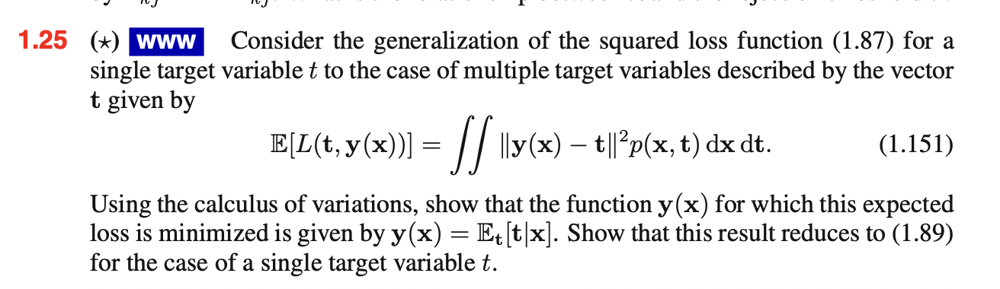

```{r setup, include=FALSE}
knitr::opts_chunk$set(echo = FALSE)
```

## 1.1


## 1.15


## 1.22


$$
\text{(1.81)} \\
\sum_k L_{kj}p(C_k|x)
$$

Substituer ind
$$
\sum_k L_{kj}p(C_k|x) \\
\sum_k (1 - I_{kj}) p(C_k|x)
$$

Her kan vi bruge at den **posterior probability** summer til 1.
Her finder vi at for hver x skal vi vælge klasse j så
$1-p(C_J|x)$ er en min. som svarer til at vælge j hvor den
posterior probability $p(C_j|x)$ er en maximum. 

Loss funktionen giver en værdi på 1 hvis eksemplet er misklassified og 0
hvis den er korrekt og heraf vil en min af expected loss minie misklassication rate.

## 1.25



```{r}
library(
  ggplot2
)
```

```{r}
geom_histogram()

```

