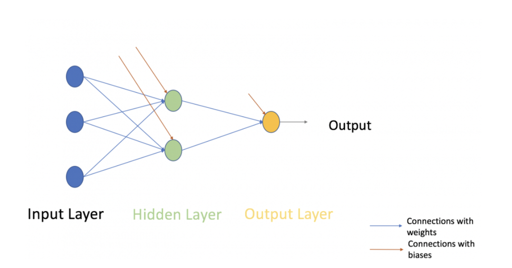

```{r setup, include=FALSE}
knitr::opts_chunk$set(echo = TRUE)
library(ggplot2)
theme_set(theme_minimal())
```

## Introduction

I am going to implement a neural network though R and going to take a different approch where I am going to build a classification assigment.

This blog post is partly inspired by  [this article by Sunil Ray](https://www.analyticsvidhya.com/blog/2017/05/neural-network-from-scratch-in-python-and-r/).


## Data

I am generating some random two dimensional labeled data. I have 200 observations.

```{r}
two_spirals <- function(N = 200,
                        radians = 3*pi,
                        theta0 = pi/2,
                        labels = 0:1) {
  N1 <- floor(N / 2)
  N2 <- N - N1
  
  theta <- theta0 + runif(N1) * radians
  spiral1 <- cbind(-theta * cos(theta) + runif(N1),
                   theta * sin(theta) + runif(N1))
  spiral2 <- cbind(theta * cos(theta) + runif(N2),
                   -theta * sin(theta) + runif(N2))
  
  points <- rbind(spiral1, spiral2)
  classes <- c(rep(0, N1), rep(1, N2))
  
  data.frame(x1 = points[, 1],
             x2 = points[, 2],
             class = factor(classes, labels = labels))
}
set.seed(42)
hotdogs <- two_spirals(labels = c('not hot dog', 'hot dog'))
```

Here is an example of the data:

```{r}
knitr::kable(hotdogs[sample(nrow(hotdogs), 5), ], 
             row.names = FALSE, digits = 2)
```

Let us look at a visualization it as well:

```{r}
ggplot(hotdogs) +
  aes(x1, x2, colour = class) +
  geom_point() +
  labs(x = expression(x[1]),
       y = expression(x[2]))
```

Now let us look at the modelling and before we go to the neural net,
let us take a detour to another model framwork we have looked at before.

## Logistic regression

We have earlier implemented a logistic regression so we will only use the
inbuild mehtod in R.

For our hot dog classification we want to  maximises the likelihood:

\[\mathcal{L} = \prod_i \operatorname P(Y_i=1)^{y_i} \operatorname P(Y_i = 0)^{1 - y_i}\]

Let us fit our model:

```{r logistic-regression}
logreg <- 
  glm(class ~ x1 + x2, family = binomial, data = hotdogs)

correct <-
  sum((fitted(logreg) > .5) + 1 == as.integer(hotdogs$class))
```


With the fitted model we can now plot the decision boundary:

```{r logistic-boundary}
beta <- coef(logreg)

grid <- 
  expand.grid(x1 = seq(min(hotdogs$x1) - 1,
                       max(hotdogs$x1) + 1,
                       by = .25),
              x2 = seq(min(hotdogs$x2) - 1,
                       max(hotdogs$x2) + 1,
                       by = .25))

grid$class <-
  factor((predict(logreg, newdata = grid) > 0) * 1,
         labels = c('not hot dog', 'hot dog'))

ggplot(hotdogs) + 
  aes(x1, x2, colour = class) +
  geom_point(data = grid, size = .5) +
  geom_point() +
  labs(x = expression(x[1]), y = expression(x[2])) +
  geom_abline(intercept = -beta[1]/beta[3],
              slope = -beta[2]/beta[3])
```

As can bee seen the model gives us a linear line and our result is not that good with a  accuracy of (`r round(100 * correct / nrow(hotdogs))`%).

Why is the results so bad? It often is because of the nonlinearity in data and
it is a bigger problem when the data get more complex. Here one solution is to use neural networks. 

## Artificial neural networks

Neural networks (for classification, at least) are also known as multi-layer [perceptrons](https://en.wikipedia.org/wiki/Perceptron).

The output layer is our estimate of the probability that objects belong to each class.
The input layer comprises the covariates and an intercept, as before.
In the middle, there is a *hidden layer*, which is a transformation of the input space into \(h\) dimensions, where \(h\) is a number chosen by us.
We then perform a logistic regression on this transformed space to estimate the classes.



It works like this.

1. Generate \(h\) different linear combinations of the input variables.
2. Apply an 'activation' function, that for each observation, turns each hidden node 'on' or 'off'.
3. Fit a logistic regression model to these \(h\) transformed predictors, plus an intercept.
4. Adjust the parameters of both the input and the output to maximise likelihood.
5. Repeat.

If \(h = 1\) then there is only one linear combination of the predictors, which is effectively the same thing as having no hidden layer at all, i.e. ordinary logistic regression.

So we run a kind of logistic regression model on the inputs to generate a transformation of the feature space, then once more to classify our actual objects.
Each iteration of the fitting or 'training' process adjusts both the transformation and the regression parameters.

What make a neural network (nne) special is the **hidden layer** which is what
differencring the model from a logistic model. 

The hidden layer passes though with a activation function and we are using a
Relu.

```{r}
relu <- function(a) { pmax(0, a) }
```


## Forward propagation

Starting with the inputs, we [feed forward](https://en.wikipedia.org/wiki/Feedforward_neural_network) through the network as follows.

Firstly, compute a linear combination of the covariates, using some weight matrix \(\mathbf W_\text{in} \in \mathbb R^{(d+1) \times h}\).
\[
\mathbf z_1
= \mathbf{XW}_\text{in}
= \begin{bmatrix}\mathbf 1 & \mathbf x\end{bmatrix} \mathbf W_\text{in}
\]
Next, apply an activation function to obtain the nodes in the hidden layer.
The hidden layer \(\mathbf H\) might be thought of as a design matrix containing the output of a logistic regression classifying whether each node is 'activated' or not.
\[\mathbf h = \sigma(\mathbf z_1)\]
The intercept/bias is always activated, so it is fixed to be a vector of ones.
\[\mathbf H = \begin{bmatrix} \mathbf 1 & \mathbf h \end{bmatrix}
            = \begin{bmatrix} \mathbf 1 & \sigma(\mathbf z_1) \end{bmatrix}
            = \begin{bmatrix} \mathbf 1 & \sigma(\mathbf {XW}_\text{in}) \end{bmatrix}\]
For the output layer, compute a linear combination of the hidden variables, this time using another weight matrix, \(\mathbf{W}_\text{out} \in \mathbb R^{(h+1) \times (k-1)}\).
\[\mathbf z_2
= \mathbf {HW}_\text{out}
= \begin{bmatrix} \mathbf 1 & \mathbf h\end{bmatrix} \mathbf W_\text{out}
\]
Apply one more function to get the output
\[\hat {\mathbf y} = \sigma (\mathbf z_2),\]
which is a probability vector, \(\hat Y_i = \operatorname P(Y_i = 1)\).

Putting it all together,
\[\hat {\mathbf y}
= \sigma \left( \mathbf {H W} _ \text{out} \right)
= \sigma \bigl( \begin{bmatrix} \mathbf 1 & \sigma ( \mathbf {X W} _ \text{in} ) \end{bmatrix} \mathbf W _ \text{out} \bigr).\]

It is straightforward to write a function to perform the forward propagation process in R. Just do

```{r, echo=FALSE}
sigmoid <- function(x) {1 / (1 + exp(-x))}
```

```{r feedforward}
feedforward <- 
  function(x, w1, w2) {
    z1 <- cbind(1, x) %*% w1
    h <- sigmoid(z1)
    z2 <- cbind(1, h) %*% w2
    list(output = relu(z2), h = h)
  }
```


## Back propagation

So far we have been taking the parameters, or weights, \(\mathbf W_\text{in}\) and \(\mathbf W_\text{out}\), for granted.

Like parameters in a linear regression, we need to choose weights that make our model 'better' by some criterion.
Neural network enthusiasts will say that we will train our multilayer perceptron by minimising the cross entropy loss.
That's a fancy way of saying we fit the model using maximum likelihood.

The log-likelihood for a binary classifier is
\[\ell = \sum_i \Bigl( y_i \log \hat y_i + (1 - y_i) \log (1 - \hat y_i) \Bigr).\]
We can maximise this via [gradient descent](https://en.wikipedia.org/wiki/Gradient_descent), a general-purpose optimisation algorithm.

To minimise \(\ell = f(\mathbf W)\) via gradient descent, we iterate using the formula
\[\mathbf W_{t+1} = \mathbf W_{t} - \gamma \cdot \nabla f(\mathbf W_{t}),\]
where \(\mathbf W_t\) is the weight matrix at time \(t\), \(\nabla f\) is the gradient of \(f\) with respect to \(\mathbf W\) and \(\gamma\) is the 'learning rate'.

Choose a learning rate too high and the algorithm will leap around like a dog chasing a squirrel, going straight past the optimum; choose one too low and it will take forever, making mountains out of molehills.

Using the [chain rule](https://en.wikipedia.org/wiki/Chain_rule), the gradient of the log-likehood with respect to the output weights is given by
\[\frac {\partial\ell} {\partial \mathbf W_\text{out}} =
\frac{\partial \ell}{\partial \hat {\mathbf y}}
\frac{\partial \hat {\mathbf y} }{\partial \mathbf W_\text{out}}\]
where
\[\begin{aligned}
\frac{\partial\ell}{\partial \hat{\mathbf y}}
  &=  \frac{\mathbf y}{\hat{\mathbf y}} - \frac{1 - \mathbf y}{1 - \hat{\mathbf y}}
  = \frac{\hat{\mathbf y} - \mathbf y}{\hat{\mathbf y}(1 - \hat{\mathbf y})},\\
\frac{\partial\hat{\mathbf y}}{\partial \mathbf W_\text{out}}
  &=  \mathbf{H}^T \sigma(\mathbf {HW}_\text{out})\bigl( 1 - \sigma(\mathbf{HW}_\text{out}) \bigr) \\
  &= \mathbf H^T \hat {\mathbf y} (1 - \hat{\mathbf y}).
\end{aligned}\]

And the gradient with respect to the input weights is
\[
\frac {\partial\ell} {\partial \mathbf W_\text{in}}
= \frac{\partial \ell}{\partial \hat {\mathbf y} }
   \frac{\partial \hat {\mathbf y} }{\partial \mathbf H}
   \frac{\partial \mathbf H}{\partial \mathbf W_\text{in}}
\]
where
\[
\begin{aligned}
\frac{\partial \hat{\mathbf y}}{\partial \mathbf H}
  &=  \sigma(\mathbf{HW}_\text{out}) \bigl( 1 - \sigma(\mathbf{HW}_\text{out}) \bigr) \mathbf W_\text{out}^T \\
  &= \hat{\mathbf y} (1 - \hat{\mathbf y}) \mathbf W_\text{out}^T, \\
\frac{\partial \mathbf H}{\partial \mathbf W_\text{in}}
  &= \mathbf X^T \begin{bmatrix} \mathbf 0 & \sigma(\mathbf{XW}_\text{in})\bigl( 1 - \sigma(\mathbf{XW}_\text{in}) \bigr) \end{bmatrix}.
\end{aligned}
\]

In the last step, we take for granted that the intercept column of \(\mathbf H\) doesn't depend on \(\mathbf W_\text{in}\), but you could parametrise it differently ([see footnotes](#fn1)).

A simple R implementation is as follows.


```{r backprop}
backpropagate <- 
  function(x, y, y_hat, w1, w2, h, learn_rate) {
    dw2 <- t(cbind(1, h)) %*% (y_hat - y)
    dh  <- (y_hat - y) %*% t(w2[-1, , drop = FALSE])
    dw1 <- t(cbind(1, x)) %*% (h * (1 - h) * dh)
    
    w1 <- w1 - learn_rate * dw1
    w2 <- w2 - learn_rate * dw2
    
    list(w1 = w1, w2 = w2)
  }
```

```{r train}
train <- function(x, y, hidden = 5, learn_rate = 1e-2, iterations = 1e4) {
  d <- ncol(x) + 1
  w1 <- matrix(rnorm(d * hidden), d, hidden)
  w2 <- as.matrix(rnorm(hidden + 1))
  for (i in 1:iterations) {
    ff <- feedforward(x, w1, w2)
    bp <- backpropagate(x, y,
                        y_hat = ff$output,
                        w1, w2,
                        h = ff$h,
                        learn_rate = learn_rate)
    w1 <- bp$w1; w2 <- bp$w2
  }
  list(output = ff$output, w1 = w1, w2 = w2)
}
```

```{r test-ad-hoc}
x <- data.matrix(hotdogs[, c('x1', 'x2')])
y <- hotdogs$class == 'hot dog'
nnet5 <- train(x, 
               y, 
               hidden = 5,
               iterations = 1e5)
```

We can calculate how many objects it classified correctly:

```{r accuracy-ad-hoc}
mean((nnet5$output > .5) == y)
```


That's `r round(100*mean((nnet5$output > .5) == y))`%, or `r sum((nnet5$output > .5) == y)` out of `r nrow(hotdogs)` objects in the right class.

Then feed these points forward through our trained neural network.

```{r grid-ad-hoc}
ff_grid <- feedforward(x = data.matrix(grid[, c('x1', 'x2')]),
                       w1 = nnet5$w1,
                       w2 = nnet5$w2)
grid$class <- factor((ff_grid$output > .5) * 1,
                     labels = levels(hotdogs$class))
```

Then, using `ggplot2`, we plot the predicted classes on a grid behind the observed points.

```{r plot-ad-hoc}
ggplot(hotdogs) +
  aes(x1, x2, colour = class) +
  geom_point(data = grid, size = .5) +
  geom_point() +
  labs(x = expression(x[1]), y = expression(x[2]))
```

The regions the neural network has classified into 'hot dog' and 'not hot dog' can no longer be separated by a single straight line.
The more nodes we add to the hidden layer, the more elaborate the decision boundaries can become, improving accuracy at the expense of computation time (as more weights must be calculated) and increased risk of [over-fitting](https://en.wikipedia.org/wiki/Overfitting) the data.

How about 30 nodes?

```{r 30-nodes}
nnet30 <- 
  train(x, 
        y, 
        hidden = 30, 
        iterations = 1e5)
```

After 100,000 iterations, accuracy is `r round(100 * mean((nnet30$output > .5) == y))`%.
The decision boundary looks much smoother:

```{r plot-30-nodes, echo = FALSE}
ff_grid <- 
  feedforward(x = data.matrix(grid[, c('x1', 'x2')]),
              w1 = nnet30$w1,
              w2 = nnet30$w2)

grid$class <- factor((ff_grid$output > .5) * 1,
                     labels = levels(hotdogs$class))

ggplot(hotdogs) +
  aes(x1, x2, colour = class) +
  geom_point(data = grid, size = .5) +
  geom_point() +
  labs(x = expression(x[1]), y = expression(x[2]))
```

And for completeness, let's see what one hidden node (plus an intercept) gives us.

```{r 1-node}
nnet1 <-
  train(x,
        y, 
        hidden = 1,
        iterations = 1e5)
```

```{r plot-1-node, echo = FALSE}
ff_grid <- 
  feedforward(x = data.matrix(grid[, c('x1', 'x2')]),
                       w1 = nnet1$w1,
                       w2 = nnet1$w2)

grid$class <- factor((ff_grid$output > .5) * 1,
                     labels = levels(hotdogs$class))

ggplot(hotdogs) + 
  aes(x1, x2, colour = class) +
  geom_point(data = grid, size = .5) +
  geom_point() +
  labs(x = expression(x[1]), y = expression(x[2]))
```

Much worse accuracy---`r round(100 * mean((nnet1$output > .5) == y))`%---and the decision boundary looks linear.
