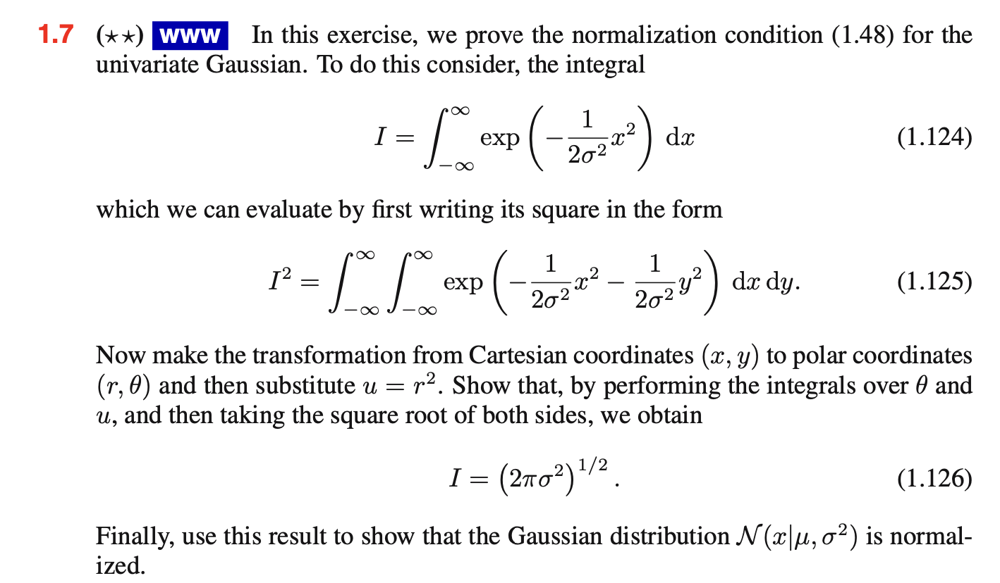
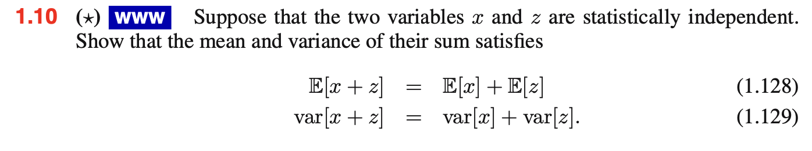
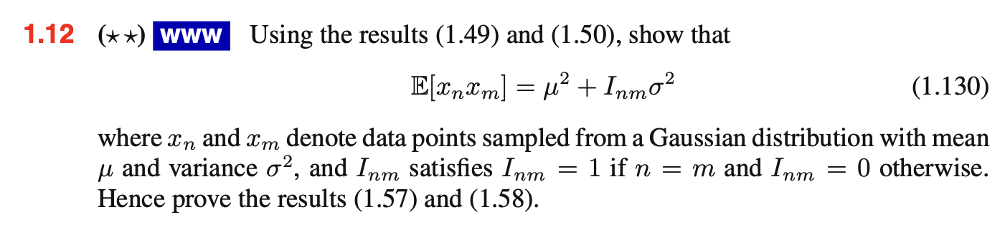

```{r setup, include=FALSE}
knitr::opts_chunk$set(echo = FALSE)
```

## Lecture 1 + 2

Denne del er om **Probability theory**.

### 1.2.1 - Probability densities

Hvis vi har en værdi *x* og vi gerne vil se på sandsynligheen for den
falder i intervallet $(x, x+\delta x)$ så vil den være $p(x) \delta$. Her kalder
vi $p(x)$ for **probability density** over x. 

Sandsynligheden for x ligger i intervallet er givet ved:

$$
p(x\in (a,b)) = \int^b_a p(x)dx
$$

**Den cumulative distribution function**

$$
P(z)=\int^z_{-\infty}p(x) dx
$$


### 1.2.2 - Expectations and covariances

Weigthed average af kontinuerlig variables:

$$
E[f] = \int p(x) f(x) dx
$$

Variance:

$$
var[f] = E[(f(x) - E[f(x)])^2] \\
= E[x^2] -E[x]^2
$$

Covariance:

$$
cov[x,y] = E_{x,y}[[x-E[x]][y-E[y]]]\\
= E_{x,y}[xy]-E[x]E[y]
$$

### 1.2.3 - bayesian probabilities

**Frequencies** random og gentagende forsøg.

**Prior probability** er vi har en forventning til en paramerter før vi
observer den. 

**Bayes theorem**:

$$
p(w|D) = \frac{p(D|w)p(w)}{p(D)}
$$

vi kan evaluer usikkerheden ved w efter observer data D, som er i form af
en **posterior probability** $p(w|D)$. Den kan ses som en funktion af 
parameter vektoe, w, hvor den så er en likelihood funktion. 

### 1.2.4 Gaussian distribution

Defined som

$$
N(x|\mu,\sigma^2)=\frac{1}{(2 \pi \sigma^2)^{1/2}}exp[-\frac{1}{2 \sigma^2}(x-\mu)^2]
$$

## Exercises

### 1.7



En af de vigtigst probability distributions for continouse variabler er 
den *normal or gaussian distributions*.

Allerførst kan vi skrive **cartesian polar koordinater der er 
definerede som der kan findes ved [linket](https://www.mathsisfun.com/polar-cartesian-coordinates.html):

\begin{align*}

x & = r \ cos \ \theta \\
y & = r \ sin \ \theta

\end{align*}

Hvoraf vi har $x^2+y^2=r^2$ hvor vi bruger den trigonometisk resultat, til at forsimple vores udtryk.
Vi har også at *jacobian* af ændringen af variablerne kan ses som

$$
\frac{\partial (x,y)}{\partial (r,\theta)} = 
\begin{vmatrix}
\frac{\partial x}{\partial r} & 
\frac{\partial x}{\partial \theta} \\
\frac{\partial y}{\partial r} & \frac{\partial x}{\partial \theta}
\end{vmatrix}
$$

Her får vi således integralet til

\begin{align*}

I^2 & = \int^{2\pi}_0 \int^\infty_0 exp(-\frac{r^2}{2 \sigma^2})
r dr d\theta \\
\text{*insæt u} \\
& = 2\pi\int^\infty_0 exp

\left(
  -\frac{u}{2\sigma^2}
\right) \frac{1}{2}
 du \\
& = \pi \left[ 
exp \left(
    -\frac{u}{2\sigma^2}
    \right)
    \frac{1}{2}
\right]^\infty_0 \\
& = 2\pi \sigma^2 
\end{align*}

Hvor

$$
I=(2\pi\sigma^2)^{1/2}
$$
Til sidst skal vi vise at Gaussian er normalisere ved transformationen
y = x- $\mu$:


\begin{align*}

\int^\infty_{-\infty} N(x|\mu,\sigma^2)\ dx & =
\frac{1}{(2\pi\sigma)^{1/2}}\int^\infty_{-\infty} 
exp(-\frac{y^2}{2\sigma^2})dy \\
 & = \frac{I}{(2\pi\sigma^2)^{1/2}} \\
 \text{Indsæt I og vi reducer udtrykket} \\
 & = 1

\end{align*}

### 1.10  



Siden x og z er uafhængige, vil deres joint distribution faktoriser som
$p(x,z) = p(x)p(z)$, og så vil

\begin{align*}
E[x  + z] 
& = \int \int (x+z)p(x)p(z) \ dx \ dx \\
& = \int x p(x) dx + \int z p(z) dx \\
& = E[x] + E[z]

\end{align*}

Det samme kan ses for variansen, vi noter først

\begin{align*}

(x + z - E[x+z])^2 
& = (x-E[x])^2 + (z-E[z])^2 + 2(x-E[x])(z-E[z])

\end{align*}

hvor det sidste led vil gå mod nul når vi integerer det. Heraf


\begin{align*}

var[x + z] 
& = \int \int (x + z - E[x+z])^2p(x)p(z) dx dz \\
& = \int (x-E[x])^2p(x) dx + \int(z-E[z])^2p(z) dz \\
& = var(x) + var(z)
\end{align*}

### 1.12



Ligning 1.49

\begin{align*}
E[x] 
& = \int^\infty_{-\infty} N(x|\mu,\sigma^2) x dx \\
& = \mu

\end{align*}

Ligning 1.50

\begin{align*}

E[x^2] 
& = \int^\infty_{-\infty} N(x|\mu,\sigma^2)x^2 dx \\
& = \mu^2 + \sigma^2

\end{align*}


Hvis m = n så vil

$$
x_mx_n=x_n^2
$$

ved at bruge 1.50 får vi $E[x_n^2] = \mu^2 + \sigma^2$, men hvis de er 
forskellig, så vil de to data punkter $x_n$ og $x_m$ være uafhængig og 
heraf

$$
E[x_nx_m]=E[x_n]E[x_m] = \mu^2
$$

Dermed har vi

$$
E[\mu_{ML}]=\frac{1}{N}\sum^N_{n=1} E[x_n]=1
$$

Til sidst se på $E[\sigma^2_{ML}]$. Her brug 1.55 og 1.56 samt 1.130 får vi

\begin{align*}

E[\sigma^2_{ML}] 
& = E 
\left[
    \frac{1}{N}
    \sum^N_{n=1} 
    \left(
      x_n - \frac{1}{N} \sum^N_{m=1}x_m
    \right)^2
\right]\\
& =
  \frac{1}{N} \sum^N_{n=1} 
  E
  \left[
    x^2_n - \frac{2}{N} x_n \sum^N_{m=1} + \frac{1}{N^2}\sum^N_{m=1}\sum^N_{l=1} x_m x_l  
  \right] \\
& =
  \left[
        \mu^2+\sigma^2 -2
        \left(
              \mu^2 0 \frac{1}{N}\sigma^2
        \right)
        + \mu^2 +\frac{1}{N}\sigma^2
  \right] \\
& = 

  \left(
        \frac{N-1}{N}\sigma^2
  \right)
\end{align*}


