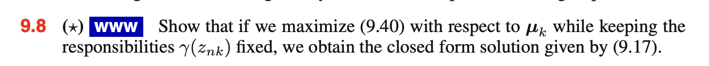

```{r setup, include=FALSE}
knitr::opts_chunk$set(echo = TRUE)
```

## Week 4:

### (Lecture 7) Probability Distributions 3

> Sections: 2.3.9, 2.5, 2.5.1, 2.5.2

### (Lecture 8) Mixture Models

> Sections: 9.1, 9.1.1, 9.1.2, 9.2, 9.2.1, 9.2.2

### Exercises: 9.1, 9.3, 9.8, 9.12

#### 9.1


#### 9.3


#### 9.8



#### 9.12


