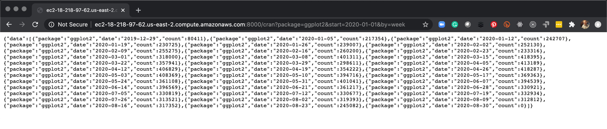

```{r setup, include=FALSE}
knitr::opts_chunk$set(
    echo = TRUE,
    eval = FALSE
)
```

These instructions will help you set up the `h2o-plumber` container on AWS so you can run the Cranlogs API service.

# Step 1 - Setup and EC2 Server on AWS 

Follow the [AWS Overview](https://business-science.github.io/shiny-production-with-aws-book/aws-overview.html) to get an EC2 Server up and running. 

- Chapters 2-7 will show you how to get your AWS EC2 Server Up and Running. 

- Make sure to open __Port 8000__ using a Custom TCP during ["Step 6 - Configure Security Group"](https://business-science.github.io/shiny-production-with-aws-book/aws-ec2-server-setup.html#step-6---configure-security-group). Set availability to __Anywhere__.

- Connect to [Ubuntu EC2 Server via Terminal (Mac) or Putty (Windows)](https://business-science.github.io/shiny-production-with-aws-book/connecting-to-ec2-with-ssh-secure-shell.html) 

# Step 2 - Update Ubuntu 

Once you log into your Ubuntu EC2 Server via Terminal or Putty, do this to upgrade ubuntu software:

```{bash}
# Upgrade Ubuntu
sudo apt update
sudo apt-get upgrade -y
sudo apt-get dist-upgrade -y
```


# Step 3 - Install Docker

Next, install docker. 

```{bash}
# Install Docker
sudo apt-get install docker.io
```

# Step 4 - Fire Up Plumber Docker Container

Note - I have already loaded a docker image `mdancho/h2o-plumber` on Docker Hub. This command pulls that image. If you have a different image that you'd like to run (different API you've developed), just publish it to Docker Hub using `docker push user_name/image_name`. Then you can swap out the end of the code with your image.

```{bash}
sudo docker run -d -p 8000:8000 mdancho/h2o-plumber:latest
```

- Pulls the container `mdancho/h2o-plumber` from DockerHub
- Fires up the container in __detached mode__ (so it runs in the background)
- The files from the `lab_42_plumber` are installed already inside the container, so the Cran Logs Service just works.

# Step 5 - Test Your API Service Out

In the browser, using your server Public DNS:

Public DNS (IPv4): 
`ec2-XX-XXX-XX-XX.us-XXXX-X.compute.amazonaws.com`

Append the port: `:8000`

Append your API String: `/cran?package=ggplot2&start=2016-01-01&by=month`

Putting it all together, you should have a URL string that looks like this:

`http://ec2-XX-XX-XX-XX.us-east-2.compute.amazonaws.com:8000/cran?package=ggplot2&start=2020-01-01&by=week`

Putting intor your browser should return JSON that your Google Sheet can ingest.

```{r, eval=TRUE, echo=FALSE}

```


# Next - Setup Your Google Sheet

Once your API is setup, next set up a Google Sheet to connect to your API.  

