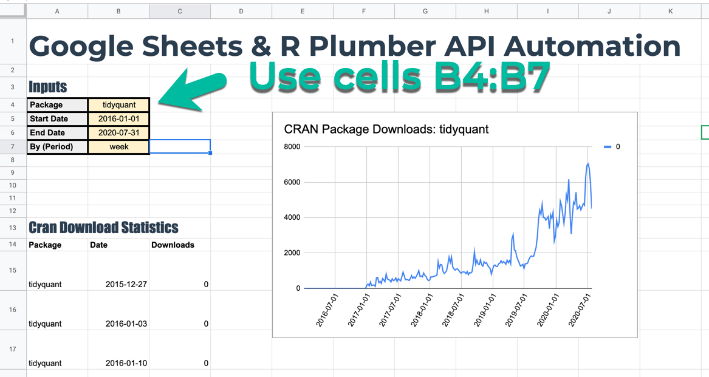
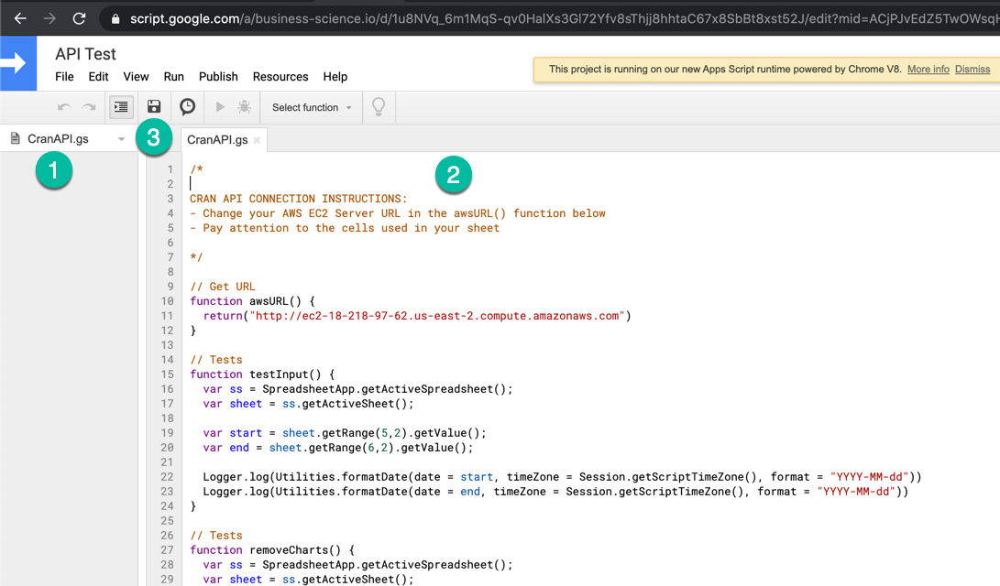
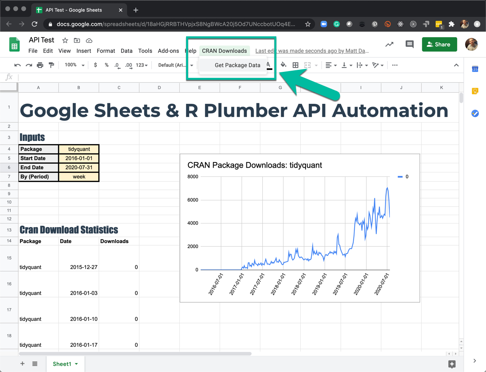

```{r setup, include=FALSE}
knitr::opts_chunk$set(echo = FALSE)
```

# Step 1 - Open a New Google Sheet

Call it something like "Cran API"

# Step 2 - Decorate your Google Sheet

__Minimum Requirements:__ Make sure to set up cells B4:B7 as shown. These will be mapped to your API URL package, start, end, and by parameters. 

```{r}

```


# Step 3 - Connect your Google Sheet to your API 

We need to set your Google Sheet this up in your google sheet. 

#### Open GS Script Editor

You'll open your script editor in Google Sheets by going to __Tools > Script Editor__. Note - You may need to accept permissions to open up the script editor. 

#### Paste Script 

You should now see a Script Editor where you can add code. I've provided `CranAPI.gs`. All you need to do is copy and paste into the script editor and save your work. Here's how:

1. Rename your Script: "CranAPI.gs"
2. Paste the contents of the `CranAPI.gs` file that I've provided. Make sure to update the `awsURL()` function to return YOUR EC2 SERVER PUBLIC DNS. Just modify Line 11.
3. Save your work. 


```{r}

```

# Step 4 - Test Your Google Sheet Out

You should now see a Menu Item called "CRAN Downloads".  Click "Get Package Data". Your sheet should automatically update using the inputs provided in Cells B4:B7. 


```{r}

```

# Going Further - Exploring the Google Sheets Script

I encourage you to explore the script to see if you can figure out how it works. Google has the [Google Apps Scripts Documentation](https://developers.google.com/apps-script/reference/spreadsheet?hl=en), which is how I figured out how to do this tutorial. 

There's also a great tutorial on [Google Sheets Scripts here](https://www.benlcollins.com/apps-script/api-tutorial-for-beginners/). 
