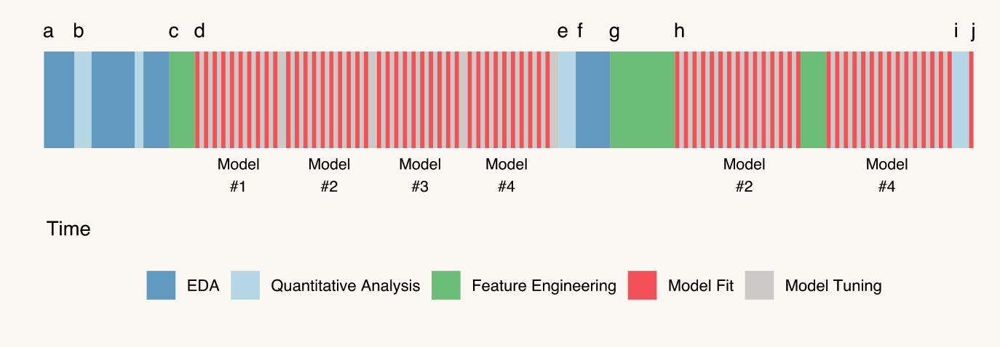
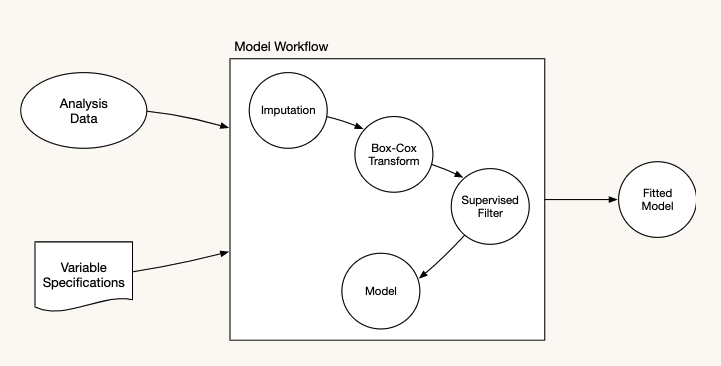
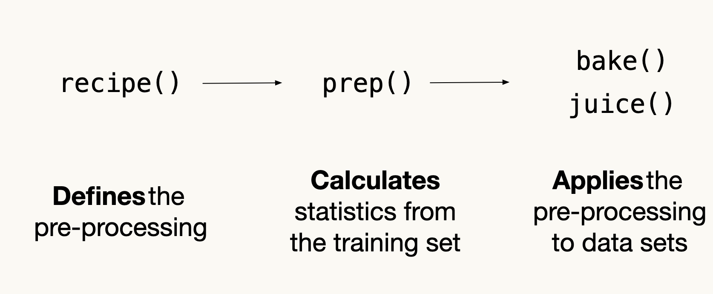
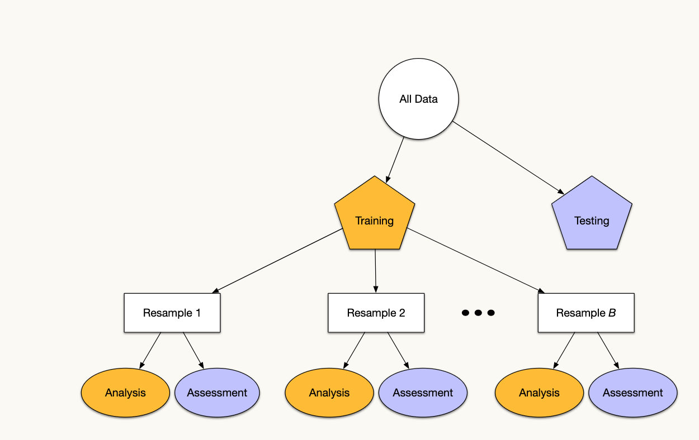
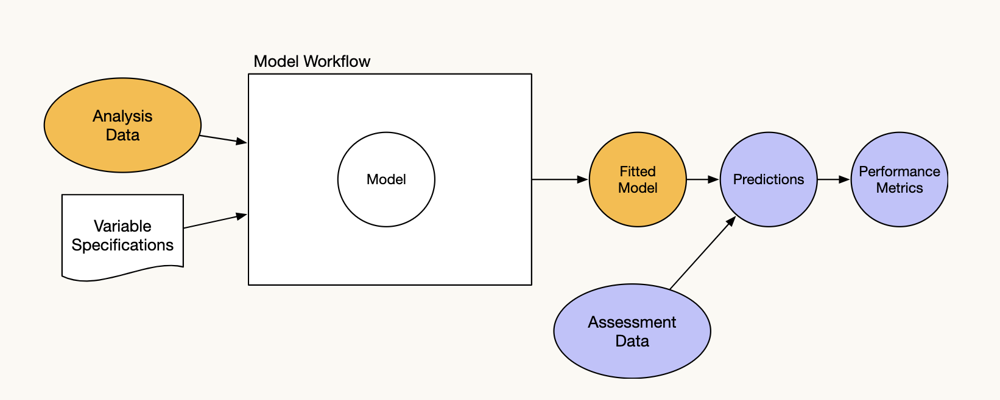
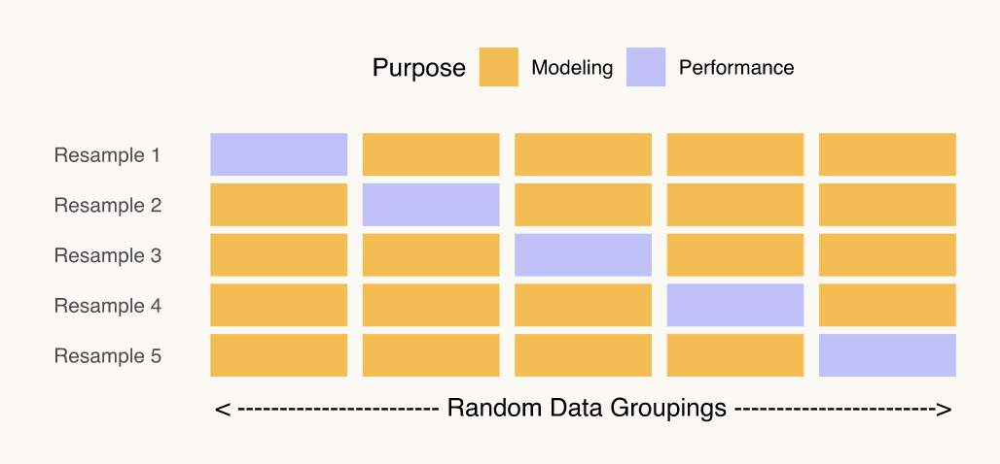

```{r setup, include=FALSE}
knitr::opts_chunk$set(echo = TRUE)
```

## Applied Machine learning

This post will explore how to predict houses prices


read in the packages

```{r}
library(tidymodels)
library(AmesHousing)
ames <- make_ames()
```

We will take a very used data set in the form of AmesIA housing data.



and the workflow


There are a few suffixes that we'll use for certain types of objects:

- _mod for a parsnip model specification
- _fit for a fitted model
- _rec for a recipe
- _wfl for a workflow
- _tune for a tuning object
- _res for a general result

## Data splitting

We typically split data into training and test data sets:

- Training Set: these data are used to estimate model parameters and to pick the values of the complexity parameter(s) for the model.

- Test Set: these data can be used to get an independent assessment of model efficacy. They should not be used during model training.

There are a few different ways to do the split: simple random sampling, stratified sampling based on the outcome, by date, or methods that focus on the distribution of the predictors.

- Classification: This would mean sampling within the classes to preserve the distribution of the outcome in the training and test sets.

- Regression: Determine the quartiles of the data set and sample within those artificial groups.

## Ames housing data

```{r}
# resample functions
# Make sure that you get the same random numbers
set.seed(4595)
data_split <- initial_split(ames, strata = "Sale_Price")
ames_train <- training(data_split)
ames_test  <- testing(data_split)
```


## Modelling


### Parsnip in Action

lm() isn't the only way to perform linear regression

glmnet for regularized regression

stan for Bayesian regression

keras for regression using tensorflow

spark for large data sets


1) Create a specification

2) Set the engine

3) Fit the model

```{r}
spec_lin_reg <- linear_reg()
spec_lin_reg
```

```{r}
spec_stan <- 
  spec_lin_reg %>%
  # Engine specific arguments are passed through here
  set_engine("stan", chains = 4, iter = 1000)
# Otherwise, looks exactly the same!
fit_stan <- fit(
  spec_stan,
  log10(Sale_Price) ~ Longitude + Latitude,
  data = ames_train
)
coef(fit_stan$fit)
```

```{r}
fit_knn <- 
  nearest_neighbor(mode = "regression", neighbors = 5) %>%
  set_engine("kknn") %>% 
  fit(log10(Sale_Price) ~ Longitude + Latitude, data = ames_train)
fit_knn
```

Reasons for Modifying the Data
Some models (K-NN, SVMs, PLS, neural networks) require that the predictor variables have the same units. Centering and scaling the predictors can be used for this purpose.

Other models are very sensitive to correlations between the predictors and filters or PCA signal extraction can improve the model.

As we'll see in an example, changing the scale of the predictors using a transformation can lead to a big improvement.

In other cases, the data can be encoded in a way that maximizes its effect on the model. Representing the date as the day of the week can be very effective for modeling public transportation data.


Many models cannot cope with missing data so imputation strategies might be necessary.

Development of new features that represent something important to the outcome (e.g. compute distances to public transportation, university buildings, public schools, etc.)

One common procedure for modeling is to create numeric representations of categorical data. This is usually done via dummy variables: a set of binary 0/1 variables for different levels of an R factor.

For example, the Ames housing data contains a predictor called Alley with levels: 'Gravel', 'No_Alley_Access', 'Paved'.

Most dummy variable procedures would make two numeric variables from this predictor that are 1 when the observation has that level, and 0 otherwise.

A zero-variance predictor that has only a single value (zero) would be the result.

Many models (e.g. linear/logistic regression, etc.) would find this numerically problematic and issue a warning and NA values for that coefficient. Trees and similar models would not notice.

There are two main approaches to dealing with this:

Run a filter on the training set predictors prior to running the model and remove the zero-variance predictors.

Recode the factor so that infrequently occurring predictors (and possibly new values) are pooled into an "other" category.

However, model.matrix() and the formula method are incapable of helping you.

Recipes are an alternative method for creating the data frame of predictors for a model. They allow for a sequence of steps that define how data should be handled.

Recall the previous part where we used the formula log10(Sale_Price) ~ Longitude + Latitude? These steps are:

Assign Sale_Price to be the outcome

Assign Longitude and Latitude as predictors

Log transform the outcome

To start using a recipe, these steps can be done using

# recipes loaded by tidymodels

```{r}
mod_rec <-
  recipe(Sale_Price ~ Longitude + Latitude, ames_train) %>%
  step_log(Sale_Price, base = 10)

mod_rec <-
  recipe(Sale_Price ~ Longitude + Latitude + Neighborhood, 
         data = ames_train) %>%
  step_log(Sale_Price, base = 10) %>%
  # Lump factor levels that occur in   <= 5% of data as "other"
  step_other(Neighborhood, threshold = 0.05) %>%
  # Create dummy variables for _any_ factor variables
  step_dummy(all_nominal())
```

This creates the recipe for data processing (but does not execute it yet)




Now that we have a preprocessing specification, let's run it on the training set to prepare the recipe:

```{r}
mod_rec_trained <- prep(mod_rec, training = ames_train, verbose = TRUE)
```

## oper 1 step log [training] 
## oper 2 step other [training] 
## oper 3 step dummy [training] 
## The retained training set is ~ 0.19 Mb  in memory.
Here, the "training" is to determine which levels to lump together and to enumerate the factor levels of the Neighborhood variable.

```{r}

```


Now that the recipe has been prepared, we can extract the processed training set from it, with all of the steps applied. To do that, we use juice().

# Extracts processed version of `ames_train`
```{r}
juice(mod_rec_trained)
```

After model fitting, you'll eventually want to make predictions on new data. But first, you have to reapply all of the pre-processing steps on it. To do that, use bake().

```{r}
bake(mod_rec_trained, new_data = ames_test)
```

this is passed on to predict

- juice() is used to get the pre-processed training set (basically for free)
- bake() is used to pre-process a new data set

Note that we have:

recipe(..., data = data_set)
prep(...,   training = data_set)
bake(...,   new_data = data_set)
recipe() - data is used only to determine column names and types. A 0-row data frame could even be used.

prep() - training is the entire training set, used to estimate parameters in each step (like means or standard deviations).

bake() - new_data is data to apply the pre-processing to, using the same estimated parameters from when prep() was called on the training set.

### interactions

An interaction between two predictors indicates that the relationship between the predictors and the outcome cannot be describe using only one of the variables.

For example, let's look at the relationship between the price of a house and the year in which it was built. The relationship appears to be slightly nonlinear, possibly quadratic:

```{r}

price_breaks <- (1:6)*(10^5)
ames_train %>%
  ggplot(aes(x = Year_Built, y = Sale_Price)) + 
  geom_point(alpha = 0.4) +
  scale_y_log10() + 
  geom_smooth(method = "loess")
```

However... what if we separate this trend based on whether the property has air conditioning or not.


```{r}
ames_train %>%
  group_by(Central_Air) %>%
  summarise(n = n()) %>%
  mutate(percent = n / sum(n) * 100)
```

```{r}
# to get robust linear regression model
library(MASS)
ames_train %>%
  ggplot(aes(x = Year_Built, y = Sale_Price)) + 
  geom_point(alpha = 0.4) +
  scale_y_log10() + 
  facet_wrap(~ Central_Air, nrow = 2) +
  geom_smooth(method = "rlm")
```

It appears as though the relationship between the year built and the sale price is somewhat different for the two groups.

When there is no AC, the trend is perhaps flat or slightly decreasing.
With AC, there is a linear increasing trend or is perhaps slightly quadratic with some outliers at the low end.

```{r}
mod1 <- lm(log10(Sale_Price) ~ Year_Built + Central_Air,                          data = ames_train)
mod2 <- lm(log10(Sale_Price) ~ Year_Built + Central_Air + Year_Built:Central_Air, data = ames_train)
anova(mod1, mod2)
```

We first create the dummy variables for the qualitative predictor (Central_Air) then use a formula to create the interaction using the : operator in an additional step:

```{r}
interact_rec <- recipe(Sale_Price ~ Year_Built + Central_Air, data = ames_train) %>%
  step_log(Sale_Price) %>%
  step_dummy(Central_Air) %>%
  step_interact(~ starts_with("Central_Air"):Year_Built)
interact_rec %>%
  prep(training = ames_train) %>%
  juice() %>%
  # select a few rows with different values
  slice(153:157)
```

```{r}
ggplot(ames_train, 
       aes(x = Longitude, y = Sale_Price)) + 
  geom_point(alpha = .5) + 
  geom_smooth(
    method = "lm", 
    formula = y ~ splines::bs(x, 5), 
    se = FALSE
  ) + 
  scale_y_log10()
```


Splines add nonlinear versions of the predictor to a linear model to create smooth and flexible relationships between the predictor and outcome.

This "basis expansion" technique will be seen again in the regression section of the workshop.

```{r}
ggplot(ames_train, 
       aes(x = Latitude, y = Sale_Price)) + 
  geom_point(alpha = .5) + 
  geom_smooth(
    method = "lm", 
    formula = y ~ splines::ns(x, df = 5), 
    se = FALSE
  ) + 
  scale_y_log10()
```

We'll add neighborhood in as well and a few other house features.

Our plots suggests that the coordinates can be helpful but probably require a nonlinear representation. We can add these using B-splines with 5 degrees of freedom.

Two numeric predictors are very skewed and could use a transformation (Lot_Area and Gr_Liv_Area).
```{r}
ames_rec <- recipe(
    Sale_Price ~ Bldg_Type + Neighborhood + Year_Built + 
                 Gr_Liv_Area + Full_Bath + Year_Sold + Lot_Area +
                 Central_Air + Longitude + Latitude,
    data = ames_train
  ) %>%
  step_log(Sale_Price, base = 10) %>%
  step_BoxCox(Lot_Area, Gr_Liv_Area) %>%
  step_other(Neighborhood, threshold = 0.05)  %>%
  step_dummy(all_nominal()) %>%
  step_interact(~ starts_with("Central_Air"):Year_Built) %>%
  step_ns(Longitude, Latitude, deg_free = 5)
```

```{r}
lm_mod <- 
  linear_reg() %>% 
  set_engine("lm")
ames_rec <- prep(ames_rec)
lm_fit <- 
  lm_mod %>% 
  fit(Sale_Price ~ ., data = juice(ames_rec))   # The recipe puts Sale_Price on the log scale
glance(lm_fit$fit)
```

```{r}
ames_test_processed <- bake(ames_rec, ames_test, all_predictors())
```

The workflows package enables a handy type of object that can bundle pre-processing and models together.

You don’t have to keep track of separate objects in your workspace.

The recipe prepping and model fitting can be executed using a single call to fit() instead of prep()-juice()-fit().

The recipe baking and model predictions are handled with a single call to predict() instead of bake()-predict().

Workflows will be able to add post-processing operations in upcoming versions. An example of post-processing would be to modify (and tune) the probability cutoff for two-class models.

```{r}
ames_wfl <-
  workflow() %>% 
  add_recipe(ames_rec) %>% 
  add_model(lm_mod)
ames_wfl
```

# preps() `ames_train`, juice()s it, then fit()s model
```{r}
ames_wfl_fit <- fit(ames_wfl, ames_train)
```

# bake()s `ames_test`, then predict()s

```{r}
predict(ames_wfl_fit, ames_test) %>% slice(1:5)
```

add_formula() can be used as a simple alternative to add_recipe().

A secondary formula can be given to add_model() that will be directly passed to the model. This is helpful when recipes are used with GAMs or mixed-models.

There are remove_*() and update_*() functions too.

## 4 https://rstudio-conf-2020.github.io/applied-ml/Part_4.html#20 Resampling and Grid Search

```{r}
library(AmesHousing)
ames <- make_ames() %>% 
  dplyr::select(-matches("Qu"))
set.seed(4595)
data_split <- initial_split(ames, strata = "Sale_Price")
ames_train <- training(data_split)
ames_test  <- testing(data_split)
perf_metrics <- metric_set(rmse, rsq, ccc)
ames_rec <- recipe(
    Sale_Price ~ Bldg_Type + Neighborhood + Year_Built + 
                 Gr_Liv_Area + Full_Bath + Year_Sold + Lot_Area +
                 Central_Air + Longitude + Latitude,
    data = ames_train
  ) %>%
  step_log(Sale_Price, base = 10) %>%
  step_BoxCox(Lot_Area, Gr_Liv_Area) %>%
  step_other(Neighborhood, threshold = 0.05)  %>%
  step_dummy(all_nominal()) %>%
  step_interact(~ starts_with("Central_Air"):Year_Built) %>%
  step_bs(Longitude, Latitude, deg_free = 5)
```

These are additional data splitting schemes that are applied to the training set and are used for estimating model performance.

They attempt to simulate slightly different versions of the training set. These versions of the original are split into two model subsets:

The analysis set is used to fit the model (analogous to the training set).
Performance is determined using the assessment set.
This process is repeated many times.



All resampling methods repeat this process multiple times:



The final resampling estimate is the average of all of the estimated metrics (e.g. RMSE, etc).

### v fold


Here, we randomly split the training data into V distinct blocks of roughly equal size (AKA the "folds").

We leave out the first block of analysis data and fit a model.

This model is used to predict the held-out block of assessment data.

We continue this process until we've predicted all V assessment blocks

The final performance is based on the hold-out predictions by averaging the statistics from the V blocks.

V is usually taken to be 5 or 10 and leave-one-out cross-validation has each sample as a block.

Repeated CV can be used when training set sizes are small. 5 repeats of 10-fold CV averages for 50 sets of metrics.



The goal of resampling is to produce a single estimate of performance for a model.

Even though we end up estimating V models (for V-fold CV), these models are discarded after we have our performance estimate.

Resampling is basically an emprical simulation system used to understand how well the model would work on new data.

rsample has a number of resampling functions built in. One is vfold_cv(), for performing V-Fold cross-validation like we've been discussing.

```{r}
set.seed(2453)
cv_splits <- vfold_cv(ames_train) #10-fold is default
cv_splits
```


Each individual split object is similar to the initial_split() example.

Use analysis() to extract the resample's data used for the fitting process.

Use assessment() to extract the resample's data used for the performance process.

```{r}
cv_splits$splits[[1]]
```

## <1979/220/2199>

```{r}
cv_splits$splits[[1]] %>% 
  analysis() %>%
  dim()
```

```{r}
cv_splits$splits[[1]] %>% 
  assessment() %>%
  dim()
```

### K-Nearest Neighbors Model

K-nearest neighbors stores the training set (including the outcome).

When a new sample is predicted, K training set points are found that are most similar to the new sample being predicted.

The predicted value for the new sample is some summary statistic of the neighbors, usually:

the mean for regression, or
the mode for classification.
Let's try a 5-neighbor model on the Ames data.

```{r}
knn_mod <- 
  nearest_neighbor(neighbors = 5) %>% 
  set_engine("kknn") %>% 
  set_mode("regression")

knn_wfl <- 
  workflow() %>% 
  add_model(knn_mod) %>% 
  add_formula(log10(Sale_Price) ~ Longitude + Latitude)

fit(knn_wfl, data = ames_train)
```

```{r}
knn_res <- cv_splits %>%
  mutate(
    workflows = map(
      splits, 
      ~ fit(knn_wfl, data = analysis(.x))
    )
  ) 
knn_res
```

```{r}
knn_pred <- map2_dfr(
  knn_res$workflows, 
  knn_res$splits,     
  ~ predict(.x, assessment(.y)),         
  .id = "fold"
)
knn_pred
```

```{r}
knn_pred <- map2_dfr(
  knn_res$workflows, 
  knn_res$splits,     
  ~ predict(.x, assessment(.y)),         
  .id = "fold"
)                                   
prices <- map_dfr(
    knn_res$splits,  
    ~ assessment(.x) %>% select(Sale_Price)
  )
```

```{r}
knn_pred <- map2_dfr(
  knn_res$workflows, 
  knn_res$splits,     
  ~ predict(.x, assessment(.y)),         
  .id = "fold"
)                                   
prices <- map_dfr(
    knn_res$splits,  
    ~ assessment(.x) %>% select(Sale_Price)
  ) %>% 
  mutate(Sale_Price = log10(Sale_Price))

```

```{r}

knn_pred <- map2_dfr(
  knn_res$workflows, 
  knn_res$splits,     
  ~ predict(.x, assessment(.y)),         
  .id = "fold"
)                                   
prices <- map_dfr(
    knn_res$splits,  
    ~ assessment(.x) %>% select(Sale_Price)
  ) %>% 
  mutate(Sale_Price = log10(Sale_Price))
rmse_estimates <- knn_pred %>%
  bind_cols(prices)
```

```{r}
knn_pred <- map2_dfr(
  knn_res$workflows, 
  knn_res$splits,     
  ~ predict(.x, assessment(.y)),         
  .id = "fold"
)                                   
prices <- map_dfr(
    knn_res$splits,  
    ~ assessment(.x) %>% select(Sale_Price)
  ) %>% 
  mutate(Sale_Price = log10(Sale_Price))
rmse_estimates <- knn_pred %>%
  bind_cols(prices) %>% 
  group_by(fold) %>% 
  do(rmse = rmse(., Sale_Price, .pred)) %>% 
  unnest(cols = c(rmse)) 
mean(rmse_estimates$.estimate)
```

There is a fit_resamples() function in the tune package that does all of this for you.


```{r}
library(tune)
easy_eval <- fit_resamples(knn_wfl, resamples = cv_splits, control = control_resamples(save_pred = TRUE))
```

```{r}
collect_metrics(easy_eval)
```

```{r}
collect_metrics(easy_eval, summarize = FALSE) %>% 
  slice(1:10)
```

### Model Tuning

Tuning Parameters
There are some models with parameters that cannot be directly estimated from the data.

For example:

The number of neighbors in a K-NN models.

The depth of a classification tree.

The link function in a generalized linear model (e.g. logit, probit, etc).

The covariance structure in a linear mixed model.

#### Tuning Parameters and Overfitting

Overfitting occurs when a model inappropriately picks up on trends in the training set that do not generalize to new samples.

When this occurs, assessments of the model based on the training set can show good performance that does not reproduce in future samples.

For example, K = 1 neighbors is much more likely to overfit the data than larger values since they average more values.

Also, how would you evaluate this model by re-predicting the training set? Those values would be optimistic since one of your neighbors is always you.

Unsurprisingly, we will evaluate a tuning parameter by fitting a model on one set of data and assessing it with another.

Grid search uses a pre-defined set of candidate tuning parameter values and evaluates their performance so that the best values can be used in the final model.

We'll use resampling to do this. If there are B resamples and C tuning parameter combinations, we end up fitting B×C models (but these can be done in parallel).

tune has more general functions for tuning models. There are two main strategies used:

Grid search (as shown above) where all of the candidate models are known at the start. We pick the best of these.

Iterative search where each iteration finds novel tuning parameter values to evaluate.

Both have their advantages and disadvantages. At first, we will focus on grid search.

Usually combinatorial representation of vectors of tuning parameter values. Note that:

The number of values don't have to be the same per parameter.

The values can be regular on a transformed scale (e.g. log-10 for penalty).

Quantitative and qualitative parameters can be combined.

As the number of parameters increase, the curse of dimensionality kicks in.

Thought to be really inefficient but not in all cases (see the sub-model trick and multi_predict()).

Bad when performance plateaus over a range of one or more parameters.

```{r}
glmn_param <- parameters(penalty(), mixture())
```

```{r}
glmn_grid <- 
  grid_regular(glmn_param, levels = c(10, 5))
glmn_grid %>% slice(1:4)
```


